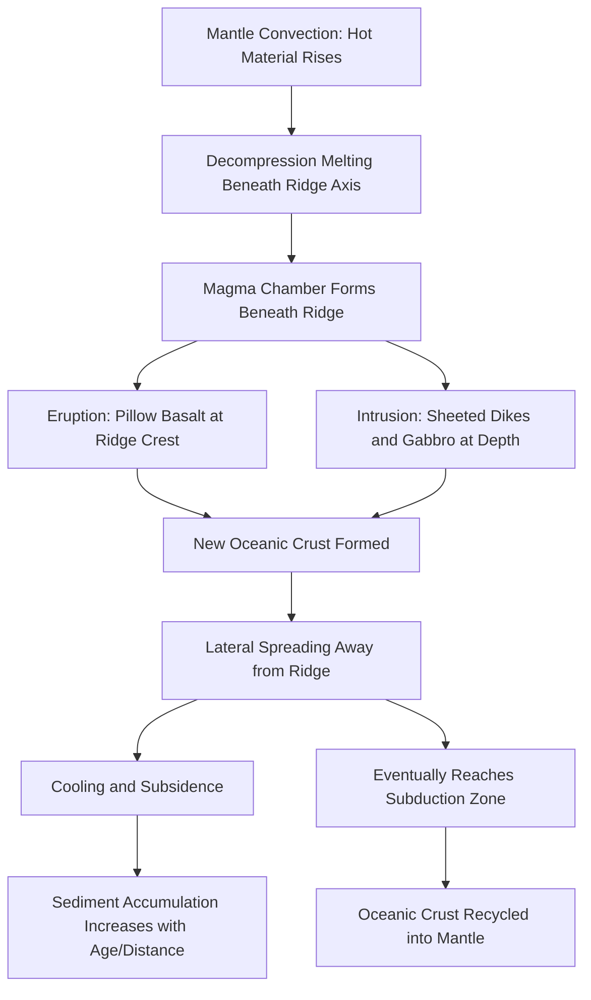

## Seafloor Spreading

### Definition and Core Concept

Seafloor spreading is the process by which new oceanic lithosphere is continuously created at mid-ocean ridges through upwelling and solidification of mantle-derived magma, and progressively moves away from the ridge axis in both directions as part of diverging tectonic plates. The hypothesis was formally proposed by Harry Hess in 1962 (published as "History of Ocean Basins"), providing the physical mechanism that Alfred Wegener's Continental Drift Theory had lacked, and became a foundational pillar of modern plate tectonic theory.

Hess described mid-ocean ridges as sites where hot mantle material rises via convection, partially melts, and generates new basaltic crust that is then carried laterally away from the ridge crest atop the moving asthenosphere-driven convection cells — a process he termed, with characteristic modesty, "geopoetry" pending independent confirmation.

### Mechanism of Formation

**Key Points**

- **Mantle upwelling**: hot mantle material rises beneath mid-ocean ridges due to convective currents in the asthenosphere, decompressing as it ascends.
- **Decompression melting**: as mantle rock rises, pressure decreases faster than temperature, causing partial melting even without additional heat input, generating basaltic magma.
- **Magma emplacement and eruption**: magma rises into the rift at the ridge axis, partly erupting as pillow basalt on the seafloor and partly crystallizing at depth as sheeted dikes and gabbro.
- **Lateral spreading**: newly formed crust is pushed away from the ridge axis symmetrically in both directions as more magma is continuously injected behind it, acting like a slow-moving conveyor belt.
- **Cooling and subsidence**: as oceanic crust moves away from the ridge, it cools, thickens, and becomes denser, causing it to subside gradually — explaining why ocean depth increases systematically with distance from the ridge axis and with crustal age.

### Structure of the Oceanic Crust Produced

Seafloor spreading generates a consistent, layered vertical sequence of oceanic crust known as an **ophiolite sequence** when preserved and later exposed on land:

| Layer | Composition/Rock Type | Origin |
| --- | --- | --- |
| Layer 1 | Pelagic sediment (clay, ooze) | Accumulates gradually after crust formation |
| Layer 2A | Pillow basalt | Rapid quenching of lava erupted on the seafloor/seawater contact |
| Layer 2B | Sheeted dike complex | Magma injected into vertical fractures, feeding eruptions above |
| Layer 3 | Gabbro (coarse-grained, same composition as basalt) | Slow crystallization of magma in a sub-ridge magma chamber |
| Below crust | Peridotite (upper mantle) | Mantle source rock, partially depleted after melt extraction |

### Key Evidence Supporting Seafloor Spreading

**Marine Magnetic Striping**

The most decisive confirming evidence came from Fred Vine and Drummond Matthews (1963), building on the discovery of geomagnetic polarity reversals (periods when Earth's magnetic field flips north-south polarity):

- As basaltic magma cools through the Curie point at the ridge axis, magnetic minerals (primarily magnetite) align with Earth's magnetic field at that time and lock in that orientation.
- Because new crust forms continuously at the ridge and spreads symmetrically outward, the record of magnetic reversals is preserved as parallel stripes of alternating normal and reversed polarity, mirrored on either side of the ridge axis.
- This symmetric striping pattern is now widely regarded as strong, direct physical evidence of seafloor spreading, since no other proposed mechanism produces a mirror-symmetric, age-progressive magnetic pattern centered exactly on the ridge axis.

**Age of Oceanic Crust**

- Deep-sea drilling (Deep Sea Drilling Project, later Ocean Drilling Program) confirmed that oceanic crust is progressively older with increasing distance from the ridge axis, symmetric on both flanks.
- The oldest oceanic crust found anywhere on Earth is only about 180–200 million years old — dramatically younger than the oldest continental crust (over 4 billion years) — consistent with continuous creation and eventual destruction (subduction) of oceanic lithosphere, a cycle continental crust largely escapes due to its lower density.

**Heat Flow and Sediment Thickness**

- Heat flow measurements are highest at the ridge axis (where hot mantle material is closest to the surface) and decrease systematically with distance from the ridge, correlating with crustal age and cooling.
- Sediment thickness on the ocean floor increases with distance from the ridge axis, since older crust has had more time to accumulate pelagic sediment — the ridge crest itself is typically sediment-free or has only a thin veneer.

**Transform Faults and Fracture Zones**

- Ridges are offset by transform faults, which accommodate differential spreading rates or geometric adjustments along the ridge system; seismicity is confined to the active segment between offset ridge sections, a pattern predicted by seafloor spreading and confirmed by J. Tuzo Wilson's transform fault concept (1965).

### Spreading Rate Classification

| Spreading Rate Category | Approximate Full Rate | Example Ridge | Ridge Morphology |
| --- | --- | --- | --- |
| Slow-spreading | <5 cm/yr | Mid-Atlantic Ridge | Pronounced axial rift valley, rugged topography |
| Intermediate-spreading | 5–9 cm/yr | Juan de Fuca Ridge | Transitional morphology |
| Fast-spreading | >9 cm/yr | East Pacific Rise | Broad, gentle axial high, little to no rift valley |

*[Unverified: precise rate boundaries between categories vary somewhat between sources and are used descriptively rather than as fixed universal thresholds.]*

### Seafloor Spreading Process Diagram

### Magnetic Striping Illustration (svg_diagram)

<svg xmlns="http://www.w3.org/2000/svg" viewBox="0 0 800 300" font-family="Helvetica, Arial, sans-serif">
<text x="400" y="25" text-anchor="middle" font-size="16" font-weight="bold">Symmetric Magnetic Striping at a Mid-Ocean Ridge (svg_diagram)</text>
<rect x="50" y="120" width="35" height="80" fill="#2c5f8a" />
<rect x="85" y="120" width="35" height="80" fill="#e8d4a0" />
<rect x="120" y="120" width="35" height="80" fill="#2c5f8a" />
<rect x="155" y="120" width="35" height="80" fill="#e8d4a0" />
<rect x="190" y="120" width="35" height="80" fill="#2c5f8a" />
<rect x="225" y="120" width="35" height="80" fill="#e8d4a0" />
<rect x="260" y="120" width="35" height="80" fill="#2c5f8a" />
<rect x="295" y="120" width="35" height="80" fill="#e8d4a0" />
<rect x="330" y="120" width="35" height="80" fill="#2c5f8a" />
<rect x="365" y="120" width="35" height="80" fill="#e8d4a0" />
<polygon points="400,110 420,150 400,190 380,150" fill="#c94c4c" />
<text x="400" y="152" text-anchor="middle" font-size="9" fill="#fff" font-weight="bold">Ridge</text>
<rect x="420" y="120" width="35" height="80" fill="#e8d4a0" />
<rect x="455" y="120" width="35" height="80" fill="#2c5f8a" />
<rect x="490" y="120" width="35" height="80" fill="#e8d4a0" />
<rect x="525" y="120" width="35" height="80" fill="#2c5f8a" />
<rect x="560" y="120" width="35" height="80" fill="#e8d4a0" />
<rect x="595" y="120" width="35" height="80" fill="#2c5f8a" />
<rect x="630" y="120" width="35" height="80" fill="#e8d4a0" />
<rect x="665" y="120" width="35" height="80" fill="#2c5f8a" />
<rect x="700" y="120" width="35" height="80" fill="#e8d4a0" />
<rect x="735" y="120" width="35" height="80" fill="#2c5f8a" />
<line x1="400" y1="220" x2="400" y2="240" stroke="#333" stroke-dasharray="3,2" />
<line x1="50" y1="230" x2="750" y2="230" stroke="#333" stroke-width="1.5" marker-end="url(#arrow2)" marker-start="url(#arrow2rev)" />
<text x="400" y="255" text-anchor="middle" font-size="12">Symmetric spreading, older crust farther from axis</text>
<rect x="50" y="270" width="15" height="15" fill="#2c5f8a" />
<text x="75" y="282" font-size="11">Normal polarity</text>
<rect x="220" y="270" width="15" height="15" fill="#e8d4a0" />
<text x="245" y="282" font-size="11">Reversed polarity</text>
</svg>

### Worked Example: Calculating Spreading Rate from Magnetic Anomalies

**Example**

If a magnetic reversal boundary known to be 2.5 million years old is found 50 km from the ridge axis, the half-spreading rate is:

$$\text{Rate} = \frac{50 \text{ km}}{2.5 \text{ million years}} = \frac{50{,}000{,}000 \text{ cm}}{2{,}500{,}000 \text{ yr}} = 20 \text{ cm/yr}$$

Since this represents motion of one plate away from the axis, the **full spreading rate** (relative motion between the two diverging plates) is double this value: 40 cm/yr. Note this example uses illustrative figures to demonstrate the method; actual spreading rates for real ridges should be checked against current geodetic (e.g., GPS/GNSS) and paleomagnetic datasets, as this figure exceeds typical fast-spreading ridge values and is presented purely for calculation demonstration.

### Consequences and Broader Significance

**Key Points**

- Seafloor spreading necessitates a balancing destructive process (subduction) at convergent boundaries, since Earth's total surface area remains constant — this closes the loop of the plate tectonic cycle and explains why oceanic crust is geologically young compared to continental crust.
- It provided the missing mechanistic link that transformed Wegener's Continental Drift Theory from a contested hypothesis into the evidence-based foundation of modern Plate Tectonic Theory.
- It explains major bathymetric features of ocean basins: the global mid-ocean ridge system, abyssal hills, and the systematic relationship between ocean depth, crustal age, and sediment thickness.
- It underlies the practical dating method of using magnetic anomaly patterns to reconstruct past plate positions and calculate historical plate velocities.

### Common Misconceptions

**Key Points**

- Seafloor spreading does not mean the ocean basin itself grows indefinitely larger everywhere; net global crustal area is conserved because spreading at ridges is balanced by subduction destruction at convergent margins elsewhere.
- The mid-ocean ridge is not a continuous, uniform crack; it is segmented and offset by numerous transform faults accommodating differential motion along the ridge system.
- Magnetic striping does not indicate that the magnetic minerals themselves move or "stripe" after formation; the stripes are a frozen record of Earth's field orientation at the moment each strip of crust cooled through the Curie point, subsequently carried apart by spreading.
- Seafloor spreading rates are not uniform globally; different ridge segments spread at markedly different rates, producing correspondingly different ridge morphologies (rift-valley vs. broad axial high).

### Related Topics

- Plate Tectonics: convergent, divergent, and transform boundaries
- Continental Drift Theory and its historical development
- Paleomagnetism and geomagnetic polarity reversal timescales
- Subduction Zones and the destruction of oceanic lithosphere
- Ophiolite Sequences as exposed analogs of oceanic crust
- Mantle Convection and the driving forces of plate motion
- Transform Faults and the Wilson Cycle
- Deep-sea drilling and marine geophysical survey methods