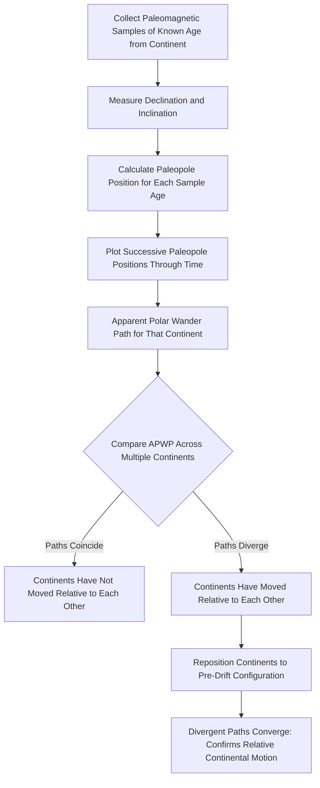

## Paleomagnetism and Polar Wander

### Definition and Scope

Paleomagnetism is the study of the record of Earth's ancient magnetic field preserved in rocks, sediments, and archaeological materials. This record forms because certain minerals lock in the direction and intensity of the ambient magnetic field at the time of their formation. **Apparent Polar Wander (APW)** refers to the seemingly progressive shift in the position of Earth's magnetic poles through geologic time when reconstructed from paleomagnetic data collected from a single continent — a phenomenon now understood to result primarily from the *motion of the continent itself* rather than genuine wandering of the poles, making it one of the most decisive lines of evidence for plate tectonics.

### Physical Basis: How Rocks Record Magnetism

**Key Points**

- Earth's magnetic field is generated by convective motion of molten iron in the outer core (the **geodynamo**), approximating a dipole field aligned close to (but not identical with) the rotational axis.
- Certain iron-bearing minerals (magnetite, hematite, and related iron oxides) are ferromagnetic and can align their internal magnetic domains with the ambient external field.
- This alignment becomes "locked in" — fixed and no longer responsive to later field changes — once the mineral cools below its **Curie temperature** (magnetite: ~580°C) or, in sedimentary settings, once magnetic grains become physically immobilized during compaction and lithification.
- The recorded magnetization preserves two independent pieces of information: **magnetic declination** (horizontal angle from geographic north) and **magnetic inclination** (the dip angle of the field relative to horizontal, which varies systematically with latitude).

### Types of Remanent Magnetization

| Type | Acronym | Formation Process | Typical Rock Type |
| --- | --- | --- | --- |
| Thermoremanent magnetization | TRM | Magnetic minerals align while cooling through the Curie point | Igneous rocks (lava, intrusions) |
| Detrital remanent magnetization | DRM | Magnetic grains physically rotate to align with the field as they settle and are buried | Sedimentary rocks (fine clastics) |
| Chemical remanent magnetization | CRM | Magnetic minerals grow/recrystallize chemically after deposition, locking in the field at that later time | Diagenetically altered sediments, some metamorphic rocks |

### Determining Paleolatitude from Inclination

Magnetic inclination varies predictably with latitude for an idealized dipole field, following the relationship:

$$\tan(I) = 2\tan(\lambda)$$

where $I$ is the magnetic inclination and $\lambda$ is the geographic (paleo)latitude. At the magnetic equator, field lines run horizontal ($I = 0°$); at the magnetic poles, field lines point straight down/up ($I = \pm90°$). By measuring the inclination preserved in a rock of known age, geologists can calculate the paleolatitude at which that rock formed — though this method reveals only paleolatitude, not paleolongitude, since declination alone (constrained by the rotational symmetry of a dipole field) cannot resolve east-west position without independent geologic constraints.

**Example**

A basalt flow preserves a magnetic inclination of $I = 45°$. Applying the dipole formula:

$$\tan(45°) = 2\tan(\lambda) \implies 1 = 2\tan(\lambda) \implies \tan(\lambda) = 0.5 \implies \lambda \approx 26.6°$$

This indicates the rock formed at approximately 26.6° paleolatitude (north or south cannot be distinguished by inclination magnitude alone; polarity sign and independent geologic context resolve the hemisphere).

### Apparent Polar Wander Paths (APWPs)

An **Apparent Polar Wander Path** is constructed by plotting the calculated position of the magnetic pole (as inferred from paleomagnetic data) at successive geologic time intervals, using rocks of different ages from a single continent or crustal block.

**Key interpretive principle**: Earth's magnetic pole itself does not wander far from the rotational axis over geologically significant timescales when averaged over thousands of years (a foundational assumption known as the **Geocentric Axial Dipole, GAD, hypothesis**). Therefore, when an APWP constructed from one continent's rocks shows the pole appearing to move progressively over millions of years, the far more parsimonious explanation is that the continent itself moved beneath a relatively stationary pole, and the "path" is an artifact of plotting pole position in the continent's own fixed reference frame.

### The Critical Continental-Drift Proof: Divergent APW Paths

The decisive evidence for continental motion emerged when researchers in the 1950s (notably S. Keith Runcorn and colleagues) constructed independent APW paths for different continents using rocks of the same ages:

- If continents had always been in their present positions, APW paths derived independently from each continent should coincide, since there is only one true magnetic pole position at any given time.
- Instead, APW paths calculated for North America and for Europe, when plotted for the same time intervals, diverged from one another, tracing distinctly different curves.
- These two divergent paths could be made to coincide almost perfectly if the continents were repositioned to their reconstructed pre-drift locations (consistent with the pre-Atlantic-opening configuration), removing the relative rotation and translation that had accumulated since separation.
- This divergence-then-convergence-on-reassembly result could not be explained by genuine polar wander (which would affect all continents identically) and instead provided powerful, quantitative confirmation that the continents themselves had moved relative to one another — directly validating Wegener's Continental Drift Theory decades after its initial rejection.

### Apparent Polar Wander Diagram

### Polar Wander Illustration (svg_diagram)

<svg xmlns="http://www.w3.org/2000/svg" viewBox="0 0 800 380" font-family="Helvetica, Arial, sans-serif">
<text x="400" y="25" text-anchor="middle" font-size="16" font-weight="bold">Divergent Apparent Polar Wander Paths for Two Continents (svg_diagram)</text>
<circle cx="400" cy="200" r="8" fill="#333" />
<text x="400" y="180" text-anchor="middle" font-size="11">Present-Day Pole</text>
<path d="M 400,200 Q 350,150 320,100 Q 300,70 280,40" fill="none" stroke="#c94c4c" stroke-width="2.5" />
<circle cx="320" cy="100" r="5" fill="#c94c4c" />
<circle cx="280" cy="40" r="5" fill="#c94c4c" />
<text x="240" y="35" font-size="11" fill="#c94c4c" font-weight="bold">North America APWP</text>
<text x="330" y="95" font-size="9" fill="#c94c4c">200 Ma</text>
<text x="290" y="60" font-size="9" fill="#c94c4c">400 Ma</text>
<path d="M 400,200 Q 470,160 520,120 Q 560,90 610,70" fill="none" stroke="#2c5f8a" stroke-width="2.5" />
<circle cx="520" cy="120" r="5" fill="#2c5f8a" />
<circle cx="610" cy="70" r="5" fill="#2c5f8a" />
<text x="560" y="55" font-size="11" fill="#2c5f8a" font-weight="bold">Europe APWP</text>
<text x="525" y="115" font-size="9" fill="#2c5f8a">200 Ma</text>
<text x="600" y="90" font-size="9" fill="#2c5f8a">400 Ma</text>

<text x="400" y="280" text-anchor="middle" font-size="12" font-style="italic">Two independently-derived paths diverge through time</text>

<text x="400" y="300" text-anchor="middle" font-size="12" font-style="italic">— explained by relative motion of the continents,</text>

<text x="400" y="320" text-anchor="middle" font-size="12" font-style="italic">not by genuine wandering of Earth's rotational pole</text>

<line x1="150" y1="350" x2="650" y2="350" stroke="#999" stroke-dasharray="2,2" />
<text x="150" y="365" font-size="10" fill="#666">Older</text>
<text x="650" y="365" font-size="10" fill="#666" text-anchor="end">Present</text>
</svg>

### Applications of Paleomagnetism

**Key Points**

- **Magnetostratigraphy**: correlating and dating rock sequences globally using the established Geomagnetic Polarity Timescale (GPTS) of recorded field reversals, independent of and complementary to biostratigraphy and radiometric dating.
- **Plate reconstruction**: quantitatively reconstructing past positions and relative motions of continents and oceanic plates, forming the basis of software-driven plate tectonic reconstruction models used in petroleum exploration and geodynamic research.
- **Seafloor spreading confirmation**: the symmetric magnetic striping of oceanic crust (Vine-Matthews-Morley hypothesis) is a direct application of paleomagnetic principles to confirm seafloor spreading rates and directions.
- **True Polar Wander (TPW) studies**: distinguishing genuine, whole-mantle-and-crust rotation relative to the spin axis (a real, though much rarer and slower, geodynamic phenomenon) from the far more common *apparent* polar wander caused by individual plate motion.

### Paleomagnetism vs. Apparent Polar Wander vs. True Polar Wander: Key Distinctions

**Key Points**

- **Paleomagnetism** is the underlying data/methodology: the measured magnetic properties recorded in rock.
- **Apparent Polar Wander** is an interpretive artifact of plotting one continent's paleopole positions through time in that continent's own fixed reference frame; it primarily reflects the continent's motion, not the pole's.
- **True Polar Wander** is a distinct, genuine geodynamic phenomenon in which the entire solid Earth (mantle and crust together) shifts relative to the fixed spin axis, typically invoked to explain mass redistribution effects (e.g., large mantle plumes or major deglaciation); it is generally much smaller in magnitude and rarer than apparent polar wander signals attributable to plate motion. *[Inference: the relative contribution of true polar wander versus plate motion in any specific ancient APW dataset is often debated and requires careful analysis to disentangle, since both processes are superimposed on the same data.]*

### Common Misconceptions

**Key Points**

- Apparent Polar Wander does not mean Earth's actual magnetic (or rotational) pole physically traveled along the plotted curve; the curve is a mathematical consequence of holding the continent's reference frame fixed while the continent itself moved.
- Paleomagnetic data alone cannot determine paleolongitude; only paleolatitude and orientation (declination) are directly recoverable from inclination and declination measurements, meaning full plate reconstructions require combining paleomagnetic data with other geologic and geophysical constraints.
- Magnetic pole reversals (flips between normal and reversed polarity) are a distinct phenomenon from apparent polar wander; reversals are relatively rapid, global, and simultaneous events recorded identically worldwide, whereas APW reflects gradual, continent-specific apparent pole migration over much longer timescales.
- The Curie temperature is not the melting point of the rock; magnetic locking occurs well below the rock's melting temperature, at the specific temperature threshold where ferromagnetic minerals lose (upon heating) or regain (upon cooling) their capacity to retain magnetization.

### Related Topics

- Continental Drift Theory and its mid-20th-century validation
- Seafloor Spreading and the Vine-Matthews-Morley Hypothesis
- Geomagnetic Polarity Timescale and Magnetostratigraphy
- The Geodynamo and Earth's Magnetic Field Generation
- True Polar Wander and Mantle Mass Redistribution
- Plate Reconstruction Modeling Techniques
- Curie Temperature and Rock Magnetic Mineralogy
- Radiometric Dating Methods Used Alongside Paleomagnetic Correlation