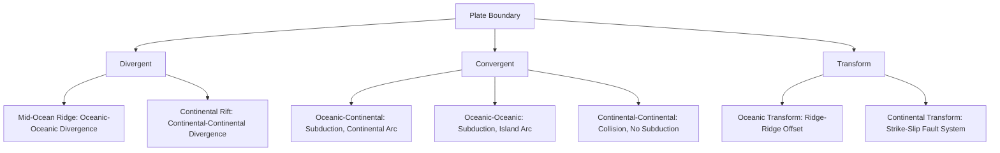

## Types of Plate Boundaries

### Definition and Classification Overview

A plate boundary is the interface where two adjacent lithospheric plates interact, accommodating relative motion between them. Since Earth's total surface area is conserved, the three fundamental boundary types are defined by the relative direction of plate motion at the interface: plates moving apart, plates moving together, or plates sliding laterally past one another. Nearly all significant seismic activity, volcanism, and major topographic features on Earth are concentrated along these boundary zones rather than distributed randomly across plate interiors.

### Divergent Boundaries

**Definition**: Divergent boundaries occur where two plates move apart from each other, allowing upwelling mantle material to fill the resulting gap and generate new lithosphere.

**Key Points**

- Characterized by tensional stress, normal faulting, and shallow-focus earthquakes.
- New oceanic crust is continuously created through seafloor spreading, driven by decompression melting of upwelling mantle material.
- The two principal settings are **mid-ocean ridges** (oceanic divergence, e.g., Mid-Atlantic Ridge) and **continental rift zones** (early-stage continental divergence, e.g., East African Rift).
- Continental rifting, if sustained, progresses through a recognized sequence: continental rift → narrow linear sea → full ocean basin with an active mid-ocean ridge (the Red Sea and Gulf of Aden represent intermediate stages of this progression).
- Associated volcanism is typically basaltic, reflecting partial melting of mantle peridotite.

| Feature | Mid-Ocean Ridge | Continental Rift |
| --- | --- | --- |
| Example | Mid-Atlantic Ridge, East Pacific Rise | East African Rift, Rio Grande Rift |
| Crust Type | Oceanic (both sides) | Continental (both sides, thinning) |
| Topography | Submarine ridge with axial valley | Rift valley with bounding normal faults |
| Volcanism | Basaltic (MORB) | Basaltic to bimodal (basalt-rhyolite) |
| Seismicity | Shallow, along ridge axis | Shallow, along rift-bounding faults |

### Convergent Boundaries

**Definition**: Convergent boundaries occur where two plates move toward each other, resulting in either subduction (one plate descending beneath the other) or continental collision, depending on the density and composition of the converging plates.

Convergent boundaries are subdivided into three distinct configurations based on crust type:

**Oceanic–Continental Convergence**

- The denser oceanic plate subducts beneath the less dense continental plate.
- Produces a volcanic continental arc (e.g., the Andes) fed by flux melting of the mantle wedge as water released from the subducting slab lowers the mantle's melting point.
- Generates a deep oceanic trench, an accretionary wedge/prism, and a Wadati-Benioff zone of progressively deeper earthquakes tracing the subducting slab.
- Produces intermediate to felsic (andesitic to dacitic) volcanism, distinct in composition from divergent-boundary basalts.

**Oceanic–Oceanic Convergence**

- The denser (typically older, colder) oceanic plate subducts beneath the other oceanic plate.
- Produces a volcanic island arc (e.g., the Mariana Islands, Aleutian Islands, Japan) rather than a continental arc, since no continental crust is present on the overriding plate.
- Also produces a deep oceanic trench (including the Mariana Trench, the deepest point on Earth's surface) and an associated Wadati-Benioff seismic zone.

**Continental–Continental Convergence**

- Because continental crust is too buoyant to subduct significantly, neither plate subducts in a sustained sense; instead the two continental masses collide and crumple.
- Produces intense crustal thickening, large-scale folding and thrust faulting, and the tallest mountain ranges on Earth (the Himalayas, formed by ongoing India-Asia collision, are the archetypal example).
- Typically produces minimal to no active volcanism, since the driving mechanism (flux melting from a subducting slab releasing water into a mantle wedge) is largely absent once subduction of oceanic lithosphere ceases at the collision zone.
- Generates abundant, often deep, crustal earthquakes but generally lacks the deep Wadati-Benioff seismicity characteristic of active subduction.

| Feature | Oceanic-Continental | Oceanic-Oceanic | Continental-Continental |
| --- | --- | --- | --- |
| Example | Andes (South America) | Mariana Islands, Japan | Himalayas |
| Resulting Arc | Continental volcanic arc | Volcanic island arc | None (no active subduction) |
| Trench Present | Yes | Yes | Generally absent |
| Volcanism | Andesitic/felsic | Andesitic/felsic | Minimal to none |
| Dominant Deformation | Thrust faulting, arc volcanism | Thrust faulting, arc volcanism | Folding, thrust faulting, crustal thickening |

### Transform Boundaries

**Definition**: Transform boundaries occur where two plates slide horizontally past one another along a roughly vertical fault plane, with lithosphere neither created nor destroyed.

**Key Points**

- Dominated by shear stress and strike-slip faulting.
- Most transform faults occur as short offsets connecting segments of mid-ocean ridges, accommodating the curved geometry of spreading centers on a spherical Earth.
- A smaller number of transform faults cut through continental crust, producing some of the most well-studied and hazardous plate boundaries on land (e.g., the San Andreas Fault in California, the North Anatolian Fault in Turkey).
- Seismicity is typically shallow-focus but can produce very large, damaging earthquakes due to the large accumulated strain released along continental transform systems.
- Volcanism is generally minimal or absent at transform boundaries, since the boundary geometry neither creates space for decompression melting (as at divergent boundaries) nor triggers flux melting (as at convergent boundaries).

### Plate Boundary Comparison Diagram

### Cross-Sectional Illustration of the Three Boundary Types (svg_diagram)

<svg xmlns="http://www.w3.org/2000/svg" viewBox="0 0 800 500" font-family="Helvetica, Arial, sans-serif">
<text x="400" y="25" text-anchor="middle" font-size="16" font-weight="bold">Cross-Sections of the Three Plate Boundary Types (svg_diagram)</text>

<text x="130" y="55" text-anchor="middle" font-size="13" font-weight="bold">Divergent</text>

<rect x="20" y="130" width="120" height="30" fill="`#8a9ba8`" />

<rect x="160" y="140" width="100" height="20" fill="`#8a9ba8`" />

<polygon points="150,160 170,90 190,160" fill="`#c94c4c`" />

<line x1="170" y1="90" x2="170" y2="60" stroke="`#c94c4c`" stroke-width="3" marker-end="url(#a1)" />

<path d="M120,180 Q170,140 220,180" fill="none" stroke="#999" stroke-dasharray="3,2" />

<text x="170" y="60" font-size="9" text-anchor="middle">Upwelling</text>

<line x1="60" y1="175" x2="30" y2="175" stroke="#333" stroke-width="2" marker-end="url(#a1)" />

<line x1="220" y1="175" x2="250" y2="175" stroke="#333" stroke-width="2" marker-end="url(#a1)" />

<text x="140" y="200" text-anchor="middle" font-size="10">Plates moving apart</text>

<text x="400" y="55" text-anchor="middle" font-size="13" font-weight="bold">Convergent</text>

<rect x="330" y="150" width="90" height="15" fill="`#8a9ba8`" transform="rotate(15 330 150)" />

<path d="M330,150 L420,165 L440,280 L360,260 Z" fill="`#8a9ba8`" />

<rect x="440" y="130" width="120" height="30" fill="`#b89968`" />

<polygon points="500,130 520,80 540,130" fill="`#c94c4c`" />

<line x1="380" y1="150" x2="420" y2="150" stroke="#333" stroke-width="2" marker-end="url(#a1)" />

<line x1="500" y1="140" x2="470" y2="140" stroke="#333" stroke-width="2" marker-end="url(#a1)" />

<text x="480" y="200" text-anchor="middle" font-size="10">Subduction; arc volcanism</text>

<text x="670" y="55" text-anchor="middle" font-size="13" font-weight="bold">Transform</text>

<rect x="610" y="130" width="60" height="30" fill="`#8a9ba8`" />

<rect x="670" y="130" width="60" height="30" fill="`#8a9ba8`" />

<line x1="670" y1="120" x2="670" y2="170" stroke="#333" stroke-width="2" />

<line x1="640" y1="180" x2="640" y2="200" stroke="#333" stroke-width="2" marker-end="url(#a1)" />

<line x1="700" y1="180" x2="700" y2="160" stroke="#333" stroke-width="2" marker-end="url(#a1)" />

<text x="670" y="215" text-anchor="middle" font-size="10">Lateral sliding, no creation/destruction</text>

<line x1="10" y1="350" x2="790" y2="350" stroke="#ccc" />
<text x="400" y="380" text-anchor="middle" font-size="12" font-style="italic">Blue-gray = oceanic lithosphere · Tan = continental lithosphere · Red = magma/melt pathway</text>
</svg>

### Boundary Type vs. Crust Type: A Two-Axis Classification

**Key Points**

- Plate boundary behavior depends on *both* the relative motion direction (divergent/convergent/transform) *and* the crust type on each side (oceanic/continental), producing the seven meaningfully distinct settings covered above (2 divergent + 3 convergent + 2 transform).
- This two-axis framework explains why, for instance, "convergent" alone is an incomplete description: an oceanic-oceanic convergent boundary and a continental-continental convergent boundary produce fundamentally different landforms, seismicity patterns, and volcanic behavior despite sharing the same basic relative motion.
- Boundaries are not static classifications over geologic time; a boundary can transition between types as the plates involved evolve (e.g., an oceanic-oceanic convergent margin can evolve into an oceanic-continental margin as an intervening ocean basin closes, eventually becoming a continental-continental collision once all intervening oceanic lithosphere is consumed).

### Common Misconceptions

**Key Points**

- Convergent boundaries do not always produce subduction; continental-continental convergence produces collision and crustal thickening instead, because continental crust is too buoyant to subduct in a sustained way.
- Transform boundaries are not simply "the boundary type with earthquakes and no volcanoes without exception" — while volcanism is typically minimal, the defining characteristic is the lateral, non-convergent/non-divergent relative motion and associated strike-slip faulting, not merely an absence of magmatism.
- Not all continental rifts succeed in forming a new ocean basin; some rifts stall and become inactive ("failed rifts" or aulacogens), preserved as buried structural features rather than evolving into full divergent plate boundaries.
- Volcanic arcs at convergent boundaries are not caused by direct melting of the subducting slab itself in most cases, but predominantly by flux melting of the overlying mantle wedge, triggered by water and other volatiles released from the dehydrating subducting plate.

### Related Topics

- Seafloor Spreading and Mid-Ocean Ridge Processes
- Subduction Zones and the Wadati-Benioff Zone
- Continental Rifting and the East African Rift System
- Transform Faults and the San Andreas Fault System
- Volcanic Arc Formation and Flux Melting
- Orogenesis: Mountain Building at Convergent Margins
- Plate Tectonic Driving Forces (Ridge Push, Slab Pull, Mantle Convection)
- The Wilson Cycle: Ocean Basin Opening and Closing