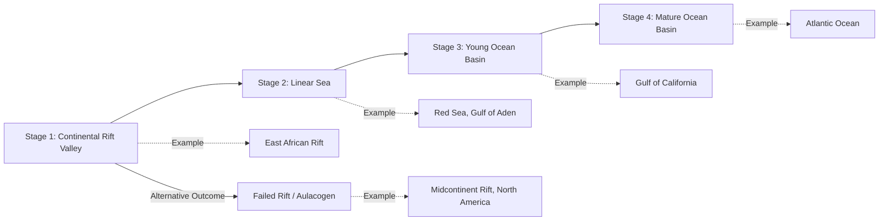

## Divergent Boundaries and Rifting

### Definition and Core Process

Divergent boundaries are locations where two lithospheric plates move apart from one another, allowing upwelling asthenospheric material to fill the resulting space and generate new lithosphere. Rifting is the broader tectonic process of lithospheric extension and thinning that initiates and sustains this separation, beginning within continental crust and, if extension continues long enough, culminating in the formation of new oceanic crust and a fully developed mid-ocean ridge. Divergent boundaries and continental rifting therefore represent sequential stages along a single continuous evolutionary pathway rather than two unrelated phenomena.

### Driving Forces of Rifting

**Key Points**

- **Active rifting**: driven primarily by an underlying mantle plume or elevated asthenospheric upwelling that thermally and mechanically weakens the overlying lithosphere from below, pushing extension outward.
- **Passive rifting**: driven primarily by far-field tectonic stresses (e.g., plate boundary forces acting at a distance) that stretch and thin the lithosphere, with asthenospheric upwelling occurring passively in response to the resulting thinning rather than initiating it.
- *[Inference: for many real-world rift systems, active and passive mechanisms likely operate together or transition from one to the other over the rift's history, and the relative contribution of each is often debated for specific cases.]*
- Regardless of initiating mechanism, extension leads to lithospheric thinning, decompression melting of upwelling mantle, and a progressive weakening of the crust that localizes further strain.

### The Continental Rifting Sequence

Continental rifting progresses through a broadly recognized series of stages, each with distinct structural, topographic, and volcanic characteristics:

**Stage 1: Continental Rift Valley**

- Extension produces a system of normal faults, creating a down-dropped central block (**graben**) flanked by uplifted rift shoulders.
- Crustal thinning triggers decompression melting, generating bimodal volcanism (basaltic and, less commonly, rhyolitic).
- Example: the East African Rift System, actively splitting the Nubian and Somali sub-plates of the African Plate.

**Stage 2: Linear Sea**

- Continued extension eventually ruptures the continental crust entirely, allowing seawater to flood the rift and true oceanic crust to begin forming at a nascent spreading center.
- The rift transitions from a continental depression to a narrow, elongate marine basin bounded by thinned, rifted continental margins.
- Example: the Red Sea, representing an intermediate stage between continental rifting and a mature ocean basin.

**Stage 3: Young Ocean Basin**

- A well-established mid-ocean ridge actively generates new oceanic crust via seafloor spreading, and the basin widens progressively.
- Example: the Gulf of California, a young, actively widening oceanic basin.

**Stage 4: Mature Ocean Basin**

- Sustained spreading over tens of millions of years produces a wide ocean basin with a long-lived, stable mid-ocean ridge system flanked by broad passive continental margins.
- Example: the Atlantic Ocean, which began forming from Pangaean rifting roughly 200 million years ago and now hosts the Mid-Atlantic Ridge.

### Rift Evolution Diagram

### Structural Features of Rift Zones

| Feature | Description |
| --- | --- |
| Graben | Down-dropped fault-bounded block forming the central rift depression |
| Horst | Uplifted fault-bounded block, often forming rift-flanking ridges |
| Normal Fault | Dominant fault type in extensional settings; hanging wall moves down relative to footwall |
| Rift Shoulder | Elevated, uplifted margin flanking the rift, produced by flexural/isostatic response to crustal thinning |
| Half-Graben | Asymmetric basin bounded by a single major normal fault on one side, tilted block geometry |
| Border Fault | The primary, largest-displacement normal fault bounding a rift basin |

### Cross-Sectional Illustration: Continental Rift Structure (svg_diagram)

<svg xmlns="http://www.w3.org/2000/svg" viewBox="0 0 800 400" font-family="Helvetica, Arial, sans-serif">
<text x="400" y="25" text-anchor="middle" font-size="16" font-weight="bold">Continental Rift Valley Cross-Section (svg_diagram)</text>
<rect x="50" y="120" width="700" height="40" fill="#c9a876" />
<text x="400" y="110" text-anchor="middle" font-size="11">Rift Shoulder (uplifted)</text>
<path d="M50,160 L200,160 L230,220 L120,220 Z" fill="#b89968" stroke="#7a5c3a" />
<text x="160" y="195" text-anchor="middle" font-size="10">Horst</text>
<path d="M230,220 L500,220 L500,280 L230,280 Z" fill="#e8d4a0" stroke="#7a5c3a" />
<text x="365" y="255" text-anchor="middle" font-size="12" font-weight="bold">Graben (Rift Valley Floor)</text>
<text x="365" y="270" text-anchor="middle" font-size="9">Sediment fill + bimodal volcanics</text>
<path d="M500,220 L630,220 L650,160 L580,160 Z" fill="#b89968" stroke="#7a5c3a" />
<text x="565" y="195" text-anchor="middle" font-size="10">Horst</text>
<rect x="630" y="120" width="120" height="40" fill="#c9a876" />
<text x="690" y="110" text-anchor="middle" font-size="11">Rift Shoulder (uplifted)</text>
<line x1="230" y1="220" x2="120" y2="220" stroke="#333" stroke-width="2.5" />
<line x1="500" y1="220" x2="580" y2="160" stroke="#333" stroke-width="2.5" />
<text x="150" y="240" font-size="9" font-style="italic">Normal fault</text>
<text x="560" y="200" font-size="9" font-style="italic">Normal fault</text>
<polygon points="365,300 355,340 375,340" fill="#c94c4c" />
<line x1="365" y1="340" x2="365" y2="370" stroke="#c94c4c" stroke-width="2" marker-end="url(#a3)" />
<text x="365" y="390" text-anchor="middle" font-size="10">Upwelling mantle, decompression melting</text>
<line x1="80" y1="350" x2="30" y2="350" stroke="#333" stroke-width="2" marker-end="url(#a3b)" />
<line x1="720" y1="350" x2="770" y2="350" stroke="#333" stroke-width="2" marker-end="url(#a3b)" />
<text x="400" y="350" text-anchor="middle" font-size="10">Extensional (tensional) stress</text>
</svg>

### The East African Rift as a Type Example

**Example**

The East African Rift System (EARS) illustrates active continental rifting in progress: it splits into an eastern (Gregory) branch and a western branch flanking the Victoria microplate, with the Nubian Plate to the west and the Somali Plate to the east actively separating at a few millimeters per year. The rift hosts characteristic bimodal volcanism (Mount Kilimanjaro, Mount Kenya, Ol Doinyo Lengai), deep rift lakes occupying graben structures (Lake Tanganyika, Lake Malawi), and shallow seismicity concentrated along the bounding normal faults. Current geologic understanding treats it as a natural laboratory for observing the transition from continental rifting toward eventual, though geologically distant, ocean basin formation. *[Inference: projected timescales for the EARS to fully separate into an ocean basin are highly uncertain and are typically estimated on the order of tens of millions of years, based on extrapolation of current strain rates.]*

### Failed Rifts (Aulacogens)

**Key Points**

- Not all rifts succeed in fully separating continental crust; a rift may become tectonically inactive before reaching the linear sea stage, a structure termed a **failed rift** or, when preserved as a buried structural reentrant at a later passive margin, an **aulacogen**.
- Failed rifts commonly form at the third arm of a three-armed rift junction (**triple junction**), where two arms successfully propagate into a spreading ocean basin while the third arm stalls.
- Failed rifts remain geologically significant as zones of thinned, weakened crust that can be reactivated by later tectonic events and often host thick sedimentary basins of economic interest (hydrocarbon exploration).
- Example: the Midcontinent Rift System of North America, a Precambrian failed rift preserved beneath the Great Lakes region.

### Volcanism Associated with Rifting

**Key Points**

- Rift volcanism is typically **bimodal**, dominated by basalt (from direct partial melting of upwelling mantle peridotite) with a subordinate component of rhyolite (from partial melting of pre-existing continental crust heated by the intruding basaltic magma), with a notable scarcity of intermediate-composition (andesitic) volcanic rocks compared to convergent-margin settings.
- **Flood basalts** (large igneous provinces) are sometimes associated with the initial stages of continental rifting, particularly where a mantle plume is implicated as the driving mechanism (e.g., the Karoo and Deccan large igneous provinces are linked to rifting phases in Gondwana's breakup history).
- As rifting progresses toward true seafloor spreading, volcanism becomes progressively dominated by basalt alone (mid-ocean ridge basalt, MORB), reflecting the transition to a mantle-fed magmatic system uncomplicated by continental crustal melting.

### Common Misconceptions

**Key Points**

- Rifting is not synonymous with a fully-formed divergent plate boundary; rifting describes the broader extensional process, of which a mature mid-ocean ridge divergent boundary is only the eventual, successful end stage.
- Not all rifts evolve into new ocean basins; failed rifts (aulacogens) are common and represent an equally important, though less obviously visible, outcome of the rifting process.
- Graben and horst are relative structural terms describing down-dropped and up-thrown fault blocks respectively, not fixed rock types or absolute elevations — a horst is only "up" relative to its adjacent graben.
- Continental rift volcanism is not typically andesitic; the bimodal basalt-rhyolite association is a diagnostic difference from the andesitic volcanism characteristic of convergent-margin subduction settings.

### Related Topics

- Seafloor Spreading and Mid-Ocean Ridge Formation
- Types of Plate Boundaries (Convergent, Transform)
- The East African Rift System as a Modern Analog
- Large Igneous Provinces and Flood Basalt Volcanism
- Passive Continental Margins and Their Formation
- The Wilson Cycle: Full Cycle of Ocean Basin Opening and Closing
- Normal Faulting and Extensional Tectonics
- Triple Junctions and Plate Boundary Geometry