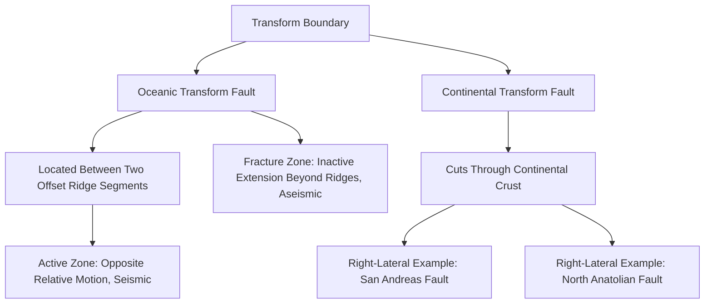

## Transform Boundaries

### Definition and Core Process

Transform boundaries are plate boundaries where two lithospheric plates slide horizontally past one another along a roughly vertical fault plane, with relative motion oriented parallel to the boundary itself. Unlike divergent and convergent boundaries, transform boundaries neither create new lithosphere nor destroy existing lithosphere — plate area is conserved across the interaction, making transform boundaries the mechanism by which Earth's rigid plate mosaic can accommodate complex relative motions on a spherical surface without requiring net area gain or loss along that specific boundary segment.

The concept and terminology were formally introduced by J. Tuzo Wilson in 1965, who recognized that these faults "transform" motion from one type of plate boundary to another (e.g., linking two offset ridge segments, or a ridge segment to a subduction zone), rather than simply terminating.

### Why Transform Faults Exist: Ridge Segmentation

**Key Points**

- Mid-ocean ridges do not form as single, continuous, unbroken lines; because Earth is a sphere, seafloor spreading along a curved plate boundary requires the ridge to be broken into a series of offset, roughly straight segments connected by transform faults.
- Between two offset ridge segments, the transform fault accommodates the relative motion where the two ridge segments are spreading in the same overall direction but are physically staggered.
- This ridge-transform-ridge geometry is the most common global occurrence of transform boundaries, vastly outnumbering the smaller set of transform faults that cut through continental crust.
- Transform faults can also connect a ridge to a subduction zone, or link two subduction zones, though ridge-ridge transforms are by far the dominant configuration.

### Transform Fault vs. Fracture Zone: A Critical Distinction

This distinction is one of the most commonly confused concepts in plate tectonics:

| Feature | Transform Fault | Fracture Zone |
| --- | --- | --- |
| Location | The active segment directly between two offset ridge crests | The inactive extension of that same structural trend, beyond the ridge segments |
| Relative Motion | Plates move in **opposite** directions across the fault (both moving away from their respective ridge segments toward each other along the fault) | Plates on either side move in the **same** direction at the same rate (no relative motion) |
| Seismicity | Frequent, shallow-focus earthquakes | Little to no seismicity |
| Classification | True plate boundary | Not a plate boundary; a fossil scar of past transform motion |

**Key Points**

- The transform fault itself is confined strictly to the segment between the two offset active ridge crests, where genuine relative plate motion (and thus seismicity) occurs.
- Beyond the ridge crests, the same linear trend continues as a fracture zone, but here both sides of the structure belong to plates moving together at the same velocity (having formed at the same ridge system and simply carried apart by symmetric spreading), so there is no relative motion and hence no boundary-related seismicity.

### Oceanic vs. Continental Transform Faults

**Oceanic Transform Faults**

- Occur predominantly as short offsets within mid-ocean ridge systems.
- Generally produce moderate-magnitude earthquakes given the typically thinner, weaker oceanic lithosphere and shorter fault segments involved.
- Example: numerous transform faults segmenting the Mid-Atlantic Ridge and East Pacific Rise.

**Continental Transform Faults**

- Cut through thick, strong continental crust, and though fewer in number globally, they include some of the most intensively studied and hazardous plate boundaries on Earth.
- Capable of accumulating large elastic strain over long fault segments before releasing it in major, highly damaging earthquakes.
- Example: the San Andreas Fault (Pacific Plate sliding northwest relative to the North American Plate, right-lateral motion) and the North Anatolian Fault in Turkey (right-lateral motion, source of repeated major historical earthquakes).

### Sense of Motion: Right-Lateral vs. Left-Lateral

Strike-slip motion along a transform fault is classified by the apparent direction of offset when viewed from either side looking across the fault:

- **Right-lateral (dextral) motion**: an observer standing on one side of the fault sees the opposite block move to the right.
- **Left-lateral (sinistral) motion**: an observer standing on one side of the fault sees the opposite block move to the left.

**Example**

The San Andreas Fault exhibits right-lateral motion: the Pacific Plate (west side) moves northwest relative to the North American Plate (east side). An observer standing on the North American Plate looking across the fault toward the Pacific Plate would see the opposite block displaced to the right over time — this is the diagnostic geometric test for distinguishing right-lateral from left-lateral motion in the field or on a map.

### Transform Boundary Diagram

### Ridge-Transform-Ridge Geometry Illustration (svg_diagram)

<svg xmlns="http://www.w3.org/2000/svg" viewBox="0 0 800 400" font-family="Helvetica, Arial, sans-serif">
<text x="400" y="25" text-anchor="middle" font-size="16" font-weight="bold">Transform Fault vs. Fracture Zone Along an Offset Ridge (svg_diagram)</text>
<line x1="150" y1="150" x2="150" y2="250" stroke="#c94c4c" stroke-width="6" />
<text x="150" y="140" text-anchor="middle" font-size="10" font-weight="bold">Ridge Segment A</text>
<line x1="150" y1="200" x2="450" y2="200" stroke="#333" stroke-width="5" />
<text x="300" y="185" text-anchor="middle" font-size="11" font-weight="bold" fill="#c94c4c">Transform Fault (active, seismic)</text>
<line x1="450" y1="150" x2="450" y2="250" stroke="#c94c4c" stroke-width="6" />
<text x="450" y="140" text-anchor="middle" font-size="10" font-weight="bold">Ridge Segment B</text>
<line x1="50" y1="200" x2="150" y2="200" stroke="#999" stroke-width="3" stroke-dasharray="6,3" />
<line x1="450" y1="200" x2="550" y2="200" stroke="#999" stroke-width="3" stroke-dasharray="6,3" />
<text x="100" y="230" text-anchor="middle" font-size="9" fill="#666">Fracture Zone</text>
<text x="500" y="230" text-anchor="middle" font-size="9" fill="#666">Fracture Zone</text>
<text x="100" y="245" text-anchor="middle" font-size="9" fill="#666">(inactive, aseismic)</text>
<text x="500" y="245" text-anchor="middle" font-size="9" fill="#666">(inactive, aseismic)</text>
<line x1="200" y1="170" x2="240" y2="170" stroke="#333" stroke-width="2" marker-end="url(#a5)" />
<line x1="360" y1="230" x2="400" y2="230" stroke="#333" stroke-width="2" marker-end="url(#a5r)" />
<text x="300" y="300" text-anchor="middle" font-size="11" font-style="italic">Between the ridge crests, plates move in opposite directions across the fault</text>
<text x="300" y="318" text-anchor="middle" font-size="11" font-style="italic">Beyond the ridge crests, plates on both sides move together (same direction/rate)</text>
</svg>

### Seismic Hazard Characteristics

**Key Points**

- Transform boundary earthquakes are shallow-focus, since strike-slip faulting is confined to the relatively brittle upper lithosphere and does not involve the deep subduction geometry that produces Wadati-Benioff seismicity at convergent margins.
- Continental transform faults are capable of generating very large-magnitude earthquakes (historically up to and exceeding magnitude 7.5–8) due to the long, strong fault segments and high accumulated elastic strain characteristic of continental lithosphere.
- Transform boundaries generally do not produce tsunamis as readily as subduction zone megathrust earthquakes, since horizontal strike-slip motion produces comparatively little vertical seafloor displacement — though tsunami generation is not entirely precluded if a transform-related rupture involves some vertical (oblique) component of motion or triggers submarine landslides.
- Volcanism is minimal to absent at transform boundaries, distinguishing them clearly from both divergent and convergent settings in terms of associated magmatic activity.

### Common Misconceptions

**Key Points**

- A transform fault and a fracture zone are not the same feature, despite forming along a single continuous linear trend; only the actively slipping segment between two offset ridge crests is a true plate boundary (transform fault), while the aseismic extension beyond it is a fracture zone with no relative plate motion.
- Transform boundaries are not exclusively continental features; the vast majority of transform faults on Earth occur in oceanic settings, segmenting mid-ocean ridges, even though continental examples like the San Andreas Fault receive disproportionate attention due to their societal impact.
- Transform motion does not necessarily imply zero vertical deformation; while the dominant motion is horizontal (strike-slip), local bends or step-overs along a transform fault can produce localized zones of compression (restraining bends, producing uplift) or extension (releasing bends, producing localized basins).
- Not all strike-slip faults are plate boundaries; many strike-slip faults occur within plate interiors or accommodate secondary deformation near plate boundaries without themselves representing the full plate boundary displacement.

### Related Topics

- Types of Plate Boundaries (Divergent, Convergent)
- Seafloor Spreading and Mid-Ocean Ridge Segmentation
- The San Andreas Fault System and California Seismic Hazard
- Strike-Slip Fault Mechanics and Fault Sense Determination
- Earthquake Magnitude, Fault Rupture, and Seismic Hazard Assessment
- Triple Junctions and Complex Plate Boundary Geometry
- J. Tuzo Wilson's Contributions to Plate Tectonic Theory
- Restraining and Releasing Bends in Strike-Slip Systems