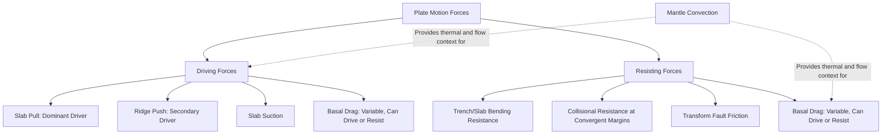

## Mantle Convection and Plate Motion Forces

### Definition and Scope

Mantle convection is the large-scale, slow circulation of solid (but ductile) mantle material driven by internal heat, in which hotter, more buoyant material rises while cooler, denser material sinks. Plate motion forces are the specific physical mechanisms — including but not limited to mantle convection — that are proposed to drive the observed movement of Earth's rigid lithospheric plates. Understanding what actually powers plate tectonics requires distinguishing convection as a general mantle process from the several discrete force mechanisms that act directly on plates, since modern geodynamics regards plates not merely as passengers riding atop convection cells, but as active participants whose own boundary forces significantly contribute to and help organize mantle flow.

### The Mantle as a Convecting System

**Key Points**

- The mantle behaves as a solid on short (seismic) timescales but as an extremely viscous fluid capable of slow, ductile flow over geologic timescales (millions of years), a behavior described by the concept of rheology.
- Convection is driven primarily by heat: from primordial heat retained since Earth's formation, from ongoing radioactive decay of elements (uranium, thorium, potassium) within the mantle and core, and from heat conducted upward from the core-mantle boundary.
- Hot material near the base of the mantle becomes less dense and buoyantly rises; as it approaches the surface and loses heat, it cools, becomes denser, and eventually sinks back down, completing a convective cell.
- The precise large-scale geometry of mantle convection (whether it is organized as separate upper and lower mantle convection layers, whole-mantle convection, or some hybrid arrangement) remains an active area of geophysical research. *[Unverified: the exact structural organization of mantle convection cells is not fully resolved and different geodynamic models propose differing configurations.]*

### Historical Framing: Convection as the "Conveyor Belt"

Early plate tectonic models (1960s–1970s) commonly depicted mantle convection cells as the primary driving engine, with plates passively riding atop convecting mantle material much like objects carried on a conveyor belt. While this framing captured an essential truth (mantle convection is fundamental to plate tectonics), subsequent research has substantially refined this picture: quantitative force-balance studies have shown that plates are not simply passive passengers but are themselves active drivers of mantle flow at their boundaries, and that some specific boundary forces exert far greater direct influence on plate velocity than basal drag from convection beneath plate interiors.

### The Primary Plate-Driving Forces

**Slab Pull**

- The gravitational sinking force exerted by a dense, subducting oceanic slab, which pulls the attached, still-surface plate along behind it as it descends into the mantle.
- Widely regarded by geodynamicists as the dominant force driving plate motion, since plates with long subducting slab attachments (e.g., the Pacific Plate) tend to move fastest.
- Arises because subducted oceanic lithosphere, having cooled and thickened over its journey from the ridge, is denser than the surrounding asthenosphere and sinks under its own weight.

**Ridge Push (Gravitational Sliding)**

- A secondary force generated by the elevated topography of mid-ocean ridges: newly formed, hot oceanic lithosphere stands topographically higher than older, cooler, denser lithosphere farther from the ridge.
- This elevation difference creates a gravitational potential energy gradient, causing the lithosphere to gravitationally slide/push away from the ridge axis, contributing to plate divergence.
- Despite the name "push," it operates more as a gravitational body force distributed across the lithosphere rather than a direct mechanical shove from the ridge itself.

**Slab Suction**

- A force arising from mantle flow induced around a subducting slab, which can pull the overriding plate toward the trench, contributing to convergence and trench migration.

**Basal Drag (Mantle Drag)**

- The frictional force exerted on the base of a plate by underlying mantle flow, which can either drive plate motion (if mantle flow moves faster than or in the same direction as the plate) or resist it (if mantle flow is slower or moving in an opposing direction).
- Historically assumed to be a primary driver in early "conveyor belt" models; now generally regarded by most researchers as a secondary or even net-resistive force for many plates, though its relative importance is still debated for specific plate configurations. *[Inference: quantitative estimates of basal drag's contribution vary considerably between geodynamic modeling studies and specific plates analyzed.]*

**Trench Suction and Collisional Resistance**

- Various resistive forces oppose plate motion, including friction along the subduction interface, resistance to bending the subducting plate at the trench, and collisional resistance where continental masses collide.

### Force Balance Diagram

### Force Balance Illustration (svg_diagram)

<svg xmlns="http://www.w3.org/2000/svg" viewBox="0 0 800 420" font-family="Helvetica, Arial, sans-serif">
<text x="400" y="25" text-anchor="middle" font-size="16" font-weight="bold">Primary Plate-Driving Forces (svg_diagram)</text>
<rect x="50" y="120" width="700" height="30" fill="#c9a876" />
<text x="400" y="112" text-anchor="middle" font-size="10">Lithospheric Plate</text>
<polygon points="130,150 150,90 170,150" fill="#c94c4c" />
<text x="150" y="80" text-anchor="middle" font-size="10">Mid-Ocean Ridge</text>
<line x1="180" y1="160" x2="230" y2="160" stroke="#333" stroke-width="2.5" marker-end="url(#a6)" />
<text x="205" y="180" text-anchor="middle" font-size="10" font-weight="bold">Ridge Push</text>
<path d="M600,150 L680,150 L740,320 L680,340 L620,220 Z" fill="#8a9ba8" stroke="#5a6b78" />
<text x="660" y="140" text-anchor="middle" font-size="10">Trench</text>
<line x1="640" y1="250" x2="670" y2="290" stroke="#333" stroke-width="3" marker-end="url(#a6)" />
<text x="700" y="270" text-anchor="middle" font-size="10" font-weight="bold">Slab Pull</text>
<line x1="250" y1="200" x2="580" y2="200" stroke="#999" stroke-width="8" opacity="0.4" />
<text x="400" y="220" text-anchor="middle" font-size="10" fill="#666">Asthenospheric Flow (Basal Drag Interface)</text>
<line x1="300" y1="240" x2="340" y2="240" stroke="#666" stroke-width="1.5" marker-end="url(#a6g)" />
<line x1="450" y1="240" x2="490" y2="240" stroke="#666" stroke-width="1.5" marker-end="url(#a6g)" />
<text x="400" y="260" text-anchor="middle" font-size="9" fill="#666" font-style="italic">Variable basal drag: assists or resists</text>
<text x="400" y="370" text-anchor="middle" font-size="11" font-style="italic">Slab pull is generally regarded as the dominant force; ridge push contributes secondarily</text>

</svg>

### Quantitative Perspective on Relative Force Magnitudes

**Key Points**

- Geodynamic force-balance modeling studies have consistently found slab pull to be substantially larger in magnitude than ridge push, which is the primary basis for regarding it as the dominant driving mechanism. *[Unverified: precise numerical estimates of each force's magnitude vary across studies and depend on modeling assumptions, so specific quantitative values are not stated here.]*
- Plates with extensive subducting slab boundaries (Pacific Plate) tend to exhibit higher observed plate velocities than plates lacking significant subduction boundaries (African Plate, largely surrounded by divergent and transform boundaries), a correlation frequently cited as supporting evidence for slab pull's dominant role.
- The relative contributions of basal drag versus boundary forces (slab pull, ridge push, slab suction) remain an active area of geodynamic research, with most contemporary studies favoring boundary forces as the primary drivers for most plates, while acknowledging mantle flow still plays an important supporting role in the overall system.

### Mantle Plumes: A Related but Distinct Phenomenon

**Key Points**

- Mantle plumes are narrow, localized upwellings of unusually hot mantle material, hypothesized to originate from deep within the mantle (potentially near the core-mantle boundary), distinct from the broader, more diffuse convective flow associated with plate boundary processes.
- Plumes are invoked to explain intraplate volcanism unrelated to plate boundaries, such as the Hawaiian-Emperor seamount chain, where a stationary (or slowly moving) plume produces a linear trail of progressively older volcanic islands as the overlying Pacific Plate moves across it.
- The plume hypothesis, while widely used, remains debated in certain respects within the geodynamics community regarding plume origin depth, structure, and universality as an explanation for all intraplate volcanism. *[Unverified: the degree of scientific consensus on plume characteristics varies by specific case and continues to be refined by ongoing seismic tomography research.]*

### Mantle Convection and Plate Motion: Key Distinction

**Key Points**

- **Mantle convection** is the broad, underlying thermally-driven circulation of the mantle as a whole, providing the fundamental heat engine and background flow field within which plates exist.
- **Plate motion forces** are the specific, quantifiable mechanical forces (slab pull, ridge push, slab suction, basal drag, various resistances) that act directly on plate boundaries and bases, and whose sum determines a plate's actual velocity and direction.
- Modern plate tectonic theory treats plates and mantle convection as coupled and interacting, rather than simply plates being carried by convection: plate boundary processes (subduction in particular) significantly influence and help organize the pattern of mantle flow, rather than mantle flow being solely the independent driver.

### Common Misconceptions

**Key Points**

- Plates are not simply passive rafts "floating" or being carried atop mantle convection currents like objects on a conveyor belt; contemporary force-balance research indicates that boundary forces generated by the plates themselves (chiefly slab pull) are the dominant drivers for most plate motions.
- Ridge push does not mean magma is mechanically shoving plates apart from the ridge; it is a gravitational body force arising from the elevation difference between young, buoyant ridge lithosphere and older, denser lithosphere farther away.
- Mantle convection is not a settled, single-layer or simple two-cell process; the precise geometry (whole-mantle vs. layered convection) remains a genuinely open area of ongoing geophysical research and debate.
- Mantle plumes are not the same phenomenon as general mantle convection or as the upwelling associated with mid-ocean ridges; plumes are proposed as narrow, distinct, deep-sourced thermal anomalies invoked specifically to explain intraplate volcanism unrelated to plate boundary processes.

### Related Topics

- Types of Plate Boundaries and Associated Force Regimes
- Subduction Zones and the Mechanics of Slab Pull
- Seafloor Spreading and Ridge Push Dynamics
- Mantle Plumes and Hotspot Volcanism (Hawaiian-Emperor Chain)
- Seismic Tomography and Imaging Mantle Structure
- Rheology of Earth's Mantle and Lithosphere
- The Geodynamo and Heat Flow from Earth's Core
- Continental Drift Theory and the Historical Search for a Driving Mechanism