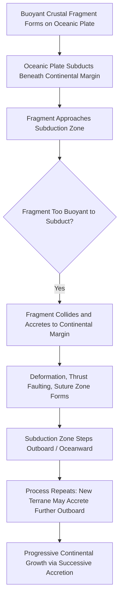

## Terranes and Continental Growth

### Definition and Core Concept

A **terrane** (specifically a "tectonostratigraphic terrane") is a fault-bounded crustal fragment with a geologic history — stratigraphy, structural style, fossil assemblages, and paleomagnetic signature — distinct from that of neighboring crustal blocks, indicating it formed elsewhere and was subsequently transported to its present position by plate tectonic processes before being **accreted** (attached) to a larger continental margin. **Continental growth** refers to the net process by which continents increase in area and volume over geologic time, of which terrane accretion is one of the principal mechanisms, alongside magmatic addition at continental arcs and other crust-forming processes.

### Recognizing a Terrane: Diagnostic Criteria

**Key Points**

- **Bounding faults**: a terrane is bounded by faults (typically thrust or suture-related) on all sides, sharply distinguishing it from surrounding crust rather than grading gradually into it.
- **Distinct stratigraphy**: the rock sequence within a terrane records a depositional and structural history unrelated to, and often incompatible with, that of the adjacent crust it is now attached to.
- **Distinct paleontology**: fossil assemblages within a terrane may indicate formation in a very different paleogeographic (often far-traveled, exotic) setting or climate zone than the terrane's current neighbors.
- **Distinct paleomagnetic signature**: paleomagnetic data from terrane rocks frequently indicate formation at a significantly different paleolatitude than currently occupied, providing quantitative evidence of large-scale lateral transport.
- **Internal coherence**: despite its exotic origin, a terrane displays internally consistent geology, implying it moved and was accreted as a single, coherent crustal block rather than through gradual in-place deformation.

### Types of Terranes by Origin

| Terrane Type | Origin | Characteristic Composition |
| --- | --- | --- |
| Island Arc Terrane | Former volcanic island arc, later accreted to a continent | Andesitic/volcanic rocks, arc-related plutons |
| Oceanic Plateau Terrane | Former submarine large igneous province (thickened oceanic crust) | Thick basaltic sequences, sometimes with associated seamounts |
| Microcontinent Terrane | Fragment rifted from a larger continental block | Continental-type crust, often with older basement rocks |
| Accretionary Wedge Terrane | Sediment and oceanic crust scraped off a subducting plate | Mélange, deformed marine sediments, ophiolite fragments |
| Seamount/Guyot Terrane | Former oceanic volcanic seamount chain, accreted at a subduction zone | Basaltic volcanic rock, sometimes capped by reef limestone |

### The Accretion Process

Terrane accretion typically occurs at convergent plate boundaries through the following general sequence:

1. A buoyant crustal fragment (island arc, oceanic plateau, microcontinent, or similar) forms or exists independently, riding on an oceanic plate that is being subducted.
2. As the oceanic plate carrying this fragment approaches a subduction zone, the fragment itself — being too buoyant and thick to subduct, unlike normal oceanic lithosphere — resists subduction.
3. The buoyant fragment collides with and becomes mechanically attached (accreted) to the overriding plate's continental margin, typically along a zone of intense deformation, thrust faulting, and metamorphism.
4. Subduction may then either cease at that location (if the accreted terrane fully blocks further subduction) or, more commonly, jump outboard (oceanward) of the newly accreted terrane, allowing subduction of the remaining oceanic plate to continue at a new, more seaward location.
5. Repeated accretion events over geologic time progressively add successive terranes to a continental margin, building an increasingly wide zone of composite, exotic crust flanking the original continental core.

### Terrane Accretion Diagram

### Suspect Terranes and Suture Zones (svg_diagram)

<svg xmlns="http://www.w3.org/2000/svg" viewBox="0 0 800 380" font-family="Helvetica, Arial, sans-serif">
<text x="400" y="25" text-anchor="middle" font-size="16" font-weight="bold">Successive Terrane Accretion Along a Continental Margin (svg_diagram)</text>
<rect x="50" y="120" width="200" height="150" fill="#c9a876" stroke="#7a5c3a" />
<text x="150" y="200" text-anchor="middle" font-size="12" font-weight="bold">Craton</text>
<text x="150" y="216" text-anchor="middle" font-size="10">(Original Continental Core)</text>
<line x1="250" y1="120" x2="250" y2="270" stroke="#333" stroke-width="3" stroke-dasharray="6,3" />
<text x="250" y="110" text-anchor="middle" font-size="9">Suture 1</text>
<rect x="250" y="120" width="130" height="150" fill="#b0c9a8" stroke="#4a6a3a" />
<text x="315" y="195" text-anchor="middle" font-size="11" font-weight="bold">Terrane A</text>
<text x="315" y="211" text-anchor="middle" font-size="9">(Island Arc)</text>
<line x1="380" y1="120" x2="380" y2="270" stroke="#333" stroke-width="3" stroke-dasharray="6,3" />
<text x="380" y="110" text-anchor="middle" font-size="9">Suture 2</text>
<rect x="380" y="120" width="120" height="150" fill="#a8c0d0" stroke="#3a5a6a" />
<text x="440" y="195" text-anchor="middle" font-size="11" font-weight="bold">Terrane B</text>
<text x="440" y="211" text-anchor="middle" font-size="9">(Oceanic Plateau)</text>
<line x1="500" y1="120" x2="500" y2="270" stroke="#333" stroke-width="3" stroke-dasharray="6,3" />
<text x="500" y="110" text-anchor="middle" font-size="9">Suture 3</text>
<rect x="500" y="120" width="110" height="150" fill="#d0b0a8" stroke="#6a3a3a" />
<text x="555" y="195" text-anchor="middle" font-size="11" font-weight="bold">Terrane C</text>
<text x="555" y="211" text-anchor="middle" font-size="9">(Microcontinent)</text>
<path d="M610,150 L680,170 L750,340 L680,360 L620,250 Z" fill="#8a9ba8" />
<text x="680" y="140" text-anchor="middle" font-size="10">Active Trench</text>
<text x="680" y="380" text-anchor="middle" font-size="10">Subducting Oceanic Plate</text>

<text x="400" y="310" text-anchor="middle" font-size="11" font-style="italic">Successive accretion progressively widens the continental margin outward from the original craton</text>

</svg>

### Terranes as Evidence: The North American Cordillera

**Example**

The western margin of North America (the North American Cordillera) is one of the most extensively documented examples of terrane accretion in the world, composed of numerous distinct terranes (such as Wrangellia and various island arc and oceanic plateau fragments) accreted progressively to the ancestral North American craton over roughly the past 200 million years. Wrangellia, in particular, is a well-studied terrane whose internally coherent stratigraphy and paleomagnetic data indicate it formed at a significantly different paleolatitude and traveled a substantial distance before being sutured onto the continental margin, illustrating how terrane analysis reveals a far more complex assembly history for continental margins than a simple, static continental edge would suggest.

### Terranes and the Broader Concept of Continental Growth

**Key Points**

- **Terrane accretion** progressively widens continental margins by attaching pre-existing, buoyant crustal fragments (of varied origin) that would otherwise have been lost to subduction, effectively transferring crustal material from the oceanic realm to the continental inventory.
- **Continental arc magmatism** contributes to continental growth through a different mechanism: new igneous material is generated directly from mantle-derived magma during ongoing subduction beneath an existing continental margin, adding juvenile crust rather than recycling pre-existing exotic fragments.
- **Underplating** describes the addition of magma or metamorphosed material to the base of existing continental crust, thickening it without necessarily adding new surface area.
- These processes operate alongside, and are balanced against, crustal recycling mechanisms (subduction erosion, sediment subduction, and delamination) that can remove material from continents back into the mantle, meaning net continental growth reflects the balance between crust-adding and crust-removing processes over geologic time.

### Terrane Accretion vs. Continental-Continental Collision: Key Distinction

**Key Points**

- **Terrane accretion** typically involves smaller, often oceanic-affinity crustal fragments (island arcs, oceanic plateaus, seamounts, sometimes small microcontinents) being progressively attached to a continental margin, usually without producing the extreme, sustained crustal thickening characteristic of major continent-continent collisions.
- **Continental-continental collision** (as in the Himalayas) involves two large, comparably-sized continental masses colliding after an intervening ocean basin closes entirely, producing much more extensive crustal thickening and higher mountain ranges.
- Terrane accretion can be considered a smaller-scale, more frequent analog of the same fundamental principle underlying continental collision: buoyant crust resists subduction and instead attaches to the overriding plate, whether that buoyant crust is a small island arc terrane or an entire continent.

### Common Misconceptions

**Key Points**

- A terrane is not simply any distinct-looking rock unit; the formal definition requires it to be fault-bounded and to show a geologic history (stratigraphic, paleontological, and/or paleomagnetic) genuinely incompatible with its neighboring crust, indicating significant relative transport before accretion.
- Terrane accretion does not necessarily halt subduction permanently at a continental margin; subduction frequently continues by stepping outboard of the newly accreted terrane, allowing the ongoing plate tectonic cycle to persist.
- Continental growth via terrane accretion is not a one-directional, ever-increasing process without exception; crustal recycling mechanisms (subduction erosion, delamination) can remove material from continental margins, meaning net continental growth over Earth's history reflects a balance of competing addition and removal processes rather than continuous, unopposed accumulation.
- Not all suspect or exotic-looking crustal blocks have been conclusively proven to be far-traveled terranes; some apparently anomalous crustal fragments may instead reflect complex but essentially in-place deformation, and rigorous paleomagnetic and stratigraphic analysis is required to distinguish genuine far-traveled terranes from other explanations.

### Related Topics

- Convergent Boundaries and Subduction Zones
- Continental Drift Theory and Plate Reconstruction
- Paleomagnetism and Determining Paleolatitude
- Orogenesis and Continental Collision (Himalayan Example)
- The North American Cordillera and Wrangellia Terrane
- Accretionary Wedges and Subduction Zone Sedimentary Processes
- Crustal Recycling: Subduction Erosion and Delamination
- Suture Zones and Ophiolite Emplacement