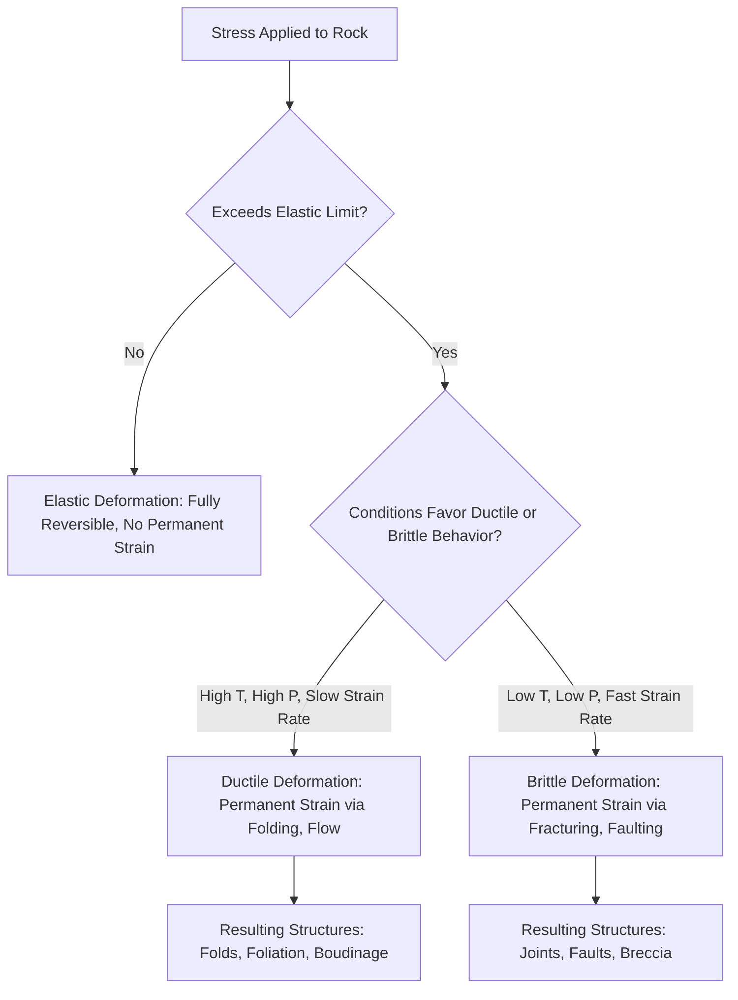

## Stress and Strain in Rocks

### Definition and Fundamental Distinction

**Stress** is the force applied to a rock per unit area, describing the intensity of loading acting on a material regardless of whether that material actually deforms. **Strain** is the resulting change in shape, size, or volume that a rock body undergoes in response to applied stress. Stress is the cause; strain is the observable effect — a rock can be subjected to stress without necessarily accumulating permanent strain (if it deforms elastically and returns to its original shape once stress is removed), making the stress-strain relationship the foundational conceptual framework of structural geology.

### Stress: Definition and Types

**Key Points**

- Stress is mathematically defined as force per unit area: $\sigma = F/A$, expressed in units of pressure (pascals, or more commonly megapascals, MPa, in geologic contexts).
- **Normal stress** acts perpendicular to a given surface or plane, either compressing (pushing together) or extending (pulling apart) the material across that surface.
- **Shear stress** acts parallel to a given surface or plane, tending to cause one part of the material to slide relative to an adjacent part.
- At any point within a stressed body, stress is fully described by a **stress tensor**, which can always be resolved into three mutually perpendicular **principal stresses** ($\sigma_1 \geq \sigma_2 \geq \sigma_3$), oriented such that no shear stress acts across the planes perpendicular to them.

**Stress States**

| Stress State | Description | Geologic Context |
| --- | --- | --- |
| Lithostatic (Confining) Stress | Equal stress in all directions ($\sigma_1 = \sigma_2 = \sigma_3$) | Burial under overlying rock/sediment weight |
| Differential (Deviatoric) Stress | Unequal principal stresses; drives fabric development and faulting | Tectonically active settings |
| Compressive Stress | Principal stresses directed toward each other, shortening the rock | Convergent boundaries, thrust faulting |
| Tensile Stress | Principal stresses directed away from each other, extending the rock | Divergent boundaries, normal faulting |
| Shear Stress (dominant) | Stress oriented to promote sliding along a plane | Transform boundaries, strike-slip faulting |

### Strain: Definition and Components

**Key Points**

- Strain is a dimensionless measure of deformation, typically expressed as a fractional or percentage change relative to an original (undeformed) dimension: $\varepsilon = \Delta L / L_0$.
- **Translation**: rigid-body movement of the entire rock mass from one location to another, without internal deformation or rotation.
- **Rotation**: rigid-body rotation of the rock mass about an axis, again without internal deformation.
- **Dilation**: a change in volume of the rock without a change in overall shape (uniform expansion or contraction).
- **Distortion**: a change in the shape of the rock body, the component of deformation most directly associated with the development of structural fabrics (foliation, lineation, fold geometry).

Total deformation experienced by a rock body is generally a combination of these four components, though structural geology is often most concerned with distortion, since it is this component that produces the recognizable geologic structures used to reconstruct deformation history.

### The Three Fields of Rock Deformation Behavior

As stress is progressively applied to a rock, it characteristically passes through up to three distinct behavioral fields, most clearly illustrated on a stress-strain curve:

**Elastic Deformation**

- Strain is directly proportional to applied stress (following Hooke's Law: $\sigma = E\varepsilon$, where $E$ is Young's modulus).
- Deformation is fully reversible: if stress is removed, the rock returns completely to its original shape and size.
- Represents the initial response of most rocks to low levels of applied stress.

**Ductile (Plastic) Deformation**

- Once stress exceeds the rock's **elastic limit** (yield point), further deformation becomes permanent (non-recoverable) even after stress is removed.
- Deformation proceeds through continuous, non-fracturing internal mechanisms (crystal plastic deformation, pressure solution, diffusion creep) that allow the rock to change shape smoothly without breaking.
- Typically favored by high confining pressure, elevated temperature, and slow (low) strain rates.

**Brittle (Fracture) Deformation**

- If stress continues to increase beyond the rock's ultimate strength, the rock fails abruptly by fracturing, losing cohesion along discrete surfaces.
- Typically favored by low confining pressure, low temperature, and fast (high) strain rates — essentially the opposite conditions favoring ductile behavior.

### Stress-Strain Curve Diagram (svg_diagram)

<svg xmlns="http://www.w3.org/2000/svg" viewBox="0 0 700 400" font-family="Helvetica, Arial, sans-serif">
<text x="350" y="25" text-anchor="middle" font-size="16" font-weight="bold">Idealized Stress-Strain Curve for Rock (svg_diagram)</text>
<line x1="80" y1="330" x2="80" y2="60" stroke="#333" stroke-width="2" marker-end="url(#a8)" />
<line x1="80" y1="330" x2="620" y2="330" stroke="#333" stroke-width="2" marker-end="url(#a8)" />
<text x="40" y="200" font-size="12" transform="rotate(-90 40 200)">Stress</text>
<text x="350" y="365" text-anchor="middle" font-size="12">Strain</text>
<path d="M80,330 L250,180" stroke="#2c5f8a" stroke-width="3" fill="none" />
<text x="150" y="240" font-size="11" fill="#2c5f8a" font-weight="bold">Elastic Field</text>
<text x="150" y="255" font-size="9" fill="#2c5f8a">(reversible)</text>
<circle cx="250" cy="180" r="5" fill="#c94c4c" />
<text x="260" y="170" font-size="10" fill="#c94c4c" font-weight="bold">Elastic Limit</text>
<text x="260" y="183" font-size="9" fill="#c94c4c">(Yield Point)</text>
<path d="M250,180 Q380,130 450,110" stroke="#3a8a3a" stroke-width="3" fill="none" />
<text x="330" y="150" font-size="11" fill="#3a8a3a" font-weight="bold">Ductile Field</text>
<text x="330" y="165" font-size="9" fill="#3a8a3a">(permanent, non-fracturing)</text>
<circle cx="450" cy="110" r="5" fill="#c94c4c" />
<text x="460" y="100" font-size="10" fill="#c94c4c" font-weight="bold">Ultimate Strength</text>
<line x1="450" y1="110" x2="450" y2="330" stroke="#8a3a3a" stroke-width="3" stroke-dasharray="5,3" />
<text x="470" y="220" font-size="11" fill="#8a3a3a" font-weight="bold">Brittle Failure</text>
<text x="470" y="235" font-size="9" fill="#8a3a3a">(fracture, loss of cohesion)</text>
</svg>

### Factors Controlling Ductile vs. Brittle Behavior

| Factor | Favors Ductile Behavior | Favors Brittle Behavior |
| --- | --- | --- |
| Temperature | High | Low |
| Confining Pressure | High | Low |
| Strain Rate | Slow (low) | Fast (high) |
| Rock Composition | Weaker minerals (e.g., calcite, halite, mica) | Stronger minerals (e.g., quartz, feldspar) |
| Presence of Fluids | Can promote ductile mechanisms (pressure solution) | Can promote brittle failure (increased pore pressure reduces effective stress) |
| Crustal Depth | Deeper (lower crust, upper mantle) | Shallower (upper crust) |

**Key Points**

- The same rock composition can behave in a brittle manner near the surface and in a ductile manner at greater depth, since increasing temperature and confining pressure with depth progressively favor ductile mechanisms.
- This depth-dependent transition is a central concept underlying the structure of fault zones, which commonly show a brittle upper portion and a ductile lower portion, connected by a transitional **brittle-ductile transition zone**.

### Strain Rate and Its Geologic Significance

**Key Points**

- Strain rate describes how quickly deformation accumulates over time, typically expressed in units of inverse seconds (s⁻¹).
- Natural tectonic strain rates are extremely slow compared to laboratory or everyday experience, generally on the order of $10^{-14}$ to $10^{-15}$ s⁻¹. *[Unverified: precise natural strain rate values vary considerably by tectonic setting and specific deformation event, and the figures given here should be treated as broadly illustrative orders of magnitude rather than universal constants.]*
- At geologically realistic (very slow) strain rates, rocks can behave in a ductile manner even under conditions where they would fracture brittlely if the same total strain were applied instantaneously or very rapidly, illustrating that deformation behavior depends on the *rate* of loading, not solely on stress magnitude or ambient conditions alone.

### Worked Example: Distinguishing Stress from Strain

**Example**

Consider a layer of rock buried at depth and subjected to horizontal compressive tectonic stress. If the applied stress remains below the rock's elastic limit, the layer will compress elastically (a measurable, but small and fully reversible, decrease in length) and will return to its original dimensions if the stress is removed — in this case, stress was applied, but no permanent strain resulted. If instead the applied stress exceeds the elastic limit and the rock deforms ductilely, forming a visible fold, the shortened and folded shape represents permanent strain that persists even after the driving stress is later removed by erosion or unroofing — the fold itself is the recorded strain, while the tectonic compression that caused it was the stress.

### Stress and Strain Relationship Flowchart

### Connection to Resulting Geologic Structures

**Key Points**

- Ductile deformation under differential stress produces structures such as folds, foliation, lineation, and boudinage (necking of competent layers within a more ductile matrix).
- Brittle deformation under differential stress produces structures such as joints (fractures with no significant offset) and faults (fractures with measurable offset), along with associated breccia and gouge.
- The specific style, orientation, and geometry of resulting structures directly reflects the orientation and relative magnitudes of the principal stresses that produced them, meaning structural geologists routinely work backward from observed strain (structures) to infer the paleostress conditions responsible.

### Common Misconceptions

**Key Points**

- Stress and strain are not interchangeable terms; stress is the applied force per unit area (the cause), while strain is the resulting deformation (the effect), and it is entirely possible to have stress without permanent strain if deformation remains within the elastic field.
- Ductile deformation does not mean the rock was molten or liquid; ductile behavior in structural geology refers to solid-state flow through crystal-plastic and diffusive mechanisms, occurring well below the rock's melting temperature.
- Brittle versus ductile behavior is not a fixed, permanent property of a given rock type; the same rock can behave brittlely or ductilely depending on the specific temperature, pressure, and strain rate conditions at the time of deformation.
- Elastic deformation is not synonymous with "no deformation occurring"; elastic strain is a real, measurable deformation, it simply happens to be fully recoverable once the applied stress is removed, unlike permanent ductile or brittle strain.

### Related Topics

- Faults and Fault Classification (Normal, Reverse, Strike-Slip)
- Folds and Fold Geometry in Structural Geology
- Joints and Brittle Fracture Mechanics
- The Brittle-Ductile Transition Zone in the Crust
- Rock Rheology and Deformation Mechanisms (Crystal Plasticity, Pressure Solution)
- Paleostress Analysis and Structural Reconstruction
- Metamorphism and the Development of Foliation Under Differential Stress
- Earthquake Mechanics and Elastic Rebound Theory