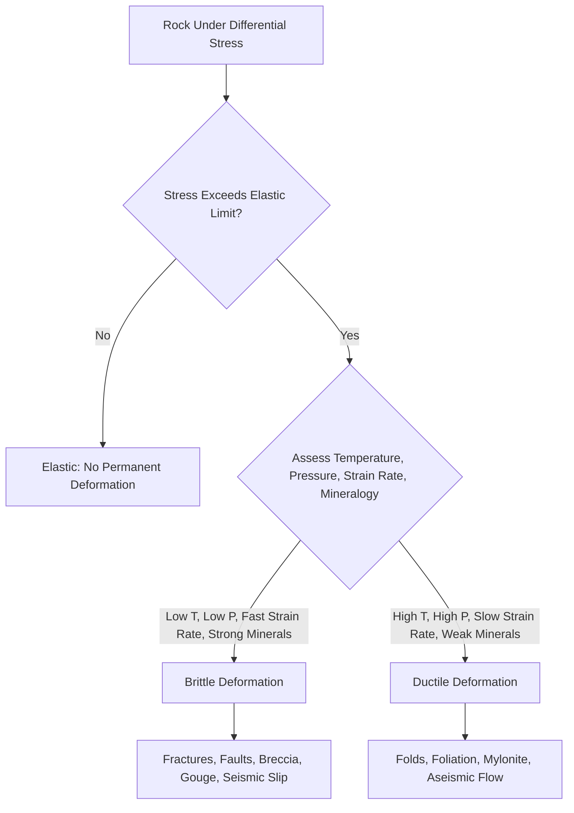

## Brittle versus Ductile Deformation

### Definition and Fundamental Distinction

Brittle deformation is a mode of permanent rock failure in which a material loses cohesion abruptly along discrete fracture surfaces once stress exceeds its strength, with little to no permanent change in shape prior to failure. Ductile deformation is a mode of permanent rock deformation in which the material undergoes continuous, non-fracturing internal flow, progressively and smoothly changing shape without losing cohesion. Both represent the two fundamental end-member styles by which rocks accumulate permanent (non-elastic) strain, and the distinction between them underlies nearly all structural interpretation of deformed rock, since it directly determines which types of geologic structures (fractures and faults versus folds and foliation) will develop under a given set of conditions.

### Mechanisms of Brittle Deformation

**Key Points**

- Brittle failure occurs through the initiation and propagation of microscopic and then macroscopic fractures, ultimately coalescing into a through-going failure surface.
- Failure is typically sudden and associated with a rapid release of stored elastic strain energy, which is the fundamental physical basis for earthquake generation along brittle fault surfaces.
- Brittle deformation produces structures with sharp, discrete boundaries: joints (fractures without measurable offset), faults (fractures with measurable offset), and breccia/fault gouge (comminuted, crushed rock material generated along the failure zone).
- Pore fluid pressure plays a significant role in promoting brittle failure: elevated pore pressure reduces the **effective stress** (the stress actually borne by the rock's mineral framework), weakening the rock and lowering the differential stress required to trigger fracture, a principle central to induced seismicity from fluid injection and to natural fault reactivation.

### Mechanisms of Ductile Deformation

**Key Points**

- Ductile deformation proceeds through several distinct, temperature- and pressure-dependent microscopic mechanisms rather than a single process:
  - **Crystal plastic deformation**: movement of dislocations (line defects) through a mineral's crystal lattice, allowing the crystal to change shape without breaking.
  - **Diffusion creep**: migration of individual atoms or ions through a mineral grain (volume diffusion) or along grain boundaries (grain boundary diffusion), gradually changing grain shape.
  - **Pressure solution (dissolution-precipitation creep)**: dissolution of minerals at high-stress grain contacts, transport of dissolved material through an intergranular fluid film, and reprecipitation at lower-stress sites — particularly important in fluid-rich, lower-temperature settings.
  - **Dynamic recrystallization**: formation of new, strain-free mineral grains during ongoing deformation, allowing continued shape change while maintaining a fine, equant grain structure.
- These mechanisms operate without loss of cohesion at any point during deformation, in fundamental contrast to the discrete failure surfaces characteristic of brittle behavior.
- Ductile deformation produces structures such as folds, foliation, lineation, and boudinage (necking/pinching of relatively strong layers embedded within a weaker, more ductile matrix).

### Factors Controlling Brittle vs. Ductile Behavior

| Factor | Favors Brittle Behavior | Favors Ductile Behavior |
| --- | --- | --- |
| Temperature | Low | High |
| Confining Pressure | Low | High |
| Strain Rate | Fast (high) | Slow (low) |
| Depth in Crust | Shallow | Deep |
| Mineral Strength | Strong minerals (quartz, feldspar) | Weak minerals (calcite, halite, mica, quartz at elevated temperature) |
| Pore Fluid Pressure | High pore pressure promotes brittle failure by reducing effective stress | Presence of fluid can also promote ductile mechanisms (pressure solution) |

**Key Points**

- No single factor determines behavior in isolation; brittle versus ductile response emerges from the combined effect of temperature, confining pressure, strain rate, and mineralogy acting together at the time of deformation.
- The same rock composition characteristically behaves brittlely under shallow, low-temperature, high-strain-rate conditions, yet behaves ductilely under deep, high-temperature, low-strain-rate conditions — behavior is a function of conditions, not a fixed, intrinsic property of the rock type alone.

### The Brittle-Ductile Transition Zone

**Key Points**

- Within Earth's continental crust, brittle behavior generally dominates in the upper crust (roughly the uppermost 10–15 km, varying by geothermal gradient and rock composition), while ductile behavior dominates progressively with depth in the middle-to-lower crust.
- The **brittle-ductile transition zone** is the depth interval where the dominant deformation mechanism shifts from fracture-dominated to flow-dominated behavior; it is not a sharp, single boundary but a gradational zone whose depth varies with local geothermal gradient, rock type, and strain rate.
- This transition has major seismological significance: most crustal earthquakes nucleate within the brittle upper crust, since ductile lower-crustal material generally accommodates strain aseismically (without generating large earthquakes) through continuous flow rather than sudden rupture.
- Fault zones commonly illustrate this transition directly in cross-section: a fault plane accommodating brittle slip (with associated breccia/gouge) in the upper crust typically transitions downward into a broader zone of ductile shearing (a mylonite zone) at depth, both representing the same overall fault system responding differently to depth-dependent conditions.

### Brittle-Ductile Transition Diagram (svg_diagram)

<svg xmlns="http://www.w3.org/2000/svg" viewBox="0 0 700 450" font-family="Helvetica, Arial, sans-serif">
<text x="350" y="25" text-anchor="middle" font-size="16" font-weight="bold">Brittle-Ductile Transition Along a Fault Zone (svg_diagram)</text>
<rect x="100" y="60" width="500" height="150" fill="#d4b483" opacity="0.5" />
<text x="620" y="130" font-size="11" font-weight="bold">Upper Crust</text>
<text x="620" y="145" font-size="10">(Brittle)</text>
<rect x="100" y="210" width="500" height="60" fill="#c9a876" opacity="0.4" stroke="#7a5c3a" stroke-dasharray="4,3" />
<text x="620" y="245" font-size="10" font-weight="bold">Transition Zone</text>
<rect x="100" y="270" width="500" height="150" fill="#8a9ba8" opacity="0.5" />
<text x="620" y="340" font-size="11" font-weight="bold">Lower Crust</text>
<text x="620" y="355" font-size="10">(Ductile)</text>
<path d="M300,60 L280,150 L260,210" stroke="#c94c4c" stroke-width="6" fill="none" />
<text x="180" y="120" font-size="10" fill="#c94c4c" font-weight="bold">Discrete Fault Plane</text>
<text x="180" y="135" font-size="9" fill="#c94c4c">(gouge, breccia)</text>
<path d="M260,210 Q220,280 240,340 Q260,390 300,420" stroke="#3a8a3a" stroke-width="16" fill="none" opacity="0.6" />
<text x="330" y="360" font-size="10" fill="#3a8a3a" font-weight="bold">Ductile Shear Zone</text>
<text x="330" y="375" font-size="9" fill="#3a8a3a">(mylonite)</text>

<text x="350" y="440" text-anchor="middle" font-size="11" font-style="italic">A single fault system: brittle slip above, ductile shearing below</text>

</svg>

### Comparative Summary Table

| Characteristic | Brittle Deformation | Ductile Deformation |
| --- | --- | --- |
| Cohesion During Deformation | Lost (fracture surface forms) | Maintained (continuous flow) |
| Speed of Failure | Sudden, often seismic | Gradual, generally aseismic |
| Resulting Structures | Joints, faults, breccia, gouge | Folds, foliation, lineation, boudinage, mylonite |
| Reversibility | Permanent, discrete offset | Permanent, smooth shape change |
| Typical Crustal Depth | Shallow (upper crust) | Deep (middle-lower crust, upper mantle) |
| Associated Seismicity | High (major earthquake source) | Low (generally aseismic flow) |

### Worked Example: Predicting Behavior at Depth

**Example**

Consider a quartz-rich rock unit undergoing tectonic deformation at two different crustal depths within the same orogenic belt. At a shallow depth (~5 km), low confining pressure and low temperature mean the rock's strength is exceeded by fracture rather than flow, producing a brittle fault with associated breccia. At a much greater depth (~20 km) within the same rock unit, elevated temperature and confining pressure activate crystal-plastic mechanisms (dislocation creep in quartz) at strain rates too slow to trigger fracture, so the identical rock composition instead accommodates deformation through ductile flow, producing a mylonitic fabric. This example illustrates that the brittle-ductile transition is fundamentally a function of depth-dependent conditions rather than an intrinsic property of quartz itself.

### Behavior Prediction Flowchart

### Significance for Interpreting Deformed Terrains

**Key Points**

- Identifying whether a rock exposure records brittle or ductile deformation (or both, in sequence) allows structural geologists to infer the approximate crustal depth and thermal conditions present at the time of deformation, even long after the rocks have been exhumed to the surface.
- A single rock body can preserve evidence of both deformation styles if it experienced deformation at different times under different conditions (e.g., an early ductile fabric overprinted by later brittle faulting as the rock was progressively exhumed toward the surface, cooling and depressurizing along the way).
- Engineering geology and seismic hazard assessment rely heavily on the brittle-ductile transition concept, since it defines the maximum depth at which large, damaging earthquakes can nucleate within a given tectonic setting.

### Common Misconceptions

**Key Points**

- Ductile deformation does not require or imply melting; it is a solid-state process operating well below a rock's melting temperature, distinct from magmatic flow.
- Brittle and ductile are not fixed, permanent categories for a given rock type; the same composition can behave in either manner depending on the temperature, pressure, and strain rate conditions present at the specific time and place of deformation.
- The brittle-ductile transition is not a single sharp depth that applies uniformly to all rock types and tectonic settings; its actual depth varies considerably with local geothermal gradient, mineral composition, and strain rate.
- Ductile deformation is not inherently "gentler" or lower-stress than brittle deformation; ductile flow can accommodate very large total strains and can occur under high differential stress, it simply does so through continuous internal flow rather than discrete fracture.

### Related Topics

- Stress and Strain in Rocks: Fundamental Concepts
- Faults and Fault Classification
- Folds and Fold Geometry
- Joints and Brittle Fracture Mechanics
- Mylonite and Ductile Shear Zone Fabrics
- Earthquake Mechanics and the Seismogenic Zone
- Rock Rheology and Deformation Mechanism Maps
- Metamorphism and the Development of Ductile Fabrics