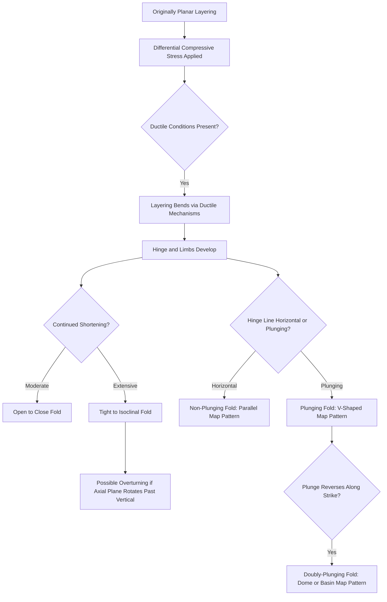

## Folds and Fold Geometry

### Definition and Core Concept

A fold is a curved or bent geometric form developed in originally planar rock features (bedding, foliation, or other layering) as a result of ductile deformation under differential stress, without loss of cohesion. Folds represent one of the two principal structural responses to permanent deformation (alongside brittle fracturing) and record the accumulated ductile strain history of a rock body, making fold geometry a primary tool for reconstructing the orientation, magnitude, and sense of the tectonic stresses responsible for a given deformed terrain.

### Basic Fold Terminology

**Key Points**

- **Hinge**: the line of maximum curvature along a folded surface, marking the point where the surface bends most sharply.
- **Limb**: the relatively planar (less curved) portion of a folded layer extending outward from the hinge on either side.
- **Axial plane** (or axial surface): the imaginary plane that bisects a fold, connecting the hinge lines of all successively folded layers within the structure.
- **Fold axis**: the line representing the trend and plunge of the hinge, essentially the direction along which the fold's cross-sectional profile is repeated.
- **Crest and trough**: the highest point (crest) and lowest point (trough) of a folded surface in cross-section, distinct from the hinge, which refers specifically to the point of maximum curvature rather than simple elevation.
- **Inflection point**: the point along a folded surface where curvature changes direction (from concave to convex or vice versa), marking the boundary between adjacent fold limbs.

### Anticlines and Synclines

The two most fundamental fold types are defined by their relationship to the age of the layers involved and their overall geometric convexity:

**Anticline**

- A fold that is convex-upward in its simplest form, with the oldest rock layers located in the core (center) of the fold.
- In an undisturbed, upright sequence, limbs dip away from the hinge/axial plane.

**Syncline**

- A fold that is concave-upward in its simplest form, with the youngest rock layers located in the core (center) of the fold.
- In an undisturbed, upright sequence, limbs dip toward the hinge/axial plane.

**Key Points**

- The critical diagnostic distinction is based on the relative age of the core rocks, not simply the fold's apparent up-or-down curvature at the present erosional surface — in overturned or complexly deformed sequences, a structure that looks convex-upward can, counterintuitively, actually be a syncline (and vice versa) if the original stratigraphic younging direction has been inverted by earlier deformation.
- **Antiform** and **synform** are purely geometric terms describing convex-upward and concave-upward folds respectively, used when the relative age of the core rocks is unknown or when referring to folds in non-stratified rocks (such as foliated metamorphic rocks) where "older/younger" terminology does not readily apply.

### Fold Classification by Limb Orientation

| Fold Type | Description |
| --- | --- |
| Upright (Symmetric) Fold | Axial plane is vertical; limbs dip at roughly equal angles on either side |
| Inclined (Asymmetric) Fold | Axial plane is tilted from vertical; limbs dip at unequal angles |
| Overturned Fold | Axial plane is tilted enough that one limb is rotated past vertical (inverted stratigraphic order on that limb) |
| Recumbent Fold | Axial plane is close to horizontal; both limbs are nearly horizontal, one directly atop the other |
| Isoclinal Fold | Limbs are parallel or nearly parallel to each other, regardless of axial plane orientation |

### Fold Classification by Interlimb Angle

**Key Points**

- The **interlimb angle** (the angle measured between the two limbs of a fold, on the concave side) provides a quantitative basis for describing how "tight" a fold is.
- **Gentle folds**: interlimb angle 180°–120°
- **Open folds**: interlimb angle 120°–70°
- **Close folds**: interlimb angle 70°–30°
- **Tight folds**: interlimb angle 30°–0°
- **Isoclinal folds**: interlimb angle approximately 0° (limbs essentially parallel)

*[Unverified: the precise numerical boundaries between these descriptive categories vary somewhat between different structural geology textbooks and are used as broadly agreed-upon conventions rather than strict universal thresholds.]*

### Fold Geometry Illustration: Anticline and Syncline (svg_diagram)

<svg xmlns="http://www.w3.org/2000/svg" viewBox="0 0 800 400" font-family="Helvetica, Arial, sans-serif">
<text x="400" y="25" text-anchor="middle" font-size="16" font-weight="bold">Anticline and Syncline: Basic Fold Geometry (svg_diagram)</text>
<path d="M50,250 Q150,100 250,250 Q350,400 450,250 Q550,100 650,250 Q700,325 750,250" stroke="#c9a876" stroke-width="14" fill="none" />
<path d="M50,230 Q150,80 250,230 Q350,380 450,230 Q550,80 650,230 Q700,305 750,230" stroke="#b89968" stroke-width="14" fill="none" />
<path d="M50,210 Q150,60 250,210 Q350,360 450,210 Q550,60 650,210 Q700,285 750,210" stroke="#a08050" stroke-width="14" fill="none" />

<text x="150" y="90" text-anchor="middle" font-size="13" font-weight="bold">Anticline</text>

<text x="150" y="105" text-anchor="middle" font-size="10">(oldest rocks in core)</text>

<line x1="150" y1="115" x2="150" y2="200" stroke="`#c94c4c`" stroke-width="2" stroke-dasharray="4,3" />

<text x="120" y="160" font-size="9" fill="`#c94c4c`">Hinge</text>

<text x="350" y="395" text-anchor="middle" font-size="13" font-weight="bold">Syncline</text>

<text x="350" y="410" text-anchor="middle" font-size="10">(youngest rocks in core)</text>

<line x1="350" y1="240" x2="350" y2="350" stroke="`#c94c4c`" stroke-width="2" stroke-dasharray="4,3" />

<text x="550" y="90" text-anchor="middle" font-size="13" font-weight="bold">Anticline</text>

<line x1="250" y1="60" x2="250" y2="380" stroke="#333" stroke-width="1" stroke-dasharray="2,2" />
<text x="270" y="70" font-size="9">Axial Plane</text>
<line x1="180" y1="180" x2="140" y2="200" stroke="#333" stroke-width="1.5" marker-end="url(#a9)" />
<text x="120" y="215" font-size="8">Limb</text>
</svg>

### Three-Dimensional Fold Features: Plunge and Doubly-Plunging Folds

**Key Points**

- **Plunge** describes the angle at which a fold's hinge line is inclined below the horizontal, measured in the vertical plane containing the fold axis.
- A **plunging fold** has a hinge line that is not horizontal, causing the fold's outcrop pattern to appear as a series of curved, V-shaped (or "nose"-shaped) traces on a geologic map rather than simple parallel lines.
- A **doubly-plunging fold** (or periclinal fold) plunges in opposite directions at its two ends, producing an elliptical or dome/basin-like outcrop pattern on a geologic map, since the hinge line rises to a high point (or descends to a low point) somewhere along its length before plunging away on both sides.
- Plunge direction and angle are essential for accurately predicting subsurface rock geometry, making them of significant practical importance in petroleum and groundwater exploration where fold-related traps are targeted.

### Domes and Basins

**Key Points**

- A **dome** is a fold structure in which rock layers dip outward in all directions from a central point, with the oldest rocks exposed at the structural center — essentially a three-dimensional, non-elongate equivalent of an anticline.
- A **basin** (structural basin) is a fold structure in which rock layers dip inward toward a central point from all directions, with the youngest rocks exposed at the structural center — essentially a three-dimensional, non-elongate equivalent of a syncline.
- Domes and basins are commonly associated with either doubly-plunging fold geometry or with vertical, non-fold-related processes (salt diapirism for domes, sedimentary basin subsidence for basins), so their presence does not automatically confirm a purely compressional folding origin without additional supporting evidence.

### Fold Classification by Mechanism

| Mechanism | Description |
| --- | --- |
| Flexural-Slip Folding | Layers bend by slipping along bedding planes, similar to bending a deck of cards; common in well-layered sedimentary sequences |
| Flexural-Flow Folding | Similar to flexural-slip, but with additional internal ductile flow within each layer, common at higher metamorphic grade |
| Passive-Flow (Similar) Folding | Layering itself has little mechanical control; the whole rock mass flows plastically, and layering is passively folded along with it, common in highly ductile, high-grade rocks |
| Buckle Folding | A single competent layer embedded in a weaker matrix shortens and buckles due to a contrast in mechanical strength (competency contrast) between the layer and its surroundings |

### Fold Formation Sequence Diagram

### Worked Example: Reading a Geologic Map for Fold Type

**Example**

On a geologic map, a structure shows rock units forming a series of curved, roughly parallel bands, with the oldest exposed unit occupying the central band and progressively younger units occurring symmetrically outward on both sides. This pattern is diagnostic of an eroded anticline: the fold has been beveled by erosion down to a level exposing its core, and because older rocks characteristically occupy the core of an anticline (by definition), the age progression from center outward confirms the anticlinal identification — regardless of whether the present topographic expression happens to be a valley or a ridge at that particular location, since erosion can invert the original topographic expression of a fold over time.

### Fold Interference Patterns

**Key Points**

- Rocks that have experienced more than one episode of folding (polyphase deformation), particularly with differing fold axis orientations between episodes, can produce complex **fold interference patterns** when the two fold generations are superimposed.
- Classic interference patterns include dome-and-basin patterns, mushroom-shaped patterns, and hook-shaped patterns, each corresponding to specific combinations of relative fold orientation and refolding geometry described in structural geology interference classification schemes.
- Recognizing interference patterns is essential for correctly unraveling complex, multiply-deformed terrains, since a naive single-phase interpretation of such areas can lead to significant misinterpretation of the true deformation history.

### Common Misconceptions

**Key Points**

- Anticlines are not defined simply by their convex-upward shape at the present erosion surface; the rigorous definition depends on the relative age of the core rocks, and overturned or inverted structures can superficially resemble the opposite fold type if age relationships are not carefully checked.
- A syncline does not have to form a topographic valley, nor does an anticline have to form a topographic ridge; differential erosion can invert the relationship between fold structure and present-day topography (producing, for example, an eroded anticline that now forms a valley because its crestal region was more easily eroded).
- Folds do not require extremely high temperatures or partial melting to form; most folding occurs entirely in the solid state through ductile deformation mechanisms operating well below melting temperatures.
- Domes and basins are not always the product of pure compressional folding; some domal or basinal structures arise from unrelated processes such as salt diapirism (domes) or long-term sedimentary subsidence (basins), so structural context is needed before attributing every dome or basin to fold-related shortening.

### Related Topics

- Stress and Strain in Rocks
- Brittle versus Ductile Deformation
- Faults and Fault Classification
- Structural Geology Map Reading and Cross-Section Construction
- Salt Tectonics and Diapirism
- Petroleum Traps and Structural Geology Applications
- Metamorphic Fabrics and Foliation Development
- Polyphase Deformation and Fold Interference Patterns