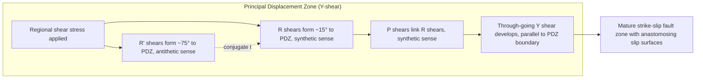

## Faults and Fault Classification

### Definition and Fundamental Concepts

A fault is a planar or gently curved fracture in rock material across which measurable displacement has occurred parallel to the fracture surface. This distinguishes faults from joints, which are fractures showing no appreciable shear displacement. Faults form when shear stress within the crust exceeds the shear strength of the rock, and they range in scale from millimeter-scale slip surfaces in hand samples to lithosphere-spanning structures thousands of kilometers long, such as transform plate boundaries.

The geometric description of a fault relies on a standard set of terms:

- **Fault plane**: the surface along which displacement occurs (in practice often slightly curved or stepped rather than a perfect plane)
- **Strike**: the compass orientation of the line formed by the intersection of the fault plane with a horizontal plane
- **Dip**: the angle between the fault plane and the horizontal, measured perpendicular to strike
- **Dip direction**: the azimuth toward which the fault surface inclines downward
- **Hanging wall**: the rock mass located above an inclined fault plane
- **Footwall**: the rock mass located below an inclined fault plane
- **Fault trace**: the line of intersection between the fault plane and the ground surface, as mapped at the outcrop or on geologic maps

The hanging wall/footwall distinction only applies to non-vertical faults and is a critical reference frame for classifying fault types, since the sense of relative motion between these two blocks defines the primary categories.

### The Mechanics of Faulting

Faulting is a brittle deformation process governed by the relationship between stress, rock strength, and existing planes of weakness. The Mohr-Coulomb failure criterion is the standard framework describing when a rock will fail in shear:

$$\tau = C + \mu\sigma_n$$

where $\tau$ is the shear stress required for failure, $C$ is the cohesive strength of the material, $\mu$ is the coefficient of internal friction, and $\sigma_n$ is the normal stress acting across the potential failure plane. This relationship predicts that new faults tend to form at an angle of roughly 30° to the maximum principal compressive stress ($\sigma_1$), since this orientation optimizes the ratio of shear stress to normal stress on the plane.

Andersonian fault theory, developed by E.M. Anderson in 1905, extends this framework by assuming the Earth's surface is a free surface (unable to sustain shear stress), which forces one of the three principal stress axes ($\sigma_1$, $\sigma_2$, $\sigma_3$, ordered from greatest to least compressive stress) to be vertical. The orientation of the vertical stress axis relative to the other two determines which basic fault type is mechanically favored:

- If $\sigma_1$ is vertical → normal faulting is favored
- If $\sigma_2$ is vertical → strike-slip faulting is favored
- If $\sigma_3$ is vertical → reverse/thrust faulting is favored

[Inference] Andersonian theory is a first-order model; natural fault systems frequently deviate from it due to pre-existing weaknesses, fault reactivation, non-Andersonian stress states at depth, and rotation of stress axes through time.

Once a fault exists, frictional sliding along the pre-existing surface is typically easier than generating a new fracture, so reactivation of favorably oriented existing faults is common even when their orientation is not optimal for the current stress field. Fault behavior also depends on whether slip is stable and continuous (aseismic creep) or occurs in sudden episodic slip events (stick-slip behavior), the latter being the mechanism responsible for earthquakes.

### Primary Classification: Dip-Slip Faults

Dip-slip faults exhibit displacement predominantly parallel to the dip direction of the fault plane, meaning the hanging wall moves up or down relative to the footwall.

#### Normal Faults

In a normal fault, the hanging wall moves downward relative to the footwall. Normal faults typically dip between 45° and 70°, though listric normal faults flatten with depth into a curved, concave-upward profile that can approach horizontal at depth, often soling into a detachment surface.

Normal faults are the characteristic structure of extensional tectonic regimes, where $\sigma_1$ is vertical (lithostatic load) and $\sigma_3$ is horizontal. They accommodate crustal extension and are the dominant fault type in:

- Continental rift zones (e.g., the East African Rift System)
- Mid-ocean ridge spreading centers
- Back-arc basins
- Basin-and-range extensional provinces (e.g., the Basin and Range Province of the western United States)

Associated structural assemblages include horsts (elevated blocks bounded by normal faults dipping away from the block) and grabens (down-dropped blocks bounded by normal faults dipping toward the block), as well as half-grabens formed by a single dominant normal fault.

#### Reverse Faults and Thrust Faults

In a reverse fault, the hanging wall moves upward relative to the footwall, accommodating horizontal shortening of the crust. Reverse faults are subdivided by dip angle:

- **Reverse faults** (strict sense): dip greater than approximately 45°
- **Thrust faults**: dip less than approximately 45°, often much shallower (10°-30°) or nearly horizontal

Thrust faults are characteristic of compressional tectonic settings including continental collision zones (e.g., the Himalayan thrust belt), subduction zone megathrusts, and fold-and-thrust belts (e.g., the Canadian Rocky Mountains). Large-displacement thrust systems commonly exhibit:

- **Duplex structures**: stacked imbricate thrust sheets bounded by a floor thrust and roof thrust, containing horses (fault-bounded lenses of rock)
- **Klippen**: erosional remnants of a thrust sheet isolated from the main body of the sheet, appearing as an outlier of older rock surrounded by younger rock
- **Fenster (windows)**: erosional breaches through a thrust sheet exposing older footwall rock beneath, surrounded by the younger hanging wall rock
- **Ramp-flat geometry**: thrust surfaces that alternate between flat segments (parallel to bedding) and ramp segments (cutting up-section through bedding), producing characteristic fault-bend folds

Reverse faults with very low displacement-to-length ratios and shallow dip are sometimes distinguished further as **overthrusts** when displacement reaches tens of kilometers.

### Primary Classification: Strike-Slip Faults

Strike-slip faults (also called wrench faults or transcurrent faults) exhibit displacement dominantly parallel to the strike of the fault plane, meaning the two blocks move horizontally past one another with little vertical component. Strike-slip faults are typically near-vertical to steeply dipping (often greater than 70°).

Sense of motion is described relative to an observer standing on one block and looking across the fault:

- **Right-lateral (dextral)**: the opposite block appears to have moved to the right
- **Left-lateral (sinistral)**: the opposite block appears to have moved to the left

Major examples include the San Andreas Fault (right-lateral) and the North Anatolian Fault (right-lateral). Strike-slip faults occur at transform plate boundaries, as accommodation structures within broader zones of oblique convergence or divergence, and as tear faults within thrust belts.

Strike-slip fault zones commonly generate distinctive secondary structures due to local bends and stepovers along the main fault trace:

- **Releasing bends/stepovers**: where the fault geometry produces local extension, generating **pull-apart basins**
- **Restraining bends/stepovers**: where the fault geometry produces local compression, generating localized uplift and small-scale reverse faulting or folding

**Riedel shear systems** describe the characteristic geometric array of secondary fractures (R, R', P, and Y shears) that develop within a strike-slip shear zone at predictable angles to the principal displacement zone, and are widely used in structural analysis and analog modeling of strike-slip deformation.

### Oblique-Slip Faults

Many natural faults exhibit both dip-slip and strike-slip components simultaneously, termed oblique-slip faults. The net slip vector on such a fault can be decomposed into its dip-slip and strike-slip components, and the **rake** (or pitch) — the angle measured within the fault plane between the strike direction and the slip vector — quantifies this obliquity. A rake of 0° or 180° indicates pure strike-slip motion, while a rake of 90° indicates pure dip-slip motion. Transtensional and transpressional regimes, common along transform boundaries with a component of divergence or convergence respectively, typically produce oblique-slip fault systems.

### Classification by Additional Criteria

**By displacement geometry:**

- **Planar faults**: fault surface approximates a flat plane
- **Listric faults**: fault surface curves, becoming shallower with depth
- **Rotational (scissor) faults**: displacement magnitude varies along strike and reverses sense on either side of a pivot point

**By scale and structural role:**

- **Detachment faults**: low-angle normal faults, often regionally extensive, that separate distinct structural or metamorphic domains, commonly associated with metamorphic core complexes
- **Décollement**: a low-angle detachment surface, particularly at the base of a fold-and-thrust belt or salt/shale décollement horizon, along which the overlying sedimentary package is displaced independent of basement
- **Transform faults**: strike-slip faults that terminate at their ends against other plate boundary types (spreading ridges or subduction zones), forming one of the three principal plate boundary categories

**By activity status:**

- **Active faults**: have produced displacement in the current tectonic stress regime, generally within the Holocene, and are considered capable of future rupture
- **Inactive/relict faults**: preserve evidence of past displacement but show no evidence of recent movement
- **Reactivated faults**: pre-existing structures that experience renewed slip under a later, potentially different stress regime, often with a different sense of motion than the original formation

### Fault-Related Structures and Diagnostic Features

Field identification of faults relies on both direct offset evidence and associated deformation features:

- **Fault gouge**: fine-grained, unconsolidated to weakly consolidated material produced by grinding and comminution of rock along the fault surface
- **Fault breccia**: coarser, angular fragmented rock associated with brittle faulting, distinguished from gouge by larger clast size
- **Cataclasite**: a cohesive fault rock produced by brittle fracturing and grain-size reduction, without significant gouge development
- **Mylonite**: a foliated, fine-grained fault rock produced by ductile crystal-plastic deformation at depth, indicating faulting under higher temperature/pressure conditions than brittle gouge or breccia
- **Slickensides**: polished, striated surfaces on a fault plane produced by frictional sliding; the striations (slickenlines) record the direction of relative slip
- **Fault drag**: bending of bedding or foliation adjacent to a fault plane; normal drag folds concave in the direction of motion, while reverse drag folds convex in the direction of motion
- **Fault scarp**: a topographic step produced by fault displacement of the ground surface, most clearly preserved along recently active normal and strike-slip faults
- **Piercing points**: geologic features (such as a dike, channel, or bed) offset by a fault, used to directly measure the magnitude and direction of net slip

### Illustration: Basic Fault Geometries (svg_diagram)

<svg xmlns="http://www.w3.org/2000/svg" viewBox="0 0 900 620" font-family="Arial, sans-serif">
<text x="450" y="30" font-size="20" font-weight="bold" text-anchor="middle">Fault Classification by Slip Sense (svg_diagram)</text>

<g>
<text x="150" y="70" font-size="16" font-weight="bold" text-anchor="middle">Normal Fault</text>
<rect x="20" y="90" width="260" height="160" fill="#eef2f7" stroke="none" />
<line x1="60" y1="90" x2="220" y2="250" stroke="black" stroke-width="3" />
<polygon points="60,90 220,90 220,170 140,250 60,250" fill="#cde3f7" stroke="black" stroke-width="1.5" />
<polygon points="220,90 260,90 260,250 140,250 220,170" fill="#f7d9b0" stroke="black" stroke-width="1.5" />
<text x="100" y="150" font-size="12">Hanging Wall</text>
<text x="230" y="200" font-size="12" transform="rotate(-90 230,200)">Footwall</text>
<line x1="150" y1="150" x2="150" y2="200" stroke="red" stroke-width="2" marker-end="url(#arrow)" />
<text x="10" y="270" font-size="11">Hanging wall moves DOWN relative to footwall</text>
<text x="10" y="284" font-size="11">σ1 vertical — extensional regime</text>
</g>

<g>
<text x="450" y="70" font-size="16" font-weight="bold" text-anchor="middle">Reverse / Thrust Fault</text>
<rect x="320" y="90" width="260" height="160" fill="#eef2f7" stroke="none" />
<line x1="360" y1="250" x2="520" y2="90" stroke="black" stroke-width="3" />
<polygon points="360,250 520,90 560,90 560,250" fill="#cde3f7" stroke="black" stroke-width="1.5" />
<polygon points="320,90 520,90 360,250 320,250" fill="#f7d9b0" stroke="black" stroke-width="1.5" />
<text x="380" y="150" font-size="12">Footwall</text>
<text x="500" y="200" font-size="12">Hanging Wall</text>
<line x1="450" y1="200" x2="450" y2="150" stroke="red" stroke-width="2" marker-end="url(#arrow)" />
<text x="310" y="270" font-size="11">Hanging wall moves UP relative to footwall</text>
<text x="310" y="284" font-size="11">σ3 vertical — compressional regime</text>
</g>

<g>
<text x="750" y="70" font-size="16" font-weight="bold" text-anchor="middle">Strike-Slip Fault</text>
<rect x="620" y="90" width="260" height="160" fill="#eef2f7" stroke="none" />
<line x1="750" y1="90" x2="750" y2="250" stroke="black" stroke-width="3" />
<rect x="620" y="90" width="130" height="160" fill="#cde3f7" stroke="black" stroke-width="1.5" />
<rect x="750" y="90" width="130" height="160" fill="#f7d9b0" stroke="black" stroke-width="1.5" />
<line x1="700" y1="130" x2="740" y2="130" stroke="red" stroke-width="2" marker-end="url(#arrow)" />
<line x1="800" y1="210" x2="760" y2="210" stroke="red" stroke-width="2" marker-end="url(#arrow)" />
<text x="640" y="270" font-size="11">Right-lateral (dextral) shown</text>
<text x="640" y="284" font-size="11">Near-vertical plane, horizontal slip</text>
</g>
<g>
<text x="450" y="330" font-size="16" font-weight="bold" text-anchor="middle">Andersonian Stress Configuration (svg_diagram)</text>
<rect x="60" y="350" width="780" height="230" fill="#fbfbfb" stroke="#ccc" />



```
<text x="180" y="380" font-size="13" font-weight="bold" text-anchor="middle">Normal</text>
<line x1="180" y1="400" x2="180" y2="480" stroke="black" stroke-width="2" marker-end="url(#arrow)" />
<line x1="180" y1="480" x2="180" y2="400" stroke="black" stroke-width="2" marker-end="url(#arrow)" />
<text x="120" y="440" font-size="11">σ3</text>
<text x="230" y="440" font-size="11">σ3</text>
<text x="185" y="405" font-size="11">σ1 (vertical)</text>
<line x1="120" y1="500" x2="240" y2="440" stroke="darkblue" stroke-width="2" />
<text x="130" y="540" font-size="11">Fault dips ~60°</text>

<text x="450" y="380" font-size="13" font-weight="bold" text-anchor="middle">Strike-Slip</text>
<line x1="370" y1="460" x2="530" y2="460" stroke="black" stroke-width="2" marker-end="url(#arrow)" />
<text x="535" y="465" font-size="11">σ1 (horiz.)</text>
<text x="450" y="400" font-size="11">σ2 (vertical)</text>
<line x1="410" y1="500" x2="490" y2="420" stroke="darkblue" stroke-width="2" />
<text x="400" y="540" font-size="11">Fault near vertical</text>

<text x="720" y="380" font-size="13" font-weight="bold" text-anchor="middle">Reverse/Thrust</text>
<line x1="640" y1="460" x2="800" y2="460" stroke="black" stroke-width="2" marker-end="url(#arrow)" />
<text x="805" y="465" font-size="11">σ1 (horiz.)</text>
<text x="700" y="560" font-size="11">σ3 (vertical)</text>
<line x1="660" y1="500" x2="780" y2="420" stroke="darkblue" stroke-width="2" />
<text x="670" y="540" font-size="11">Fault dips shallow-moderate</text>
```

</g>
</svg>

### Diagram: Riedel Shear Geometry in a Strike-Slip Zone



### Fault Recognition and Field/Map Criteria

Identifying faults in the field or on geologic maps relies on convergent lines of evidence rather than any single indicator, since erosion, vegetation cover, and younger deposition can obscure direct exposure of the fault plane itself:

- Abrupt truncation or offset of stratigraphic units, dikes, or veins across a linear or curvilinear trace
- Repetition or omission of stratigraphic section in a measured section (repetition commonly indicates reverse/thrust faulting; omission commonly indicates normal faulting, under simple geometric assumptions)
- Anomalous juxtaposition of rock units or metamorphic grades across a contact
- Physical fault rocks (gouge, breccia, mylonite) exposed in outcrop
- Slickensides and slickenlines providing direct kinematic indicators
- Topographic linears, including scarps, offset drainages, sag ponds, and shutter ridges along active fault traces
- Seismicity patterns and focal mechanism solutions, which for active faults provide independent confirmation of fault plane orientation and slip sense at depth
- Geophysical anomalies (gravity, magnetic, or seismic reflection discontinuities) marking the subsurface fault trace where surface exposure is absent

[Unverified] Precise omission/repetition relationships in cross-section depend on cutoff angles between the fault and bedding, and reversed relationships are possible in complex geometries such as low-angle normal faults cutting steeply dipping strata; this general rule should be treated as a first approximation rather than a universal diagnostic.

### Faults and Seismicity

Not all faults are seismogenic. Fault slip behavior is influenced by rock rheology, temperature, pore fluid pressure, and slip rate, producing a spectrum from stable aseismic creep to unstable stick-slip rupture. The seismogenic zone on a given fault is typically bounded by a shallow limit (where near-surface material deforms in a stable, ductile-like manner, e.g., unconsolidated gouge) and a deeper limit (where increasing temperature promotes ductile crystal-plastic flow rather than brittle failure). Earthquake magnitude on a given fault segment scales broadly with the rupture area and average slip, as formalized in seismic moment:

$$M_0 = \mu A D$$

where $M_0$ is seismic moment, $\mu$ is the shear modulus of the surrounding rock, $A$ is the rupture area, and $D$ is average displacement across that area. [Inference] Because larger, longer faults can sustain larger rupture areas, they are generally capable of larger maximum-magnitude earthquakes, though this relationship is also affected by fault segmentation, geometric complexity, and stress heterogeneity along strike.

### Regional and Global Examples by Type

| Fault Type | Example | Tectonic Setting |
| --- | --- | --- |
| Normal | Wasatch Fault (Utah, USA) | Basin and Range extension |
| Normal (rift) | Gulf of Suez / Red Sea faults | Continental rifting |
| Listric normal | Gulf of Mexico growth faults | Passive margin sediment loading |
| Thrust | Main Himalayan Thrust | Continental collision |
| Thrust | Lewis Overthrust (Montana, USA) | Cordilleran fold-and-thrust belt |
| Reverse (blind) | Northridge fault (California, USA) | Transpressional segment of plate boundary |
| Strike-slip (dextral) | San Andreas Fault (California, USA) | Transform plate boundary |
| Strike-slip (sinistral) | Dead Sea Transform | Transform boundary, Arabian/African plates |
| Detachment | Whipple Mountains (California, USA) | Metamorphic core complex |

### Common Misconceptions

- **"All faults are seismically active."** Many faults are inactive relict structures preserving no current stress accumulation, or accommodate slip purely through aseismic creep.
- **"Fault dip alone determines fault type."** While dip ranges are diagnostic tendencies (steep for strike-slip and normal faults, variable for reverse/thrust), the definitive classification criterion is the sense and direction of relative displacement, not dip angle in isolation.
- **"Joints and faults are the same feature at different scales."** Joints lack shear displacement entirely; the presence of measurable offset, not just fracture size, is the distinguishing criterion.
- **"Faults are simple, single planar breaks."** Natural fault zones are typically anastomosing networks of subsidiary fractures, gouge zones, and damage zones surrounding a principal slip surface, especially at outcrop and map scale.

### Related Topics

- Stress and strain in the crust (principal stress axes, stress ellipsoid, Mohr circle analysis)
- Folds and folding mechanisms
- Fold-and-thrust belt structural styles
- Plate tectonic boundary types (divergent, convergent, transform)
- Paleoseismology and trenching methods for active fault studies
- Seismic hazard analysis and earthquake magnitude-frequency relationships
- Metamorphic core complexes and detachment fault systems
- Basin analysis and syn-rift/syn-tectonic sedimentation
- Rock mechanics and brittle-ductile transition
- Structural geology mapping techniques (stereonets, cross-section balancing)