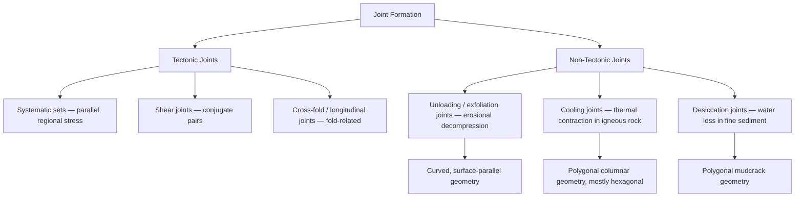

## Joints and Fracture Systems

### Definition and Fundamental Concepts

A joint is a fracture in rock across which there has been no measurable shear displacement parallel to the fracture surface, distinguishing it from faults. Minor displacement perpendicular to the fracture (opening) may occur, but joints are fundamentally extensional or tensile features at the time of formation. Joints are among the most ubiquitous structures in the upper crust, occurring in virtually all rock types and at all scales from millimeters to features traceable for kilometers.

Joints form as brittle failure surfaces when tensile stress within a rock mass exceeds its tensile strength, or when the effective stress state locally becomes tensile due to a reduction in confining pressure, fluid pressure changes, or cooling/desiccation. Since intact rock typically has very low tensile strength compared to its compressive or shear strength, relatively small stress perturbations are sufficient to generate joints, which explains their pervasive occurrence across nearly all exposed rock.

### Mechanics of Joint Formation

Joints are classified mechanically as Mode I fractures in fracture mechanics terminology, meaning the fracture walls move apart perpendicular to the fracture plane (opening mode), as opposed to Mode II (in-plane shear) or Mode III (out-of-plane shear) fractures associated with faulting. The Griffith fracture criterion provides the classical framework for tensile failure initiation, proposing that failure nucleates preferentially at pre-existing microscopic flaws where stress concentrates:

$$\sigma_t = \sqrt{\frac{2E\gamma_s}{\pi c}}$$

where $\sigma_t$ is the theoretical tensile strength, $E$ is Young's modulus, $\gamma_s$ is surface energy, and $c$ is half the length of the flaw. [Inference] This idealized relationship is rarely applied quantitatively in field-scale structural analysis, but it underlies the qualitative understanding that joints nucleate at flaws (grain boundaries, fossils, pre-existing microcracks) rather than through homogeneous rock strength.

Joints propagate in the direction perpendicular to the least principal stress ($\sigma_3$) and parallel to the plane containing $\sigma_1$ and $\sigma_2$. Because the orientation of a joint records the paleostress field at the time of fracture, systematic joint orientation analysis is a standard tool for reconstructing regional and local stress history.

### Genetic Classification of Joints

Joints are commonly classified by their origin, since the mechanism of formation strongly controls their orientation, spacing, and regional distribution pattern.

#### Tectonic Joints

Tectonic joints form in response to regional or local tectonic stress fields, often associated with folding, faulting, or regional uplift. Common tectonic joint sets include:

- **Cross-joints (release joints)**: form perpendicular to fold axes or perpendicular to the regional maximum compressive stress direction
- **Longitudinal joints**: form parallel to fold axes, often in the outer arc of folded layers experiencing extension during flexure
- **Shear joints**: form as conjugate sets at acute angles to one another, bisected by $\sigma_1$, reflecting a hybrid mode between pure tensile and shear failure
- **Systematic joints**: planar, regionally consistent, parallel joints forming a well-defined set with consistent orientation over a wide area
- **Cross-fold joints**: joints related to flexural-slip or flexural-flow folding mechanisms, forming in predictable orientations relative to bedding and fold geometry

#### Unloading (Exfoliation) Joints

Unloading joints, also called sheeting joints or exfoliation joints, form parallel to the ground surface as a result of the removal of overlying rock or ice through erosion, producing a reduction in confining pressure. As overburden is removed, the rock mass expands elastically in the direction of unloading, generating tensile stress parallel to the surface and joints that curve to follow topography. These joints are especially well developed in massive, homogeneous rocks such as granite, producing classic exfoliation domes (e.g., Half Dome in Yosemite National Park, Sugarloaf Mountain in Rio de Janeiro).

#### Cooling Joints (Columnar Jointing)

Cooling joints form in igneous rocks (typically basaltic lava flows, sills, or dikes) as a result of thermal contraction during cooling and solidification. Contraction generates a triple-junction crack pattern that propagates inward from cooling surfaces, ideally producing hexagonal columns oriented perpendicular to the cooling surface (isotherms). Classic examples include the Giant's Causeway (Northern Ireland) and Devils Postpile (California). [Inference] While hexagonal geometry is the theoretical energy-minimizing configuration, natural columns commonly show 4- to 7-sided cross-sections due to heterogeneities in cooling rate and lava composition.

#### Desiccation Joints (Mudcracks)

Desiccation joints form in fine-grained sediment (mud, clay) as a result of volume reduction during water loss, producing polygonal crack patterns at the surface that can be preserved in the rock record as mudcracks — a valuable sedimentary structure for identifying subaerial exposure surfaces.

#### Joints Related to Regional Uplift and Erosion (Unloading in a Broader Sense)

Regional-scale joint sets, sometimes called master joints, can extend over large areas and are attributed to broad regional stress fields associated with far-field plate boundary stresses, regional doming, or deep-seated basement structure, persisting independent of local structures like individual folds.

### Joint Geometry and Descriptive Terminology

- **Joint set**: a group of parallel or sub-parallel joints sharing a common orientation and inferred origin
- **Joint system**: two or more joint sets that formed under a related stress regime, often intersecting at consistent angles (commonly forming conjugate or orthogonal patterns)
- **Master joint**: a joint of unusually large extent or persistence relative to others in the same set
- **Joint spacing**: the perpendicular distance between adjacent joints within a set, often controlled by bed thickness in layered sedimentary rocks (thinner beds generally show closer joint spacing)
- **Joint density**: the number of joints per unit area or unit volume, used as a proxy for the intensity of deformation or degree of brittle failure
- **Plumose structure (hackle marks)**: a feather-like pattern of fine ridges on a joint surface radiating from the point of fracture initiation, allowing determination of propagation direction and sometimes the initiation point
- **Joint face**: the exposed planar surface of a joint

Cross-cutting relationships between joint sets (which set truncates which) allow relative age determination, since younger joints commonly terminate against pre-existing older joints (an "abutting" relationship) rather than cutting continuously through them.

### Illustration: Joint Set Geometries by Origin (svg_diagram)

<svg xmlns="http://www.w3.org/2000/svg" viewBox="0 0 900 480" font-family="Arial, sans-serif">
<text x="450" y="28" font-size="20" font-weight="bold" text-anchor="middle">Joint Origins and Characteristic Patterns (svg_diagram)</text>

<g>
<text x="150" y="60" font-size="15" font-weight="bold" text-anchor="middle">Tectonic (Conjugate)</text>
<rect x="30" y="80" width="240" height="160" fill="#f4f4f4" stroke="#999" />
<line x1="60" y1="90" x2="240" y2="230" stroke="black" stroke-width="1.5" />
<line x1="60" y1="130" x2="240" y2="270" stroke="black" stroke-width="1.5" transform="translate(0,-30)" />
<line x1="240" y1="90" x2="60" y2="230" stroke="black" stroke-width="1.5" />
<line x1="240" y1="130" x2="60" y2="270" stroke="black" stroke-width="1.5" transform="translate(0,-30)" />
<line x1="150" y1="90" x2="150" y2="230" stroke="red" stroke-width="1.5" stroke-dasharray="4,3" />
<text x="155" y="100" font-size="10" fill="red">σ1</text>
<text x="40" y="255" font-size="10">Acute bisector = σ1 direction</text>
</g>

<g>
<text x="450" y="60" font-size="15" font-weight="bold" text-anchor="middle">Cooling (Columnar)</text>
<rect x="330" y="80" width="240" height="160" fill="#f4f4f4" stroke="#999" />
<g stroke="black" stroke-width="1.2" fill="none">
<polygon points="380,100 400,90 420,100 420,120 400,130 380,120" />
<polygon points="420,100 440,90 460,100 460,120 440,130 420,120" />
<polygon points="460,100 480,90 500,100 500,120 480,130 460,120" />
<polygon points="380,120 400,130 420,120 420,140 400,150 380,140" />
<polygon points="420,120 440,130 460,120 460,140 440,150 420,140" />
<polygon points="460,120 480,130 500,120 500,140 480,150 460,140" />
<polygon points="380,140 400,150 420,140 420,160 400,170 380,160" />
<polygon points="420,140 440,150 460,140 460,160 440,170 420,160" />
<polygon points="460,140 480,150 500,140 500,160 480,170 460,160" />
</g>
<text x="360" y="200" font-size="10">Hexagonal columns perpendicular</text>
<text x="360" y="214" font-size="10">to cooling surface</text>
</g>

<g>
<text x="750" y="60" font-size="15" font-weight="bold" text-anchor="middle">Desiccation (Polygonal)</text>
<rect x="630" y="80" width="240" height="160" fill="#f4f4f4" stroke="#999" />
<path d="M650,100 L700,95 L730,120 L710,150 L670,155 L650,130 Z" fill="none" stroke="black" stroke-width="1.2" />
<path d="M700,95 L750,90 L770,115 L730,120 Z" fill="none" stroke="black" stroke-width="1.2" />
<path d="M730,120 L770,115 L790,145 L750,160 L710,150 Z" fill="none" stroke="black" stroke-width="1.2" />
<path d="M670,155 L710,150 L720,190 L680,195 Z" fill="none" stroke="black" stroke-width="1.2" />
<path d="M710,150 L750,160 L760,195 L720,190 Z" fill="none" stroke="black" stroke-width="1.2" />
<text x="650" y="215" font-size="10">Irregular polygonal network,</text>
<text x="650" y="229" font-size="10">curled edges typical in mudcracks</text>
</g>

<g>
<text x="450" y="290" font-size="15" font-weight="bold" text-anchor="middle">Unloading / Exfoliation Sheeting Joints</text>
<rect x="200" y="310" width="500" height="150" fill="#f4f4f4" stroke="#999" />
<path d="M220,440 Q450,320 680,440" fill="none" stroke="black" stroke-width="1.5" />
<path d="M220,450 Q450,350 680,450" fill="none" stroke="black" stroke-width="1.5" />
<path d="M230,455 Q450,380 670,455" fill="none" stroke="black" stroke-width="1.5" />
<text x="270" y="330" font-size="11">Curved joints parallel to topographic surface,</text>
<text x="270" y="345" font-size="11">formed by unloading-driven expansion (e.g., granite domes)</text>
</g>
</svg>

### Fracture Systems in Sedimentary Sequences

In layered sedimentary rocks, joints frequently show a strong dependence on mechanical stratigraphy — the layering of units with contrasting mechanical properties (stiffness, strength). Key relationships include:

- Joint spacing scales approximately with bed thickness for a given lithology, following empirically observed fracture saturation behavior in which spacing increases with layer thickness up to a limiting ratio
- Joints frequently terminate at bedding-plane interfaces, particularly at contacts between mechanically contrasting units (e.g., stiff sandstone overlying more ductile shale)
- Sequential jointing (fracture saturation) describes the process by which joint spacing decreases until the layer becomes "saturated" and further extension is accommodated by widening existing joints rather than forming new ones

Fracture systems in sedimentary basins are of major practical importance as they control secondary (fracture) permeability in otherwise low-permeability reservoir rocks, and are a primary target of interest in unconventional hydrocarbon reservoir characterization and groundwater aquifer studies in fractured bedrock.

### Diagram: Joint Set Genetic Classification

### Analytical and Field Methods

Joint characterization relies on both systematic field measurement and, increasingly, remote and subsurface analytical techniques:

- **Scanline surveys**: measuring joint orientation, spacing, and length along a linear traverse across an outcrop, providing quantitative statistics on joint set density and spacing distribution
- **Stereonet (equal-area or equal-angle projection) analysis**: plotting poles to joint planes to identify statistically significant joint sets and their preferred orientations
- **Rose diagrams**: circular histograms of joint strike orientations, commonly used to visualize dominant regional trends
- **Fracture intensity metrics** (P10, P21, P32): standardized measures of fracture frequency along a line, per unit area, or per unit volume respectively, widely used in reservoir characterization
- **Image logs and core analysis**: in subsurface studies, borehole televiewer or resistivity image logs identify fracture orientation and density where direct outcrop access is unavailable
- **Remote sensing and lineament analysis**: satellite and aerial imagery used to map large-scale joint and fracture trends over inaccessible or poorly exposed terrain

### Practical and Applied Significance

Joints and fracture systems have substantial applied importance across multiple geoscience and engineering disciplines:

- **Hydrogeology**: joints provide secondary porosity and permeability pathways in otherwise low-permeability crystalline or fine-grained rocks, controlling groundwater flow direction and rate in fractured-rock aquifers
- **Petroleum geology**: natural fracture networks are critical to production from tight reservoirs (tight sandstone, shale) and are a key input to hydraulic fracturing design and reservoir simulation
- **Slope stability and geotechnical engineering**: joint orientation relative to a slope or excavation face controls the potential for planar, wedge, or toppling failure; kinematic analysis of joint sets is standard practice in rock slope engineering
- **Quarrying and dimension stone extraction**: natural joint spacing and orientation determine the maximum extractable block size and the ease of splitting stone along natural planes
- **Karst and weathering processes**: joints serve as preferential pathways for water infiltration, accelerating chemical weathering and controlling the development of karst conduit networks in carbonate terrain
- **Seismic hazard and induced seismicity**: pre-existing fracture networks can be reactivated by fluid injection (e.g., wastewater disposal, hydraulic fracturing), a factor considered in induced seismicity risk assessment

[Inference] The degree to which a given joint set enhances permeability depends strongly on the degree of fracture connectivity, aperture, and any subsequent mineral infill (cementation), so joint presence alone does not guarantee enhanced fluid flow.

### Common Misconceptions

- **"Joints and faults are just different names for the same feature."** The defining distinction is the presence (fault) or absence (joint) of measurable shear displacement parallel to the fracture, not the scale or appearance of the fracture.
- **"All columnar joints are perfectly hexagonal."** Hexagonal geometry is the theoretical ideal; natural cooling joint columns commonly display 4- to 7-sided cross-sections due to heterogeneous cooling conditions.
- **"Joint orientation is random."** Within a given rock mass, joints typically organize into a limited number of statistically distinct sets reflecting the stress conditions (tectonic or non-tectonic) active at the time of formation.
- **"Joints only matter in outcrop-scale geology."** Fracture systems are of major quantitative importance in subsurface fluid flow, reservoir engineering, and geotechnical design, not merely a descriptive field-mapping feature.

### Related Topics

- Faults and fault classification
- Stress and strain analysis in the crust
- Rock mechanics and the brittle-ductile transition
- Mechanical stratigraphy and its control on deformation style
- Folds and folding mechanisms
- Fractured reservoir characterization and unconventional hydrocarbon systems
- Hydrogeology of fractured rock aquifers
- Rock slope stability and kinematic failure analysis
- Columnar basalt and igneous cooling structures
- Karst development and structural controls on dissolution