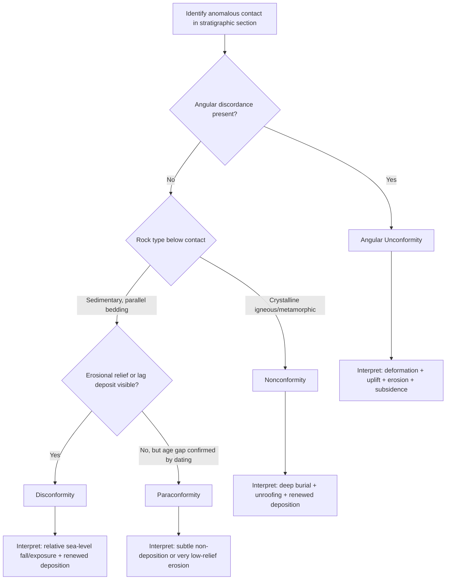

## Unconformities

### Definition and Fundamental Concepts

An unconformity is a buried surface of erosion or non-deposition that separates two rock units of markedly different age, representing a gap in the geologic record termed a hiatus. Unconformities are among the most important tools in stratigraphy and structural geology because they record intervals during which deposition ceased, erosion removed previously deposited material, or both, before deposition resumed. The magnitude of the time gap represented — the unconformity's duration — can range from a few thousand years to hundreds of millions of years and is rarely knowable with precision from field relationships alone.

Recognizing and correctly classifying unconformities is central to reconstructing the tectonic and depositional history of a region, since the type of unconformity present reveals specific information about the structural events (tilting, folding, faulting, uplift, subsidence) that occurred during the hiatus.

### The Four Principal Types of Unconformities

#### Angular Unconformity

An angular unconformity occurs where older strata have been tilted or folded, then eroded, before younger strata were deposited on top with a distinctly different orientation — typically the younger beds lie nearly horizontally across the truncated edges of the older, dipping beds. The angular discordance between the two sequences is the defining diagnostic feature, directly visible in outcrop or on seismic reflection data as truncated reflectors beneath a discordant overlying sequence.

The classic historical example is Siccar Point, Scotland, studied by James Hutton in 1788, where near-vertical Silurian graywacke is overlain by more gently dipping Devonian sandstone. This locality is frequently cited as a foundational observation supporting the principle of uniformitarianism and the recognition of deep geologic time.

The sequence of events recorded by an angular unconformity is:

1. Deposition of the older sequence
2. Deformation (tilting, folding, or faulting) of the older sequence
3. Uplift and subaerial exposure
4. Erosion, truncating the deformed older beds
5. Subsidence or renewed relative sea-level rise
6. Deposition of the younger sequence across the erosional surface

#### Disconformity

A disconformity is an unconformity in which the strata above and below the erosional surface are parallel (concordant in dip), but the contact represents a significant gap in time, typically identified through biostratigraphic, geochronologic, or paleontological evidence of a missing time interval rather than through obvious angular discordance. Disconformities are frequently the most difficult unconformity type to recognize in the field, since the surface may be subtle, marked only by a change in lithology, a thin lag deposit, paleosol development, karst features (in carbonate sequences), or an erosional relief of channels and irregularities cut into the underlying unit.

#### Nonconformity

A nonconformity is an unconformity in which stratified sedimentary or volcanic rock overlies older crystalline rock (plutonic igneous rock or metamorphic rock). This type inherently implies a prolonged history of deep burial, cooling, uplift, and deep erosion (sufficient to exhume rock formed at depth) prior to renewed deposition, making nonconformities generally associated with especially large time gaps and significant unroofing of the underlying basement.

#### Paraconformity (often treated as a subtype of disconformity)

A paraconformity is a bedding-parallel unconformity in which no physical evidence of erosion (no channeling, no relief, no obvious weathering horizon) is visible at the contact, and the hiatus is recognized purely through biostratigraphic or geochronologic dating showing a gap in the age sequence. [Inference] Because paraconformities lack unambiguous physical erosional evidence, their recognition depends heavily on the resolution of the available dating method, and some contacts classified as paraconformities under coarse biostratigraphic resolution may later be reclassified as disconformities once higher-resolution age control (e.g., radiometric dating or high-resolution biostratigraphy) becomes available.

### Illustration: The Four Unconformity Types (svg_diagram)

<svg xmlns="http://www.w3.org/2000/svg" viewBox="0 0 900 620" font-family="Arial, sans-serif">
<text x="450" y="28" font-size="20" font-weight="bold" text-anchor="middle">Four Types of Unconformities (svg_diagram)</text>

<g>
<text x="150" y="60" font-size="15" font-weight="bold" text-anchor="middle">Angular Unconformity</text>
<rect x="30" y="80" width="240" height="180" fill="#f7f7f7" stroke="#999" />
<g stroke="#555" stroke-width="1" fill="none">
<line x1="40" y1="230" x2="120" y2="120" transform="rotate(0)" />
</g>
<path d="M40,240 L120,140 L200,240 Z" fill="#d9c9a3" stroke="black" />
<path d="M55,235 L120,155 L185,235" fill="none" stroke="black" stroke-width="0.8" />
<path d="M65,238 L120,175 L175,238" fill="none" stroke="black" stroke-width="0.8" />
<rect x="30" y="180" width="240" height="30" fill="#bcdff0" stroke="black" />
<rect x="30" y="150" width="240" height="30" fill="#a8d2e8" stroke="black" />
<line x1="30" y1="180" x2="270" y2="180" stroke="red" stroke-width="2.5" />
<text x="35" y="255" font-size="10">Tilted/eroded beds truncated</text>
<text x="35" y="268" font-size="10">beneath horizontal younger beds</text>
</g>

<g>
<text x="450" y="60" font-size="15" font-weight="bold" text-anchor="middle">Disconformity</text>
<rect x="330" y="80" width="240" height="180" fill="#f7f7f7" stroke="#999" />
<rect x="330" y="200" width="240" height="60" fill="#d9c9a3" stroke="black" />
<rect x="330" y="170" width="240" height="30" fill="#c7b58f" stroke="black" />
<path d="M330,170 Q400,163 450,170 Q520,178 570,170" fill="none" stroke="red" stroke-width="2.5" />
<rect x="330" y="120" width="240" height="50" fill="#bcdff0" stroke="black" />
<rect x="330" y="90" width="240" height="30" fill="#a8d2e8" stroke="black" />
<text x="335" y="280" font-size="10">Parallel bedding above/below;</text>
<text x="335" y="293" font-size="10">irregular erosional surface, gap in age</text>
</g>

<g>
<text x="750" y="60" font-size="15" font-weight="bold" text-anchor="middle">Nonconformity</text>
<rect x="630" y="80" width="240" height="180" fill="#f7f7f7" stroke="#999" />
<rect x="630" y="170" width="240" height="90" fill="#d9c9a3" stroke="black" />
<rect x="630" y="140" width="240" height="30" fill="#c7b58f" stroke="black" />
<line x1="630" y1="170" x2="870" y2="170" stroke="red" stroke-width="2.5" />
<g fill="#e8b0b0" stroke="black" stroke-width="0.7">
<polygon points="650,170 665,150 680,170" />
<polygon points="690,170 710,145 730,170" />
<polygon points="740,170 755,155 775,170" />
<polygon points="790,170 810,148 830,170" />
</g>
<text x="700" y="130" font-size="10">Crystalline basement</text>
<text x="635" y="280" font-size="10">Sedimentary/volcanic rock over</text>
<text x="635" y="293" font-size="10">plutonic or metamorphic basement</text>
</g>

<g>
<text x="450" y="340" font-size="15" font-weight="bold" text-anchor="middle">Paraconformity</text>
<rect x="330" y="360" width="240" height="180" fill="#f7f7f7" stroke="#999" />
<rect x="330" y="480" width="240" height="60" fill="#d9c9a3" stroke="black" />
<rect x="330" y="450" width="240" height="30" fill="#c7b58f" stroke="black" />
<line x1="330" y1="480" x2="570" y2="480" stroke="red" stroke-width="2.5" stroke-dasharray="6,4" />
<rect x="330" y="400" width="240" height="50" fill="#bcdff0" stroke="black" />
<rect x="330" y="370" width="240" height="30" fill="#a8d2e8" stroke="black" />
<text x="335" y="560" font-size="10">No visible erosional relief; hiatus recognized</text>
<text x="335" y="573" font-size="10">only via biostratigraphic/geochronologic dating</text>
</g>
</svg>

### Field and Analytical Recognition Criteria

Identifying and classifying an unconformity relies on multiple independent lines of evidence:

- **Angular discordance**: measurable difference in dip/strike between the bedding above and below the contact (diagnostic of angular unconformities)
- **Basal conglomerate or lag deposit**: a coarse-grained unit at the base of the younger sequence, often containing clasts derived from erosion of the underlying unit, marking the resumption of deposition
- **Paleosol development**: ancient soil horizons at the unconformity surface indicating a period of subaerial exposure and weathering
- **Paleokarst**: dissolution features (caves, sinkholes, solution pits) developed in carbonate rock beneath the unconformity surface, indicating a period of subaerial exposure in a humid climate
- **Erosional relief and channeling**: irregular topography cut into the underlying unit, including paleovalleys or paleochannels infilled by the younger sequence
- **Biostratigraphic or geochronologic age gap**: a demonstrable jump in fossil assemblage age or radiometric age across the contact exceeding the expected duration of a normal depositional hiatus within a conformable sequence
- **Truncated seismic reflectors**: on seismic reflection profiles, unconformities appear as surfaces against which underlying reflectors terminate (truncation) and above which younger reflectors onlap, downlap, or toplap — a foundational concept in seismic stratigraphy

### Unconformities in Seismic Stratigraphy

In seismic stratigraphic interpretation, unconformities are identified by characteristic reflection termination patterns relative to a stratal surface:

- **Truncation**: underlying reflectors terminate against the unconformity surface from below, indicating erosion of the underlying sequence
- **Onlap**: overlying reflectors terminate against the surface by lapping progressively landward/upward onto it, indicating the surface was a topographic low being progressively filled
- **Downlap**: overlying reflectors terminate against the surface by converging downward onto it, commonly associated with the base of a prograding depositional sequence
- **Toplap**: underlying reflectors terminate against an overlying surface from below due to non-deposition, without significant erosional truncation, often seen at the top of prograding clinoform sequences

These termination relationships form the basis of sequence stratigraphy, in which unconformities (specifically sequence boundaries) bound genetically related packages of strata (depositional sequences) and are interpreted in terms of relative sea-level history, accommodation space, and sediment supply.

### Diagram: Unconformity Recognition Workflow

### Nested and Composite Unconformities

Unconformities are frequently not simple single surfaces but composite features reflecting multiple episodes of exposure, or they nest within larger regional unconformity-bounded sequences:

- **Regional unconformities**: traceable across large areas (basin-wide to continent-wide), typically associated with major tectonic events (orogenic uplift, continental rifting) or major eustatic sea-level falls
- **Local unconformities**: restricted in areal extent, often associated with local structural features (fault-block uplift, local channel incision) rather than regional events
- **Unconformity-bounded sequences (allostratigraphic units)**: packages of strata bounded above and below by unconformities or their correlative conformities, forming the basis of allostratigraphy as a classification approach independent of lithologic similarity
- **Diastems**: very short-duration depositional breaks within an otherwise conformable sequence (e.g., a single storm event surface), generally not classified as true unconformities due to their brief duration, though the boundary between a "long diastem" and a "minor unconformity" is not sharply defined [Unverified] and is applied somewhat inconsistently across the literature depending on the temporal resolution under consideration

### Structural and Tectonic Significance

Unconformities provide critical constraints for structural geologists and basin analysts:

- **Timing constraints on deformation**: an angular unconformity directly brackets the age of folding or tilting between the age of the youngest deformed unit below and the oldest undeformed unit above
- **Basin evolution records**: the vertical stacking of unconformity-bounded sequences within a sedimentary basin records the alternating history of subsidence/accommodation creation and uplift/erosion
- **Unconformity traps in petroleum geology**: unconformity surfaces are major stratigraphic trap mechanisms, where reservoir rock beneath the unconformity is sealed by impermeable rock deposited above it (subcrop traps), or where onlapping reservoir rock pinches out against the unconformity surface (onlap traps)
- **Correlation tool**: because unconformities often have wide lateral extent and represent isochronous or near-isochronous surfaces at a regional scale, they serve as valuable stratigraphic correlation datums between widely separated outcrops or wells

### Distinguishing Unconformities from Superficially Similar Features

Careful field and subsurface analysis is needed to avoid confusing unconformities with other contact types:

- **Fault contacts**: unlike unconformities, fault contacts show evidence of shear displacement (slickensides, fault gouge, drag folding) rather than erosional or depositional relationships, and may juxtapose units without necessarily reflecting a simple age-younging relationship
- **Intrusive contacts**: an igneous intrusion emplaced into older rock can superficially resemble a nonconformity but is distinguished by contact metamorphism (baking) of the country rock, chilled margins in the intrusive body, and cross-cutting relationships with structures in the host rock, rather than a depositional relationship
- **Conformable lithologic contacts**: an abrupt but conformable change in lithology (e.g., a sharp facies change) can superficially resemble a disconformity but lacks the diagnostic age gap, erosional relief, or exposure indicators

### Common Misconceptions

- **"All unconformities are visually obvious in outcrop."** Disconformities and especially paraconformities can be extremely subtle or entirely cryptic without biostratigraphic or geochronologic data, in contrast to the visually striking angular unconformity.
- **"An unconformity always represents millions of years."** The duration of the hiatus varies enormously by type and setting; some disconformities represent relatively short-duration exposure events, while major regional unconformities (particularly at continental margins or associated with major orogenies) can represent tens to hundreds of millions of years.
- **"A nonconformity requires igneous rock specifically."** A nonconformity is defined by sedimentary/volcanic rock overlying older crystalline rock, and the crystalline basement can be either plutonic igneous rock or metamorphic rock, not exclusively igneous rock.
- **"Any erosional surface within a sedimentary sequence is an unconformity."** Minor scour surfaces, single-event erosional features, and diastems representing negligible geologic time are generally not classified as true unconformities.

### Related Topics

- Faults and fault classification
- Folds and folding mechanisms
- Sequence stratigraphy and depositional sequences
- Seismic stratigraphy and reflection termination patterns
- Basin analysis and subsidence history
- Radiometric dating and geochronology
- Biostratigraphy and fossil-based correlation
- Petroleum stratigraphic trap systems
- Paleosols and paleoclimate indicators
- Principle of uniformitarianism and the history of geologic time concepts