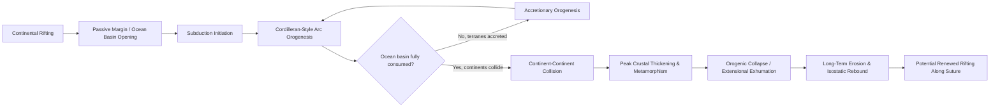

## Orogenesis and Mountain Building

### Definition and Fundamental Concepts

Orogenesis refers to the collective set of tectonic, structural, metamorphic, and magmatic processes by which mountain belts (orogens) are formed, typically through the deformation and thickening of the crust and lithosphere at convergent plate boundaries. An orogen is the resulting linear to arcuate belt of deformed rock, generally comprising folded and faulted sedimentary and volcanic sequences, regionally metamorphosed rock, and syn- to post-tectonic igneous intrusions, often exposed in a characteristic zoned pattern from the undeformed foreland to the highly deformed hinterland.

Orogenesis is fundamentally a plate tectonic phenomenon, and virtually all major orogenic belts on Earth can be linked to convergent plate boundary processes: subduction of oceanic lithosphere, collision of continental blocks, or accretion of allochthonous terranes.

### Tectonic Settings of Orogenesis

#### Cordilleran (Andean-Type) Orogenesis

Cordilleran orogenesis occurs above a subduction zone where oceanic lithosphere subducts beneath continental lithosphere, without full continental collision. This setting is characterized by:

- A magmatic arc built from partial melting of the mantle wedge above the subducting slab, producing a continuous belt of plutonic and volcanic rock
- A retroarc fold-and-thrust belt developed in the overriding continental plate, driven by horizontal compressive stress transmitted from the subduction interface
- A retroarc foreland basin formed by flexural subsidence of the continental lithosphere under the load of the thrust belt
- Crustal thickening primarily through magmatic addition and upper-crustal thrust stacking, without the extreme continent-continent collision seen in Himalayan-type belts

The modern Andes are the type example of this style, and this mechanism is often invoked for portions of the North American Cordillera (Sevier and Laramide orogenies).

#### Himalayan-Type (Continent-Continent Collisional) Orogenesis

Continent-continent collisional orogenesis occurs when subduction of intervening oceanic lithosphere is completed and two buoyant continental blocks, both too low-density to be subducted, collide directly. This produces the most extreme crustal thickening observed on Earth, characterized by:

- Large-scale crustal shortening accommodated by extensive thrust faulting and nappe stacking
- Development of a doubly-vergent orogenic wedge, with thrust belts propagating both toward the foreland (on the overriding plate side) and, in some cases, back toward the hinterland
- Extreme crustal thickness (locally exceeding 70-80 km beneath the Tibetan Plateau) leading to partial melting of the deep crust and the generation of anatectic granites
- High-grade regional metamorphism in the deeply buried core of the orogen, often exhumed via a combination of erosion and extensional detachment faulting
- Suture zones marking the former location of the closed ocean basin, typically preserved as a belt of ophiolite fragments, mélange, and deformed oceanic sedimentary rock

The Himalaya-Tibet system, formed by the ongoing collision of the Indian and Eurasian plates beginning approximately 50-55 million years ago, is the type example of this orogenic style.

#### Accretionary (Terrane) Orogenesis

Accretionary orogenesis occurs through the progressive addition (accretion) of allochthonous terranes — fault-bounded crustal fragments with a distinct geologic history from the adjacent continent — onto a continental margin as oceanic lithosphere is subducted and consumed. This process can build substantial new continental crust laterally over long periods of subduction, without necessarily involving full continent-continent collision. Much of the North American Cordillera, including large portions of the Canadian and Alaskan orogenic belts, is interpreted as an assemblage of accreted terranes.

#### Continental Rift-Related and Failed Orogenesis

[Inference] Not all crustal thickening events are classically "orogenic" in the collisional sense; some belts, such as those associated with continental rifting followed by failed spreading (aulacogens), produce localized zones of deformation and basin inversion that share some structural characteristics with orogenic belts without involving plate convergence, though this is a less universally emphasized category in introductory treatments of orogenesis.

### The Wilson Cycle Framework

The Wilson Cycle describes the long-term cyclical opening and closing of ocean basins through the supercontinent cycle, providing the overarching framework within which most orogenic events are understood:

1. **Continental rifting**: initial extension and rift basin formation within a continental plate (e.g., modern East African Rift)
2. **Ocean basin opening (drifting stage)**: continued extension leads to seafloor spreading and the establishment of a passive margin on either side of a new ocean basin (e.g., modern Atlantic margins)
3. **Subduction initiation**: as the ocean basin ages and cools, subduction may initiate along one or both margins, consuming oceanic lithosphere
4. **Arc-continent or continent-continent collision**: continued subduction eventually consumes the entire ocean basin, leading to collision and orogenesis (e.g., Himalaya from closure of the Tethys Ocean)
5. **Orogenic collapse and erosion**: following peak crustal thickening, the orogen may undergo gravitational collapse (extensional exhumation) combined with long-term erosion, ultimately reducing the mountain belt toward isostatic equilibrium and potentially setting the stage for renewed rifting along the newly welded suture

### Structural Zonation of a Collisional Orogen

A mature collisional orogen typically displays a systematic structural and metamorphic zonation from the undeformed foreland to the hinterland core:

- **Foreland basin**: an asymmetric sedimentary basin formed by flexural loading of the lithosphere under the weight of the growing orogenic wedge, receiving synorogenic sediment (flysch and later molasse facies) shed from the rising mountain belt
- **Fold-and-thrust belt (foreland thin-skinned zone)**: a zone of imbricate thrust faults and associated folds, typically detached along a basal décollement, propagating in a foreland-younging sequence (younger faults forming progressively toward the foreland, beneath older, more hinterland-ward faults)
- **Hinterland (metamorphic core / internal zone)**: the structurally deepest, most highly deformed and metamorphosed part of the orogen, often exposing thick-skinned basement-involved structures, regional metamorphic rock, and syn-tectonic granitic intrusions
- **Suture zone**: in collisional orogens, the zone marking the former plate boundary, typically containing ophiolite slivers, mélange, and highly deformed rock derived from the subducted or obducted oceanic lithosphere and its sedimentary cover

### Illustration: Cross-Section of a Collisional Orogen (svg_diagram)

<svg xmlns="http://www.w3.org/2000/svg" viewBox="0 0 900 460" font-family="Arial, sans-serif">
<text x="450" y="26" font-size="19" font-weight="bold" text-anchor="middle">Structural Zonation of a Collisional Orogen (svg_diagram)</text>
<rect x="20" y="60" width="860" height="360" fill="#eef4f8" stroke="none" />

<path d="M20,380 L880,380" stroke="black" stroke-width="1" stroke-dasharray="4,3" />
<text x="30" y="395" font-size="11">Moho (approx.)</text>

<path d="M300,380 Q450,200 600,380 Z" fill="#e3d0b8" stroke="black" stroke-width="1.5" />
<text x="420" y="330" font-size="11">Thickened crustal root</text>

<rect x="20" y="330" width="140" height="50" fill="#c9dff2" stroke="black" />
<text x="25" y="320" font-size="12" font-weight="bold">Foreland Basin</text>

<g stroke="black" stroke-width="1.3" fill="#d7e6b8">
<path d="M160,380 L220,330 L260,380 Z" />
<path d="M210,380 L270,320 L320,380 Z" />
<path d="M270,380 L330,300 L380,380 Z" />
</g>
<text x="180" y="300" font-size="12" font-weight="bold">Fold-and-Thrust Belt</text>

<ellipse cx="450" cy="260" rx="120" ry="70" fill="#e6b8c9" stroke="black" stroke-width="1.3" />
<text x="395" y="255" font-size="12" font-weight="bold">Hinterland /</text>
<text x="395" y="270" font-size="12" font-weight="bold">Metamorphic Core</text>

<rect x="560" y="330" width="40" height="50" fill="#888" stroke="black" />
<text x="545" y="320" font-size="11" font-weight="bold">Suture</text>
<text x="545" y="410" font-size="10">Ophiolite/mélange</text>

<g stroke="black" stroke-width="1.3" fill="#d7e6b8">
<path d="M600,380 L660,330 L700,380 Z" />
<path d="M650,380 L710,320 L760,380 Z" />
</g>
<text x="640" y="300" font-size="12" font-weight="bold">Opposing Thrust Belt</text>

<rect x="760" y="340" width="110" height="40" fill="#c9dff2" stroke="black" />
<text x="765" y="330" font-size="11" font-weight="bold">Opposing Craton</text>

<text x="30" y="440" font-size="11">Convergence direction</text>

<line x1="140" y1="435" x2="240" y2="435" stroke="red" stroke-width="2" marker-end="url(#arrowO)" />

<line x1="760" y1="435" x2="660" y2="435" stroke="red" stroke-width="2" marker-end="url(#arrowO)" />

</svg>

### Metamorphic and Igneous Processes in Orogenesis

Crustal thickening in orogenic belts drives systematic changes in pressure and temperature that produce regionally extensive metamorphic rock and commonly generate anatectic (partial-melt derived) granitic magmatism:

- **Barrovian-type regional metamorphism**: a moderate-pressure, moderate- to high-temperature metamorphic facies series characteristic of collisional orogens, producing a systematic sequence of index minerals (chlorite, biotite, garnet, staurolite, kyanite, sillimanite) with increasing metamorphic grade
- **Metamorphic core complexes**: domal structures exposing deeply buried, high-grade metamorphic and plutonic rock, exhumed along low-angle detachment faults, typically forming during post-orogenic extensional collapse of a previously thickened orogen
- **Syn-collisional (S-type) granites**: granitic magmas generated by partial melting of thickened, radiogenically-heated continental crust, characteristic of the hinterland of collisional orogens (e.g., Himalayan leucogranites)
- **Metamorphic core exhumation mechanisms**: exhumation of deeply buried rock to the surface results from a combination of erosion, tectonic extension (extensional unroofing), and isostatic (buoyancy-driven) uplift, with the relative contribution of each mechanism varying between orogens and through time within a single orogenic cycle

### Isostasy and Topographic Evolution

The elevation of a mountain belt is governed by the principle of isostasy, in which the thickened, lower-density crustal root buoyantly supports the elevated topography above, analogous to an iceberg floating on denser water. Approximate isostatic (Airy-type) balance can be expressed as:

$$h = \frac{\rho_m - \rho_c}{\rho_m} \cdot t_c'$$

where $h$ is the elevation of the topography above the reference level, $\rho_m$ is mantle density, $\rho_c$ is crustal density, and $t_c'$ is the thickness of the crustal root added below the reference level. This relationship explains why the highest topography on Earth (the Himalaya-Tibet system) coincides with the thickest known continental crust, and why erosional removal of mass from the top of an orogen drives isostatic rebound that partially offsets the elevation loss, extending the lifespan of high topography well beyond what erosion rates alone might suggest. [Inference] Real orogenic belts commonly show more complex flexural (regional) isostatic behavior rather than simple local (Airy) compensation, particularly where lithospheric strength is significant, but the local isostasy model remains a widely used first-order approximation in introductory structural geology.

### Diagram: Orogenic Cycle Stages

### Foreland Basin Systems and Synorogenic Sedimentation

Foreland basins form through lithospheric flexure induced by the topographic and subsurface load of the orogenic wedge, and their sedimentary fill records the tempo of orogenic uplift and unroofing:

- **Flysch facies**: deep-marine to marginal-marine, typically turbiditic sediment deposited during the early, actively subsiding phase of foreland basin development
- **Molasse facies**: coarser-grained, typically continental to shallow-marine clastic sediment (conglomerate, sandstone) deposited during the later stage of orogenesis as the basin fills and the adjacent mountain belt is actively eroding
- **Provenance and thermochronologic studies**: detrital mineral dating (e.g., detrital zircon U-Pb, apatite fission-track, and (U-Th)/He thermochronology) of foreland basin sediment is a standard method for reconstructing the timing and rate of unroofing in the adjacent orogen

### Examples of Major Orogenic Belts by Style

| Orogen | Primary Style | Notes |
| --- | --- | --- |
| Andes | Cordilleran (subduction) | Active continental margin, no full collision |
| Himalaya | Continent-continent collision | India-Eurasia collision, ongoing |
| Alps | Continent-continent collision | Closure of Tethys Ocean, complex nappe stacking |
| Appalachians | Multiple accretionary + collisional events | Taconic, Acadian, Alleghanian orogenies (Paleozoic) |
| Canadian Cordillera | Accretionary (terrane) | Assembly of allochthonous terranes onto North America |
| Caledonides | Continent-continent collision | Closure of Iapetus Ocean (Scotland, Scandinavia, NE North America) |

### Common Misconceptions

- **"Mountain building always requires continent-continent collision."** Cordilleran-type orogenesis at subduction zones (e.g., the modern Andes) builds substantial mountain topography without full continental collision.
- **"Mountains grow indefinitely as long as convergence continues."** Orogenic elevation reaches an approximate steady state where erosional mass removal balances tectonic mass input under continued convergence; extreme elevation gain is limited by the strength of crustal and lithospheric material as well as isostatic constraints.
- **"All deformation in an orogen occurred at the same time."** Fold-and-thrust belts typically propagate sequentially (often, though not universally, in a foreland-younging direction), meaning deformation ages differ systematically across the width of the belt.
- **"High topography directly reflects the total amount of tectonic shortening."** Present-day elevation reflects the current isostatic balance of crustal thickness and density, which is also modified by erosion, extensional collapse, and time-dependent thermal and density changes in the underlying lithosphere, not shortening magnitude alone.

### Related Topics

- Faults and fault classification
- Folds and folding mechanisms
- Plate tectonics and convergent boundary processes
- Regional metamorphism and metamorphic facies
- Foreland basin analysis and sequence stratigraphy
- Isostasy and lithospheric flexure
- Thermochronology and exhumation studies
- Subduction zone processes and arc magmatism
- Metamorphic core complexes
- Terrane accretion and continental growth