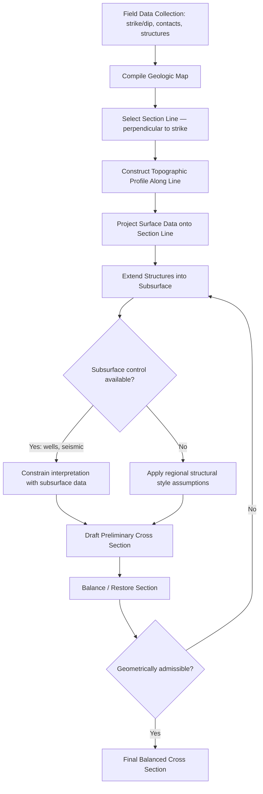

## Structural Mapping and Cross Sections

### Definition and Fundamental Concepts

Structural mapping is the systematic collection, recording, and spatial representation of the orientation, geometry, and kinematic history of deformed rock bodies, producing geologic maps that depict the distribution of rock units, structural features (faults, folds, foliations), and their measured orientations across an area. A structural cross section is a two-dimensional vertical projection constructed from map data (and supporting subsurface data where available) that depicts the geometry of rock units and structures as they would appear in a vertical plane cutting through the crust, serving as the primary tool for interpreting subsurface geometry, testing structural hypotheses, and estimating parameters such as shortening magnitude or fault displacement.

Together, structural maps and cross sections form the core analytical and communication tools of structural geology, translating point-by-point field observations into a coherent three-dimensional (and, through sequential restoration, four-dimensional/time-evolving) model of crustal architecture.

### Structural Field Data Collection

#### Orientation Measurements

The fundamental raw data of structural geology are orientation measurements of planar and linear features, conventionally recorded using a geologic compass or, increasingly, digital compass-clinometer applications on tablets or smartphones:

- **Strike and dip**: describe the orientation of a planar feature (bedding, foliation, fault plane, joint); strike is the compass bearing of the horizontal line within the plane, and dip is the maximum angle of inclination from horizontal, measured perpendicular to strike, always reported with a dip direction quadrant or azimuth
- **Trend and plunge**: describe the orientation of a linear feature (fold axis, lineation, slickenline, intersection lineation); trend is the compass bearing of the vertical plane containing the line, and plunge is the angle of inclination of the line below horizontal
- **Right-hand rule (RHR) convention**: a widely used standardized notation in which strike is recorded such that dip direction is 90° clockwise from the reported strike azimuth, eliminating ambiguity in digital data recording and processing
- **Apparent dip**: the dip of a planar feature as observed in any vertical section not oriented perpendicular to strike; apparent dip is always less than or equal to true dip and is calculated using the relationship

$$\tan(\alpha_a) = \tan(\delta) \cdot \sin(\theta)$$

where $\alpha_a$ is the apparent dip, $\delta$ is the true dip, and $\theta$ is the angle between the section line and the strike direction.

#### Contact Mapping and Unit Identification

Structural mapping requires careful delineation of geologic contacts (boundaries between mapped units) and consistent lithostratigraphic or lithodemic unit identification in the field, supported by:

- Traverse mapping along accessible transects (roads, streams, ridgelines) with station-by-station recording of unit contacts and structural data
- Aerial photograph and remote sensing interpretation to trace contacts and structural trends between field stations, particularly across vegetated or inaccessible terrain
- Photogeologic and structural lineament analysis using satellite imagery, digital elevation models (DEMs), and increasingly LiDAR-derived bare-earth terrain models to resolve structures obscured by vegetation

### The Geologic Map as a Structural Data Product

A geologic map is fundamentally a specialized data visualization in which the three-dimensional geometry of a rock body is represented through its intersection with the ground surface topography, meaning the map pattern (the shape and width of outcrop belts) is a joint function of the true structural geometry and the local topographic relief.

Key structural map conventions include:

- **Strike-and-dip symbols**: a standardized symbol (a long strike line with a short perpendicular tick and dip angle number) plotted at each measurement station
- **Formation contacts**: lines representing the mapped boundaries of distinct rock units, typically differentiated from fault contacts by symbology (solid lines for depositional contacts, specific ornamented lines for faults)
- **Fault symbols**: standardized notation indicating fault trace location plus additional symbology denoting fault type (e.g., ball-and-bar or hachured symbol on the downthrown side of a normal fault, teeth on the hanging wall/upper plate of a thrust fault, half-arrows showing relative motion sense on a strike-slip fault)

  & - **Fold axial trace symbols**: lines marking the map-view trace of a fold's axial surface, differentiated by symbology for anticlines versus synclines (and further for antiforms/synforms where stratigraphic younging direction is unknown), often including an arrow indicating plunge direction where the fold axis is not horizontal

#### The Rule of V's

The rule of V's describes the predictable relationship between the map-view trace of a dipping contact and topography when crossing a valley: a contact dipping in the same direction as valley drainage but at a shallower angle than the valley gradient forms a V pointing downstream (upstream-pointing when dip is opposite to drainage direction, or steeper than the valley gradient); a horizontal contact follows topographic contours exactly (mimicking topography); and a vertical contact forms a straight line unaffected by topography. This relationship is a standard diagnostic tool for inferring dip direction and relative dip magnitude directly from a geologic map without needing a cross section.

### Illustration: Rule of V's Across a Valley (svg_diagram)

<svg xmlns="http://www.w3.org/2000/svg" viewBox="0 0 900 380" font-family="Arial, sans-serif">
<text x="450" y="26" font-size="19" font-weight="bold" text-anchor="middle">Rule of V's — Contact Geometry vs. Topography (svg_diagram)</text>

<g>
<text x="150" y="60" font-size="13" font-weight="bold" text-anchor="middle">Dip Same Direction as Drainage</text>
<rect x="30" y="80" width="240" height="220" fill="#f4f8fb" stroke="#999" />
<path d="M30,90 L150,300 L270,90" fill="none" stroke="#3d7ab8" stroke-width="3" />
<path d="M30,140 Q150,190 270,140" fill="none" stroke="black" stroke-width="1.5" />
<path d="M30,110 Q150,250 270,110" fill="none" stroke="black" stroke-width="1.5" />
<text x="150" y="330" font-size="11" text-anchor="middle">V points DOWNSTREAM (down-valley)</text>
</g>

<g>
<text x="450" y="60" font-size="13" font-weight="bold" text-anchor="middle">Dip Opposite to Drainage</text>
<rect x="330" y="80" width="240" height="220" fill="#f4f8fb" stroke="#999" />
<path d="M330,90 L450,300 L570,90" fill="none" stroke="#3d7ab8" stroke-width="3" />
<path d="M330,230 Q450,140 570,230" fill="none" stroke="black" stroke-width="1.5" />
<path d="M330,260 Q450,190 570,260" fill="none" stroke="black" stroke-width="1.5" />
<text x="450" y="330" font-size="11" text-anchor="middle">V points UPSTREAM (up-valley)</text>
</g>

<g>
<text x="750" y="60" font-size="13" font-weight="bold" text-anchor="middle">Horizontal Contact</text>
<rect x="630" y="80" width="240" height="220" fill="#f4f8fb" stroke="#999" />
<path d="M630,90 L750,300 L870,90" fill="none" stroke="#3d7ab8" stroke-width="3" />
<path d="M630,150 Q750,270 870,150" fill="none" stroke="black" stroke-width="1.5" />
<path d="M630,190 Q750,235 870,190" fill="none" stroke="black" stroke-width="1.5" />
<text x="750" y="330" font-size="11" text-anchor="middle">Contact mimics/parallels topographic contours</text>
</g>
</svg>

### Constructing a Structural Cross Section

Cross sections are constructed by projecting map data onto a vertical plane, typically oriented perpendicular to regional strike or structural trend to display true dip and true structural thickness rather than apparent (foreshortened) values.

#### Standard Construction Workflow

1. **Select the section line**: chosen perpendicular to the dominant structural trend (fold axes, fault strike) wherever possible, to avoid apparent-dip distortion
2. **Construct the topographic profile**: extract the ground-surface elevation along the section line from a topographic map or DEM
3. **Project surface geologic data onto the section line**: plot the position and true (or corrected apparent) dip of each contact and structure where it crosses the section line
4. **Extend dips into the subsurface**: project contacts downward from the surface using appropriate methods (straight-line projection for planar contacts, arc methods for kink or parallel folds, or well/seismic-constrained interpolation where subsurface data exist)
5. **Apply structural style constraints**: honor known regional structural style (thin-skinned versus thick-skinned deformation, fault-bend versus fault-propagation fold geometry, décollement depth) to guide subsurface interpretation beyond the depth of direct surface control
6. **Balance and validate the section**: apply section-balancing techniques to test the geometric and volumetric plausibility of the interpreted subsurface structure

#### Down-Plunge Projection

Where folds plunge (their hinge line is inclined rather than horizontal), a down-plunge projection technique can be used: viewing the map along the plunge direction of the fold axis effectively converts the oblique map-view geometry into a true profile view of the fold cross-sectional shape, a technique especially valuable for reconstructing fold geometry from map data alone without needing extensive subsurface control.

### Cross-Section Balancing and Restoration

Section balancing is the process of verifying that an interpreted cross section is geometrically and volumetrically valid — that is, that it can be restored to an undeformed (palinspastic) state without unrealistic gaps, overlaps, or area/volume changes, under specific assumptions about deformation mechanism.

- **Line-length balancing**: assumes that the length of a bed measured along its deformed profile in cross section equals its original, undeformed (pre-shortening) length, commonly applied to flexural-slip fold and thrust systems where bedding-parallel slip accommodates folding without significant layer-parallel strain
- **Area balancing**: assumes that the cross-sectional area of a given stratigraphic unit is conserved between the deformed and restored (undeformed) states, applicable more broadly than line-length balancing since it accommodates some forms of internal strain
- **Excess area method**: a specific area-balancing technique used to estimate the depth to a basal décollement in a fold-and-thrust belt, based on the area of structural relief above a reference horizon and the total shortening displacement
- **Palinspastic restoration**: the process of sequentially removing (undoing) deformation on a cross section, in reverse chronological order, to reconstruct the pre-deformation configuration of the rock units, a key test of both section validity and total shortening magnitude

[Inference] Balancing techniques rest on specific assumptions (plane strain, conservation of bed length or area, an appropriate choice of undeformed reference state) that may not hold precisely in three-dimensionally complex or highly strained terranes, so a "balanced" section demonstrates geometric self-consistency and admissibility rather than proof of geologic correctness.

### Diagram: Cross-Section Construction Workflow

### Stereographic Projection in Structural Analysis

Stereonets (equal-area or equal-angle stereographic projections) are the standard graphical tool for analyzing orientation data collected during structural mapping, allowing three-dimensional orientation problems to be solved graphically in two dimensions:

- **Poles to planes**: plotting the pole (perpendicular) to a planar feature rather than the plane itself allows large orientation datasets to be visualized as point clusters, facilitating statistical identification of dominant joint sets, fold limb orientations, or fault populations
- **Great circles**: used to plot planar features directly and to solve problems involving the intersection of two planes (e.g., finding a fold axis from two limb orientations, or finding the line of intersection between two fault planes)
- **Beta (β) diagrams and Pi (π) diagrams**: methods for determining fold axis orientation from bedding data — the β method finds the fold axis as the intersection of great circles representing bedding measurements, while the π method plots poles to bedding, which cluster along a great circle (the "pi girdle") whose pole defines the fold axis
- **Kinematic analysis**: stereonet-based methods for assessing rock slope stability (planar sliding, wedge sliding, toppling potential) by comparing joint/discontinuity orientations to the slope face orientation, widely used in geotechnical and mining engineering applications

### Modern Structural Mapping Technologies

Contemporary structural mapping increasingly integrates digital and remote-sensing methods alongside traditional field techniques:

- **GPS/GNSS-enabled field mapping**: tablet- or smartphone-based digital mapping applications that record structural data with integrated positioning, replacing or supplementing paper field maps and notebooks
- **Structure-from-motion (SfM) photogrammetry**: generating high-resolution 3D digital outcrop models from overlapping photographs (including drone-acquired imagery), enabling virtual measurement of otherwise inaccessible strike-and-dip orientations directly from the 3D model
- **LiDAR (terrestrial and airborne)**: producing high-resolution point-cloud topographic and outcrop data, particularly valuable for resolving structural trends beneath vegetation canopy (via bare-earth DEM filtering) and for precise fault scarp mapping in active tectonics studies
- **GIS-based structural map compilation**: geographic information systems used to compile, manage, and analyze structural and geologic map data as georeferenced digital layers, enabling integration with other spatial datasets (topography, geophysics, remote sensing) and facilitating cross-section construction through digital elevation extraction
- **3D structural modeling software**: specialized geomodeling packages that interpolate structural surfaces (horizons, faults) in three dimensions from combined map, cross-section, well, and seismic data, producing fully three-dimensional geologic models rather than a series of independent 2D cross sections

### Common Sources of Error and Interpretive Uncertainty

- **Apparent dip miscalculation**: failing to correct for apparent versus true dip when a cross-section line is not oriented perpendicular to strike, leading to systematic underestimation of true dip and distorted subsurface geometry
- **Extrapolation beyond data control**: subsurface projections become increasingly speculative with depth away from direct surface, well, or seismic control, and multiple non-unique subsurface geometries may honor the same limited surface data
- **Inconsistent structural style assumptions**: applying an inappropriate regional deformation style (e.g., assuming thin-skinned detachment tectonics in a setting that is actually thick-skinned basement-involved deformation) can produce a superficially reasonable but geologically invalid section
- **Vertical exaggeration effects**: cross sections drawn with vertical exaggeration (differing horizontal and vertical scales) distort true dip angles and structural geometry, and must be used cautiously or restricted to non-structural illustrative purposes only

[Unverified] The degree of subsurface uncertainty in any specific cross section is inherently case-dependent and cannot be generalized; practitioners typically qualify projected (dashed) sections as interpretive rather than directly observed, and confidence should be assessed on a section-by-section basis relative to the density and quality of available control data.

### Common Misconceptions

- **"A cross section is a direct observation of the subsurface."** Except where directly constrained by well or seismic data, the subsurface portion of a cross section is an interpretation extrapolated from surface data and regional structural style assumptions, not a direct measurement.
- **"Any geometrically drawn cross section is valid."** A cross section must be geometrically and, ideally, kinematically balanced (restorable to an undeformed state without unrealistic area/volume changes) to be considered a rigorously supported structural interpretation.
- **"The rule of V's applies to all geologic contacts regardless of dip."** A vertical contact is unaffected by topography and does not form a V pattern; the rule specifically describes the behavior of inclined (non-vertical, non-horizontal) contacts crossing valleys.
- **"Stereonets are only useful for research-grade structural analysis."** Stereonet-based kinematic analysis is standard practice in applied fields such as geotechnical slope stability assessment and mining engineering, not solely an academic tool.

### Related Topics

- Faults and fault classification
- Folds and folding mechanisms
- Joints and fracture systems
- Orogenesis and mountain building
- Seismic stratigraphy and reflection interpretation
- Geographic information systems (GIS) in geology
- Structure-from-motion photogrammetry and digital outcrop modeling
- Stereographic projection techniques
- Basin analysis and subsurface correlation
- Remote sensing and lineament analysis in structural geology