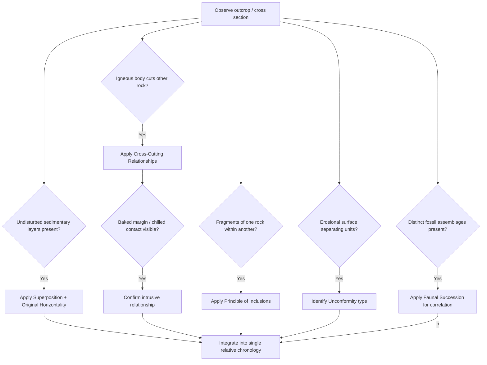

## Principles of Relative Dating

### Definition and Fundamental Concepts

Relative dating is the set of methods and logical principles used to determine the chronological sequence of geologic events (deposition, deformation, intrusion, erosion) without assigning specific numerical ages, establishing only that one event or rock unit is older or younger than another. Relative dating relies entirely on the physical relationships observable between rock bodies and structures, in contrast to absolute (numerical/radiometric) dating, which yields quantitative ages in years. Relative dating principles form the conceptual foundation of stratigraphy and were established primarily during the 17th to 19th centuries, well before the discovery of radioactivity made numerical dating possible.

### The Foundational Principles (Steno's Laws and Related Concepts)

#### Principle of Superposition

In an undisturbed sequence of sedimentary or extrusive igneous rock layers, each layer is younger than the layer beneath it and older than the layer above it, since deposition proceeds progressively from the base of a sequence upward through time. First articulated by Nicolas Steno in 1669, superposition is the single most fundamental principle of stratigraphy and relative dating. [Unverified] The principle applies strictly only to originally undisturbed sequences; structural overturning (through recumbent folding) or thrust faulting can invert the stratigraphic order, requiring independent evidence (such as graded bedding or cross-bedding) to establish true stratigraphic younging direction.

#### Principle of Original Horizontality

Sediment layers are deposited under the influence of gravity in essentially horizontal or near-horizontal layers, conforming to existing topography rather than being deposited at a steep angle. Consequently, strata found tilted, folded, or otherwise inclined from horizontal in the present day are inferred to have been deformed after their original deposition, providing a critical baseline against which subsequent structural deformation can be recognized and, in principle, "undone" during structural restoration.

#### Principle of Lateral Continuity

Sediment layers originally extend laterally in all directions until they thin to a natural pinch-out, terminate against the edge of the original depositional basin, or grade into a different facies; consequently, correlative rock units separated today by an erosional valley, fault, or other discontinuity can be inferred to have originally been physically continuous, forming the logical basis for correlating strata across an eroded landscape or geographically separated outcrops.

#### Principle of Cross-Cutting Relationships

Any geologic feature that cuts across, intrudes into, or otherwise disrupts another feature must be younger than the feature it cuts. This principle applies broadly to intrusive igneous bodies (a dike is younger than the rock it intrudes), faults (a fault is younger than the rock and structures it displaces), and erosional features (a channel is younger than the rock it is cut into), and is one of the most versatile and widely applicable relative dating tools available in structural and stratigraphic analysis.

#### Principle of Inclusions (and Included Fragments)

If a rock body contains fragments (inclusions, xenoliths, or clasts) of another rock type, the included fragments must be older than the rock body that contains them, since the fragment had to exist, be broken loose, and be incorporated prior to lithification or solidification of the host rock. This principle is applied in two closely related contexts: xenoliths within an igneous intrusion (the surrounding country rock predates the intrusion) and clasts within a sedimentary conglomerate or breccia (the source rock of the clasts predates the sedimentary deposit).

#### Principle of Baked Contacts and Chilled Margins

Where an igneous intrusion is in contact with country rock, the country rock adjacent to the intrusion typically shows evidence of contact (thermal) metamorphism — baking — indicating that the intrusion was hot (and therefore younger) relative to the already-solid country rock; conversely, the margin of the intrusive body itself often displays a chilled margin (finer-grained texture from rapid cooling against the cooler country rock), providing a complementary line of evidence for the same relative age relationship. This principle is particularly valuable for distinguishing an intrusive contact from an unconformable or faulted contact, both of which can superficially resemble an igneous contact in certain exposures.

#### Principle of Faunal Succession

Fossil assemblages within sedimentary rock succeed one another in a definite, recognizable, and irreversible order through geologic time, because evolution and extinction are unidirectional processes; consequently, rock units containing similar fossil assemblages can be correlated in relative age even when separated by great distances, and the specific fossil content of a unit can be used to place it within the broader relative geologic timescale. This principle, formalized largely through the work of William Smith in the early 19th century, underlies biostratigraphy as a correlation and relative dating discipline and was historically foundational to the construction of the geologic time scale prior to the availability of radiometric dating.

#### Principle of Unconformities

A buried erosional or non-depositional surface (unconformity) represents a gap in the rock record, and the relative dating relationship it implies is that the youngest rock below the unconformity is older than the oldest rock above it, with an indeterminate amount of missing time (hiatus) separating the two. Unconformities themselves record a sequence of events (deposition, uplift/deformation, erosion, renewed subsidence, renewed deposition) that can often be further resolved using the other relative dating principles in combination.

### Illustration: Cross-Cutting Relationships and Relative Age Determination (svg_diagram)

<svg xmlns="http://www.w3.org/2000/svg" viewBox="0 0 900 480" font-family="Arial, sans-serif">
<text x="450" y="26" font-size="19" font-weight="bold" text-anchor="middle">Relative Dating from a Composite Outcrop (svg_diagram)</text>
<rect x="60" y="60" width="780" height="380" fill="#f7f7f7" stroke="#999" />

<rect x="60" y="330" width="780" height="30" fill="#d9c9a3" stroke="black" />
<rect x="60" y="300" width="780" height="30" fill="#c7b58f" stroke="black" />
<rect x="60" y="270" width="780" height="30" fill="#b8a377" stroke="black" />
<text x="70" y="450" font-size="12" font-weight="bold">1. Oldest: layered sedimentary sequence (Superposition: bottom oldest)</text>

<path d="M60,270 Q300,255 500,268 Q650,278 840,265" fill="none" stroke="red" stroke-width="3" />
<text x="600" y="255" font-size="11" fill="red" font-weight="bold">Unconformity</text>

<rect x="60" y="230" width="780" height="40" fill="#bcdff0" stroke="black" />
<text x="70" y="222" font-size="11">2. Younger sequence deposited above unconformity</text>

<line x1="250" y1="60" x2="180" y2="440" stroke="black" stroke-width="4" />
<text x="190" y="90" font-size="11" font-weight="bold" transform="rotate(-80 190,90)">3. Fault (cuts sequence 1 &amp; 2)</text>

<rect x="600" y="60" width="24" height="200" fill="#e8a0a0" stroke="black" stroke-width="1.5" />
<text x="635" y="100" font-size="11" font-weight="bold">4. Dike (cuts sequence 1;</text>
<text x="635" y="114" font-size="11" font-weight="bold">baked margin in country rock)</text>

<circle cx="612" cy="200" r="6" fill="#b8a377" stroke="black" />
<text x="625" y="205" font-size="10">Xenolith (older than dike)</text>

<text x="70" y="470" font-size="12" font-weight="bold">Relative sequence: (1) layers → (4) dike intrudes → unconformity → (2) young beds → (3) fault cuts all</text>

</svg>

### The Principle of Uniformitarianism

Uniformitarianism is the broader philosophical and methodological principle, articulated by James Hutton and later popularized by Charles Lyell, holding that the physical, chemical, and biological processes observed operating in the present are the same processes that operated throughout geologic history ("the present is the key to the past"). While not itself a relative dating technique in the direct sense of the principles above, uniformitarianism is the conceptual foundation that justifies applying observable modern process rates and depositional relationships to interpret the sequence of events recorded in ancient rock, and it directly underlies the logical validity of principles such as original horizontality and superposition.

### Combining Principles: Sequential Event Reconstruction

Real outcrops typically require the combined, sequential application of multiple relative dating principles to reconstruct a complete geologic history, a process often formalized as constructing a "geologic history" list or relative time line for a given map area or cross section. A representative logical workflow includes:

1. Apply superposition and original horizontality to establish the depositional order of any undisturbed sedimentary sequence
2. Apply cross-cutting relationships to place igneous intrusions, faults, and erosional features into the sequence relative to the rock they affect
3. Apply the principle of inclusions to determine the relative age of xenoliths or clasts versus their host rock
4. Apply baked contact/chilled margin evidence to confirm intrusive relationships and distinguish them from other contact types
5. Identify and classify any unconformities present, using them to bracket periods of deformation, uplift, and erosion
6. Apply faunal succession and biostratigraphic correlation to tie the local relative sequence into the broader regional or global relative geologic time scale

### Diagram: Relative Dating Principle Application Logic

### Relationship to Absolute Dating and the Geologic Time Scale

Relative dating principles alone establish only the sequence of events, not their numerical age or duration; the modern geologic time scale combines relative dating (particularly biostratigraphic correlation) with absolute (radiometric) dating of datable materials — typically volcanic ash beds (tuffs) interbedded within a fossiliferous sedimentary sequence, or igneous intrusions with cross-cutting relationships to a dated stratigraphic interval — to calibrate relative time boundaries to numerical ages. [Inference] This means the internal, relative ordering of much of the geologic column was established well in advance of, and independently from, the specific numerical ages now assigned to time-scale boundaries, which is why time-scale boundary ages have been periodically revised as radiometric dating techniques and calibration standards have improved, without needing to revise the underlying relative sequence of units and events.

### Practical Applications

- **Petroleum and mineral exploration**: relative dating principles applied to well logs, cores, and outcrop data are used to construct local and regional stratigraphic and structural frameworks essential for resource evaluation
- **Structural geology and tectonic reconstruction**: relative dating of cross-cutting structures (which fault offsets which, which fold predates which intrusion) is fundamental to unraveling the deformation history of a region
- **Archaeology and geoarchaeology**: stratigraphic superposition is directly applied to interpret the sequence of cultural layers and associated artifacts at excavation sites, using essentially the same logical principle as in geologic stratigraphy
- **Engineering geology and site investigation**: relative age relationships between rock units and structures inform assessment of ground stability, fault activity status, and the sequence of natural hazards affecting a site
- **Planetary geology**: relative dating principles (superposition, cross-cutting relationships, and crater density as an additional relative-age proxy specific to planetary surfaces) are applied to reconstruct the geologic history of other planetary bodies where absolute dating is generally unavailable except from returned samples

### Common Misconceptions

- **"Relative dating tells you the exact age of a rock."** Relative dating establishes only the sequence of events (older/younger relationships), not numerical ages in years; numerical age requires radiometric or other absolute dating methods.
- **"Superposition always means the bottom layer is oldest, with no exceptions."** While this holds for undisturbed sequences, structural overturning through folding or thrust faulting can invert stratigraphic order, and younging-direction indicators (graded bedding, cross-bedding, mud cracks) must be used to verify true stratigraphic order in structurally complex terranes.
- **"A rock containing fossils of a certain age must be exactly that age."** Faunal succession establishes a relative age range based on the known temporal range of the fossil taxa present, subject to the limitations of preservation, reworking of older fossils into younger sediment, and the resolution of the biostratigraphic zonation scheme used.
- **"All igneous contacts represent cross-cutting intrusive relationships."** Some apparent igneous contacts may instead represent extrusive (surface-emplaced) relationships such as lava flows interbedded with sediment, which follow superposition rather than cross-cutting relationships; baked contacts, chilled margins, and the overall three-dimensional geometry of the contact must be evaluated to distinguish intrusive from extrusive relationships.

### Related Topics

- Unconformities
- Faults and fault classification
- Absolute (radiometric) dating methods
- Biostratigraphy and index fossils
- The geologic time scale
- Stratigraphic correlation techniques
- Structural mapping and cross sections
- Sequence stratigraphy
- Principle of uniformitarianism and the history of geologic thought
- Planetary surface chronology and crater counting