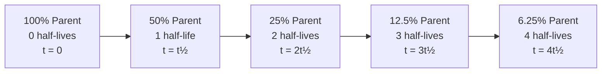

## Radiometric and Absolute Dating Methods

### Overview

Radiometric and absolute dating methods are techniques used to assign numerical ages to rocks, minerals, fossils, and geological events, in contrast to relative dating methods (which only establish sequence, e.g., superposition, cross-cutting relationships). These methods exploit the predictable, constant-rate decay of unstable atomic nuclei (radioactive isotopes) into stable daughter products.

**Key Points**

- Radiometric dating relies on radioactive decay, which is unaffected by temperature, pressure, or chemical environment (under normal geologic conditions)
- The technique measures the ratio of parent isotope to daughter isotope in a sample
- Each isotope system has a characteristic half-life, dictating the age range over which it is useful
- Absolute dating also includes non-radiometric numerical methods (e.g., dendrochronology, varve counting, ice cores)

---

### Fundamental Principles of Radioactive Decay

#### Half-Life

The half-life ($t_{1/2}$) is the time required for half of the parent isotope atoms in a sample to decay into the daughter isotope. Decay follows first-order kinetics:

$$N(t) = N_0 e^{-\lambda t}$$

Where:

- $N(t)$ = number of parent atoms remaining at time $t$
- $N_0$ = initial number of parent atoms
- $\lambda$ = decay constant
- $t$ = elapsed time

The decay constant and half-life are related by:

$$t_{1/2} = \frac{\ln(2)}{\lambda}$$

#### Age Equation

Rearranging the decay equation to solve for age using the parent-daughter ratio:

$$t = \frac{1}{\lambda} \ln\left(1 + \frac{D}{P}\right)$$

Where:

- $D$ = number of daughter atoms produced by decay
- $P$ = number of parent atoms remaining
- $t$ = age of the sample

**Key Points**

- Decay is statistical/probabilistic at the level of individual atoms, but predictable in aggregate for large populations of atoms
- The "clock" starts (or resets) when the mineral crystallizes and becomes a closed system (no gain/loss of parent or daughter isotopes except by radioactive decay)

---

### Closed-System Assumption

Radiometric dating requires the sample to behave as a **closed system**, meaning:

1. No parent or daughter isotope has been added or removed except through radioactive decay
2. The initial amount of daughter isotope (if any) is known or can be corrected for
3. The decay rate has remained constant

**Sources of System Disturbance**

- Metamorphism (heating can "reset" the clock by allowing daughter isotopes to diffuse out)
- Weathering and hydrothermal alteration
- Recrystallization
- Contamination during sample collection or preparation

[Inference] Because different mineral/isotope systems have different "closure temperatures" (the temperature below which the system stops losing daughter isotopes via diffusion), a single rock can yield different ages for different minerals if it cooled slowly through multiple closure temperatures — this is exploited in thermochronology but complicates simple age interpretation.

---

### Major Radiometric Dating Systems

#### Uranium-Lead (U-Pb) Dating

One of the most precise and widely used methods, applicable to zircon, monazite, and other U-bearing minerals.

**Decay Schemes**

$$^{238}\text{U} \rightarrow \, ^{206}\text{Pb} \quad (t_{1/2} = 4.47 \text{ billion years})$$

$$^{235}\text{U} \rightarrow \, ^{207}\text{Pb} \quad (t_{1/2} = 0.704 \text{ billion years})$$

**Key Points**

- Zircon (ZrSiO₄) is the preferred mineral because it incorporates uranium into its crystal structure but strongly excludes lead, minimizing initial daughter contamination
- The dual decay chains (U-238 and U-235) allow cross-checking via the **concordia diagram**, plotting $^{206}\text{Pb}/^{238}\text{U}$ against $^{207}\text{Pb}/^{235}\text{U}$
- Samples plotting on the concordia curve are "concordant" (undisturbed); samples plotting off the curve are "discordant," often indicating lead loss, which can still be corrected using discordia line extrapolation
- Effective dating range: ~1 million years to the age of the Earth (~4.5 billion years)

**Example**

A zircon crystal from a volcanic ash bed yields:

- $^{206}\text{Pb}/^{238}\text{U}$ age = 65.2 Ma
- $^{207}\text{Pb}/^{235}\text{U}$ age = 65.4 Ma

Since the two ages agree closely (concordant), the crystallization age is reported as approximately 65.3 Ma, commonly used to date the Cretaceous-Paleogene boundary.

---

#### Potassium-Argon (K-Ar) and Argon-Argon (⁴⁰Ar/³⁹Ar) Dating

**K-Ar Decay Scheme**

$$^{40}\text{K} \rightarrow \, ^{40}\text{Ar} \, (\text{11.2\% via electron capture}) + \, ^{40}\text{Ca} \, (\text{88.8\% via beta decay})$$

$$t_{1/2} = 1.25 \text{ billion years (combined)}$$

**Key Points**

- Only the argon-producing branch is used for dating
- Applicable to potassium-bearing minerals: biotite, muscovite, hornblende, and volcanic feldspars (sanidine)
- Argon is a noble gas and escapes easily when a mineral is molten; it accumulates only after crystallization/cooling, making it well-suited to volcanic rocks
- Traditional K-Ar dating requires two separate measurements (K content and Ar content) on different sample splits, introducing sampling error

**⁴⁰Ar/³⁹Ar (Argon-Argon) Method — An Improvement**

This method irradiates the sample with fast neutrons in a nuclear reactor, converting a known fraction of $^{39}\text{K}$ into $^{39}\text{Ar}$. This allows the K/Ar ratio to be measured as a single isotopic ratio ($^{40}\text{Ar}/^{39}\text{Ar}$) on the same sample split.

**Advantages of ⁴⁰Ar/³⁹Ar over conventional K-Ar**

- Higher precision (single measurement, single sample aliquot)
- Enables **step-heating** analysis, releasing gas incrementally at increasing temperatures to detect argon loss/disturbance (producing an "age spectrum" or "plateau age")
- Can date very small samples, including individual mineral grains

[Unverified] Specific laboratory precision figures (e.g., ±0.1% vs ±0.5%) vary by instrument, standard used, and irradiation monitor, so exact uncertainty values should be treated as method- and lab-dependent rather than fixed constants.

---

#### Rubidium-Strontium (Rb-Sr) Dating

$$^{87}\text{Rb} \rightarrow \, ^{87}\text{Sr} \quad (t_{1/2} = 48.8 \text{ billion years})$$

**Key Points**

- Long half-life makes it suited for very old rocks (billions of years)
- Because initial $^{87}\text{Sr}$ is often present at crystallization (unlike Pb in zircon), this method typically requires the **isochron technique** rather than a simple parent-daughter ratio

**Isochron Method**

Multiple co-genetic mineral samples (formed at the same time from the same source) are plotted on a graph of $^{87}\text{Sr}/^{86}\text{Sr}$ (y-axis) vs. $^{87}\text{Rb}/^{86}\text{Sr}$ (x-axis). Because $^{86}\text{Sr}$ is stable and non-radiogenic, it serves as a normalizing reference isotope.

- The samples define a straight line (the isochron)
- The slope of the line is proportional to age: $\text{slope} = e^{\lambda t} - 1$
- The y-intercept gives the initial $^{87}\text{Sr}/^{86}\text{Sr}$ ratio at the time of crystallization
- This method inherently tests the closed-system assumption: if points do not fall on a line, the system was disturbed

---

#### Samarium-Neodymium (Sm-Nd) Dating

$$^{147}\text{Sm} \rightarrow \, ^{143}\text{Nd} \quad (t_{1/2} = 106 \text{ billion years})$$

**Key Points**

- Useful for very old, high-grade metamorphic and igneous rocks, including some of the oldest terrestrial rocks and meteorites
- Sm and Nd are both rare earth elements (REEs) with similar chemical behavior, making them relatively resistant to fractionation by weathering or low-grade metamorphism, which improves reliability compared to more mobile element pairs
- Also uses the isochron method

---

#### Radiocarbon (¹⁴C) Dating

$$^{14}\text{C} \rightarrow \, ^{14}\text{N} \quad (t_{1/2} = 5{,}730 \pm 40 \text{ years})$$

**Mechanism**

- Cosmic rays produce $^{14}\text{C}$ in the upper atmosphere via neutron bombardment of $^{14}\text{N}$
- $^{14}\text{C}$ combines with oxygen to form $\text{CO}_2$, which is incorporated into living organisms via photosynthesis and the food chain
- While an organism is alive, $^{14}\text{C}$ is continuously replenished, maintaining equilibrium with atmospheric levels
- Upon death, intake stops, and $^{14}\text{C}$ decays without replacement

**Key Points**

- Effective dating range: up to approximately 50,000–60,000 years (beyond this, remaining $^{14}\text{C}$ is too low to measure reliably)
- Requires organic material: wood, charcoal, bone collagen, shell carbonate, peat
- **Calibration is required** because atmospheric $^{14}\text{C}$ concentration has varied over time due to changes in cosmic ray flux, the carbon cycle, and human activity (e.g., fossil fuel burning, nuclear testing)
- Calibration curves (e.g., IntCal20) are built from tree rings (dendrochronology), corals, and varves with independently known ages
- Accelerator Mass Spectrometry (AMS) allows dating of milligram-sized samples with higher precision than older beta-counting methods

**Sources of Error**

- The "reservoir effect": marine or freshwater organisms can show anomalously old ages due to incorporation of "old" dissolved carbon
- Contamination by younger or older carbon during sample handling
- The "Suess effect": fossil fuel combustion diluting atmospheric $^{14}\text{C}$ [Inference: this specifically affects post-Industrial Revolution calibration and is corrected for in modern calibration curves]

**Example**

A charcoal sample from an archaeological hearth yields a raw radiocarbon age of $3{,}200 \pm 30$ years BP (before present, referenced to AD 1950). After calibration against IntCal20, the calendar age range (2σ) might be reported as approximately 1520–1430 BCE. Calibrated ranges are typically reported as probability distributions rather than single dates because the calibration curve is non-linear.

---

### Comparative Summary of Common Isotope Systems

| System | Parent | Daughter | Half-Life | Typical Materials | Effective Range |
| --- | --- | --- | --- | --- | --- |
| U-Pb | $^{238}\text{U}$ / $^{235}\text{U}$ | $^{206}\text{Pb}$ / $^{207}\text{Pb}$ | 4.47 Ga / 0.704 Ga | Zircon, monazite | ~1 Ma – 4.5 Ga |
| K-Ar / Ar-Ar | $^{40}\text{K}$ | $^{40}\text{Ar}$ | 1.25 Ga | Volcanic feldspar, biotite, hornblende | ~10 ka – 4.5 Ga |
| Rb-Sr | $^{87}\text{Rb}$ | $^{87}\text{Sr}$ | 48.8 Ga | Mica, feldspar, whole rock | ~10 Ma – 4.5 Ga |
| Sm-Nd | $^{147}\text{Sm}$ | $^{143}\text{Nd}$ | 106 Ga | Garnet, mafic/ultramafic rocks | ~10 Ma – 4.5 Ga |
| ¹⁴C | $^{14}\text{C}$ | $^{14}\text{N}$ | 5,730 yr | Wood, bone, shell, charcoal | ~100 yr – 60 ka |

---

### Fission Track Dating

**Key Points**

- Based on the spontaneous fission of $^{238}\text{U}$ within uranium-bearing minerals (apatite, zircon, sphene)
- Fission events create linear damage trails ("tracks") in the crystal lattice, visible under a microscope after etching with acid
- The number of tracks accumulated is proportional to time and uranium content
- Tracks anneal (heal) above a mineral-specific temperature, so this method also functions as a thermochronometer, recording the time since the mineral cooled below its annealing temperature
- Commonly used to study exhumation rates, thermal histories of sedimentary basins, and orogenic (mountain-building) processes

---

### Cosmogenic Nuclide Dating

**Key Points**

- Isotopes such as $^{10}\text{Be}$, $^{26}\text{Al}$, $^{36}\text{Cl}$, and $^{3}\text{He}$ are produced when cosmic rays interact with minerals at or near Earth's surface
- Used to determine **surface exposure ages**: how long a rock surface has been exposed (e.g., glacial boulders, fault scarps, river terraces)
- Also used for **burial dating** (e.g., cave sediments) by measuring the ratio of two cosmogenic nuclides with different half-lives, since their ratio changes predictably once shielded from cosmic rays after burial
- Production rates depend on latitude, altitude, and shielding (snow cover, erosion, topographic shielding), requiring site-specific correction factors

---

### Non-Radiometric Absolute Dating Methods

While "radiometric" specifically refers to radioactive decay, "absolute dating" is broader and includes methods that produce numerical ages through other regular, countable processes.

#### Dendrochronology (Tree-Ring Dating)

- Counts annual growth rings in trees, which vary in width based on climatic conditions
- Overlapping ring patterns from living and dead trees ("crossdating") extend chronologies thousands of years into the past
- Provides the backbone for calibrating radiocarbon dating

#### Varve Chronology

- Varves are annual sedimentary layers deposited in glacial lakes, typically showing a coarse (summer) and fine (winter) couplet
- Counting varves provides a direct annual chronology, useful in glacial and lacustrine (lake) settings

#### Ice Core Dating

- Annual layers in ice sheets (visible via seasonal dust, isotopic, or chemical variation) are counted similarly to tree rings
- Can be cross-validated with volcanic ash layers (tephrochronology) of known age

#### Luminescence Dating (OSL/TL)

- Optically Stimulated Luminescence (OSL) and Thermoluminescence (TL) measure the accumulated radiation dose trapped in mineral grains (quartz, feldspar) since the last exposure to sunlight or heat
- Useful for dating sediment burial events (e.g., sand dunes, loess deposits) in the range of ~100 years to ~100,000+ years
- [Inference] Precision is generally lower than U-Pb or Ar-Ar methods due to complexities in dose-rate estimation and incomplete "bleaching" (zeroing) of the luminescence signal prior to burial

#### Electron Spin Resonance (ESR)

- Similar principle to luminescence dating but measures trapped electrons via microwave absorption spectra rather than light emission
- Applied to tooth enamel, coral, and shell material, extending dating ranges beyond radiocarbon limits in some contexts

---

### Integration with Relative Dating and Stratigraphy

**Key Points**

- Radiometric dating is typically applied to datable materials interbedded with or cross-cutting sedimentary sequences (e.g., volcanic ash layers, intrusive dikes), and the numerical ages are then correlated to the relative stratigraphic framework
- The Geologic Time Scale is constructed by combining absolute ages from radiometric dating with relative/biostratigraphic boundaries (fossil zones) and chronostratigraphic correlations
- "Bracketing" ages (dating layers above and below a feature of interest) allows numerical age constraints on features that cannot be dated directly (e.g., a fossil-bearing shale between two dated ash beds)

**Diagram: Combining Relative and Absolute Dating (svg_diagram)**

<svg viewBox="0 0 640 380" xmlns="http://www.w3.org/2000/svg" font-family="Arial, sans-serif">
<text x="320" y="24" font-size="16" font-weight="bold" text-anchor="middle">Bracketing Ages in a Stratigraphic Column (svg_diagram)</text>
<rect x="220" y="50" width="200" height="40" fill="#c9d6e3" stroke="#333" stroke-width="1"/>
<text x="320" y="74" font-size="12" text-anchor="middle">Shale Layer C (undated, fossil-bearing)</text>
<rect x="220" y="90" width="200" height="20" fill="#e0b04d" stroke="#333" stroke-width="1"/>
<text x="320" y="104" font-size="11" text-anchor="middle">Ash Bed B — U-Pb zircon age = 66.1 Ma</text>
<rect x="220" y="110" width="200" height="60" fill="#c9d6e3" stroke="#333" stroke-width="1"/>
<text x="320" y="144" font-size="12" text-anchor="middle">Sandstone Layer (undated)</text>
<rect x="220" y="170" width="200" height="20" fill="#e0b04d" stroke="#333" stroke-width="1"/>
<text x="320" y="184" font-size="11" text-anchor="middle">Ash Bed A — U-Pb zircon age = 68.3 Ma</text>
<rect x="220" y="190" width="200" height="60" fill="#c9d6e3" stroke="#333" stroke-width="1"/>
<text x="320" y="224" font-size="12" text-anchor="middle">Limestone (undated, base of section)</text>
<line x1="440" y1="50" x2="470" y2="50" stroke="#000" stroke-width="1"/>
<line x1="440" y1="250" x2="470" y2="250" stroke="#000" stroke-width="1"/>
<line x1="470" y1="50" x2="470" y2="250" stroke="#000" stroke-width="1" marker-end="url(#arrow)"/>
<text x="490" y="55" font-size="11">Younger</text>
<text x="490" y="250" font-size="11">Older</text>

<text x="60" y="300" font-size="12" font-weight="bold">Interpretation:</text>

<text x="60" y="320" font-size="11">Shale Layer C is younger than 66.1 Ma (above Ash Bed B).</text>

<text x="60" y="338" font-size="11">Sandstone Layer age lies between 66.1 Ma and 68.3 Ma.</text>

<text x="60" y="356" font-size="11">Fossils in Shale C are therefore constrained to < 66.1 Ma.</text>

</svg>

---

### Sources of Error and Limitations

**Key Points**

- **Analytical uncertainty**: instrument precision, isotope ratio measurement error (typically reported as ± values at a stated confidence level, e.g., 2σ)
- **Geological uncertainty**: whether the closed-system assumption genuinely holds for the specific sample
- **Inherited/detrital contamination**: e.g., inherited older zircon cores incorporated into younger magmas can yield anomalously old ages if not identified via imaging (cathodoluminescence) prior to analysis
- **Initial daughter isotope content**: must be zero, known, or solved for via isochron methods
- **Decay constant uncertainty**: extremely small but non-zero uncertainties in measured decay constants propagate into absolute age uncertainties across the entire geologic time scale [Unverified: exact magnitude depends on the specific isotope system and the metrological standard in use at the time of publication]

**Assumption of Constant Decay Rates**

[Inference] Radiometric dating fundamentally assumes that decay constants are invariant over geological time. This is strongly supported by quantum mechanical theory (decay rates depend on nuclear forces, not on external chemical/physical conditions at normal geologic temperatures and pressures) and is corroborated by consistency across independent isotope systems (e.g., U-Pb and Ar-Ar agreeing on ages for the same event), though minor, well-studied exceptions exist for decay modes sensitive to electron capture under extreme pressure (not relevant to standard geologic applications).

---

### Worked Example: Simple Parent-Daughter Age Calculation

A mineral sample contains a $^{40}\text{K}/^{40}\text{Ar}$ ratio such that 25% of the original $^{40}\text{K}$ remains (75% has decayed to $^{40}\text{Ar}$, ignoring the branching ratio for simplicity).

Using the half-life relationship:

$$\frac{N}{N_0} = \left(\frac{1}{2}\right)^n = 0.25$$

Solving for $n$ (number of half-lives):

$$n = 2$$

$$t = n \times t_{1/2} = 2 \times 1.25 \text{ billion years} = 2.5 \text{ billion years}$$

**Output**

The mineral crystallized approximately 2.5 billion years ago.

---

### Decay Curve Visualization

---

### Related Topics

- Geologic Time Scale construction and chronostratigraphic units (eons, eras, periods, ages)
- Biostratigraphy and index fossils (relative dating cross-correlation)
- Concordia and discordia diagrams in U-Pb geochronology
- Thermochronology and closure temperature concepts
- Paleomagnetism and magnetostratigraphy (correlating polarity reversals to numerical ages)
- Tephrochronology (volcanic ash layer correlation)
- The Global Boundary Stratotype Section and Point (GSSP) system ("golden spikes")
- Isotope geochemistry and mass spectrometry techniques (TIMS, SIMS, LA-ICP-MS)
- Meteorite dating and the age of the Solar System
- Milankovitch cycles and orbital tuning as an independent chronometric tool