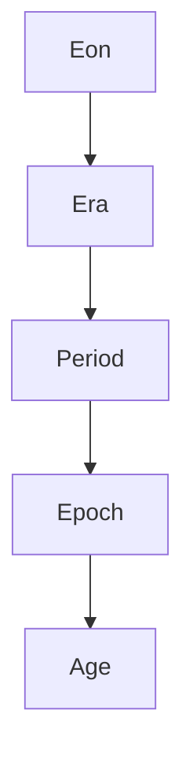

## The Geologic Time Scale

### Overview

The Geologic Time Scale (GTS) is the standardized hierarchical system used to describe the timing and relationships of events in Earth's history. It divides the 4.54-billion-year history of Earth into a nested series of chronostratigraphic (rock-based) and geochronologic (time-based) units, calibrated using a combination of relative dating principles, radiometric dating, and boundary markers tied to significant geological or biological events.

**Key Points**

- The GTS is maintained and formally ratified by the International Commission on Stratigraphy (ICS), a body of the International Union of Geological Sciences (IUGS)
- It integrates chronostratigraphy (the study of rock layers in relation to time) with geochronology (the actual numerical dating of those layers)
- The scale is periodically revised as new radiometric ages, boundary definitions, and stratigraphic sections are formally ratified
- [Unverified] Because the ICS updates the chart periodically (historically roughly annually), specific boundary ages cited in any reference should be checked against the current official ICS chart for the most up-to-date figures

---

### Chronostratigraphy vs. Geochronology

**Key Points**

- **Chronostratigraphy** deals with rock units and their boundaries: Eonothem, Erathem, System, Series, Stage (material, rock-based terminology)
- **Geochronology** deals with the corresponding time units: Eon, Era, Period, Epoch, Age (immaterial, time-based terminology)
- These are two parallel, corresponding classification systems describing the same divisions of Earth history — one names the rocks, the other names the time

| Chronostratigraphic Unit (Rocks) | Geochronologic Unit (Time) |
| --- | --- |
| Eonothem | Eon |
| Erathem | Era |
| System | Period |
| Series | Epoch |
| Stage | Age |

---

### Hierarchical Structure of the Time Scale

The GTS is organized from broadest to most refined:

**Key Points**

- **Eons** are the largest divisions (e.g., Hadean, Archean, Proterozoic, Phanerozoic)
- **Eras** subdivide eons (e.g., Paleozoic, Mesozoic, Cenozoic within the Phanerozoic)
- **Periods** subdivide eras (e.g., Cambrian, Jurassic, Neogene)
- **Epochs** subdivide periods (e.g., Pleistocene, Holocene within the Quaternary)
- **Ages** (or "stages" in rock terms) subdivide epochs and represent the finest routinely used formal subdivision (e.g., Calabrian, Chibanian within the Pleistocene)

---

### The Four Eons

#### Hadean Eon (~4.54–4.0 Ga)

- Represents Earth's earliest history, from planetary accretion through the earliest crust formation
- Named informally after Hades, reflecting the presumed hellish surface conditions (intense volcanism, bombardment, no stable crust or oceans for much of this time)
- **Informal** in current usage; not yet formally subdivided by the ICS with ratified GSSPs, largely because there is very little preserved rock record from this eon
- The oldest known terrestrial minerals (detrital zircons from the Jack Hills, Australia) date to approximately 4.4 Ga and provide most of what is known about this eon

#### Archean Eon (~4.0–2.5 Ga)

- Marks the emergence of stable continental crust and the earliest confirmed evidence of life (stromatolites, chemical biosignatures)
- Subdivided into four eras: Eoarchean, Paleoarchean, Mesoarchean, Neoarchean
- Atmosphere during this eon was largely anoxic (oxygen-poor)

#### Proterozoic Eon (~2.5 Ga–541 Ma)

- Subdivided into three eras: Paleoproterozoic, Mesoproterozoic, Neoproterozoic
- Includes the **Great Oxidation Event** (~2.4–2.0 Ga), when atmospheric oxygen rose significantly due to cyanobacterial photosynthesis
- Includes evidence of "Snowball Earth" glaciations in the Neoproterozoic
- Ends with the appearance of the earliest complex multicellular life (Ediacaran biota) and the base of the Cambrian

#### Phanerozoic Eon (~541 Ma–present)

- Means "visible life," reflecting the abundance of macroscopic fossils
- The only eon with extensive formal subdivision down to the Age/Stage level, due to the relative richness and accessibility of its rock and fossil record
- Divided into three eras: Paleozoic, Mesozoic, Cenozoic

---

### The Three Eras of the Phanerozoic

#### Paleozoic Era (~541–252 Ma)

"Ancient life" — begins with the Cambrian Explosion (rapid diversification of animal phyla) and ends with the Permian-Triassic extinction (the largest mass extinction in Earth's history, eliminating an estimated majority of marine species).

**Periods (oldest to youngest):**

1. Cambrian
2. Ordovician
3. Silurian
4. Devonian
5. Carboniferous
6. Permian

#### Mesozoic Era (~252–66 Ma)

"Middle life" — the age of dinosaurs and other reptiles, ending with the Cretaceous-Paleogene (K-Pg) extinction event.

**Periods (oldest to youngest):**

1. Triassic
2. Jurassic
3. Cretaceous

#### Cenozoic Era (~66 Ma–present)

"Recent life" — the age of mammals and, more recently, humans.

**Periods (oldest to youngest):**

1. Paleogene
2. Neogene
3. Quaternary

---

### Summary Table: Phanerozoic Periods and Approximate Boundary Ages

| Era | Period | Approx. Start (Ma) | Defining Boundary Event |
| --- | --- | --- | --- |
| Cenozoic | Quaternary | 2.58 | Onset of major Northern Hemisphere glaciation |
| Cenozoic | Neogene | 23.0 | Base defined by GSSP in Sicily |
| Cenozoic | Paleogene | 66.0 | K-Pg mass extinction (asteroid impact, iridium layer) |
| Mesozoic | Cretaceous | 145.0 | Base defined by calpionellid biostratigraphy |
| Mesozoic | Jurassic | 201.4 | Triassic-Jurassic extinction event |
| Mesozoic | Triassic | 251.9 | Permian-Triassic mass extinction |
| Paleozoic | Permian | 298.9 | Base defined by fusulinid foraminifera |
| Paleozoic | Carboniferous | 358.9 | Conodont biostratigraphy |
| Paleozoic | Devonian | 419.2 | Graptolite/conodont markers |
| Paleozoic | Silurian | 443.8 | End-Ordovician extinction |
| Paleozoic | Ordovician | 485.4 | Base defined by conodont *Iapetognathus* |
| Paleozoic | Cambrian | 541.0 | Base defined by trace fossil *Treptichnus pedum* |

[Unverified] These boundary ages reflect commonly cited ICS figures as of recent chart revisions; because the ICS periodically refines ages with improved radiometric calibration, exact decimal values should be cross-checked against the currently published chart for precision-critical work.

---

### Defining Boundaries: GSSPs and GSSAs

**Global Boundary Stratotype Section and Point (GSSP)**

- Also known as a "golden spike," a GSSP is a physically designated reference point in a specific rock outcrop that formally defines the lower boundary of a chronostratigraphic unit (Stage, Series, System)
- Chosen based on clear, globally correlatable markers: first/last appearance of key fossil taxa, geochemical excursions (e.g., carbon isotope shifts), magnetic polarity reversals, or distinctive marker beds (e.g., impact ejecta layers)
- Ratified through a formal, multi-stage approval process by the relevant ICS subcommission, followed by IUGS ratification

**Global Standard Stratigraphic Age (GSSA)**

- Used for intervals (mainly within the Precambrian) where no single, globally correlatable rock-based marker exists
- Defined instead as a fixed numerical age (in millions of years) agreed upon by convention, rather than tied to a physical rock section
- This is why Precambrian boundaries (Hadean/Archean/Proterozoic boundaries) are typically expressed as round numbers, while Phanerozoic boundaries have more precise, non-round decimal ages tied to actual dated horizons

**Diagram: GSSP Concept (svg_diagram)**

<svg xmlns="http://www.w3.org/2000/svg" viewBox="0 0 640 300" font-family="Arial, sans-serif">
<text x="320" y="24" font-size="16" font-weight="bold" text-anchor="middle">GSSP: Defining a Stage Boundary (svg_diagram)</text>
<rect x="250" y="50" width="140" height="70" fill="#c9d6e3" stroke="#333" stroke-width="1" />
<text x="320" y="90" font-size="12" text-anchor="middle">Younger Stage</text>
<line x1="200" y1="120" x2="440" y2="120" stroke="#c0392b" stroke-width="3" />
<circle cx="320" cy="120" r="6" fill="#c0392b" />
<text x="320" y="140" font-size="11" text-anchor="middle" fill="#c0392b">Golden Spike (GSSP)</text>
<text x="320" y="155" font-size="10" text-anchor="middle">First appearance of index fossil</text>
<rect x="250" y="120" width="140" height="70" fill="#e8dcc3" stroke="#333" stroke-width="1" />
<text x="320" y="160" font-size="12" text-anchor="middle">Older Stage</text>

<text x="60" y="230" font-size="11">The GSSP marks the exact horizon in an outcrop where</text>

<text x="60" y="248" font-size="11">a defining criterion (e.g., a fossil's first appearance)</text>

<text x="60" y="266" font-size="11">occurs, formally fixing the lower boundary of the stage.</text>

</svg>

---

### The Precambrian Problem

**Key Points**

- The Precambrian (Hadean + Archean + Proterozoic) spans roughly 88% of Earth's history but lacks the fine biostratigraphic resolution available in the Phanerozoic, since complex, widespread fossils are largely absent before the Ediacaran
- Precambrian subdivisions rely heavily on radiometric ages (GSSAs) rather than fossil-based GSSPs
- Ongoing work (e.g., informal proposals for a "Meghalayan," "Anthropocene," or refined Neoproterozoic subdivisions) reflects active debate about how finely the Precambrian and recent time should be subdivided

[Speculation] Some geologists have proposed subdividing the Precambrian using chemostratigraphic markers (e.g., carbon and sulfur isotope excursions) as a more rigorous alternative to purely numerical boundaries, though this remains a subject of ongoing methodological debate rather than settled practice.

---

### The Anthropocene Debate

**Key Points**

- The "Anthropocene" has been informally proposed as a new epoch/age reflecting the scale of human impact on Earth's geology and ecosystems (e.g., plastic pollution, radionuclide fallout from nuclear testing, anthropogenic sediment changes, atmospheric CO₂ rise)
- [Unverified] As of recent ICS proceedings, a formal proposal to ratify the Anthropocene as an official epoch was reviewed and rejected by the relevant voting bodies within the ICS/IUGS process; the term remains in wide informal and scientific use but is not currently a ratified unit on the official chronostratigraphic chart. Given ongoing debate on this topic, current status should be verified against the latest ICS communications.
- This debate illustrates how the formal GTS ratification process operates: even well-evidenced, widely discussed proposals must pass a rigorous, consensus-based procedure before becoming official

---

### Methods Used to Calibrate the Time Scale

**Key Points**

- **Radiometric dating** (U-Pb, Ar-Ar, etc.) of volcanic ash beds, lava flows, and intrusive bodies interbedded with or cross-cutting fossiliferous strata provides absolute numerical ages
- **Biostratigraphy** (index fossils, first/last appearance datums) establishes relative order and correlation between widely separated rock sections
- **Magnetostratigraphy** correlates sequences of geomagnetic polarity reversals recorded in rocks to an independently dated Geomagnetic Polarity Time Scale (GPTS)
- **Astrochronology / orbital tuning** uses Milankovitch cyclicity (recorded in rhythmic sedimentary sequences) to refine ages with very high resolution, particularly in the Cenozoic and Mesozoic
- **Chemostratigraphy** uses globally synchronous isotopic excursions (e.g., carbon isotope anomalies at mass extinction boundaries) as correlation tools

These methods are combined and cross-checked to produce the integrated, internally consistent numerical framework of the modern GTS.

---

### Worked Example: Placing an Event in the Time Scale

A fossil ammonite is found in a marine shale unit. Biostratigraphic analysis shows it belongs to a zone characteristic of the Late Jurassic. An overlying volcanic ash bed yields a U-Pb zircon age of 152 Ma.

**Output**

Since the ash bed lies stratigraphically above the ammonite-bearing shale (principle of superposition), the ammonite must be older than 152 Ma. Cross-referencing 152 Ma against the GTS places this within the Kimmeridgian Age of the Late Jurassic Epoch, within the Jurassic Period of the Mesozoic Era.

---

### Common Points of Confusion

**Key Points**

- "Epoch" is used loosely in casual speech (e.g., "the epoch of dinosaurs") but has a precise formal meaning in the GTS hierarchy (a subdivision of a Period, corresponding to a Series in rock terms) — dinosaurs actually span multiple Periods (Triassic, Jurassic, Cretaceous), not a single epoch
- "Ma" (mega-annum) means "million years ago" when used as an age, but can also mean "a duration of one million years" depending on context; "Ga" = billion years, "ka" = thousand years
- The Quaternary Period (current period) contains only two epochs: the Pleistocene and the Holocene, with the Holocene beginning only about 11,700 years ago
- Not all subdivisions are formally ratified at all levels; some intervals are referred to informally pending ICS action

---

### Related Topics

- Radiometric and Absolute Dating Methods (calibration basis for the GTS)
- Biostratigraphy and index fossils
- Magnetostratigraphy and the Geomagnetic Polarity Time Scale (GPTS)
- Mass extinction events (Permian-Triassic, Cretaceous-Paleogene, End-Ordovician)
- The Great Oxidation Event and Precambrian atmospheric evolution
- Milankovitch cycles and astrochronology
- Stratigraphic correlation principles (superposition, cross-cutting relationships, faunal succession)
- The Anthropocene proposal and human-driven stratigraphic signatures
- Chemostratigraphy and carbon isotope excursions