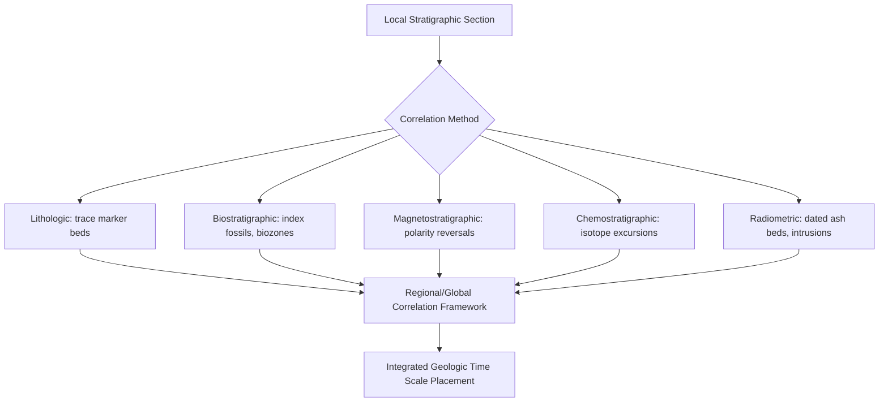

## Stratigraphic Principles and Correlation

### Overview

Stratigraphy is the branch of geology concerned with the description, classification, correlation, and interpretation of layered (stratified) rocks, primarily sedimentary but also volcanic and some metamorphic sequences. Stratigraphic principles provide the logical framework for establishing relative age relationships, while correlation techniques allow rock units in different locations to be linked as equivalent in age, in origin, or both.

**Key Points**

- Stratigraphy underlies relative dating, which establishes sequence without assigning numerical ages
- Correlation extends local stratigraphic observations into regional and global frameworks
- Most foundational stratigraphic principles were established through empirical observation of sedimentary processes and later formalized into geologic law

---

### Foundational Principles of Relative Dating

#### Principle of Superposition

- In an undisturbed sequence of sedimentary or volcanic layers, the oldest layer lies at the bottom and successively younger layers lie above
- Originally formulated by Nicolas Steno (17th century)
- **Key exception**: tectonic deformation (folding, overturning, thrust faulting) can invert this order, requiring additional criteria (e.g., graded bedding, cross-bedding orientation) to determine "way-up" (stratigraphic facing)

#### Principle of Original Horizontality

- Sediments are deposited under the influence of gravity as horizontal or near-horizontal layers
- Layers found tilted or folded today indicate post-depositional deformation
- Applies primarily to water-lain and windblown sediments; some depositional environments (e.g., steep depositional slopes, reef fronts) produce initially non-horizontal beds, which is a recognized exception

#### Principle of Lateral Continuity

- Sediment layers extend laterally in all directions until they thin out, pinch out, or terminate against the edge of their depositional basin
- Explains why the same rock unit can be traced across valleys, canyons, and even between separate outcrops, forming the basis for physical correlation

#### Principle of Cross-Cutting Relationships

- Any geological feature that cuts across existing rock (a fault, an igneous intrusion, a fracture) must be younger than the rock it cuts
- Fundamental tool for establishing relative timing of structural and igneous events relative to their host rocks

#### Principle of Inclusions (Included Fragments)

- Fragments (clasts, xenoliths) included within a rock unit must be older than the rock unit that contains them
- Example: a conglomerate containing granite pebbles indicates the granite source rock predates the conglomerate's deposition

#### Principle of Faunal Succession

- Fossil assemblages succeed one another in a definite, recognizable, and irreversible order through a stratigraphic sequence
- Formulated by William Smith (late 18th/early 19th century) based on observations of English strata
- Forms the basis of biostratigraphy: rock units can be correlated across regions based on shared or comparable fossil content, independent of physical continuity

#### Principle of Unconformities

- An unconformity represents a gap in the rock record, typically caused by non-deposition, erosion, or both
- Recognizing unconformities is essential because they indicate "missing time" that must be accounted for when constructing a stratigraphic history

---

### Types of Unconformities

**Key Points**

- **Angular unconformity**: tilted/folded older strata are eroded, then overlain by younger, horizontally deposited strata; represents deformation, uplift, erosion, then renewed deposition
- **Disconformity**: parallel strata above and below the unconformity surface, but a significant time gap exists, often marked by an erosional surface (e.g., paleosol, channel scours)
- **Nonconformity**: sedimentary strata overlie older igneous or metamorphic rock, indicating deep erosion exposed basement rock prior to renewed deposition
- **Paraconformity**: a subtle, hard-to-detect unconformity where bedding is parallel and there is little obvious physical evidence of erosion, but a time gap is revealed through biostratigraphic or radiometric dating gaps

**Diagram: Unconformity Types (svg_diagram)**

<svg xmlns="http://www.w3.org/2000/svg" viewBox="0 0 700 420" font-family="Arial, sans-serif">
<text x="350" y="24" font-size="16" font-weight="bold" text-anchor="middle">Types of Unconformities (svg_diagram)</text>

<text x="120" y="55" font-size="12" font-weight="bold" text-anchor="middle">Angular</text>

<g transform="translate(40,65)">

<polygon points="0,80 160,80 160,60 20,20 0,30" fill="`#d9c9a3`" stroke="#333" />

<line x1="0" y1="30" x2="160" y2="60" stroke="#333" stroke-dasharray="3,2" />

<line x1="10" y1="15" x2="90" y2="55" stroke="`#8a6d3b`" stroke-width="2" />

<line x1="30" y1="5" x2="110" y2="45" stroke="`#8a6d3b`" stroke-width="2" />

</g>

<text x="350" y="55" font-size="12" font-weight="bold" text-anchor="middle">Disconformity</text>

<g transform="translate(270,65)">

<rect x="0" y="0" width="160" height="30" fill="`#c9d6e3`" stroke="#333" />

<line x1="0" y1="30" x2="160" y2="30" stroke="#333" stroke-dasharray="3,2" />

<rect x="0" y="30" width="160" height="15" fill="`#a89968`" stroke="#333" />

<rect x="0" y="45" width="160" height="35" fill="`#e8dcc3`" stroke="#333" />

</g>

<text x="580" y="55" font-size="12" font-weight="bold" text-anchor="middle">Nonconformity</text>

<g transform="translate(500,65)">

<rect x="0" y="0" width="160" height="45" fill="`#c9d6e3`" stroke="#333" />

<line x1="0" y1="45" x2="160" y2="45" stroke="#333" stroke-dasharray="3,2" />

<polygon points="0,45 30,80 60,50 90,80 130,55 160,80 160,45" fill="`#b0455a`" stroke="#333" />

</g>

<text x="60" y="200" font-size="11">Angular: tilted older beds truncated, overlain by horizontal younger beds</text>

<text x="60" y="222" font-size="11">Disconformity: parallel bedding, erosional surface, hidden time gap</text>

<text x="60" y="244" font-size="11">Nonconformity: sedimentary rock overlies eroded igneous/metamorphic basement</text>

<text x="60" y="270" font-size="11">(Paraconformity, not shown, resembles conformable bedding with a hidden gap</text>

<text x="60" y="288" font-size="11">detectable only via fossil or isotopic evidence)</text>

</svg>

---

### Facies and Walther's Law

**Key Points**

- A **sedimentary facies** is a body of rock with distinctive characteristics (lithology, sedimentary structures, fossil content) reflecting a specific depositional environment
- Lateral facies changes occur because different environments (e.g., beach, lagoon, reef, offshore) exist simultaneously at different locations along a depositional profile
- **Walther's Law** states that the vertical succession of facies in a conformable sequence reflects the lateral succession of environments that existed side by side at the time of deposition, provided there is no break in the sequence
- This principle allows geologists to reconstruct paleogeography (e.g., transgressive vs. regressive sequences) from a single vertical stratigraphic column

**Example**

A vertical sequence showing shale (offshore) grading upward into sandstone (nearshore) indicates a **regression** (relative sea-level fall or basin infilling, causing the shoreline to migrate seaward over time, so shallower-water facies migrate over deeper-water facies at a fixed location). The reverse pattern (sandstone grading up into shale) indicates a **transgression** (relative sea-level rise, shoreline migrating landward).

---

### Correlation Methods

Correlation is the process of establishing the equivalence of rock units between different geographic locations, either in age (time-correlation) or in lithologic character (lithocorrelation).

#### Physical (Lithologic) Correlation

- Tracing a distinctive, laterally continuous rock unit or sequence directly between outcrops, based on lithology, thickness, and stratigraphic position
- Effective for local to regional scales, especially where continuous exposure or subsurface (well-log/seismic) data exists
- **Marker beds** (e.g., a distinctive volcanic ash layer, a coal seam, a bentonite layer) are especially valuable because they can represent a geologically instantaneous depositional event, allowing precise time-correlation over large areas

#### Biostratigraphic Correlation

- Uses fossil content to correlate strata, based on the principle of faunal succession
- **Index fossils** are ideal correlation tools when they meet the following criteria: widespread geographic distribution, short stratigraphic (temporal) range, abundance, and easily identifiable/preservable morphology
- **Range zones**, **assemblage zones**, and **concurrent range zones** are formal biozone types used to define correlatable fossil-based intervals

#### Chronostratigraphic (Time) Correlation

- Establishes that rock units formed during the same time interval, regardless of lithologic similarity
- Achieved through radiometric dating of interbedded volcanic layers, magnetostratigraphy, or chemostratigraphic markers
- Distinct from lithologic correlation because time-equivalent rocks can have very different lithologies at different locations (a direct consequence of facies relationships and Walther's Law)

#### Magnetostratigraphic Correlation

- Correlates sequences based on the pattern of geomagnetic polarity reversals (normal vs. reversed) recorded in the remanent magnetism of rocks
- Particularly powerful because polarity reversals are globally synchronous, geologically instantaneous events, providing a time-correlation tool independent of lithology or fossil content
- Correlated against the independently dated Geomagnetic Polarity Time Scale (GPTS)

#### Chemostratigraphic Correlation

- Uses globally synchronous geochemical signals — such as carbon isotope ($\delta^{13}\text{C}$) or strontium isotope ($^{87}\text{Sr}/^{86}\text{Sr}$) excursions — as correlation markers
- Particularly useful across mass extinction boundaries and ocean chemistry perturbation events, and in Precambrian sequences lacking diagnostic fossils

#### Seismic Stratigraphy / Sequence Stratigraphy

- Uses seismic reflection data to identify stratal geometries (onlap, offlap, downlap, toplap) and bounding unconformities, interpreted in terms of relative sea-level change
- Organizes strata into **depositional sequences** bounded by unconformities and their correlative conformities, subdivided into systems tracts (lowstand, transgressive, highstand) reflecting stages of relative sea-level cycles

---

### Correlation Workflow Summary

---

### Stratigraphic Nomenclature (Lithostratigraphic Units)

**Key Points**

- **Bed**: the smallest formal lithostratigraphic unit, a single distinct layer
- **Member**: a named subdivision of a formation with distinctive lithologic characteristics
- **Formation**: the fundamental unit of lithostratigraphy — a mappable, lithologically distinct body of rock with a name typically derived from a geographic locality (e.g., "Morrison Formation")
- **Group**: a assemblage of two or more related formations
- **Supergroup**: an assemblage of related groups

This hierarchy is distinct from the chronostratigraphic hierarchy (Eonothem, Erathem, System, Series, Stage) discussed under the Geologic Time Scale, since lithostratigraphic units are defined purely by physical rock characteristics, not by age.

---

### Worked Example: Constructing a Composite Stratigraphic Section

Two outcrops (A and B), 50 km apart, both preserve a distinctive bentonite (volcanic ash) layer dated by U-Pb zircon to 94.0 Ma. Outcrop A shows limestone below the ash and shale above; Outcrop B shows sandstone below the ash and limestone above.

**Output**

Because the dated ash bed is a geologically instantaneous marker, it establishes a precise time-correlation line between the two sections despite their differing lithologies above and below. Applying Walther's Law, the lateral facies change (limestone at A vs. sandstone at B, below the ash) suggests Outcrop A represents a deeper-water environment and Outcrop B a shallower, nearshore environment at that time, both existing simultaneously within the same depositional basin.

---

### Common Pitfalls in Stratigraphic Interpretation

**Key Points**

- Assuming lithologic similarity implies time-equivalence (a **diachronous** unit — e.g., a sandstone body migrating landward through time during a transgression — can cut across time lines, being older in one location and younger in another)
- Overlooking unconformities, leading to underestimation of total elapsed time in a section
- Misidentifying facies changes as unconformities, or vice versa
- Applying index fossils outside their validated geographic or environmental range, which can produce false correlations
- [Inference] In tectonically active or metamorphosed terrains, original stratigraphic relationships may be strongly modified or transposed, requiring structural geology techniques (fold/fault analysis) to be integrated with stratigraphic interpretation before correlation can be considered reliable

---

### Related Topics

- Radiometric and Absolute Dating Methods
- The Geologic Time Scale
- Sequence stratigraphy and systems tracts
- Sedimentary facies models and depositional environments
- Biostratigraphy and index fossil taxa
- Magnetostratigraphy and the Geomagnetic Polarity Time Scale (GPTS)
- Structural geology: folding, faulting, and unconformity recognition
- Basin analysis and subsidence history
- Chemostratigraphy and isotope excursion events