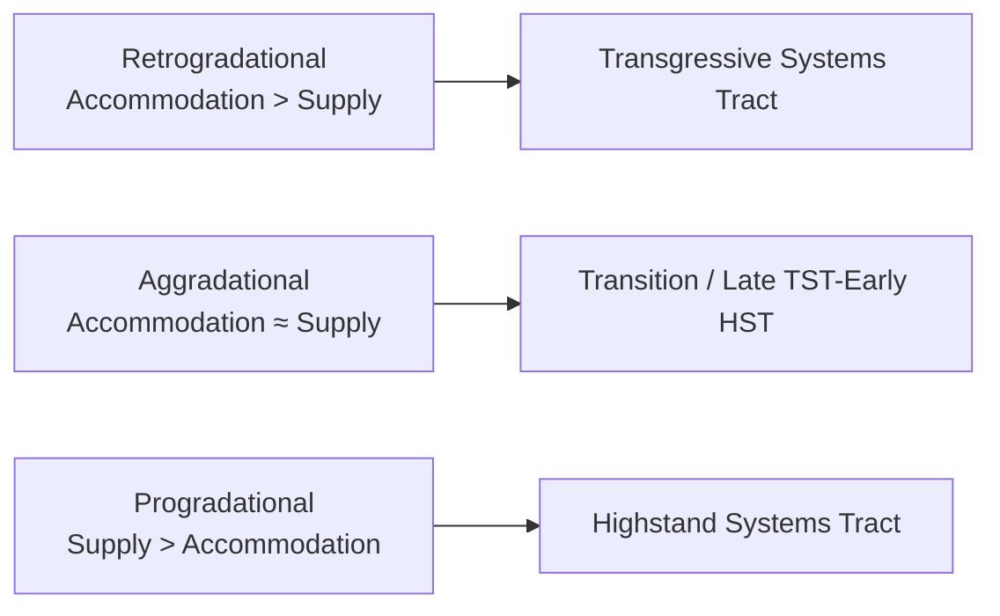

## Sequence Stratigraphy

### Overview

Sequence stratigraphy is a subdiscipline of stratigraphy that analyzes sedimentary successions in terms of genetically related units bounded by unconformities and their correlative conformities, interpreted primarily as products of cyclical changes in relative sea level (or, more generally, accommodation space and sediment supply). It provides a predictive, process-based framework for correlating strata across a basin, widely used in both academic basin analysis and petroleum/reservoir exploration.

**Key Points**

- Developed largely from seismic stratigraphy concepts pioneered by Peter Vail and colleagues at Exxon in the 1970s–1980s
- Organizes strata into hierarchically nested units: sequences, systems tracts, and parasequences
- The central organizing variable is **accommodation space**: the space available for sediment to accumulate, controlled by the interplay of eustatic (global) sea-level change, tectonic subsidence/uplift, and sediment supply

---

### Core Concepts

#### Accommodation Space

- Defined as the vertical space between the sea floor (or land surface) and sea level, available for sediment accumulation
- Increases when relative sea level rises (via eustasy, subsidence, or both) and decreases when relative sea level falls
- The balance between the **rate of accommodation change** and the **rate of sediment supply** determines whether the shoreline advances (regression) or retreats (transgression)

#### Relative Sea Level vs. Eustatic Sea Level

- **Eustatic sea level**: the global, absolute sea level, controlled by factors such as ocean basin volume and total water volume (e.g., glacio-eustasy from ice sheet growth/melt)
- **Relative sea level**: the position of sea level at a specific location relative to the land surface, which incorporates both eustatic change and local tectonic subsidence or uplift
- [Inference] Because relative sea level is what actually controls the local stratigraphic record, a location undergoing rapid subsidence can show a "transgressive" stratigraphic signature even during a period of eustatic sea-level fall, if subsidence outpaces the eustatic fall

#### Base Level

- The theoretical surface toward which erosion and deposition tend to equilibrate; closely related to but not always identical to sea level, especially in fluvial (river) systems far from the coast

---

### Depositional Sequences

A **depositional sequence** is the fundamental unit of sequence stratigraphy: a relatively conformable succession of genetically related strata bounded at its top and base by unconformities or their correlative conformities.

**Key Points**

- **Sequence boundaries** typically form during relative sea-level fall, when subaerial exposure causes erosion (fluvial incision, weathering) on the exposed shelf
- A sequence boundary's correlative conformity is the equivalent time surface traced into deeper-water settings where no physical erosion or exposure occurred
- Sequences are further subdivided internally into systems tracts based on their position within the relative sea-level cycle

---

### Systems Tracts

A **systems tract** is a linkage of contemporaneous depositional systems, defined by its position within a sequence and the trajectory of relative sea-level change during its formation.

#### Lowstand Systems Tract (LST)

- Forms during and immediately after maximum relative sea-level fall and the beginning of subsequent rise
- Characterized by incised valley fill, basin-floor fans, and prograding wedges deposited at the shelf margin or beyond
- Overlies the sequence boundary

#### Transgressive Systems Tract (TST)

- Forms during a phase of relative sea-level rise that outpaces sediment supply, causing the shoreline to migrate landward (retrogradation)
- Characterized by backstepping (retrogradational) parasequence sets, thinner and more widely dispersed sediment
- Typically capped by a **maximum flooding surface (MFS)**, marking the point of maximum landward shoreline position and often represented by a condensed section (a thin, sediment-starved interval, often organic-rich and highly fossiliferous, deposited during minimal sediment influx)

#### Highstand Systems Tract (HST)

- Forms when relative sea-level rise slows, stalls, or the rate of sediment supply exceeds the rate of accommodation increase, causing the shoreline to prograde (advance basinward)
- Characterized by aggradational to progradational parasequence sets, thick nearshore/deltaic deposits
- Overlies the maximum flooding surface

#### Falling-Stage Systems Tract (FSST)

- A tract recognized in more refined sequence stratigraphic models, formed during active relative sea-level fall (forced regression)
- Characterized by forced-regressive shoreline deposits that step basinward and downward without an intervening transgression
- Distinguishes normal regression (highstand progradation, driven by sediment supply exceeding slow accommodation gain) from forced regression (driven directly by falling sea level)

**Sequence Stratigraphic Cycle (svg_diagram)**

<svg xmlns="http://www.w3.org/2000/svg" viewBox="0 0 700 380" font-family="Arial, sans-serif">
<text x="350" y="24" font-size="16" font-weight="bold" text-anchor="middle">Relative Sea-Level Curve and Systems Tracts (svg_diagram)</text>
<line x1="60" y1="330" x2="640" y2="330" stroke="#333" stroke-width="1.5" />
<text x="350" y="355" font-size="12" text-anchor="middle">Time</text>
<line x1="60" y1="60" x2="60" y2="330" stroke="#333" stroke-width="1.5" />
<text x="35" y="200" font-size="12" text-anchor="middle" transform="rotate(-90 35 200)">Relative Sea Level</text>

<path d="M 60 200 C 150 100, 250 90, 320 130 C 390 170, 420 260, 480 280 C 540 300, 600 250, 640 150" fill="none" stroke="`#2c6fbb`" stroke-width="2.5" />

<text x="130" y="90" font-size="11" fill="`#8a6d3b`" font-weight="bold">HST</text>

<text x="330" y="150" font-size="11" fill="`#b0455a`" font-weight="bold">FSST</text>

<text x="450" y="300" font-size="11" fill="`#3b8a5c`" font-weight="bold">LST</text>

<text x="580" y="200" font-size="11" fill="`#7a4fb5`" font-weight="bold">TST</text>

<circle cx="480" cy="280" r="4" fill="#333" />
<text x="480" y="300" font-size="9" text-anchor="middle">SB</text>
<text x="480" y="312" font-size="8" text-anchor="middle">(sequence boundary)</text>
<circle cx="600" cy="255" r="4" fill="#333" />
<text x="605" y="245" font-size="9">MFS</text>
</svg>

**Key Points**

- SB = Sequence Boundary (forms at the point of maximum relative sea-level fall, at the transition from FSST to LST)
- MFS = Maximum Flooding Surface (forms at the point of maximum landward transgression, at the transition from TST to HST)
- These surfaces, along with the transgressive surface (marking the change from regression to transgression at the base of the TST), are the primary correlatable stratal surfaces used to divide a sequence into its systems tracts

---

### Parasequences

**Key Points**

- A **parasequence** is a relatively conformable succession of genetically related beds bounded by marine flooding surfaces (or their correlative surfaces), representing a smaller-scale (typically higher-frequency) cycle nested within a systems tract
- Parasequences typically show an overall shallowing-upward (coarsening-upward) trend, capped abruptly by a flooding surface where the pattern resets
- **Parasequence sets** are stacked according to their stacking pattern, which indicates the ratio of accommodation to sediment supply:
  - **Retrogradational**: each successive parasequence steps landward (accommodation > supply) — typical of TST
  - **Aggradational**: each successive parasequence stacks vertically with little lateral shift (accommodation ≈ supply)
  - **Progradational**: each successive parasequence steps basinward (supply > accommodation) — typical of HST

---

### Key Stratal Surfaces Summary

| Surface | Formed At | Significance |
| --- | --- | --- |
| Sequence Boundary (SB) | Maximum relative sea-level fall | Subaerial exposure, erosion, fluvial incision on the shelf |
| Transgressive Surface (TS) | Onset of transgression | Marks base of TST; often a minor flooding/ravinement surface |
| Maximum Flooding Surface (MFS) | Maximum landward transgression | Condensed section; boundary between TST and HST |
| Flooding Surface (within parasequences) | Each parasequence boundary | Abrupt increase in water depth; resets shallowing-upward pattern |

---

### Sequence Stratigraphic Models

**Key Points**

- **Type 1 sequence boundary**: forms when the rate of relative sea-level fall exceeds the rate of basin subsidence at the shelf edge, causing subaerial exposure across the entire shelf and forcing deposition to shift basinward (typically associated with incised valleys and basin-floor fans)
- **Type 2 sequence boundary**: forms when relative sea-level fall is more modest, exposing only the inner shelf without significant basinward shift of the shelf-edge depositional system
- [Unverified] The Type 1/Type 2 boundary classification, while foundational to classic Exxon-school sequence stratigraphy, has seen varied application and terminology across subsequent literature; some practitioners favor simplified or genetically-based classification schemes instead, so terminology may differ between texts and research traditions

---

### Applications

**Key Points**

- **Petroleum exploration**: predicting the geometry, distribution, and quality of reservoir rocks (e.g., basin-floor fan sandstones in LST), source rocks (organic-rich condensed sections at MFS), and seals (transgressive shales)
- **Correlation**: provides a chronostratigraphic (time-based) correlation framework superior to simple lithostratigraphic correlation, since systems tracts and bounding surfaces are interpreted as quasi-time-synchronous
- **Paleoclimate and sea-level reconstruction**: stacking patterns and sequence architecture can be used to infer past relative sea-level history
- **Outcrop and subsurface integration**: sequence stratigraphic surfaces identified in seismic data can be tied to well logs (gamma ray, resistivity) and outcrop sections for high-resolution correlation

---

### Worked Example: Interpreting a Vertical Log

A well log shows the following upward succession: condensed, fossiliferous organic-rich shale, overlain by a thick, coarsening-upward package of interbedded shale and sandstone, overlain sharply by an erosional surface with overlying fluvial channel sandstones.

**Output**

The condensed organic-rich shale represents a maximum flooding surface. The overlying coarsening-upward package represents a progradational parasequence set of the highstand systems tract. The sharp erosional surface capping the highstand deposits represents a sequence boundary, and the overlying fluvial channel sandstones represent incised valley fill of the succeeding lowstand systems tract.

---

### Limitations and Debates

**Key Points**

- Distinguishing eustatic from tectonic (local subsidence/uplift) controls on a given sequence can be genuinely ambiguous without independent age control or regional correlation
- Global eustatic sea-level curves derived from sequence stratigraphy (e.g., the original Exxon/Vail global cycle charts) have been debated regarding their global applicability versus local/regional tectonic overprinting
- [Speculation] Some researchers argue that autogenic (internal, non-sea-level-driven) processes such as delta lobe switching or channel avulsion can produce stratal architectures resembling allogenic (external, sea-level or tectonically driven) sequence boundaries, complicating straightforward interpretation in some settings — this remains an active area of methodological discussion rather than a fully resolved consensus
- Sequence stratigraphic terminology and boundary definitions have evolved since the original 1980s Exxon models, and multiple competing nomenclatural schools exist in current literature (e.g., depositional sequence vs. genetic stratigraphic sequence vs. transgressive-regressive sequence models)

---

### Related Topics

- Stratigraphic Principles and Correlation
- The Geologic Time Scale
- Radiometric and Absolute Dating Methods
- Sedimentary facies models and depositional environments
- Eustasy and glacio-eustatic sea-level change
- Basin analysis and subsidence mechanisms
- Seismic stratigraphy and reflection interpretation
- Petroleum system elements (source, reservoir, seal, trap)
- Carbonate vs. siliciclastic sequence stratigraphy