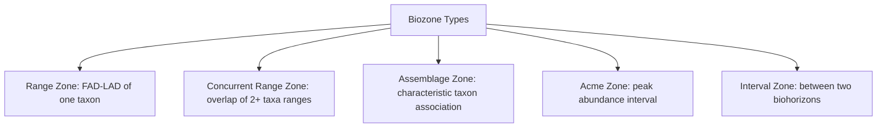

## Biostratigraphy

### Overview

Biostratigraphy is the branch of stratigraphy that uses the distribution of fossils in sedimentary rock sequences to establish relative age relationships and correlate strata between different locations. It rests on the principle of faunal (and floral) succession: fossil assemblages occur in a definite, recognizable, and irreversible order through geologic time, allowing rock units containing similar fossil content to be recognized as broadly contemporaneous.

**Key Points**

- Historically the primary tool for constructing the Phanerozoic portion of the Geologic Time Scale before radiometric dating became widely available
- Remains essential today for correlation in settings where radiometric or magnetostratigraphic data are unavailable or ambiguous (e.g., most sedimentary basins lacking datable volcanic layers)
- Provides only *relative* age and correlation; numerical ages must come from independent radiometric calibration of biozone boundaries

---

### The Principle of Faunal Succession

Formulated by William Smith based on his observations of English strata and canal excavations, the principle states that fossil organisms succeed one another through the rock record in a specific, non-repeating sequence, reflecting the irreversible process of evolutionary change and extinction.

**Key Points**

- Because evolution is directional and extinction is permanent (except in cases of convergent morphology, which can create identification pitfalls), the same distinctive fossil species should not reappear at a higher (younger) level after disappearing at a lower one within a single, undisturbed sequence
- This allows strata in geographically separated locations, even with different lithologies, to be correlated based on shared fossil content — extending the principle of lateral continuity beyond physically traceable beds

---

### Index Fossils

An **index fossil** (or "guide fossil") is a fossil species particularly well suited for biostratigraphic correlation.

**Ideal Characteristics**

- **Short stratigraphic (temporal) range**: existed for a geologically brief interval, narrowing the possible age of the enclosing rock
- **Wide geographic distribution**: found across broad areas, ideally multiple continents or ocean basins, maximizing correlation potential
- **Abundance**: common enough to be reliably found in multiple sections
- **Easily identifiable**: distinctive, easily recognized morphology, minimizing misidentification
- **Independence from facies**: ideally not restricted to a narrow depositional environment, so its distribution reflects time rather than habitat

**Commonly Used Index Fossil Groups**

| Group | Era/Period of Primary Use | Notes |
| --- | --- | --- |
| Trilobites | Cambrian–Permian | Rapid turnover, useful for Paleozoic zonation |
| Graptolites | Ordovician–Devonian | Planktonic, widely dispersed, fine-scale zonation |
| Conodonts | Cambrian–Triassic | Microfossils (phosphatic tooth-like elements), very fine biostratigraphic resolution |
| Ammonites | Devonian–Cretaceous | Rapid evolution, wide dispersal (planktonic larvae), classic Mesozoic index fossils |
| Foraminifera (forams) | Cambrian–present | Both benthic and planktonic; planktonic forams especially valuable for Cenozoic marine correlation |
| Calcareous nannofossils (coccolithophores) | Jurassic–present | Microfossils widely used in Mesozoic-Cenozoic marine biostratigraphy, especially in deep-sea cores |
| Diatoms | Cretaceous–present | Siliceous microfossils, useful in Cenozoic marine and lacustrine sequences |

[Inference] Microfossil groups (conodonts, forams, nannofossils) have become especially central to modern biostratigraphy because their small size allows recovery of statistically robust assemblages from small sample volumes, such as drill cuttings and cores, making them practical for subsurface petroleum exploration work where only limited rock material is available.

---

### Biozones

A **biozone** is the fundamental formal unit of biostratigraphy: a body of rock defined or characterized by its fossil content, distinguishing it from adjacent strata.

#### Range Zone

- Defined by the total stratigraphic (and inferred temporal) range of a single taxon, from its first appearance datum (FAD) to its last appearance datum (LAD)
- The simplest biozone type, based on one species' known occurrence interval

#### Concurrent Range Zone

- Defined by the overlapping stratigraphic ranges of two or more selected taxa
- Provides a more tightly constrained interval than a single range zone, since it requires the co-occurrence of multiple independently ranging taxa

#### Assemblage Zone

- Defined by a characteristic natural association (assemblage) of three or more taxa, regardless of their individual range limits
- Useful when no single taxon has a sufficiently restricted or well-documented range on its own

#### Acme Zone (Abundance Zone)

- Defined by an interval where a particular taxon reaches its peak relative abundance, rather than by its first or last appearance
- Less rigorous than range-based zones since abundance can be influenced by local ecological/environmental factors rather than purely evolutionary/temporal ones

#### Interval Zone

- Defined by the stratigraphic interval between two specified biohorizons (e.g., between the FAD of one taxon and the FAD of another), without requiring the interval to correspond to any single taxon's full range

---

### First and Last Appearance Datums (FAD / LAD)

**Key Points**

- **FAD (First Appearance Datum)**: the stratigraphically lowest (oldest) recorded occurrence of a taxon in a given section or globally
- **LAD (Last Appearance Datum)**: the stratigraphically highest (youngest) recorded occurrence of a taxon
- These datums are used to define GSSPs (Global Boundary Stratotype Sections and Points) for many Phanerozoic stage boundaries (e.g., the base of the Cambrian is defined by the FAD of the trace fossil *Treptichnus pedum*)
- [Inference] Because the true evolutionary origination or extinction of a species almost certainly occurred somewhat before its FAD or after its LAD in any given local section (due to incomplete preservation and sampling), FADs and LADs as observed in outcrop represent minimum estimates of a taxon's actual range, a phenomenon sometimes discussed under the "Signor-Lipps effect" for extinction boundaries specifically

---

### Diagram: Range Zones and Concurrent Range Zone

<svg xmlns="http://www.w3.org/2000/svg" viewBox="0 0 640 380" font-family="Arial, sans-serif">
<text x="320" y="24" font-size="16" font-weight="bold" text-anchor="middle">Taxon Ranges and Biozone Definition (svg_diagram)</text>
<line x1="80" y1="60" x2="80" y2="330" stroke="#333" stroke-width="1.5" />
<text x="55" y="200" font-size="12" text-anchor="middle" transform="rotate(-90 55 200)">Stratigraphic Height (younger up)</text>
<line x1="150" y1="290" x2="150" y2="120" stroke="#2c6fbb" stroke-width="4" />
<text x="150" y="110" font-size="11" text-anchor="middle" fill="#2c6fbb">Taxon A</text>
<text x="150" y="305" font-size="9" text-anchor="middle">FAD-A</text>
<text x="150" y="330" font-size="9" text-anchor="middle">(range zone A)</text>
<line x1="280" y1="320" x2="280" y2="160" stroke="#b0455a" stroke-width="4" />
<text x="280" y="150" font-size="11" text-anchor="middle" fill="#b0455a">Taxon B</text>
<rect x="150" y="160" width="130" height="130" fill="#e0b04d" opacity="0.35" />
<text x="215" y="230" font-size="10" text-anchor="middle" font-weight="bold">Concurrent</text>
<text x="215" y="244" font-size="10" text-anchor="middle" font-weight="bold">Range Zone</text>
<text x="215" y="258" font-size="9" text-anchor="middle">(A and B overlap)</text>
<line x1="420" y1="280" x2="420" y2="90" stroke="#3b8a5c" stroke-width="4" />
<text x="420" y="80" font-size="11" text-anchor="middle" fill="#3b8a5c">Taxon C</text>
<line x1="80" y1="330" x2="600" y2="330" stroke="#333" stroke-width="1" />
<text x="320" y="355" font-size="12" text-anchor="middle">Section width (schematic; not to scale)</text>
</svg>

---

### Biostratigraphy vs. Chronostratigraphy

**Key Points**

- A biozone is a body of *rock* characterized by its fossil content (a biostratigraphic, lithology-independent unit), whereas a chronostratigraphic unit (Stage, Series) is bounded by GSSPs that are often themselves defined using biostratigraphic criteria
- Biozone boundaries can be **diachronous**: because a species' first appearance in the fossil record depends on migration, ecological tolerance, and preservation, a taxon may appear earlier in one region (e.g., near its evolutionary origin) and later in another (as it migrates or disperses), meaning the same biozone boundary is not always perfectly time-synchronous everywhere
- This diachroneity is a recognized limitation, distinguishing biostratigraphic correlation from truly time-synchronous methods like magnetostratigraphy or dated ash-bed correlation

---

### Quantitative Biostratigraphy

**Key Points**

- **Graphic correlation** (Shaw, 1964) plots the stratigraphic position of shared taxa's occurrences between two sections against each other, fitting a "line of correlation" to establish equivalence, and can integrate many sections into a single composite standard reference section
- **Biostratigraphic zonation via computer-assisted methods** (e.g., ranking and scaling techniques, constrained optimization/CONOP) statistically combine range data from many sections and taxa to construct an optimal composite sequence of events, improving resolution beyond what any single section can provide
- [Unverified] The specific statistical algorithms and software packages in active use (e.g., CONOP9, various probabilistic stratigraphic ordination methods) continue to be refined in the stratigraphic research literature, so implementation details are best verified against current published methodology papers rather than treated as fixed procedure

---

### Applications

**Key Points**

- **Petroleum exploration**: micropaleontological (forams, nannofossils) analysis of well cuttings is a standard, cost-effective method for age-dating and correlating subsurface strata, since it requires only small sample volumes
- **Geologic mapping**: correlating outcrops across a mapped area using characteristic fossil assemblages
- **Paleoenvironmental reconstruction**: fossil assemblages also carry ecological information (e.g., benthic foram assemblages indicating water depth or oxygenation), linking biostratigraphy to paleoecology
- **Calibration of the Geologic Time Scale**: biozone boundaries, once identified, are cross-correlated with radiometrically dated horizons (e.g., interbedded ash layers) to assign numerical ages to biozones, and by extension to the stage boundaries they help define

---

### Worked Example: Correlating Two Sections Using Overlapping Ranges

Section X contains ammonite Taxon 1 (range: lower to middle part of section) and Taxon 2 (range: middle to upper part). Section Y, 200 km away, contains the same two taxa with overlapping ranges in its middle interval, despite Section X being limestone-dominated and Section Y being sandstone-dominated.

**Output**

The overlapping range interval of Taxon 1 and Taxon 2 defines a concurrent range zone present in both sections. Despite the differing lithologies (reflecting different depositional environments/facies at the two locations), the shared concurrent range zone allows the middle intervals of Section X and Section Y to be correlated as broadly time-equivalent, independent of their physical rock character.

---

### Limitations and Sources of Error

**Key Points**

- **Facies dependence**: some fossil taxa are restricted to specific environments (facies), so their absence in a section may reflect unsuitable habitat rather than true absence during that time interval (a phenomenon distinct from, but sometimes confused with, true absence due to non-deposition or extinction)
- **Reworking**: older fossils can be eroded and redeposited into younger sediments, potentially causing a false old age signal if not recognized (often identifiable through differential preservation/abrasion of the reworked specimens)
- **Diachronous boundaries**: as noted above, migration lag means biozone boundaries are not always perfectly synchronous across wide geographic areas
- **Preservation bias**: soft-bodied organisms and certain environments (e.g., high-energy settings) preserve fossils poorly, creating gaps in the biostratigraphic record independent of true biological absence
- **Provincialism**: some taxa are restricted to particular climatic belts or ocean basins, limiting correlation to other regions with different faunal provinces

---

### Related Topics

- Stratigraphic Principles and Correlation
- The Geologic Time Scale
- Radiometric and Absolute Dating Methods
- Sequence Stratigraphy
- Paleoecology and paleoenvironmental reconstruction
- Mass extinction events and biotic turnover (Permian-Triassic, Cretaceous-Paleogene)
- Micropaleontology (foraminifera, nannofossils, conodonts)
- Magnetostratigraphy and integrated stratigraphic correlation
- Taphonomy and fossil preservation bias