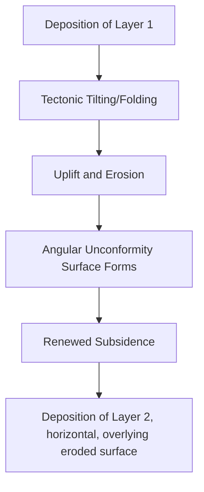

## Interpreting the Rock Record

### Overview

Interpreting the rock record is the synthesis process by which geologists reconstruct Earth history — depositional environments, tectonic events, climate change, and elapsed time — from the physical, chemical, and biological evidence preserved in stratified rocks. It integrates the principles of stratigraphy, sedimentology, structural geology, geochronology, and paleontology into a coherent reading of "what happened, in what order, and how long it took" at a given location.

**Key Points**

- The rock record is inherently incomplete: only a fraction of Earth's history is preserved as rock, and only a fraction of that is ever exposed or sampled
- Interpretation requires distinguishing primary depositional features from later diagenetic, structural, or metamorphic overprints
- The guiding philosophy is **uniformitarianism**: "the present is the key to the past," meaning processes observed operating today (erosion, deposition, volcanism) are assumed to have operated according to the same physical laws throughout geologic time, though not necessarily at the same rates

---

### The Concept of an Incomplete Record

**Key Points**

- Sedimentary sequences are punctuated by unconformities (gaps representing non-deposition or erosion), meaning "missing time" is the rule, not the exception, in most stratigraphic sections
- The principle popularly summarized as "the present is the key to the past" must be balanced against the recognition that rare, high-magnitude events (catastrophic floods, bolide impacts, supervolcanic eruptions) can produce disproportionately large amounts of the preserved rock record relative to their brief duration — a concept sometimes discussed under **actualism** or **neocatastrophism**, distinguishing it from strict 19th-century uniformitarianism, which downplayed catastrophic processes
- [Inference] Because most sediment is deposited episodically (storm events, flood pulses, individual turbidity currents) rather than at a smooth, continuous rate, a stratigraphic column more closely represents a series of discrete depositional events separated by longer periods of non-deposition than it does a uniform, continuous accumulation — this is sometimes summarized by the phrase "the present is the key to the past, but most of the past is missing from the rock record"

---

### Reading Primary Sedimentary Structures

Sedimentary structures preserved in rock provide direct evidence of the physical processes and environment of deposition.

#### Bedding and Stratification

- **Massive bedding**: no visible internal structure, often indicating rapid deposition or bioturbation destroying original structure
- **Graded bedding**: particle size decreases upward within a single bed, classically associated with turbidity currents (Bouma sequence) and used to determine "way-up" (stratigraphic facing) in deformed terrains
- **Cross-bedding**: inclined layers within a bed, formed by migration of ripples, dunes, or bars; orientation can indicate paleocurrent direction (paleoflow)
- **Planar vs. trough cross-bedding**: reflects different bedform geometries (e.g., 2D vs. 3D dunes), diagnostic of specific flow regimes

#### Surface Features

- **Ripple marks**: symmetrical ripples suggest oscillatory (wave) flow; asymmetrical ripples suggest unidirectional current flow
- **Mudcracks (desiccation cracks)**: indicate periodic subaerial exposure and drying, common in tidal flat, floodplain, or playa lake settings
- **Flute casts and load casts**: sole marks formed at the base of turbidite beds, useful for both paleocurrent direction and way-up determination

#### Chemical and Biological Structures

- **Stromatolites**: laminated structures built by microbial mat trapping/binding of sediment, indicating shallow, often hypersaline or otherwise stressed subaqueous environments with limited grazing pressure
- **Bioturbation and trace fossils (ichnofossils)**: burrows, trails, and borings record organism behavior and can indicate oxygenation levels, sedimentation rate, and substrate consistency, even in the absence of body fossils

---

### Determining "Way-Up" in Deformed Sequences

**Key Points**

- In tectonically deformed terrains, beds may be overturned, making the principle of superposition inapplicable without independent confirmation of original orientation
- Way-up indicators include: graded bedding (fining upward in normal orientation), cross-bedding truncation patterns, ripple mark asymmetry, load casts (which sink into underlying softer sediment, always pointing toward the original "down"), and fossil orientation (e.g., articulated bivalves normally rest convex-up)
- Correctly determining way-up is a prerequisite for applying superposition and constructing an accurate relative age sequence in folded or faulted terrains

---

### Reconstructing Depositional Environments (Facies Analysis)

**Key Points**

- A **facies** is interpreted by integrating lithology, grain size, sedimentary structures, fossil content, and geometry of the rock body
- **Facies models** are idealized, generalized summaries of the characteristic vertical and lateral facies relationships expected in a specific depositional environment (e.g., fluvial, deltaic, shallow marine, deep marine turbidite, eolian, glacial), built from comparison with modern analogous environments
- Comparing an observed vertical succession against established facies models allows inference of the ancient environment even when no modern direct analog is observed at that specific location

**Example**

A stratigraphic section shows, from bottom to top: cross-bedded conglomerate, overlain by trough cross-bedded sandstone with occasional mudstone drapes, overlain by rooted, mottled mudstone with pedogenic (soil) features.

**Output**

This fining-upward, capped-by-paleosol succession is consistent with a fluvial (river) facies model: the conglomerate represents a channel lag, the cross-bedded sandstone represents channel/point-bar deposits, and the mudstone with soil development represents floodplain overbank deposits, indicating channel abandonment or lateral migration away from that location.

---

### Integrating Structural Evidence

**Key Points**

- Folds, faults, and unconformities recorded in the rock provide a tectonic history that must be integrated with the depositional (stratigraphic) history
- **Cross-cutting relationships** (faults, dikes, veins cutting host rock) establish relative timing of deformation events relative to deposition
- **Angular unconformities** specifically record a deformation event (tilting/folding) that occurred between two depositional episodes, directly linking structural and stratigraphic histories
- Balancing structural and stratigraphic evidence allows construction of a full basin history: deposition, deformation, uplift/erosion, renewed deposition

---

### Quantifying Time in the Rock Record

**Key Points**

- **Sedimentation rates** vary enormously by environment: deep-sea pelagic clay may accumulate at millimeters per thousand years, while a single flood or turbidity current can deposit tens of centimeters in hours
- Estimating the duration represented by a stratigraphic thickness requires knowing (or estimating) the depositional environment's typical rate, and explicitly accounting for pauses (diastems, minor unconformities) that are often invisible at hand-sample or even outcrop scale
- Radiometric dating of bracketing horizons (e.g., ash beds above and below a unit) provides the most rigorous numerical constraint on elapsed time, when available
- [Speculation] For sections lacking any datable horizons or diagnostic fossils, duration estimates based purely on inferred sedimentation rate carry substantial uncertainty and are best treated as order-of-magnitude approximations rather than precise figures, since local rate variability is rarely fully constrained

---

### Diagram: Multi-Line Evidence Integration

<svg xmlns="http://www.w3.org/2000/svg" viewBox="0 0 680 340" font-family="Arial, sans-serif">
<text x="340" y="24" font-size="16" font-weight="bold" text-anchor="middle">Integrating Evidence to Interpret the Rock Record (svg_diagram)</text>
<rect x="40" y="60" width="140" height="60" rx="6" fill="#c9d6e3" stroke="#333" />
<text x="110" y="85" font-size="11" text-anchor="middle">Sedimentary</text>
<text x="110" y="100" font-size="11" text-anchor="middle">Structures</text>
<rect x="270" y="60" width="140" height="60" rx="6" fill="#e0b04d" stroke="#333" />
<text x="340" y="85" font-size="11" text-anchor="middle">Fossil Content</text>
<text x="340" y="100" font-size="11" text-anchor="middle">(Biostratigraphy)</text>
<rect x="500" y="60" width="140" height="60" rx="6" fill="#b0c9a3" stroke="#333" />
<text x="570" y="85" font-size="11" text-anchor="middle">Structural</text>
<text x="570" y="100" font-size="11" text-anchor="middle">Relationships</text>
<rect x="40" y="160" width="140" height="60" rx="6" fill="#d9a3c0" stroke="#333" />
<text x="110" y="185" font-size="11" text-anchor="middle">Geochemistry /</text>
<text x="110" y="200" font-size="11" text-anchor="middle">Chemostratigraphy</text>
<rect x="270" y="160" width="140" height="60" rx="6" fill="#a3c9d9" stroke="#333" />
<text x="340" y="185" font-size="11" text-anchor="middle">Radiometric /</text>
<text x="340" y="200" font-size="11" text-anchor="middle">Absolute Ages</text>
<rect x="500" y="160" width="140" height="60" rx="6" fill="#c3b0d9" stroke="#333" />
<text x="570" y="185" font-size="11" text-anchor="middle">Facies</text>
<text x="570" y="200" font-size="11" text-anchor="middle">Relationships</text>
<rect x="220" y="270" width="240" height="50" rx="6" fill="#f0e0b0" stroke="#333" stroke-width="1.5" />
<text x="340" y="300" font-size="12" text-anchor="middle" font-weight="bold">Integrated Geologic History</text>
<line x1="110" y1="120" x2="300" y2="270" stroke="#666" />
<line x1="340" y1="120" x2="340" y2="270" stroke="#666" />
<line x1="570" y1="120" x2="380" y2="270" stroke="#666" />
<line x1="110" y1="220" x2="300" y2="270" stroke="#666" />
<line x1="340" y1="220" x2="340" y2="270" stroke="#666" />
<line x1="570" y1="220" x2="380" y2="270" stroke="#666" />
</svg>

---

### Common Interpretive Pitfalls

**Key Points**

- **Confusing diagenetic features with primary depositional structures**: e.g., concretions, pressure-solution seams, or later fracturing can superficially resemble primary bedding or structures
- **Mistaking tectonic thickening/thinning for original depositional thickness variation**: structural repetition (via thrust faulting) or omission (via normal faulting) can distort the apparent stratigraphic thickness if not recognized
- **Overlooking cryptic (paraconformable) unconformities**: parallel bedding can mask a significant time gap detectable only through biostratigraphic or radiometric evidence
- **Assuming uniform sedimentation rates**: extrapolating a single measured or assumed rate across an entire section without accounting for likely internal hiatuses
- **Facies vs. time confusion**: as established by Walther's Law, a vertical facies change reflects environments that existed simultaneously nearby, not necessarily a change occurring everywhere at that same moment (diachroneity)

---

### Worked Example: Full Sequence Interpretation

A composite section shows (bottom to top): granite basement, sharply overlain by a basal conglomerate containing granite clasts, grading upward into cross-bedded sandstone, then into fossiliferous limestone containing a distinctive brachiopod index fossil, then truncated by an angular unconformity, above which lies horizontally bedded volcanic ash dated by U-Pb zircon to 320 Ma.

**Output**

Applying the principle of inclusions, the granite must predate the conglomerate (granite clasts are included fragments). The sharp contact between granite and conglomerate represents a nonconformity, indicating deep erosion of the granite prior to sedimentation. The upward transition from conglomerate to cross-bedded sandstone to limestone suggests a marine transgression (deepening-upward sequence, consistent with Walther's Law). The brachiopod index fossil provides a biostratigraphic age constraint for the limestone. The angular unconformity above the limestone records a subsequent deformation event (tilting/folding) followed by erosion, prior to deposition of the ash layer. Since the ash layer lies above the unconformity and is dated to 320 Ma, the deformation event and all underlying units are constrained to be older than 320 Ma.

---

### Related Topics

- Stratigraphic Principles and Correlation
- Sequence Stratigraphy
- Biostratigraphy
- Radiometric and Absolute Dating Methods
- The Geologic Time Scale
- Sedimentary facies models and depositional environments
- Structural geology: folding, faulting, and unconformities
- Uniformitarianism, actualism, and the history of geological thought
- Trace fossils (ichnology) and paleoenvironmental indicators
- Basin analysis and subsidence history