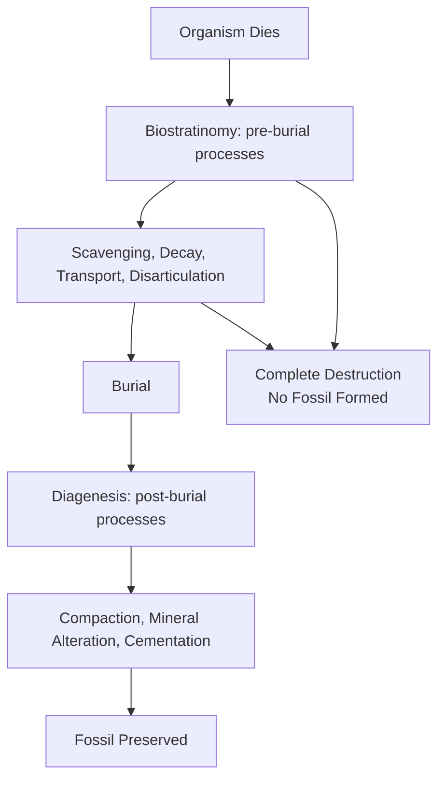

## Fossilization Processes

### Overview

Fossilization (taphonomy in its broadest sense) refers to the set of physical, chemical, and biological processes by which the remains or traces of once-living organisms are preserved in the geologic record. Because most organic material decays or is destroyed shortly after death, fossilization is inherently a rare and selective process, and understanding its mechanisms is essential for correctly interpreting the completeness and biases of the fossil record.

**Key Points**

- The scientific study of the processes affecting organisms from death to discovery is called **taphonomy** (from Greek *taphos*, "burial," and *nomos*, "law")
- Fossilization requires, at minimum, some combination of rapid burial, protection from decay/scavenging/mechanical destruction, and subsequent chemical stabilization
- Only a small fraction of organisms that ever lived are preserved as fossils, and preservation is strongly biased toward organisms with hard parts, high abundance, and burial in low-energy, low-oxygen, or rapidly aggrading environments

---

### The Taphonomic Pathway

**Key Points**

- **Biostratinomy**: the study of processes acting on remains between death and final burial (scavenging, transport, weathering, disarticulation)
- **Diagenesis** (in a taphonomic context): the study of physical and chemical changes occurring after burial (compaction, dissolution, mineral replacement, cementation)
- The vast majority of organisms are destroyed before or during this pathway; fossilization represents the exception, not the rule

---

### Conditions Favoring Preservation

**Key Points**

- **Rapid burial**: minimizes exposure time to scavengers, oxygen, and mechanical disturbance (e.g., volcanic ash falls, storm deposits, turbidity currents, rapid sediment influx from floods)
- **Low-oxygen (anoxic/dysoxic) environments**: slow the activity of decomposer organisms and scavengers, favoring soft-tissue preservation (e.g., stagnant lake bottoms, restricted marine basins)
- **Presence of hard parts**: shells, bones, teeth, and exoskeletons composed of mineralized tissue (calcium carbonate, calcium phosphate, silica, chitin with mineral reinforcement) resist decay far better than soft tissue
- **Fine-grained sediment**: mud and silt preserve fine anatomical detail better than coarse sediment, which can abrade or destroy delicate structures
- **Chemical conditions favoring early mineral precipitation**: certain pore-water chemistries promote rapid formation of stabilizing minerals (e.g., pyrite, phosphate, or carbonate cements) around a carcass before soft tissues fully decay

---

### Major Modes of Fossilization

#### Permineralization

- Groundwater carrying dissolved minerals (commonly silica, calcite, or pyrite) infiltrates the pore spaces of a hard part (bone, wood, shell), and minerals precipitate within those spaces
- The original hard material may be partially or wholly retained, with mineral filling the pores, or may be progressively replaced
- Classic example: petrified wood, where silica infills and often eventually replaces cellular structure, preserving fine anatomical detail

#### Replacement (Mineral Substitution)

- The original hard part is dissolved and simultaneously or subsequently replaced by a different mineral, sometimes preserving fine structural detail (**pseudomorphic replacement**) if replacement occurs slowly and incrementally
- Common replacement minerals: pyrite ("fool's gold" fossils), silica, calcite, hematite
- Distinguished from permineralization in that the original material is removed, not merely infilled

#### Carbonization (Coalification)

- Volatile components (hydrogen, oxygen, nitrogen) are driven off from organic tissue under heat and pressure over time, leaving a thin residual film of carbon that outlines the original organism
- Particularly common for preserving delicate structures such as leaves, soft-bodied organisms, feathers, and some graptolites
- Represents an early stage of the same process that, taken further under greater heat/pressure, produces coal from plant material

#### Molds and Casts

- A **mold** forms when an organism's hard part dissolves after burial, leaving a cavity (a negative impression) in the surrounding sediment/rock that preserves the external (or internal) shape
- An **external mold** preserves the outer surface shape; an **internal mold** (also called a "steinkern") preserves the shape of an internal cavity (e.g., the inside of a shell)
- A **cast** forms when that mold cavity is subsequently infilled by new sediment or mineral precipitate, reproducing the original three-dimensional shape (but not the original internal microstructure or composition)

#### Authigenic Mineralization (Concretions)

- Localized, rapid mineral precipitation (commonly siderite, calcite, or phosphate) around a decaying carcass, driven by chemical microenvironments created by decomposition, can form a concretion that encases and protects the fossil from later compaction and distortion
- Exceptional preservation of soft tissue is sometimes associated with rapid concretion formation (e.g., certain Carboniferous plant and arthropod fossils, some Cretaceous fish faunas)

#### Unaltered Preservation

- In rare cases, original organic material or original mineral composition (e.g., unaltered calcite or aragonite shell, or even original organic biomolecules) is preserved with little or no chemical alteration
- Most common in geologically young material (Pleistocene and younger) or in specific stabilizing environments (e.g., amber, permafrost, desiccation)

#### Amber Preservation

- Fossilized tree resin that has hardened and polymerized over geologic time, trapping and preserving small organisms (insects, arachnids, occasionally small vertebrates) with exceptional three-dimensional, often microscopic detail
- [Inference] Amber preservation is particularly valuable for studying otherwise poorly fossilized groups (soft-bodied arthropods, delicate insect wings) because the resin excludes oxygen and desiccates tissue rapidly, effectively halting decay before significant structural collapse occurs

#### Freezing (Permafrost Preservation)

- Organisms trapped and frozen in permafrost or glacial ice can retain soft tissue, hair, and even stomach contents with minimal decay, due to the combination of low temperature and often desiccation
- Notable examples include Pleistocene woolly mammoths recovered from Siberian permafrost
- Limited to geologically recent material given permafrost's limited long-term geological stability and the requirement of a continuously frozen environment

#### Desiccation (Mummification)

- Rapid drying in arid environments can preserve soft tissue by halting microbial decay through moisture removal
- Occurs naturally in some cave and desert depositional settings, in addition to well-documented anthropogenic (intentional) mummification practices

---

### Trace Fossils (Ichnofossils)

**Key Points**

- Trace fossils preserve evidence of an organism's *activity* rather than its physical body: burrows, trackways, borings, coprolites (fossilized feces), gastroliths (stomach stones), and root traces
- Trace fossils are classified using **ichnotaxonomy**, a parallel naming system to body fossil taxonomy, since a single trace-making behavior cannot always be linked to a specific producing species
- Highly valuable for paleoenvironmental interpretation: certain trace fossil assemblages (ichnofacies) are diagnostic of specific environmental conditions (e.g., substrate consistency, water energy, oxygenation, salinity)

---

### Lagerstätten: Exceptional Preservation Sites

A **Konservat-Lagerstätte** ("conservation deposit") is a fossil site exhibiting exceptional preservation, often including soft tissues, delicate structures, or complete articulated skeletons rarely preserved elsewhere.

**Notable Examples**

- **Burgess Shale** (Cambrian, Canada): exceptional soft-bodied preservation via rapid burial in fine mud under anoxic conditions, providing critical insight into the Cambrian Explosion
- **Solnhofen Limestone** (Jurassic, Germany): fine-grained lagoonal limestone preserving delicate structures including feathers (*Archaeopteryx*) due to still, hypersaline, low-oxygen lagoon conditions inhibiting scavengers
- **Mazon Creek** (Carboniferous, USA): siderite concretions preserving both marine and terrestrial soft-bodied organisms
- **Jehol Biota** (Cretaceous, China): volcanic ash-related preservation of feathered dinosaurs and early birds with exceptional soft-tissue detail

A **Konzentrat-Lagerstätte** ("concentration deposit"), by contrast, refers to a site with an unusually high density/abundance of fossils (typically hard parts) rather than exceptional soft-tissue preservation, such as bone beds formed by mass mortality events or hydraulic concentration.

---

### Diagram: Modes of Fossilization Compared

<svg xmlns="http://www.w3.org/2000/svg" viewBox="0 0 700 380" font-family="Arial, sans-serif">
<text x="350" y="24" font-size="16" font-weight="bold" text-anchor="middle">Comparing Fossilization Modes (svg_diagram)</text>
<rect x="40" y="60" width="150" height="80" rx="6" fill="#c9d6e3" stroke="#333" />
<text x="115" y="90" font-size="11" text-anchor="middle" font-weight="bold">Permineralization</text>
<text x="115" y="108" font-size="10" text-anchor="middle">mineral fills pores</text>
<text x="115" y="124" font-size="10" text-anchor="middle">of original structure</text>
<rect x="230" y="60" width="150" height="80" rx="6" fill="#e0b04d" stroke="#333" />
<text x="305" y="90" font-size="11" text-anchor="middle" font-weight="bold">Replacement</text>
<text x="305" y="108" font-size="10" text-anchor="middle">original dissolved,</text>
<text x="305" y="124" font-size="10" text-anchor="middle">new mineral substituted</text>
<rect x="420" y="60" width="130" height="80" rx="6" fill="#b0c9a3" stroke="#333" />
<text x="485" y="90" font-size="11" text-anchor="middle" font-weight="bold">Carbonization</text>
<text x="485" y="108" font-size="10" text-anchor="middle">volatiles removed,</text>
<text x="485" y="124" font-size="10" text-anchor="middle">carbon film remains</text>
<rect x="580" y="60" width="90" height="80" rx="6" fill="#d9a3c0" stroke="#333" />
<text x="625" y="90" font-size="11" text-anchor="middle" font-weight="bold">Mold/Cast</text>
<text x="625" y="108" font-size="10" text-anchor="middle">negative then</text>
<text x="625" y="124" font-size="10" text-anchor="middle">positive impression</text>
<rect x="140" y="200" width="150" height="80" rx="6" fill="#a3c9d9" stroke="#333" />
<text x="215" y="230" font-size="11" text-anchor="middle" font-weight="bold">Amber</text>
<text x="215" y="248" font-size="10" text-anchor="middle">resin encasement,</text>
<text x="215" y="264" font-size="10" text-anchor="middle">near-original detail</text>
<rect x="330" y="200" width="150" height="80" rx="6" fill="#c3b0d9" stroke="#333" />
<text x="405" y="230" font-size="11" text-anchor="middle" font-weight="bold">Freezing/Desiccation</text>
<text x="405" y="248" font-size="10" text-anchor="middle">soft tissue retained,</text>
<text x="405" y="264" font-size="10" text-anchor="middle">geologically young only</text>
</svg>

---

### Preservation Bias in the Fossil Record

**Key Points**

- **Compositional bias**: organisms with mineralized hard parts (shells, bones, teeth) are vastly overrepresented relative to soft-bodied organisms
- **Environmental bias**: depositional settings favoring rapid burial and low oxygen (marine basins, lakes, tar seeps, volcanic ash falls) are overrepresented relative to high-energy or well-oxygenated settings where decay and destruction dominate
- **Temporal bias**: older rocks have had more time to be destroyed by erosion, metamorphism, and tectonic recycling, so the fossil record is generally sparser and coarser in resolution further back in time
- **Size and abundance bias**: small, abundant, and durable organisms (e.g., marine microfossils) are more likely to be preserved and recovered in quantity than large, rare organisms
- [Inference] These combined biases mean the fossil record should be interpreted as a filtered sample of past life rather than a complete census, a consideration important when using fossil abundance or diversity data to infer past biological patterns such as extinction severity or evolutionary rates

---

### Worked Example: Interpreting a Preservation Mode

A fossil leaf is found as a thin, dark, carbon-rich film on a shale bedding surface, showing clear venation detail but no three-dimensional relief.

**Output**

This preservation is consistent with carbonization: the leaf's original volatile organic compounds have been driven off under burial heat and pressure, leaving a residual carbon film that retains the two-dimensional outline and venation pattern but not three-dimensional structure. The fine-grained shale host rock is consistent with a low-energy depositional setting (e.g., a lake or lagoon), which favored the leaf's rapid burial and helped prevent its destruction prior to preservation.

---

### Related Topics

- Taphonomy and biostratinomy in detail
- Trace fossils (ichnology) and ichnofacies
- Lagerstätten and exceptional preservation environments
- Biostratigraphy and the role of preservation bias in correlation
- Diagenesis of sedimentary rocks
- Fossil record completeness and the "Signor-Lipps effect"
- Paleoecology and reconstructing ancient environments
- The Burgess Shale and the Cambrian Explosion
- Amber inclusions and molecular preservation limits