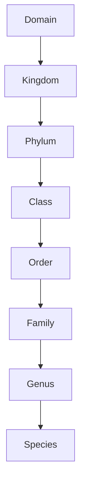

## Taxonomy and the Fossil Record

### Overview

Taxonomy is the science of classifying organisms into a hierarchical system of named groups based on shared characteristics and evolutionary relationships. Applied to paleontology, taxonomy provides the naming and classification framework used to organize fossil organisms, while also confronting unique challenges arising from incomplete preservation, time-averaging, and the fragmentary nature of the fossil record.

**Key Points**

- Modern taxonomy is grounded in **Linnaean classification** (a nested hierarchy of ranks) but is increasingly interpreted through the lens of **phylogenetics** (evolutionary relationships)
- Fossil taxonomy (paleotaxonomy) must work with incomplete specimens, often lacking soft tissue, behavior, or genetic information available for living organisms
- Naming and classification of fossils is governed by the same formal nomenclatural codes used for living organisms, primarily the International Code of Zoological Nomenclature (ICZN) for animals and the International Code of Nomenclature for algae, fungi, and plants (ICN)

---

### The Linnaean Hierarchy

**Key Points**

- Organisms are classified into a nested series of ranks, from broadest to most specific: Domain, Kingdom, Phylum, Class, Order, Family, Genus, Species
- Each rank groups together taxa sharing a more specific set of characteristics than the rank above it
- Species names follow **binomial nomenclature**: a two-part Latinized name consisting of genus (capitalized) and species epithet (lowercase), conventionally italicized (e.g., *Tyrannosaurus rex*)

---

### Species Concepts and Their Limitations in Paleontology

**Key Points**

- The **biological species concept** (organisms capable of interbreeding to produce fertile offspring) is the standard definition used for living organisms, but is generally inapplicable to fossils since reproductive behavior cannot be directly observed
- Paleontologists instead typically rely on a **morphological species concept**: grouping specimens based on shared, consistent, and diagnostic physical characteristics
- [Inference] Because morphological species definitions must infer biological boundaries indirectly from preserved hard-part variation, the same underlying biological species may sometimes be split into multiple named "morphospecies" (oversplitting), or conversely, genuinely distinct species with similar hard-part morphology may be incorrectly lumped together (oversimplification) — a persistent source of taxonomic uncertainty in paleontology
- Some paleontological groups additionally use a **chronospecies** concept, in which a continuously evolving lineage is arbitrarily divided into successive named species along a time series where morphology changes gradually (anagenesis) rather than through a branching speciation event

---

### Challenges Unique to Fossil Taxonomy

#### Incompleteness of Specimens

- Many fossils are represented only by fragmentary hard parts (isolated teeth, partial bones, disarticulated shells), complicating full morphological comparison
- Soft-tissue characters used in classifying living organisms (musculature, internal organs, coloration, behavior) are rarely preserved, forcing reliance primarily on hard-part morphology

#### Ontogenetic Variation

- Morphology often changes substantially as an organism grows (ontogeny), and juvenile fossils can be mistakenly classified as separate species from adults of the same species if growth-related variation is not recognized
- [Inference] This has historically led to taxonomic revisions in some well-studied fossil groups, where juvenile and adult forms originally described as separate genera or species were later recognized, through more complete growth-series data, as different growth stages of a single taxon

#### Sexual Dimorphism

- Morphological differences between males and females of the same species (e.g., size, ornamentation) can similarly be mistaken for separate species if a full population range is not sampled
- Ammonite macroconchs (larger) and microconchs (smaller), for example, have historically been debated as reflecting sexual dimorphism within single species rather than distinct taxa in various cases

#### Taphonomic Distortion

- Compaction, deformation, and diagenetic alteration can distort original shapes, potentially creating artificial morphological variation that does not reflect true biological differences
- Careful taphonomic assessment is required before taxonomically significant morphological differences are accepted as genuine

#### Time-Averaging

- Fossil assemblages often represent organisms that lived and died over an extended time interval (sometimes thousands of years) but are mixed together in a single bed due to slow net sedimentation, complicating fine-scale taxonomic and ecological interpretation of a single "snapshot" community

---

### Cladistics and Phylogenetic Classification

**Key Points**

- **Cladistics** classifies organisms based on shared derived characteristics (**synapomorphies**) that indicate common ancestry, producing branching diagrams called **cladograms**
- A **clade** (monophyletic group) includes a common ancestor and all of its descendants
- This contrasts with traditional Linnaean groupings, which sometimes include **paraphyletic** groups (a common ancestor and *some*, but not all, descendants) — a classic paleontological example is "Reptilia" in its traditional sense, which historically excluded birds despite birds having descended from within reptilian lineages
- Modern paleontological classification increasingly favors phylogenetic (cladistic) frameworks over strict Linnaean ranks, particularly in vertebrate paleontology, though Linnaean-style names are often still used informally alongside cladistic analysis

**Diagram: Monophyletic vs. Paraphyletic Groups (svg_diagram)**

<svg xmlns="http://www.w3.org/2000/svg" viewBox="0 0 640 320" font-family="Arial, sans-serif">
<text x="320" y="24" font-size="16" font-weight="bold" text-anchor="middle">Monophyletic vs. Paraphyletic Grouping (svg_diagram)</text>

<text x="160" y="55" font-size="12" font-weight="bold" text-anchor="middle">Monophyletic (valid clade)</text>

<line x1="160" y1="70" x2="90" y2="140" stroke="#333" />

<line x1="160" y1="70" x2="230" y2="140" stroke="#333" />

<line x1="90" y1="140" x2="60" y2="200" stroke="#333" />

<line x1="90" y1="140" x2="120" y2="200" stroke="#333" />

<line x1="230" y1="140" x2="200" y2="200" stroke="#333" />

<line x1="230" y1="140" x2="260" y2="200" stroke="#333" />

<rect x="40" y="65" width="240" height="145" fill="`#3b8a5c`" opacity="0.15" stroke="`#3b8a5c`" stroke-dasharray="4,2" />

<text x="160" y="225" font-size="10" text-anchor="middle">Includes ancestor + ALL descendants</text>

<text x="480" y="55" font-size="12" font-weight="bold" text-anchor="middle">Paraphyletic (excludes a subgroup)</text>

<line x1="480" y1="70" x2="410" y2="140" stroke="#333" />

<line x1="480" y1="70" x2="550" y2="140" stroke="#333" />

<line x1="410" y1="140" x2="380" y2="200" stroke="#333" />

<line x1="410" y1="140" x2="440" y2="200" stroke="#333" />

<line x1="550" y1="140" x2="520" y2="200" stroke="#333" />

<line x1="550" y1="140" x2="580" y2="200" stroke="#333" />

<rect x="360" y="65" width="130" height="145" fill="`#b0455a`" opacity="0.15" stroke="`#b0455a`" stroke-dasharray="4,2" />

<text x="480" y="225" font-size="10" text-anchor="middle">One descendant branch excluded</text>

</svg>

---

### The Fossil Record's Nomenclatural Practices

**Key Points**

- Fossil species are formally named following the same binomial nomenclature rules as living species, with a **holotype** specimen designated as the definitive reference for the species name
- **Form taxa** (parataxa) are sometimes used for fossils that cannot be confidently linked to a complete organism — for example, separate form-genus names historically applied to disarticulated plant parts (leaves, seeds, pollen, wood) that may belong to the same whole-plant species but cannot be definitively associated without direct physical connection
- **Ichnotaxa** (trace fossil names) are classified under a wholly separate nomenclatural system from body fossils, since a trace fossil's name refers to a behavior/morphology of the trace itself, not necessarily to a specific producing organism
- Revisions are common: as more complete specimens or refined analytical techniques (CT scanning, cladistic reanalysis) become available, taxa are frequently reclassified, synonymized (merged), or split

---

### Using Fossil Taxonomy in Biostratigraphy and Evolutionary Studies

**Key Points**

- Consistent, stable taxonomic identification underlies the reliability of biostratigraphic correlation (see Biostratigraphy), since index fossil zones depend on accurate recognition of taxon ranges
- Taxonomic diversity counts through geologic time (numbers of named genera or families per time interval) are widely used to study patterns of diversification and extinction, but such counts are sensitive to taxonomic practice (splitting vs. lumping) as well as genuine sampling and preservation biases
- [Speculation] Some researchers argue that apparent diversity spikes or troughs in the fossil record partly reflect changes in taxonomic practice or sampling intensity over the history of paleontological research (the "pull of the recent" and related sampling biases) rather than purely biological signal, an area of ongoing methodological discussion in macroevolutionary studies

---

### Worked Example: Resolving a Taxonomic Ambiguity

Two fossil specimens from the same rock unit show differing shell ornamentation: one is smooth, the other strongly ribbed. Initially described as two separate species.

**Output**

Before accepting two separate species, a paleontologist would examine whether the difference could instead reflect ontogenetic variation (e.g., ribbing developing only in later growth stages), sexual dimorphism (if a large sample shows a consistent bimodal size/ornamentation pattern rather than a continuum), or taphonomic distortion (if ribbing could result from compaction). Only if the morphological difference persists as a statistically distinct, consistent pattern across a representative sample, unexplained by growth stage or preservation, would the two forms be considered valid separate species.

---

### Related Topics

- Biostratigraphy
- Fossilization Processes
- Evolutionary theory and speciation mechanisms
- Cladistics and phylogenetic systematics
- Mass extinction events and diversity/extinction curves
- Paleoecology and community reconstruction
- Ichnology and trace fossil classification
- The history of paleontological nomenclature (ICZN, ICN)
- Macroevolution and the "pull of the recent" sampling bias