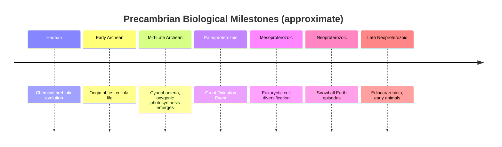

## Origin of Life and Precambrian Biota

### Overview

The origin of life and the nature of Precambrian biota encompass the earliest chapters of Earth's biological history, spanning roughly the first four billion years of the planet's existence — from the prebiotic chemical conditions on the early Earth, through the emergence of the first cells, to the diversification of complex multicellular organisms just prior to the Cambrian Explosion. This interval is characterized by sparse, often difficult-to-interpret fossil and geochemical evidence, requiring integration of biochemistry, geochemistry, and paleontology.

**Key Points**

- Life's origin (**abiogenesis**) remains an active area of scientific research without full experimental or observational consensus on the exact pathway
- Direct fossil evidence of the earliest life is limited to microscopic and biogeochemical traces, given the near-total absence of hard parts in early organisms
- The Precambrian encompasses the Hadean, Archean, and Proterozoic eons, representing approximately 88% of Earth's history

---

### Prebiotic Chemistry and the Origin of Life

**Key Points**

- Life is generally believed to have originated through a stepwise chemical process converting simple inorganic and organic precursor molecules into self-replicating, membrane-bound systems capable of metabolism and heredity
- Key hypothesized stages include: formation of simple organic monomers (amino acids, nucleotides, lipids), polymerization into more complex molecules (proteins, nucleic acids), development of self-replicating systems, and enclosure within a lipid membrane (protocell formation)
- [Speculation] Several competing (not mutually exclusive) hypotheses exist for the specific environmental setting of abiogenesis, including hydrothermal vents (providing chemical energy gradients and catalytic mineral surfaces), shallow tidal pools subject to wet-dry cycling (promoting polymerization), and extraterrestrial delivery of organic precursor molecules via meteorites/comets; this remains an actively researched and unresolved area of origin-of-life science rather than a settled conclusion

#### The RNA World Hypothesis

- Proposes that RNA molecules, capable of both storing genetic information and catalyzing chemical reactions (as ribozymes), may have preceded DNA and proteins as the primary basis of early self-replicating life
- Supported by the discovery of naturally occurring catalytic RNA molecules (ribozymes) in modern cells, and by RNA's dual information-storage/catalytic capacity
- [Speculation] While influential, the RNA World hypothesis faces open questions regarding the plausible prebiotic synthesis and stability of RNA under early Earth conditions, and remains one of several actively debated models rather than a fully confirmed mechanism

#### Miller-Urey Type Experiments

- Laboratory experiments (originally conducted in 1953) demonstrated that simple organic molecules, including amino acids, could form spontaneously from inorganic precursors (methane, ammonia, hydrogen, water) under simulated early-Earth conditions with an energy source (electrical discharge simulating lightning)
- [Unverified] The original experimental atmosphere composition assumed (a strongly reducing methane-ammonia-hydrogen mixture) has since been debated by geochemists, who argue the early atmosphere may have been more chemically neutral; subsequent experiments using more plausible atmospheric compositions have still produced organic monomers, though the efficiency and pathway details remain subjects of ongoing research

---

### Earliest Evidence of Life

**Key Points**

- **Chemical/isotopic biosignatures**: carbon isotope ratios ($\delta^{13}\text{C}$) in some of the oldest preserved carbon-bearing rocks (approaching 3.7–3.8 Ga) show patterns consistent with biological carbon fixation, though such isotopic evidence alone is debated as potentially producible by some abiotic processes as well, requiring cautious interpretation
- **Microfossils**: putative cellular microfossils have been reported from some of the oldest sedimentary rocks, though the biogenicity of the very oldest claimed examples remains debated in the scientific literature due to the difficulty of distinguishing genuine biological microstructures from abiotic mineral artifacts of similar size and shape
- **Stromatolites**: laminated sedimentary structures formed by the trapping, binding, and sometimes precipitation of sediment by microbial mats (dominated by cyanobacteria in later, better-understood examples), among the most widely accepted lines of evidence for early life due to their distinctive macroscopic morphology
- [Unverified] The exact age of the oldest confidently biogenic fossil evidence is subject to ongoing scientific debate and periodic revision as new discoveries and re-analyses are published, so specific "oldest fossil" age claims should be treated as provisional rather than fixed

---

### The Archean Biosphere

**Key Points**

- Archean life was exclusively microbial (prokaryotic), dominated by bacteria and (later in the eon) archaea
- Early ecosystems were likely anaerobic (oxygen-independent), given the near-absence of free atmospheric oxygen through most of the Archean
- **Cyanobacteria**, capable of oxygenic photosynthesis, are believed to have evolved during the Archean, setting the stage for the subsequent oxygenation of the atmosphere
- Stromatolites become increasingly common and well-documented in the fossil record through the later Archean and into the Proterozoic

---

### The Great Oxidation Event (GOE)

**Key Points**

- A major geochemical transition, generally placed within the Paleoproterozoic (roughly 2.4–2.0 Ga), during which atmospheric oxygen rose significantly from very low Archean levels due to the cumulative effect of oxygenic photosynthesis by cyanobacteria
- Evidence includes the disappearance of certain oxygen-sensitive sedimentary features (e.g., detrital pyrite and uraninite grains, which are unstable in oxygenated conditions) and the widespread appearance of **banded iron formations (BIFs)** and later continental **red beds** (oxidized iron-bearing sediments)
- [Inference] The delay between the evolutionary origin of oxygenic photosynthesis (likely earlier in the Archean) and the actual atmospheric oxygen rise recorded by the GOE is generally attributed to buffering by oxygen-consuming geochemical sinks (e.g., reaction with dissolved iron in the oceans, precipitating as banded iron formations) that had to be substantially depleted before free oxygen could accumulate in the atmosphere
- The GOE had major biological consequences, including likely mass extinction of anaerobic organisms intolerant of oxygen (sometimes informally termed the "oxygen catastrophe") and the eventual enabling of aerobic respiration, a far more energy-efficient metabolic pathway than anaerobic alternatives

[Unverified] Because this is rendered as unformatted plaintext rather than an active diagram, treat it as a schematic sequence summary only; the specific timeline package syntax shown is illustrative and not executed.

---

### Origin and Diversification of Eukaryotes

**Key Points**

- Eukaryotic cells (possessing a membrane-bound nucleus and organelles) are generally understood to have arisen from prokaryotic ancestors, with mitochondria and chloroplasts widely accepted as having originated via **endosymbiosis** — the incorporation of formerly free-living bacteria (an alphaproteobacterium ancestor for mitochondria, a cyanobacterium ancestor for chloroplasts) into a host cell
- The endosymbiotic theory is supported by multiple independent lines of evidence, including the presence of separate mitochondrial and chloroplast DNA, double membranes surrounding these organelles, and their bacterium-like ribosomes
- Fossil and biomarker evidence (e.g., certain steroid biomarkers interpreted as eukaryotic in origin) suggest eukaryotes had emerged by the Mesoproterozoic, though [Unverified] precise dating of the earliest eukaryotic lineages continues to be refined as molecular clock estimates and fossil biomarker interpretations are cross-checked and sometimes revised

---

### Neoproterozoic "Snowball Earth" Episodes

**Key Points**

- Geological evidence (glacial deposits found at low paleolatitudes, based on paleomagnetic data) suggests one or more episodes of extreme, possibly near-global glaciation during the Neoproterozoic (roughly 720–635 Ma), informally termed "Snowball Earth" events
- The **Snowball Earth hypothesis** proposes that ice cover extended to or near the equator, though a competing "Slushball Earth" variant proposes a more limited, non-total ice extent; the precise extent and severity remain subjects of ongoing scientific debate
- [Speculation] Some researchers hypothesize that the extreme environmental stress and subsequent post-glacial recovery associated with Snowball Earth episodes may have acted as an evolutionary trigger contributing to subsequent Ediacaran biological diversification, though establishing a direct causal mechanism remains an area of active research rather than an established consensus

---

### The Ediacaran Biota

**Key Points**

- Named for the Ediacara Hills in South Australia, where such fossils were first described in detail, the **Ediacaran biota** comprises a distinctive assemblage of soft-bodied, mostly immobile organisms found in late Neoproterozoic rocks (Ediacaran Period, roughly 635–541 Ma)
- Morphologies include frond-like, quilted, discoidal, and segmented body plans, many of which do not map cleanly onto modern animal phyla, leading to ongoing debate about their biological affinities
- Some Ediacaran taxa are interpreted as early animals (metazoans), some as members of now-extinct higher-level groups with no clear modern relatives, and some possibly represent non-animal lineages (e.g., certain forms proposed as giant protists or microbial colony structures) — [Unverified] the precise taxonomic and phylogenetic placement of many individual Ediacaran taxa remains genuinely unresolved and actively debated in current paleontological literature
- The Ediacaran biota largely (though [Inference] not necessarily completely, given some possible survivor lineages) disappears from the fossil record at or near the Ediacaran-Cambrian boundary, coincident with the onset of the Cambrian Explosion

---

### Diagram: Precambrian Biological Timeline

<svg xmlns="http://www.w3.org/2000/svg" viewBox="0 0 700 320" font-family="Arial, sans-serif">
<text x="350" y="24" font-size="16" font-weight="bold" text-anchor="middle">Precambrian Biological Milestones (svg_diagram)</text>
<line x1="60" y1="280" x2="660" y2="280" stroke="#333" stroke-width="2" />
<text x="60" y="300" font-size="10" text-anchor="middle">~4.0 Ga</text>
<text x="660" y="300" font-size="10" text-anchor="middle">541 Ma</text>
<text x="360" y="315" font-size="11" text-anchor="middle">(not to linear scale)</text>
<circle cx="110" cy="280" r="6" fill="#3b8a5c" />
<text x="110" y="255" font-size="10" text-anchor="middle">First cellular life</text>
<circle cx="250" cy="280" r="6" fill="#e0b04d" />
<text x="250" y="230" font-size="10" text-anchor="middle">Cyanobacteria /</text>
<text x="250" y="245" font-size="10" text-anchor="middle">oxygenic photosynthesis</text>
<circle cx="360" cy="280" r="6" fill="#2c6fbb" />
<text x="360" y="255" font-size="10" text-anchor="middle">Great Oxidation Event</text>
<circle cx="460" cy="280" r="6" fill="#7a4fb5" />
<text x="460" y="230" font-size="10" text-anchor="middle">Eukaryotic cell</text>
<text x="460" y="245" font-size="10" text-anchor="middle">diversification</text>
<circle cx="560" cy="280" r="6" fill="#a3c9d9" />
<text x="560" y="255" font-size="10" text-anchor="middle">Snowball Earth episodes</text>
<circle cx="630" cy="280" r="6" fill="#b0455a" />
<text x="630" y="230" font-size="10" text-anchor="middle">Ediacaran biota</text>
</svg>

---

### Transition to the Cambrian

**Key Points**

- The Ediacaran-Cambrian transition marks the boundary between the Precambrian supereon and the Phanerozoic eon, formally defined by a GSSP based on the first appearance of the trace fossil *Treptichnus pedum*
- This transition sets the stage for the Cambrian Explosion, the rapid diversification of animal body plans and the appearance of most modern animal phyla in the fossil record within a geologically short interval

---

### Worked Example: Interpreting Ambiguous Precambrian Evidence

A Precambrian rock sample contains disc-shaped structures with faint concentric ridges, interpreted by some researchers as body fossils of an early animal and by others as inorganic sedimentary structures (e.g., gas escape or microbial mat features).

**Output**

Resolving such ambiguity typically requires multiple independent lines of evidence: consistent, non-random morphology across many specimens (arguing against random abiotic processes), association with other more confidently biological structures, geochemical or isotopic signatures consistent with biological activity, and comparison with well-documented Ediacaran body plans from other localities. In the absence of such converging evidence, the biogenicity of ambiguous Precambrian structures is appropriately treated as [Unverified] or debated pending further study, rather than assumed.

---

### Related Topics

- Fossilization Processes
- Taxonomy and the Fossil Record
- The Geologic Time Scale (Precambrian subdivisions)
- The Cambrian Explosion and early animal diversification
- Endosymbiotic theory and organelle evolution
- Stromatolites and microbial mat ecosystems
- Banded iron formations and Precambrian ocean chemistry
- Molecular clock methods in evolutionary biology
- Astrobiology and the search for extraterrestrial biosignatures