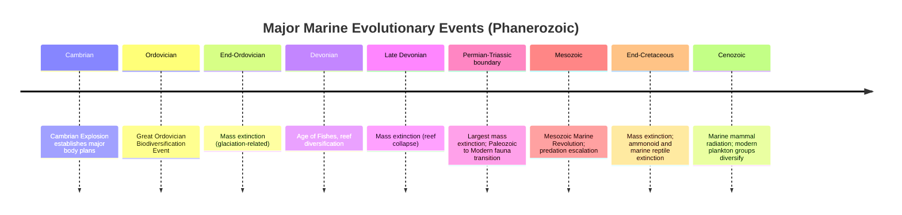

## Evolution of Marine Life

### Overview

The evolution of marine life traces the diversification, ecological restructuring, and major evolutionary transitions of ocean-dwelling organisms from the Cambrian Explosion through the Phanerozoic to the present. Marine environments have hosted the majority of animal evolutionary history, including several major radiations, mass extinctions, and ecological revolutions that reshaped ocean ecosystems repeatedly over hundreds of millions of years.

**Key Points**

- Marine invertebrates provide the backbone of the Phanerozoic fossil record due to their relatively high preservation potential (biomineralized hard parts) and abundance
- Major evolutionary patterns in marine life are typically studied through changes in taxonomic diversity, ecological guild structure, and body plan innovation through geologic time
- Marine evolutionary history is punctuated by major radiations (the Cambrian Explosion, the Great Ordovician Biodiversification Event) and major extinctions (End-Ordovician, Late Devonian, End-Permian, End-Triassic, End-Cretaceous)

---

### The Cambrian Foundation

**Key Points**

- Marine ecosystems established during the Cambrian Explosion (see The Cambrian Explosion) provided the initial framework of major animal body plans from which subsequent marine evolution proceeded
- Early Cambrian faunas were dominated by relatively simple ecological tiering (organisms largely confined to or near the sediment surface) and limited predation intensity relative to later periods

---

### The Great Ordovician Biodiversification Event (GOBE)

**Key Points**

- A major radiation of marine life occurring through the Ordovician Period (roughly 485–444 Ma), during which genus- and family-level diversity increased substantially beyond Cambrian levels, without the same degree of new body-plan (phylum-level) innovation seen in the Cambrian Explosion
- Characterized by diversification *within* established Cambrian body plans, increased ecological tiering (organisms occupying a wider range of vertical positions in and above the sediment, from deep burrowers to elevated suspension feeders), and increased provincialism (regional faunal differentiation)
- Groups that diversified prominently include brachiopods, bryozoans, corals (both tabulate and rugose), crinoids, and various mollusk groups, alongside continued diversification of trilobites and early vertebrates (jawless fish)
- [Inference] The GOBE is often interpreted as reflecting the establishment of more complex, multi-tiered ecological communities and food webs, contrasting with the comparatively simpler tiering of Cambrian ecosystems, though the precise combination of driving factors (climatic, tectonic, ecological) remains an area of ongoing research

---

### The End-Ordovician Mass Extinction

**Key Points**

- One of the "Big Five" mass extinctions, occurring near the Ordovician-Silurian boundary (~444 Ma), associated with rapid glaciation (lowering sea level and disrupting shallow marine habitats) followed by rapid warming and associated ocean chemistry changes
- Severely affected many groups that had radiated during the GOBE, including trilobites, brachiopods, and graptolites
- [Unverified] The precise relative contribution of glaciation-driven sea-level fall versus associated ocean anoxia/chemistry changes to the extinction's severity continues to be investigated and refined in the geochemical and paleontological literature

---

### Paleozoic Marine Ecosystem Evolution

**Key Points**

- Silurian and Devonian marine ecosystems saw continued diversification of reef-building organisms (corals, stromatoporoids), the radiation of jawed fish (placoderms, early chondrichthyans, early osteichthyans), and increasingly complex predator-prey interactions
- The Devonian Period is sometimes informally termed the "Age of Fishes" due to the substantial diversification of jawed vertebrate fish lineages during this interval
- The Late Devonian mass extinction (one of the "Big Five," occurring in pulses across the Frasnian-Famennian boundary and near the end of the Devonian) severely impacted reef ecosystems, contributing to a prolonged interval of reduced reef development
- Carboniferous and Permian marine faunas continued to diversify, with brachiopods, crinoids, ammonoids, and foraminifera (notably fusulinids, used extensively in Permian biostratigraphy) prominent among invertebrate groups

---

### The Permian-Triassic Mass Extinction and Its Marine Impact

**Key Points**

- The most severe mass extinction in Earth's history occurred at the Permian-Triassic boundary (~252 Ma), with estimates suggesting a very high proportion of marine species were eliminated
- Hypothesized primary drivers include massive volcanism (the Siberian Traps large igneous province), leading to rapid global warming, ocean acidification, and widespread ocean anoxia/euxinia (sulfidic conditions)
- Severely affected groups included trilobites (which went fully extinct at this boundary after already declining through the Paleozoic), rugose and tabulate corals (also going extinct), and many brachiopod and crinoid lineages
- Marked a fundamental ecological turnover, sometimes described as the transition from a "Paleozoic Evolutionary Fauna" (dominated by brachiopods, crinoids, and other Paleozoic-typical groups) to a "Modern Evolutionary Fauna" (increasingly dominated by mollusks, particularly bivalves and gastropods, along with echinoids and crustaceans) through the subsequent Mesozoic

---

### The Mesozoic Marine Revolution

**Key Points**

- Refers to a major ecological restructuring of marine benthic (bottom-dwelling) communities during the Mesozoic Era, driven substantially by escalating predation pressure from increasingly effective durophagous (shell-crushing) and drilling predators, including neoselachian sharks, teleost fish, and predatory gastropods
- Associated with adaptive responses among prey groups, including thicker or more strongly ornamented shells, increased burrowing depth and speed among infaunal bivalves, and increased motility in some groups previously more sessile (attached, non-mobile)
- Ammonoids underwent substantial diversification and repeated near-extinction/recovery cycles through the Triassic, Jurassic, and Cretaceous, making them valuable Mesozoic index fossils (see Biostratigraphy) despite their eventual complete extinction at the End-Cretaceous boundary
- Marine reptiles (ichthyosaurs, plesiosaurs, mosasaurs) represent major vertebrate radiations into fully marine (or near-fully marine) predatory niches during the Mesozoic, occupying ecological roles broadly analogous to some modern marine mammals despite being unrelated reptilian lineages

[Unverified] As with prior notes, this timeline is a schematic plaintext summary of relative sequence, not a rendered or precisely scaled diagram.

---

### The Cretaceous-Paleogene (K-Pg) Extinction and Marine Recovery

**Key Points**

- The K-Pg extinction (~66 Ma), widely attributed primarily to a large asteroid impact (with some researchers also emphasizing contemporaneous Deccan Traps volcanism as a contributing factor), caused catastrophic disruption of marine ecosystems, particularly severe among planktonic calcifying organisms (many planktonic foraminifera and calcareous nannoplankton) that formed the base of marine food webs
- Ammonoids and most marine reptile lineages (ichthyosaurs had already declined earlier in the Cretaceous; plesiosaurs and mosasaurs went extinct at the boundary) did not survive into the Cenozoic
- Post-extinction marine recovery through the early Paleogene saw renewed diversification of surviving lineages and the eventual rise of new dominant groups, including modern teleost fish radiations and, somewhat later, cetaceans (whales) as a major marine mammal radiation

---

### Cenozoic Marine Evolution

**Key Points**

- The Cenozoic Era saw the evolutionary radiation of cetaceans from terrestrial artiodactyl ancestors into fully aquatic marine mammals, a well-documented transitional sequence supported by both fossil intermediates and molecular phylogenetic evidence
- Modern coral reef ecosystems, dominated by scleractinian (stony) corals, continued to diversify and reorganize through the Cenozoic, with reef distribution and composition responding to changing ocean temperatures and chemistry
- Planktonic marine groups (diatoms, coccolithophores, planktonic foraminifera, radiolarians) diversified substantially through the Cenozoic, becoming increasingly important both ecologically (marine primary productivity, carbon cycling) and as biostratigraphic tools (see Biostratigraphy)
- [Inference] The Cenozoic marine fossil record, being both younger and often better preserved than older Phanerozoic intervals, allows unusually fine-resolution study of evolutionary and ecological patterns, including detailed climate-diversity relationships tied to Cenozoic cooling trends

---

### Diagram: Paleozoic vs. Modern Evolutionary Fauna

<svg xmlns="http://www.w3.org/2000/svg" viewBox="0 0 680 320" font-family="Arial, sans-serif">
<text x="340" y="24" font-size="16" font-weight="bold" text-anchor="middle">Shift from Paleozoic to Modern Evolutionary Fauna (svg_diagram)</text>
<rect x="60" y="60" width="260" height="200" rx="6" fill="#c9d6e3" stroke="#333" />
<text x="190" y="85" font-size="13" text-anchor="middle" font-weight="bold">Paleozoic Fauna</text>
<text x="190" y="115" font-size="11" text-anchor="middle">Brachiopods</text>
<text x="190" y="140" font-size="11" text-anchor="middle">Crinoids</text>
<text x="190" y="165" font-size="11" text-anchor="middle">Trilobites</text>
<text x="190" y="190" font-size="11" text-anchor="middle">Rugose/Tabulate Corals</text>
<text x="190" y="215" font-size="11" text-anchor="middle">Cephalopods (early forms)</text>
<text x="190" y="240" font-size="10" text-anchor="middle" font-style="italic">(Cambrian-Permian dominance)</text>
<line x1="320" y1="160" x2="380" y2="160" stroke="#333" stroke-width="2" marker-end="url(#arrow)" />
<text x="350" y="145" font-size="9" text-anchor="middle">P-T Extinction</text>
<rect x="380" y="60" width="260" height="200" rx="6" fill="#e0b04d" stroke="#333" />
<text x="510" y="85" font-size="13" text-anchor="middle" font-weight="bold">Modern Fauna</text>
<text x="510" y="115" font-size="11" text-anchor="middle">Bivalves</text>
<text x="510" y="140" font-size="11" text-anchor="middle">Gastropods</text>
<text x="510" y="165" font-size="11" text-anchor="middle">Echinoids</text>
<text x="510" y="190" font-size="11" text-anchor="middle">Crustaceans</text>
<text x="510" y="215" font-size="11" text-anchor="middle">Scleractinian Corals</text>
<text x="510" y="240" font-size="10" text-anchor="middle" font-style="italic">(Mesozoic-Recent dominance)</text>
</svg>

---

### Methodological Approaches to Studying Marine Evolutionary History

**Key Points**

- **Diversity curves**: compiled from large fossil occurrence databases (e.g., the Paleobiology Database) tracking genus- or family-level richness through time, though subject to sampling and preservation biases requiring statistical correction (see Taxonomy and the Fossil Record)
- **Ecological guild analysis**: classifying fossil taxa by feeding mode, mobility, and tiering to track changes in ecosystem structure independent of raw taxonomic counts
- **Functional morphology and biomechanics**: inferring feeding, locomotion, and defensive capabilities from fossilized hard-part morphology, often calibrated against modern analogs
- **Stable isotope geochemistry**: oxygen and carbon isotopes from marine fossil shells provide independent proxies for past ocean temperature and carbon cycle perturbations, supporting interpretation of evolutionary and extinction patterns

---

### Worked Example: Interpreting a Faunal Turnover

A stratigraphic sequence shows Permian-aged limestone rich in brachiopods, crinoids, and fusulinid foraminifera, sharply overlain by a thin clay layer, above which Triassic-aged limestone contains a markedly different, less diverse fauna dominated by a few bivalve and gastropod taxa.

**Output**

This succession is consistent with the Permian-Triassic mass extinction boundary: the underlying limestone represents a typical Paleozoic Evolutionary Fauna assemblage, the thin clay layer likely represents a condensed interval associated with the extinction event and its immediate aftermath (commonly showing geochemical anomalies in well-studied sections), and the overlying reduced-diversity Triassic fauna reflects the depleted, slowly recovering "disaster fauna" characteristic of the immediate post-extinction interval, dominated by a small number of opportunistic, stress-tolerant taxa before fuller Mesozoic recovery and diversification.

---

### Related Topics

- The Cambrian Explosion
- Taxonomy and the Fossil Record
- Fossilization Processes
- Biostratigraphy
- Mass extinction events (End-Ordovician, Late Devonian, End-Permian, End-Triassic, End-Cretaceous)
- The Mesozoic Marine Revolution and predator-prey coevolution
- Cetacean evolution and marine mammal radiations
- Paleoceanography and ocean chemistry through the Phanerozoic
- The Paleobiology Database and quantitative paleontological methods