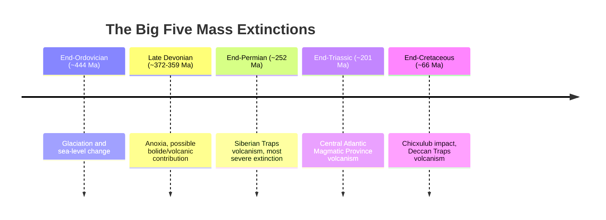

## Mass Extinction Events

### Overview

Mass extinction events are geologically brief intervals during which a substantial proportion of Earth's species go extinct across diverse, often unrelated taxonomic groups, significantly exceeding typical ("background") extinction rates. These events represent major turning points in the history of life, eliminating previously dominant lineages and creating ecological opportunities exploited by surviving and subsequently radiating groups.

**Key Points**

- Five events are conventionally recognized as the "Big Five" mass extinctions of the Phanerozoic: End-Ordovician, Late Devonian, End-Permian, End-Triassic, and End-Cretaceous
- Mass extinctions are typically identified and quantified using fossil occurrence data compiled across large taxonomic and geographic scales, most notably through global fossil databases
- Causal mechanisms vary between events and are often debated, but recurring themes include rapid climate change, volcanism, bolide impacts, sea-level change, and ocean chemistry disruption (anoxia, acidification, euxinia)

---

### Defining and Quantifying Mass Extinctions

**Key Points**

- A mass extinction is generally distinguished from normal "background" extinction by its magnitude (a large percentage of species/genera/families lost), its breadth (affecting multiple, ecologically and taxonomically unrelated groups simultaneously), and its rapidity (occurring within a geologically short interval, though "short" can still span hundreds of thousands to a few million years)
- Quantification typically relies on measuring extinction rates (proportion of taxa lost) at a chosen taxonomic level (species, genus, family) across a defined stratigraphic interval, most comprehensively using compiled global fossil occurrence databases (e.g., the Paleobiology Database)
- [Inference] Because different taxonomic groups have differing typical preservation potential and background extinction/origination rates, care must be taken when comparing extinction severity between different fossil groups or time intervals, since apparent severity differences can partly reflect preservation and sampling biases rather than purely biological signal (see Taxonomy and the Fossil Record)

---

### The "Big Five" Mass Extinctions

[Unverified] As a plaintext schematic summary rather than a rendered timeline, exact numerical ages shown reflect commonly cited approximate figures that may be refined by subsequent radiometric recalibration.

---

#### End-Ordovician Mass Extinction (~444 Ma)

**Key Points**

- Occurred in two closely spaced pulses near the Ordovician-Silurian boundary, associated with rapid onset of glaciation (lowering sea level, disrupting shallow marine shelf habitats) followed by rapid deglaciation and associated ocean chemistry changes
- Severely affected trilobites, brachiopods, graptolites, and many other marine invertebrate groups that had diversified during the Great Ordovician Biodiversification Event (see Evolution of Marine Life)
- [Unverified] The precise triggering mechanism for the glaciation itself (e.g., proposed links to tectonic weathering changes, volcanic CO2 drawdown, or other climatic drivers) remains an area of active geochemical and paleoclimatological research

#### Late Devonian Mass Extinction (~372–359 Ma)

**Key Points**

- Occurred in multiple pulses, most notably near the Frasnian-Famennian boundary, extending toward the end of the Devonian
- Disproportionately affected marine reef ecosystems, contributing to a prolonged subsequent interval of reduced global reef development
- Hypothesized contributing factors include widespread ocean anoxia (potentially linked to increased nutrient runoff from newly established, deep-rooted land plant ecosystems altering weathering and nutrient delivery to oceans), global cooling episodes, and, in some proposed scenarios, bolide impacts, though [Speculation] the relative importance and causal interlinkage of these factors remains genuinely debated in the current literature rather than settled

#### End-Permian Mass Extinction (~252 Ma)

**Key Points**

- The most severe mass extinction documented in the Phanerozoic fossil record, with estimates suggesting a very high percentage of both marine and terrestrial species were eliminated
- Primary hypothesized driver: massive volcanism associated with the **Siberian Traps** large igneous province, releasing enormous volumes of CO2 and other volcanic gases, triggering rapid global warming, ocean acidification, and widespread ocean anoxia/euxinia (sulfidic, hydrogen-sulfide-rich conditions toxic to most marine life)
- [Inference] Some researchers have proposed that thermal metamorphism of organic-rich and evaporite sediments intruded by Siberian Traps magma may have released additional greenhouse gases (methane, additional CO2) beyond direct volcanic outgassing, potentially amplifying the climatic and environmental disruption, though quantifying this contribution precisely remains an active area of geochemical modeling research
- Marked the transition from the Paleozoic Evolutionary Fauna to the Modern Evolutionary Fauna in marine ecosystems (see Evolution of Marine Life), and caused major terrestrial ecosystem disruption as well, including significant impacts on synapsid and other terrestrial vertebrate lineages

#### End-Triassic Mass Extinction (~201 Ma)

**Key Points**

- Associated with massive volcanism from the **Central Atlantic Magmatic Province (CAMP)**, linked to the initial rifting of Pangaea and the opening of the early Atlantic Ocean
- Contributed to significant marine invertebrate losses (including many ammonoid and conodont lineages) and terrestrial vertebrate turnover
- [Inference] The extinction is generally considered to have created significant ecological opportunity subsequently exploited by dinosaurs, which became the dominant large terrestrial vertebrates through the following Jurassic Period, though the precise causal relationship between the extinction event and dinosaur ecological dominance (versus dinosaurs already being competitively advantaged beforehand) continues to be discussed in the paleontological literature

#### End-Cretaceous (K-Pg) Mass Extinction (~66 Ma)

**Key Points**

- Widely attributed primarily to the impact of a large asteroid or comet, based substantially on the discovery of the **Chicxulub impact crater** (Yucatán Peninsula, Mexico) and a globally distributed iridium-enriched clay layer marking the boundary, along with shocked quartz grains and other impact-diagnostic features
- Contemporaneous **Deccan Traps** volcanism (India) is also frequently discussed as a potentially contributing or compounding factor, with ongoing scientific discussion regarding the relative timing and contribution of volcanism versus impact to the overall extinction severity
- Eliminated non-avian dinosaurs, pterosaurs, most marine reptiles (plesiosaurs, mosasaurs), ammonoids, and a large proportion of marine calcifying plankton, while birds (as surviving theropod descendants), mammals, and various other lineages survived and subsequently diversified extensively through the Cenozoic

---

### Diagram: Mass Extinction Severity Comparison (Schematic)

<svg xmlns="http://www.w3.org/2000/svg" viewBox="0 0 700 340" font-family="Arial, sans-serif">
<text x="350" y="24" font-size="16" font-weight="bold" text-anchor="middle">Relative Severity of the Big Five (schematic) (svg_diagram)</text>
<line x1="80" y1="300" x2="650" y2="300" stroke="#333" stroke-width="1.5" />
<line x1="80" y1="60" x2="80" y2="300" stroke="#333" stroke-width="1.5" />
<text x="45" y="180" font-size="11" text-anchor="middle" transform="rotate(-90 45 180)">Approx. genus-level loss</text>
<rect x="110" y="180" width="70" height="120" fill="#c9d6e3" stroke="#333" />
<text x="145" y="320" font-size="10" text-anchor="middle">End-Ord.</text>
<rect x="220" y="200" width="70" height="100" fill="#e0b04d" stroke="#333" />
<text x="255" y="320" font-size="10" text-anchor="middle">Late Dev.</text>
<rect x="330" y="80" width="70" height="220" fill="#b0455a" stroke="#333" />
<text x="365" y="320" font-size="10" text-anchor="middle">End-Perm.</text>
<rect x="440" y="190" width="70" height="110" fill="#a3c9d9" stroke="#333" />
<text x="475" y="320" font-size="10" text-anchor="middle">End-Tri.</text>
<rect x="550" y="175" width="70" height="125" fill="#7a4fb5" stroke="#333" />
<text x="585" y="320" font-size="10" text-anchor="middle">End-Cret.</text>

<text x="365" y="70" font-size="9" text-anchor="middle" fill="`#b0455a`">most severe</text>

</svg>

[Unverified] Bar heights above are schematic illustrations of the generally accepted relative ranking (End-Permian as most severe) rather than precise quantitative values, since exact percentage-loss estimates vary between studies and taxonomic groups analyzed.

---

### Recurring Causal Mechanisms Across Events

**Key Points**

- **Large Igneous Province (LIP) volcanism**: recurs as a hypothesized primary or contributing driver in several major extinctions (End-Permian: Siberian Traps; End-Triassic: CAMP), through mechanisms including rapid greenhouse gas release, global warming, ocean acidification, and disruption of ocean oxygenation
- **Bolide impacts**: definitively linked to the End-Cretaceous extinction via the Chicxulub crater and associated global impact signature; proposed but less conclusively established for some other extinction intervals
- **Ocean anoxia/euxinia**: a recurring theme in marine extinction severity, disrupting marine food webs and directly poisoning many marine organisms in the case of euxinic (hydrogen sulfide-rich) conditions
- **Rapid climate change (either direction)**: both rapid cooling/glaciation (End-Ordovician) and rapid warming (End-Permian, likely contributing to End-Triassic and End-Cretaceous) are implicated, suggesting the *rate* of climate change, exceeding many organisms' capacity to adapt or migrate, may be as significant as the ultimate direction of change
- **Sea-level change**: disrupts shallow marine habitats disproportionately represented in the fossil record, contributing to both the observed severity and potentially to some degree of apparent (partly preservation-driven) severity in the fossil record

---

### Post-Extinction Recovery Dynamics

**Key Points**

- Mass extinctions are typically followed by a **"disaster fauna"** interval: a period of low diversity dominated by a small number of opportunistic, often geographically widespread and ecologically generalist taxa, before fuller ecological and taxonomic recovery
- Recovery intervals can extend over several million years, with the pace and pattern of recovery varying substantially between events and taxonomic groups
- Mass extinctions frequently enable subsequent adaptive radiations by eliminating previously dominant, ecologically entrenched lineages and freeing ecological niche space (e.g., mammalian radiation following the K-Pg extinction, dinosaur ecological dominance following the End-Triassic extinction)
- [Inference] This pattern has led some researchers to characterize mass extinctions as playing a significant, sometimes underappreciated role in shaping the subsequent large-scale trajectory of evolutionary history, since the specific lineages that survive a given extinction event (which may reflect substantial elements of chance in addition to any adaptive advantage) can profoundly influence which evolutionary pathways remain available afterward

---

### The "Big Five Plus" Concept and Smaller Extinction Events

**Key Points**

- Beyond the conventionally recognized "Big Five," the fossil record contains numerous smaller-magnitude extinction events (sometimes termed "second-tier" extinctions) that, while less severe, still represent significant departures from typical background extinction rates
- Examples discussed in the literature include various Ordovician, Silurian, and Devonian pulses beyond the primary Late Devonian event, several Jurassic and Cretaceous-aged perturbations, and various Cenozoic climate-related extinction/turnover events
- [Unverified] The precise boundary between a "significant second-tier extinction event" and simply elevated background extinction during a period of environmental stress is not always sharply defined in the literature, and classification of specific intervals can vary between researchers and studies

---

### Ongoing Debate: The "Sixth Extinction"

**Key Points**

- Some researchers and conservation biologists have proposed that current, human-driven biodiversity loss constitutes an ongoing "sixth mass extinction," based on documented and projected extinction rates substantially elevated above estimated background rates
- [Speculation] Whether current extinction rates and trajectories will ultimately reach a magnitude comparable to the geological "Big Five" is inherently a matter of future projection rather than settled retrospective fact, and this framing, while widely used in public and conservation science discourse, involves comparing an ongoing, still-unfolding process to the geological record's necessarily post-hoc, already-completed assessments of past events — a methodological distinction worth keeping in mind when evaluating such comparisons

---

### Worked Example: Diagnosing an Extinction Boundary in the Rock Record

A stratigraphic section shows a sharp faunal turnover: diverse marine invertebrate fauna abruptly replaced above a thin, geochemically anomalous clay layer containing elevated iridium concentrations and shocked quartz grains, above which a low-diversity fauna dominated by a few small, generalist taxa persists for a significant stratigraphic interval before diversity gradually increases.

**Output**

The iridium enrichment and shocked quartz are diagnostic impact-related signatures, strongly suggesting this boundary represents the K-Pg extinction event associated with a bolide impact. The abrupt faunal turnover is consistent with the extinction's rapid onset, and the overlying low-diversity, generalist-dominated fauna represents a typical post-extinction "disaster fauna" interval, with the subsequent gradual diversity increase reflecting the characteristic multi-million-year recovery trajectory documented following major mass extinction events.

---

### Related Topics

- Evolution of Marine Life
- Evolution of Terrestrial Life
- The Cambrian Explosion
- Taxonomy and the Fossil Record
- Fossilization Processes
- Biostratigraphy (extinction boundaries as correlation tools)
- Large Igneous Provinces and volcanism-driven climate change
- Impact craters and bolide impact evidence
- The Anthropocene and modern biodiversity loss debates