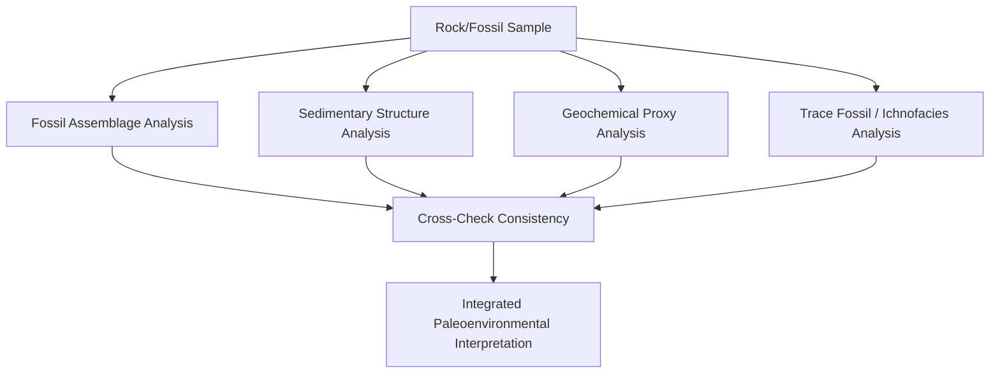

## Paleoecology and Paleoenvironmental Reconstruction

### Overview

Paleoecology is the study of the interactions between ancient organisms and their environments, and between organisms themselves, as reconstructed from the fossil and sedimentary record. Paleoenvironmental reconstruction is the closely related practice of inferring the physical, chemical, and climatic characteristics of ancient depositional settings using fossil, sedimentological, and geochemical evidence. Together, these fields transform static fossil and rock data into dynamic interpretations of past ecosystems, climates, and environmental change.

**Key Points**

- Paleoecology operates at multiple scales: autecology (the ecology of a single species/taxon), synecology (community-level interactions), and macroecology/paleobiogeography (large-scale spatial and evolutionary patterns)
- Reconstructions rely on multiple independent lines of evidence (fossil assemblages, sedimentary structures, geochemical proxies, trace fossils) that are cross-checked against one another for consistency
- Modern analogs (comparison with living ecosystems and organisms) are frequently used as interpretive frameworks, tempered by the recognition that ancient ecosystems may have no perfect modern equivalent

---

### Approaches to Paleoecological Reconstruction

#### Actualism and the Use of Modern Analogs

- **Actualism** (a refined, more nuanced form of classical uniformitarianism) holds that physical and biological processes observed in modern environments can inform interpretation of ancient ones, while explicitly allowing for changes in rate, intensity, or the existence of processes without modern equivalents
- Modern analog environments (e.g., comparing an ancient tidal flat deposit to a modern tidal flat) are used to interpret sedimentary structures, fossil taphonomy, and ecological relationships in ancient rocks
- [Inference] Because some ancient ecosystems (e.g., Ediacaran soft-bodied communities, certain Paleozoic reef ecosystems dominated by now-extinct organism groups) have no direct modern ecological equivalent, actualistic interpretation must sometimes be applied cautiously and combined with functional morphological reasoning rather than direct analogy

#### Functional Morphology

- Inferring an organism's likely ecological role (feeding mode, locomotion, habitat) from the functional interpretation of its preserved hard-part morphology, often informed by biomechanical principles and comparison with living organisms possessing analogous structures
- Example: shell shape, ornamentation, and musculature scars in fossil bivalves can indicate whether an organism was a burrower, an epifaunal (surface-dwelling) attached form, or a swimmer

#### Community (Assemblage) Analysis

- Reconstructing entire fossil communities by cataloging co-occurring taxa, their relative abundances, and their inferred ecological roles (feeding guild, tiering position, mobility)
- Used to infer community structure, diversity, and how communities changed through time or across environmental gradients within a single stratigraphic interval

---

### Key Fossil-Based Environmental Proxies

**Key Points**

- **Trace fossils (ichnofossils)**: specific trace fossil assemblages (ichnofacies) are associated with characteristic environmental conditions; for example, certain vertical burrow assemblages are associated with high-energy, well-oxygenated shoreface settings, while other trace assemblages indicate low-energy, deeper-water, or low-oxygen conditions
- **Benthic foraminifera assemblages**: composition and diversity of bottom-dwelling foraminifera are widely used to infer paleo-water depth, oxygenation, and salinity in marine sedimentary sequences
- **Coral and reef organism distribution**: since many reef-building organisms have relatively narrow modern temperature and light tolerances, their fossil distribution can constrain past sea-surface temperature and water clarity/depth
- **Plant fossil assemblages (paleobotany)**: leaf shape, size, and margin characteristics (e.g., the proportion of leaves with smooth vs. toothed margins) correlate with climate in modern floras and are used as **paleoclimate proxies** in fossil leaf assemblages (leaf margin analysis)
- **Pollen and spore assemblages (palynology)**: preserved pollen and spore composition in sediment cores allows reconstruction of past vegetation composition and, by extension, past climate, particularly valuable in Quaternary paleoecology

---

### Geochemical Paleoenvironmental Proxies

**Key Points**

- **Stable oxygen isotopes** ($\delta^{18}\text{O}$) in marine carbonate fossils (forams, mollusk shells) are widely used as a temperature and ice-volume proxy, since oxygen isotope fractionation during carbonate precipitation is temperature-dependent, and global ocean $\delta^{18}\text{O}$ composition shifts with continental ice sheet volume
- **Stable carbon isotopes** ($\delta^{13}\text{C}$) provide information on the carbon cycle, including productivity changes and major carbon cycle perturbation events (often associated with mass extinctions or rapid climate shifts)
- **Trace element ratios** in carbonate shells (e.g., Mg/Ca ratios) serve as additional independent temperature proxies, sometimes used in combination with oxygen isotopes to help separate temperature effects from ice-volume/salinity effects
- **Clumped isotope thermometry**: a more recently developed geochemical technique measuring the abundance of rare, multiply-substituted isotope combinations (e.g., $^{13}\text{C}$-$^{18}\text{O}$ bonds) in carbonate minerals, providing a temperature estimate that is, notably, largely independent of the isotopic composition of the water the carbonate formed in — a specific advantage over conventional oxygen isotope thermometry, which requires independent knowledge or assumption of ambient water isotopic composition

$$\delta^{18}\text{O} = \left(\frac{R_{sample}}{R_{standard}} - 1\right) \times 1000$$

Where $R$ represents the ratio of $^{18}\text{O}/^{16}\text{O}$ in the sample versus a defined standard, expressed in per mil (‰).

---

### Sedimentological Evidence for Paleoenvironment

**Key Points**

- Sedimentary structures (cross-bedding, ripple marks, mudcracks) provide direct physical evidence of depositional energy, flow direction, and exposure history (see Interpreting the Rock Record)
- Sediment grain size, sorting, and composition constrain transport mechanism and distance from source, as well as depositional energy regime
- Facies associations, interpreted through comparison with established facies models, allow reconstruction of the specific depositional environment (fluvial, deltaic, shallow marine, deep marine, eolian, glacial, lacustrine) hosting a given fossil assemblage
- Paleosols (fossil soils) provide direct evidence of subaerial exposure, climate (via specific pedogenic mineral/structure indicators), and vegetation cover at the time of formation

---

### Diagram: Multi-Proxy Paleoenvironmental Reconstruction Workflow

---

### Reconstructing Paleoclimate

**Key Points**

- Paleoclimate reconstruction integrates multiple proxy types (isotopic, floral, faunal, sedimentological) to estimate past temperature, precipitation, seasonality, and atmospheric composition
- **Leaf margin analysis** and **leaf area analysis** in fossil floras provide quantitative paleotemperature and paleoprecipitation estimates, calibrated against modern plant communities with known climate parameters
- **Glacial deposits** (tillites, striated bedrock, dropstones in marine sediments) provide direct physical evidence of past glaciation extent, used alongside paleomagnetic data to assess paleolatitude of glaciation (relevant to interpretations such as the Neoproterozoic "Snowball Earth" episodes)
- **Coal and evaporite distribution** through geologic time serves as an indirect large-scale paleoclimate indicator, since coal formation requires humid, vegetated conditions while evaporite deposition requires arid conditions with high evaporation rates

---

### Paleobiogeography

**Key Points**

- The study of the past geographic distribution of organisms, integrating fossil occurrence data with reconstructions of past continental configurations (paleogeography) derived from plate tectonic and paleomagnetic evidence
- Distinctive faunal provincialism (regionally restricted fossil assemblages) in the fossil record can provide independent evidence for past continental configurations, ocean current patterns, and climatic zonation, complementing purely geological/geophysical plate reconstruction methods
- The breakup and reassembly of supercontinents (e.g., Pangaea, Gondwana) has repeatedly and dramatically restructured global biogeographic patterns, evidenced both by shifts in faunal provincialism through time and by present-day disjunct distributions of related organism groups across now-separated continents

---

### Diagram: Ecological Tiering Reconstruction

<svg xmlns="http://www.w3.org/2000/svg" viewBox="0 0 640 340" font-family="Arial, sans-serif">
<text x="320" y="24" font-size="16" font-weight="bold" text-anchor="middle">Reconstructed Marine Benthic Tiering (svg_diagram)</text>
<rect x="60" y="180" width="520" height="120" fill="#d9c9a3" stroke="#333" />
<text x="320" y="310" font-size="11" text-anchor="middle">Sediment</text>
<line x1="60" y1="180" x2="580" y2="180" stroke="#2c6fbb" stroke-width="2" />
<text x="580" y="170" font-size="10" text-anchor="end" fill="#2c6fbb">Sediment-water interface</text>
<circle cx="150" cy="150" r="12" fill="#e0b04d" />
<text x="150" y="130" font-size="10" text-anchor="middle">Epifaunal suspension feeder</text>
<line x1="250" y1="180" x2="250" y2="230" stroke="#3b8a5c" stroke-width="3" />
<text x="250" y="245" font-size="10" text-anchor="middle" fill="#3b8a5c">Shallow burrower</text>
<line x1="380" y1="180" x2="380" y2="280" stroke="#b0455a" stroke-width="3" />
<text x="380" y="295" font-size="10" text-anchor="middle" fill="#b0455a">Deep burrower</text>
<circle cx="480" cy="100" r="12" fill="#7a4fb5" />
<text x="480" y="80" font-size="10" text-anchor="middle">Elevated/erect suspension feeder</text>
</svg>

---

### Worked Example: Integrated Paleoenvironmental Reconstruction

A Cretaceous-aged sedimentary sequence contains fine-grained mudstone with abundant articulated bivalves showing shallow-burrowing morphology, a diverse assemblage of low-diversity but abundant benthic foraminifera indicating dysoxic (low-oxygen) conditions, oxygen isotope values suggesting relatively warm bottom-water temperatures, and horizontal, simple trace fossils consistent with a stressed, low-oxygen ichnofacies.

**Output**

Integrating these lines of evidence: the fine-grained mudstone indicates a low-energy depositional setting; the shallow-burrowing bivalve morphology and simple, horizontal trace fossil assemblage both point toward reduced oxygen availability limiting deeper burrowing behavior; the low-diversity but abundant benthic foraminifera assemblage is independently consistent with dysoxic bottom-water conditions (a classic pattern in oxygen-stressed marine settings, where a few tolerant taxa can dominate numerically despite low overall diversity); and the oxygen isotope-derived warm bottom-water temperature estimate is consistent with reduced oxygen solubility, providing a plausible contributing mechanism for the inferred dysoxia. Together, these independent proxies converge on a consistent interpretation: a warm, poorly oxygenated, low-energy marine depositional environment.

---

### Limitations and Sources of Uncertainty

**Key Points**

- **Taphonomic overprinting**: preservation bias can distort the apparent original community composition, requiring careful taphonomic assessment before ecological interpretation (see Fossilization Processes)
- **Time-averaging**: fossil assemblages often represent time-averaged accumulations rather than true ecological snapshots, potentially blending organisms that never actually coexisted at the same moment
- **Proxy calibration uncertainty**: geochemical and floral proxies are calibrated against modern relationships that are assumed, but not always verified, to have remained constant through geologic time (e.g., potential changes in ancient seawater chemistry affecting isotope fractionation relationships)
- **Incomplete modern analogs**: as noted above, some ancient ecosystems and organism groups lack close modern equivalents, limiting the direct applicability of actualistic reasoning
- [Inference] Given these compounding uncertainties, robust paleoenvironmental reconstructions generally depend on convergence of multiple independent proxy lines rather than reliance on any single indicator, since agreement among methods with different, largely independent sources of potential error provides stronger interpretive confidence than any one method alone

---

### Related Topics

- Interpreting the Rock Record
- Fossilization Processes
- Biostratigraphy
- Evolution of Marine Life
- Evolution of Terrestrial Life
- Mass Extinction Events
- Sequence Stratigraphy
- Stable isotope geochemistry and clumped isotope thermometry
- Paleoclimatology and Cenozoic climate change
- Paleobiogeography and plate tectonic reconstruction