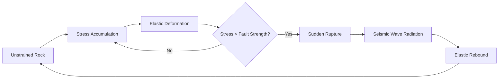
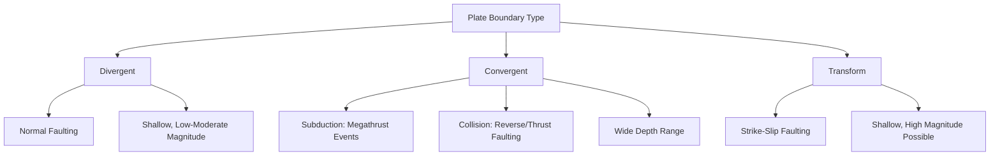

## Causes and Mechanisms of Earthquakes

### Definition and Overview

An earthquake is the sudden release of accumulated strain energy within Earth's lithosphere, radiating as seismic waves that cause ground shaking. This release occurs predominantly along faults—fractures in rock where measurable displacement has occurred. The scientific study of these processes falls under **seismogenesis** (the generation of earthquakes) and is grounded in the elastic rebound theory, plate tectonics, and rock mechanics.

### Elastic Rebound Theory

Proposed by Harry Fielding Reid following the 1906 San Francisco earthquake, elastic rebound theory remains the foundational model explaining how earthquakes occur.

**Key Points**

- Rocks on either side of a fault are subjected to tectonic stress over long periods (years to centuries)
- Rather than slipping immediately, rocks deform elastically, storing strain energy
- When accumulated stress exceeds the frictional strength holding the fault locked, sudden rupture occurs
- The rocks "rebound" to a lower-strain configuration, releasing stored energy as seismic waves
- This is a cyclical process: strain accumulation → rupture → strain accumulation (the **seismic cycle**)

The relationship between stored elastic strain energy and stress can be conceptually expressed as:

$$E = \frac{1}{2} k x^2$$

where $E$ is stored elastic energy, $k$ is the effective stiffness of the crustal rock, and $x$ is the displacement (strain) accumulated prior to rupture. This is a simplified analog; real fault systems involve heterogeneous stress fields rather than simple linear elasticity. [Inference]

### Plate Tectonics as the Primary Driver

The overwhelming majority of earthquakes occur at or near plate boundaries, where relative motion between lithospheric plates generates the stress that drives faulting.

#### Divergent Boundaries

- Plates move apart (e.g., mid-ocean ridges, continental rift zones like the East African Rift)
- Produce shallow-focus earthquakes, generally low-to-moderate magnitude
- Dominated by normal faulting due to tensional (extensional) stress

#### Convergent Boundaries

- Plates move toward each other, producing the most powerful earthquakes on Earth
- **Subduction zones**: one plate descends beneath another (e.g., Cascadia, Japan Trench, Peru-Chile Trench), generating megathrust earthquakes—the largest recorded events (magnitude 8.5+)
- **Continental collision zones**: crustal thickening and reverse/thrust faulting (e.g., Himalayan front)
- Earthquakes here can occur across a wide depth range, from shallow crustal events to deep-focus earthquakes exceeding 600 km within subducting slabs

#### Transform Boundaries

- Plates slide horizontally past one another
- Dominated by strike-slip faulting
- Shallow focus, but can produce very high-magnitude events (e.g., San Andreas Fault, North Anatolian Fault)

### Fault Types and Stress Regimes

Fault mechanism is directly determined by the orientation of the three principal stress axes: maximum ($\sigma_1$), intermediate ($\sigma_2$), and minimum ($\sigma_3$) compressive stress.

| Fault Type | Stress Regime | Principal Stress Orientation | Associated Tectonic Setting |
| --- | --- | --- | --- |
| Normal | Extensional | $\sigma_1$ vertical | Divergent boundaries, rift zones |
| Reverse/Thrust | Compressional | $\sigma_1$ horizontal | Convergent boundaries, collision zones |
| Strike-slip | Shear | $\sigma_1$ and $\sigma_3$ horizontal, $\sigma_2$ vertical | Transform boundaries |
| Oblique-slip | Mixed | Intermediate orientation | Transtensional/transpressional zones |

**Example**

A normal fault forms when the hanging wall moves downward relative to the footwall under tensional stress, characteristic of the Basin and Range Province in the western United States.

Below is a schematic cross-section illustrating the three primary fault types.

<svg xmlns="http://www.w3.org/2000/svg" viewBox="0 0 900 320" font-family="sans-serif">
<text x="450" y="25" font-size="18" text-anchor="middle" font-weight="bold">Fault Types (svg_diagram)</text>

<g transform="translate(20,50)">
<text x="120" y="0" font-size="14" text-anchor="middle" font-weight="bold">Normal Fault</text>
<line x1="20" y1="230" x2="260" y2="230" stroke="black" stroke-width="1" />
<path d="M0,60 L150,60 L180,230 L0,230 Z" fill="#d9a441" stroke="black" />
<path d="M150,60 L260,110 L260,230 L180,230 Z" fill="#c97b3d" stroke="black" />
<line x1="150" y1="60" x2="180" y2="230" stroke="black" stroke-width="2" stroke-dasharray="4,2" />
<polygon points="90,120 100,110 100,130" fill="black" />
<text x="60" y="145" font-size="11">Hanging wall</text>
<text x="200" y="90" font-size="11">Footwall</text>
<text x="70" y="270" font-size="11">Tension (extension)</text>
</g>

<g transform="translate(320,50)">
<text x="120" y="0" font-size="14" text-anchor="middle" font-weight="bold">Reverse Fault</text>
<line x1="20" y1="230" x2="260" y2="230" stroke="black" stroke-width="1" />
<path d="M0,110 L150,60 L180,230 L0,230 Z" fill="#7c9c73" stroke="black" />
<path d="M150,60 L260,60 L260,230 L180,230 Z" fill="#5c7c53" stroke="black" />
<line x1="150" y1="60" x2="180" y2="230" stroke="black" stroke-width="2" stroke-dasharray="4,2" />
<polygon points="100,90 110,100 90,100" fill="black" />
<text x="40" y="150" font-size="11">Hanging wall</text>
<text x="200" y="90" font-size="11">Footwall</text>
<text x="60" y="270" font-size="11">Compression</text>
</g>

<g transform="translate(620,50)">
<text x="130" y="0" font-size="14" text-anchor="middle" font-weight="bold">Strike-Slip Fault</text>
<rect x="0" y="60" width="260" height="170" fill="#a3b8cc" stroke="black" />
<line x1="130" y1="60" x2="130" y2="230" stroke="black" stroke-width="2" stroke-dasharray="4,2" />
<line x1="20" y1="100" x2="110" y2="100" stroke="black" stroke-width="2" />
<polygon points="110,100 100,94 100,106" fill="black" />
<line x1="150" y1="190" x2="240" y2="190" stroke="black" stroke-width="2" />
<polygon points="150,190 160,184 160,196" fill="black" />
<text x="55" y="250" font-size="11">Opposing lateral</text>
<text x="60" y="264" font-size="11">motion</text>
</g>
</svg>

### Non-Tectonic and Secondary Earthquake Causes

While tectonic processes account for the vast majority of seismic events, several other mechanisms generate measurable earthquakes.

**Volcanic Earthquakes**

- Caused by magma movement, dike intrusion, and pressure changes within volcanic conduits
- Include volcano-tectonic (VT) earthquakes (brittle failure), long-period (LP) events (fluid resonance), and volcanic tremor (sustained fluid movement)

**Induced (Anthropogenic) Seismicity**

- Reservoir-induced seismicity: impoundment of large reservoirs alters pore pressure and stress on nearby faults (e.g., Koyna Dam, India, 1967)
- Wastewater injection: disposal of fluids from oil/gas extraction increases pore fluid pressure along pre-existing faults, reducing effective normal stress and triggering slip (linked to increased seismicity in Oklahoma, 2009–present)
- Mining-induced seismicity: collapse of underground voids or stress redistribution from extraction
- Hydraulic fracturing: generally produces smaller-magnitude induced events, though it can activate nearby critically stressed faults [Inference — magnitude outcomes are site-dependent and not fully predictable]

**Collapse Earthquakes**

- Result from the collapse of underground cavities such as caves or mine workings
- Generally low magnitude and highly localized

**Explosion-Induced Seismicity**

- Nuclear tests and large chemical explosions generate seismic waves detectable by seismographs, though the source mechanism (explosive, isotropic) differs fundamentally from tectonic shear faulting

### The Physics of Fault Friction

Fault behavior is governed by frictional properties described by rate-and-state friction theory, which explains why some faults slip in sudden earthquakes (stick-slip behavior) while others slip gradually (aseismic creep).

**Key Points**

- Static friction must be overcome before slip initiates, following a Coulomb failure criterion:

$$\tau = \mu (\sigma_n - P)$$

where $\tau$ is shear stress required for failure, $\mu$ is the coefficient of friction, $\sigma_n$ is normal stress across the fault, and $P$ is pore fluid pressure.

- Elevated pore fluid pressure ($P$) reduces effective normal stress, lowering the shear stress needed for failure—this is the mechanism underlying most induced seismicity
- Velocity-weakening materials (where friction decreases as slip velocity increases) promote unstable, seismogenic slip
- Velocity-strengthening materials promote stable sliding (aseismic creep), common in fault segments with high clay content or elevated temperature/pressure conditions found at greater depths

### Earthquake Focus, Hypocenter, and Epicenter

- **Hypocenter (focus)**: the actual subsurface point of rupture initiation
- **Epicenter**: the point on Earth's surface directly above the hypocenter
- **Focal depth**: classified as shallow (0–70 km), intermediate (70–300 km), or deep (300–700 km)
- Deep-focus earthquakes occur exclusively within subducting slabs, where cold, brittle lithosphere persists to greater depths; the mechanism at these depths is debated, with leading hypotheses including dehydration embrittlement (release of water from hydrous minerals reducing effective stress) and phase transformation faulting (mineral phase changes causing volume reduction and instability) [Unverified — the exact mechanism at depths beyond ~300 km remains an active area of research without full scientific consensus]

### Seismic Moment and Rupture Parameters

The size of an earthquake is fundamentally quantified through **seismic moment** ($M_0$), a physical measure of the energy released during rupture:

$$M_0 = \mu \, A \, D$$

where $\mu$ is the shear modulus (rigidity) of the rock, $A$ is the rupture area along the fault, and $D$ is the average slip displacement.

This relates to moment magnitude ($M_w$) via:

$$M_w = \frac{2}{3} \log_{10}(M_0) - 10.7$$

(using $M_0$ in dyne-cm; conventions vary by unit system). Larger rupture area and greater slip both directly increase seismic moment, which is why subduction megathrust faults—capable of rupturing hundreds of kilometers along strike—generate the largest earthquakes on Earth.

### Foreshocks, Mainshocks, and Aftershocks

- **Foreshocks**: smaller earthquakes preceding a larger mainshock on the same or a related fault; identifiable only in retrospect, as no reliable method exists to distinguish a foreshock from an isolated small earthquake in real time [Inference — this reflects the current consensus limitation in earthquake prediction]
- **Mainshock**: the largest event in a sequence
- **Aftershocks**: smaller earthquakes following the mainshock, resulting from stress redistribution onto adjacent fault segments; generally follow Omori's Law, where aftershock frequency decays approximately as:

$$n(t) = \frac{K}{(t + c)^p}$$

where $n(t)$ is aftershock rate at time $t$, and $K$, $c$, $p$ are empirically fitted constants (typically $p \approx 1$).

### Earthquake Prediction vs. Forecasting

**Key Points**

- Deterministic short-term earthquake *prediction* (specific time, location, magnitude) is not currently achievable with reliable scientific methods; no precursor signal has been validated as consistently predictive
- Probabilistic *forecasting* is achievable and operationally used—estimating the likelihood of an earthquake of a given magnitude occurring in a region over a defined time window, based on historical seismicity, fault slip rates, and statistical models (e.g., UCERF for California)
- Early warning systems (e.g., Japan's ShakeAlert-equivalent, the US ShakeAlert system) do not predict earthquakes before they occur; they detect the P-wave of an already-initiated rupture and issue warnings before the slower, more destructive S-waves and surface waves arrive [Behavior may vary by regional network design, sensor density, and epicentral distance]

### Conclusion

Earthquakes arise primarily from the sudden release of tectonic strain energy accumulated across locked fault surfaces, governed by elastic rebound theory and modulated by frictional and pore-pressure conditions at depth. While plate boundary interactions—divergent, convergent, and transform—account for the overwhelming majority of global seismicity, secondary mechanisms including volcanic activity, fluid injection, reservoir loading, and subsurface collapse also generate measurable earthquakes. The physical scale of an event is captured through seismic moment, itself a function of rupture area, slip, and crustal rigidity, while temporal earthquake behavior (foreshock-mainshock-aftershock sequences) follows well-documented statistical patterns even though deterministic prediction remains scientifically unresolved.

**Related Topics**

- Seismic wave types (P-waves, S-waves, surface waves) and their propagation
- Magnitude scales (Richter, moment magnitude, intensity scales)
- Plate tectonic theory and boundary classification
- Seismographs and seismometer instrumentation
- Earthquake hazard assessment and building codes
- Tsunami generation from submarine earthquakes
- Paleoseismology and fault trenching methods
- Ground motion attenuation and site amplification effects