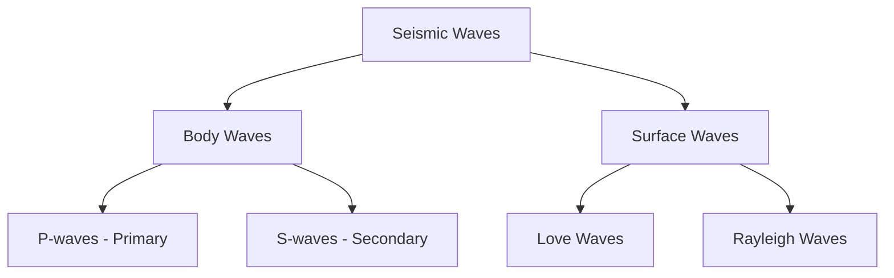
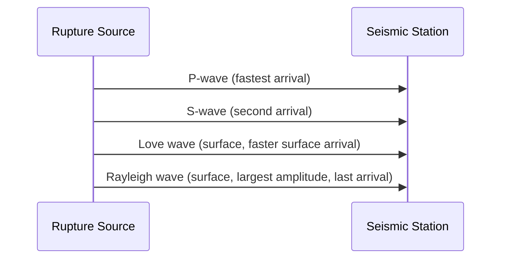
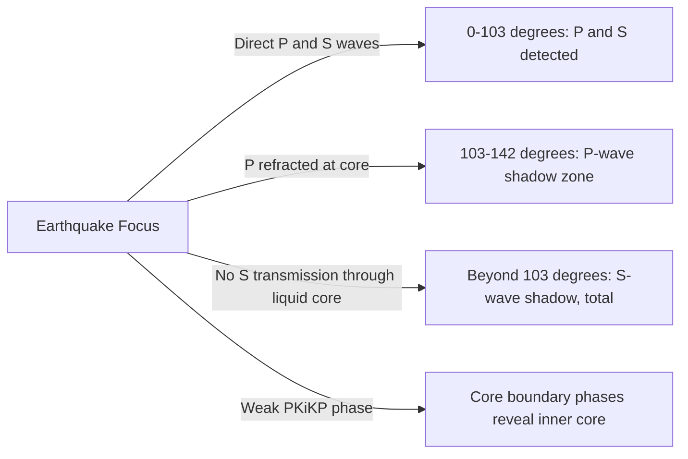

## Seismic Waves and Wave Propagation

### Definition and Overview

Seismic waves are elastic energy pulses radiated outward from a rupture source (typically a fault), propagating through Earth's interior and along its surface. Their study—**seismology**—relies on the physics of elastic wave propagation in heterogeneous, anisotropic media. Seismic waves are broadly divided into **body waves**, which travel through Earth's interior, and **surface waves**, which travel along the boundary between layers of contrasting properties (most notably the free surface).

### Elastic Wave Theory Foundations

Seismic wave propagation is derived from the elastic wave equation, applying Newton's second law to a continuous, deformable medium under stress. For a homogeneous, isotropic elastic medium, the general wave equation for displacement $\mathbf{u}$ is:

$$\rho \frac{\partial^2 \mathbf{u}}{\partial t^2} = (\lambda + \mu) \nabla(\nabla \cdot \mathbf{u}) + \mu \nabla^2 \mathbf{u}$$

where $\rho$ is material density, $\lambda$ and $\mu$ are the Lamé parameters (elastic moduli describing the medium's stiffness), $t$ is time, and $\nabla$ denotes the spatial gradient operator. This single equation decomposes into two independent wave types based on the nature of particle motion: **compressional** (dilatational) waves and **shear** (rotational) waves—corresponding physically to P-waves and S-waves.

### Body Waves

#### P-waves (Primary/Compressional Waves)

**Key Points**

- Fastest seismic wave type; first to arrive at a seismic station, hence "Primary"
- Particle motion is longitudinal—parallel to the direction of wave propagation, alternating compression and rarefaction
- Can travel through solids, liquids, and gases, since compressional deformation does not require shear resistance
- Velocity is given by:

$$V_p = \sqrt{\frac{\lambda + 2\mu}{\rho}} = \sqrt{\frac{K + \frac{4}{3}\mu}{\rho}}$$

where $K$ is the bulk modulus (resistance to uniform compression), $\mu$ is the shear modulus, and $\rho$ is density.

- Typical crustal velocities range approximately 5–7 km/s, increasing with depth as pressure and density increase [Inference — exact values are highly dependent on local lithology and are typically derived from regional velocity models rather than a fixed universal constant]

#### S-waves (Secondary/Shear Waves)

**Key Points**

- Slower than P-waves; arrive second at a recording station
- Particle motion is transverse—perpendicular to the direction of propagation
- Cannot propagate through liquids or gases, since fluids do not support static shear stress ($\mu = 0$ for an ideal fluid)
- Velocity is given by:

$$V_s = \sqrt{\frac{\mu}{\rho}}$$

- S-waves are further decomposed into **SH** (horizontally polarized shear motion) and **SV** (vertically polarized shear motion) components when interacting with layered media or boundaries
- The inability of S-waves to traverse Earth's outer core provided the primary seismological evidence that the outer core is liquid (identified via the S-wave "shadow zone")

**Example**

Given a rock with bulk modulus $K = 52$ GPa, shear modulus $\mu = 32$ GPa, and density $\rho = 2700 \text{ kg/m}^3$:

$$V_p = \sqrt{\frac{52 \times 10^9 + \frac{4}{3}(32 \times 10^9)}{2700}} \approx 6.34 \text{ km/s}$$

$$V_s = \sqrt{\frac{32 \times 10^9}{2700}} \approx 3.44 \text{ km/s}$$

The $V_p/V_s$ ratio (here approximately 1.84) is a diagnostic parameter used in subsurface characterization, including lithology discrimination and fluid detection in reservoir geophysics.

### Surface Waves

Surface waves arise from the constructive interference of body waves near a free surface or a strong impedance contrast (such as the boundary between crustal layers). They travel slower than body waves but typically carry greater amplitude and are responsible for the majority of structural damage in shallow, large-magnitude earthquakes due to their lower attenuation rate over distance.

#### Love Waves (LQ)

- Horizontally polarized shear motion, with particle displacement perpendicular to propagation direction and parallel to Earth's surface (no vertical component)
- Require a velocity gradient with depth (a lower-velocity layer overlying a higher-velocity layer) to exist—they are a guided wave phenomenon
- Generally faster than Rayleigh waves but slower than S-waves

#### Rayleigh Waves (LR)

- Produced by the interaction of P-waves and SV-waves at a free surface
- Particle motion traces a retrograde elliptical path in the vertical plane aligned with the propagation direction
- Velocity is approximately $0.92$ times the S-wave velocity in a Poisson solid, though the exact ratio depends on the medium's Poisson's ratio [Inference — this coefficient is a standard approximation for a homogeneous half-space and varies with actual near-surface elastic properties]
- Cause the rolling ground motion often described in large earthquakes

Below is a schematic comparing particle motion patterns for each wave type.

<svg xmlns="http://www.w3.org/2000/svg" viewBox="0 0 900 380" font-family="sans-serif">
<text x="450" y="25" font-size="18" text-anchor="middle" font-weight="bold">Seismic Wave Particle Motion (svg_diagram)</text>

<g transform="translate(20,50)">
<text x="100" y="0" font-size="14" text-anchor="middle" font-weight="bold">P-wave</text>
<line x1="0" y1="60" x2="210" y2="60" stroke="#999" stroke-width="1" />
<g stroke="black" stroke-width="2">
<line x1="10" y1="40" x2="10" y2="80" />
<line x1="30" y1="40" x2="30" y2="80" />
<line x1="45" y1="40" x2="45" y2="80" />
<line x1="90" y1="40" x2="90" y2="80" />
<line x1="140" y1="40" x2="140" y2="80" />
<line x1="155" y1="40" x2="155" y2="80" />
<line x1="195" y1="40" x2="195" y2="80" />
</g>
<text x="100" y="105" font-size="11" text-anchor="middle">Compression / Rarefaction</text>
<text x="100" y="120" font-size="11" text-anchor="middle">(longitudinal)</text>
</g>

<g transform="translate(260,50)">
<text x="100" y="0" font-size="14" text-anchor="middle" font-weight="bold">S-wave</text>
<path d="M0,60 Q25,20 50,60 T100,60 T150,60 T200,60" fill="none" stroke="black" stroke-width="2" />
<line x1="0" y1="60" x2="200" y2="60" stroke="#999" stroke-width="1" stroke-dasharray="3,2" />
<text x="100" y="105" font-size="11" text-anchor="middle">Transverse shear motion</text>
</g>

<g transform="translate(500,50)">
<text x="100" y="0" font-size="14" text-anchor="middle" font-weight="bold">Love Wave</text>
<path d="M0,60 Q25,20 50,60 T100,60 T150,60 T200,60" fill="none" stroke="black" stroke-width="2" />
<text x="100" y="100" font-size="11" text-anchor="middle">Horizontal shear,</text>
<text x="100" y="115" font-size="11" text-anchor="middle">no vertical component</text>
</g>

<g transform="translate(680,150)">
<text x="100" y="0" font-size="14" text-anchor="middle" font-weight="bold">Rayleigh Wave</text>
<ellipse cx="30" cy="60" rx="14" ry="22" fill="none" stroke="black" stroke-width="2" />
<ellipse cx="80" cy="60" rx="14" ry="22" fill="none" stroke="black" stroke-width="2" />
<ellipse cx="130" cy="60" rx="14" ry="22" fill="none" stroke="black" stroke-width="2" />
<polygon points="30,38 25,46 35,46" fill="black" />
<text x="80" y="105" font-size="11" text-anchor="middle">Retrograde elliptical motion</text>
</g>
</svg>

### Wave Propagation Phenomena

#### Reflection and Refraction

When seismic waves encounter a boundary between materials of differing acoustic impedance (product of density and wave velocity), part of the energy reflects and part refracts, following Snell's Law:

$$\frac{\sin \theta_1}{V_1} = \frac{\sin \theta_2}{V_2}$$

where $\theta_1$ and $\theta_2$ are the angles of incidence and refraction, and $V_1$, $V_2$ are the wave velocities in each medium.

#### Wave Conversion

At a boundary, incident P-waves can partially convert to SV-waves and vice versa (mode conversion), since both satisfy the same boundary conditions of continuous displacement and traction. This produces converted phases (e.g., PS, SP) used extensively in receiver function analysis to image crustal and upper-mantle discontinuities.

#### Attenuation and Geometric Spreading

Seismic wave amplitude decreases with distance from source due to two combined effects:

- **Geometric spreading**: energy distributed over an expanding wavefront (spherical for body waves, cylindrical for surface waves), causing amplitude to decay approximately as $1/r$ for body waves and $1/\sqrt{r}$ for surface waves
- **Anelastic attenuation**: energy loss to heat via internal friction, quantified by the quality factor $Q$, where higher $Q$ indicates lower attenuation

#### Diffraction

Waves bend around sharp discontinuities or obstacles (such as the core-mantle boundary edge), allowing energy to be detected in geometric "shadow zones" at reduced amplitude.

### Earth's Internal Structure from Wave Behavior

Seismic wave travel-time and shadow-zone analysis has been the primary method for delineating Earth's internal layering.

| Boundary | Depth (approx.) | Evidence |
| --- | --- | --- |
| Crust–Mantle (Mohorovičić discontinuity) | 5–70 km | Sharp increase in P-wave velocity (Mohorovičić, 1909) |
| Upper–Lower Mantle (660 km discontinuity) | ~660 km | Velocity discontinuity from mineral phase transition |
| Mantle–Outer Core (Gutenberg discontinuity) | ~2,900 km | S-wave shadow zone (103°–142° epicentral distance); P-wave velocity drop |
| Outer Core–Inner Core (Lehmann discontinuity) | ~5,150 km | Weak P-wave arrivals (PKiKP) within the P-wave shadow zone |

**Key Points**

- The **P-wave shadow zone** (103°–142° angular distance from an earthquake epicenter) results from P-wave refraction at the core-mantle boundary due to the sharp velocity drop entering the liquid outer core
- The **S-wave shadow zone** (beyond 103°) is total and permanent, since S-waves cannot propagate through the liquid outer core at all—this is the definitive evidence for the outer core's liquid state
- Seismic tomography extends this principle by inverting travel-time residuals from many earthquake-station pairs to construct 3D velocity models of mantle structure, revealing features such as subducting slabs and mantle plumes [Inference — tomographic resolution varies significantly with ray path density and is inherently smoothed compared to true Earth structure]

### Recording and Interpreting Seismic Waves

- **Seismograms** record ground motion amplitude versus time at a station; the time interval between P- and S-wave arrivals (S–P interval) is directly proportional to epicentral distance, forming the basis of earthquake location via triangulation from at least three stations
- **Travel-time curves** (e.g., the Jeffreys–Bullen tables) provide empirically calibrated relationships between epicentral distance and wave arrival time, foundational to routine earthquake location procedures
- **Seismometers** measure ground displacement, velocity, or acceleration depending on instrument design (broadband seismometers vs. strong-motion accelerographs), with the choice depending on the intended application (teleseismic monitoring vs. near-source strong shaking characterization)

### Factors Affecting Wave Propagation and Ground Shaking

- **Site amplification**: soft sediments and unconsolidated soils amplify shaking amplitude relative to bedrock due to impedance contrast and resonance effects, a major factor in localized earthquake damage patterns (e.g., Mexico City, 1985)
- **Directivity effects**: rupture propagation direction along a fault concentrates wave energy in the direction of rupture, producing stronger shaking in that direction
- **Basin effects**: sediment-filled basins can trap and amplify surface waves through repeated internal reflections, extending shaking duration
- Behavior of these amplification effects is strongly site-dependent and requires local geotechnical characterization for accurate prediction in any specific location [Behavior may vary by regional subsurface conditions]

### Conclusion

Seismic waves are the physical medium through which earthquake energy is transmitted and observed, comprising body waves (P and S) that travel through Earth's interior and surface waves (Love and Rayleigh) generated at boundaries and the free surface. Their differing velocities, particle motion characteristics, and medium dependencies (particularly the inability of S-waves to traverse liquids) have provided the principal evidence for Earth's internal layered structure. Understanding wave propagation phenomena—reflection, refraction, mode conversion, attenuation, and site amplification—underpins both fundamental seismology and applied fields such as earthquake engineering, exploration geophysics, and seismic hazard assessment.

**Related Topics**

- Earthquake location and travel-time curve methodology
- Seismic tomography and Earth's interior imaging
- Earthquake magnitude and intensity scales
- Seismometer and accelerograph instrumentation
- Site response and soil amplification effects
- Causes and mechanisms of earthquakes
- Reflection and refraction seismology in exploration geophysics
- Earthquake early warning systems