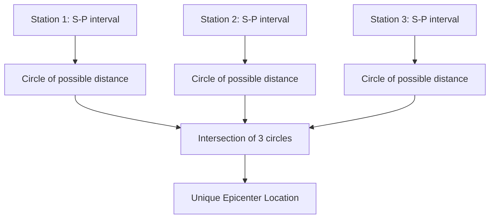
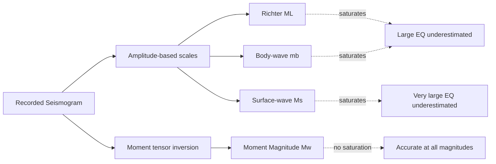

## Earthquake Location and Magnitude Scales

### Definition and Overview

Earthquake location determines the spatial coordinates (latitude, longitude, depth) and origin time of a seismic rupture, while magnitude scales quantify the size of the event in terms of energy release. Both are derived from seismogram analysis but rely on distinct physical principles: location depends on wave travel-time geometry, while magnitude depends on wave amplitude, frequency content, or fault rupture parameters. Together, they form the core quantitative output of routine seismic monitoring.

### Earthquake Location Methodology

#### The S–P Interval Method

**Key Points**

- P-waves and S-waves travel from the same origin point at different velocities, causing an increasing time separation (S–P interval) with increasing epicentral distance
- A single station's S–P interval yields distance but not direction, producing a circle of possible epicenter locations centered on that station
- A minimum of three stations is required to resolve a unique epicenter via circle intersection (trilateration)
- Approximate epicentral distance can be estimated using empirical relationships such as:

$$\Delta \approx 8 \times (t_s - t_p)$$

where $\Delta$ is epicentral distance in kilometers and $(t_s - t_p)$ is the S–P interval in seconds; this coefficient varies regionally depending on local crustal velocity structure [Inference — the constant 8 km/s is a commonly cited approximation and not a universal physical constant]

#### Modern Location Algorithms

Contemporary earthquake location relies on iterative, computationally optimized methods rather than manual circle intersection:

- **Geiger's Method**: an iterative least-squares algorithm that minimizes the residual between observed and predicted arrival times across a network of stations, linearizing the nonlinear travel-time problem around a starting hypocenter estimate and updating it through successive iterations
- **Double-difference relocation (HypoDD)**: uses the difference in arrival times between pairs of nearby earthquakes recorded at common stations, substantially improving relative location precision (particularly useful for resolving fault-plane geometry in earthquake clusters and aftershock sequences)
- **Probabilistic/non-linear location methods** (e.g., NonLinLoc): apply grid-search or Bayesian approaches to fully characterize location uncertainty rather than producing a single least-squares point estimate

**Key Points**

- Depth determination is typically the least well-constrained parameter, since near-vertical ray paths for nearby stations provide poor depth resolution compared to horizontal position
- Velocity model accuracy directly controls location precision; errors in the assumed crustal velocity structure propagate directly into systematic location bias
- Network geometry (azimuthal station coverage) strongly affects location uncertainty; poor azimuthal coverage produces elongated error ellipses

#### Origin Time Determination

Origin time ($t_0$) is solved simultaneously with hypocenter location as a fourth unknown parameter in the location inversion, using the relation:

$$t_{arrival} = t_0 + \frac{\Delta}{V}$$

where $t_{arrival}$ is the observed wave arrival time, $\Delta$ is source-to-station distance, and $V$ is the relevant wave velocity along the ray path.

### Magnitude Scales

Magnitude quantifies earthquake size on a logarithmic scale, meaning each whole-number increase represents roughly a 10-fold increase in measured wave amplitude and approximately a 31.6-fold increase in radiated energy.

#### Richter Local Magnitude ($M_L$)

**Key Points**

- Developed by Charles Richter (1935) for shallow, local earthquakes in Southern California, using a specific instrument (Wood-Anderson torsion seismometer)
- Defined as:

$$M_L = \log_{10}(A) - \log_{10}(A_0(\Delta))$$

where $A$ is the maximum trace amplitude recorded, and $A_0(\Delta)$ is an empirical distance-correction function calibrated to Southern California crustal structure

- Limitations: saturates (becomes insensitive) for large earthquakes above approximately $M_L \, 6.5$–$7$, since it does not directly measure the total rupture area or slip, and its distance-correction calibration is regionally specific, making it less reliable outside its original calibration region [Inference — saturation thresholds vary by instrument response and regional attenuation and are not a single fixed value]

#### Body-Wave Magnitude ($m_b$) and Surface-Wave Magnitude ($M_s$)

- $m_b$: measured from the amplitude of short-period P-waves, useful for globally recorded, often deep-focus events; also saturates at large magnitudes (typically above $\sim M \, 6.5$)
- $M_s$: measured from the amplitude of surface waves (typically 20-second period Rayleigh waves), historically standard for shallow, large earthquakes; saturates above approximately $M \, 8$
- Both were standard prior to widespread adoption of moment magnitude but remain in use for rapid regional assessment and historical earthquake catalogs

#### Moment Magnitude ($M_w$)

**Key Points**

- Developed by Hiroo Kanamori and Thomas Hanks (1979) to overcome the saturation problem inherent in amplitude-based scales
- Directly derived from seismic moment ($M_0$), a physical quantity based on fault rupture area, average slip, and rock rigidity:

$$M_0 = \mu \, A \, D$$

$$M_w = \frac{2}{3} \log_{10}(M_0) - 10.7 \quad \text{(with } M_0 \text{ in dyne-cm)}$$

- Does not saturate at large magnitudes, since it scales directly with physical rupture parameters rather than a single amplitude measurement at a specific frequency
- Now the standard magnitude reported for significant global earthquakes by agencies including the USGS and international seismological centers [Behavior of exact computation methodology may vary slightly between reporting agencies depending on the specific moment tensor inversion technique used]

#### Comparative Summary

| Scale | Basis | Saturation Point | Best Use Case |
| --- | --- | --- | --- |
| $M_L$ (Richter) | Max amplitude, Wood-Anderson response | ~6.5–7 | Local/regional shallow events |
| $m_b$ | Short-period P-wave amplitude | ~6.5 | Global, deep-focus events |
| $M_s$ | Surface wave amplitude | ~8 | Shallow, large events |
| $M_w$ (Moment) | Physical rupture parameters ($\mu$, $A$, $D$) | None | All magnitudes, standard modern reporting |

### Intensity Scales (Distinguished from Magnitude)

Magnitude is a single value describing total energy release at the source; **intensity** describes the observed effects of shaking at a specific location, and therefore varies across a region for a single earthquake.

**Key Points**

- **Modified Mercalli Intensity (MMI) Scale**: a qualitative scale (Roman numerals I–XII) based on observed damage, human perception, and structural effects at a given site
- Intensity is influenced by magnitude, distance from epicenter, focal depth, local geology (site amplification), and building construction quality
- **ShakeMap** products (produced by agencies such as USGS) interpolate recorded ground-motion data and intensity reports to produce spatial intensity distribution maps immediately following significant events, aiding rapid damage assessment

### Example Calculation

Given a fault rupture with area $A = 5{,}000 \text{ km}^2 = 5 \times 10^{15} \text{ cm}^2$, average slip $D = 3 \text{ m} = 300 \text{ cm}$, and shear modulus $\mu = 3 \times 10^{11} \text{ dyne/cm}^2$:

$$M_0 = (3 \times 10^{11})(5 \times 10^{15})(300) = 4.5 \times 10^{29} \text{ dyne-cm}$$

$$M_w = \frac{2}{3} \log_{10}(4.5 \times 10^{29}) - 10.7 \approx \frac{2}{3}(29.65) - 10.7 \approx 19.77 - 10.7 \approx 9.07$$

This corresponds approximately to the scale of the 2011 Tōhoku earthquake ($M_w \, 9.0$–9.1), illustrating how megathrust subduction ruptures with large fault area and displacement produce the highest moment magnitudes recorded. [Inference — the specific input parameters used here are illustrative round figures for demonstration, not the precise inverted source parameters of any single specific event]

### Location and Magnitude Uncertainty Considerations

- Real-time (rapid) location and magnitude estimates issued within seconds to minutes of an event are inherently less precise than final, reviewed catalog solutions computed after additional station data and refined velocity models are incorporated
- Magnitude estimates from different scales for the same earthquake can differ by several tenths of a magnitude unit, particularly for very large events where amplitude-based scales saturate while moment magnitude does not
- Behavior of automated location and magnitude systems may vary depending on network density, azimuthal coverage, and regional velocity model calibration [Behavior may vary by specific seismic network configuration]

### Conclusion

Earthquake location and magnitude determination together transform raw seismogram recordings into the standardized parameters used for hazard assessment, scientific research, and public communication. Location relies fundamentally on travel-time differences between wave phases across a network of stations, evolving from simple trilateration to sophisticated iterative and probabilistic inversion methods. Magnitude scales have progressed from regionally calibrated amplitude measures (Richter $M_L$) to the physically grounded moment magnitude ($M_w$), which avoids saturation and enables consistent comparison across the full range of earthquake sizes. Distinguishing magnitude (a single source-based value) from intensity (a spatially variable, effects-based measure) remains essential for accurate hazard communication.

**Related Topics**

- Seismic waves and wave propagation
- Causes and mechanisms of earthquakes
- Seismograph and seismometer network design
- Earthquake early warning systems
- Ground motion prediction equations (GMPEs)
- Probabilistic seismic hazard analysis (PSHA)
- Moment tensor inversion techniques
- Historical and paleoseismic earthquake catalogs