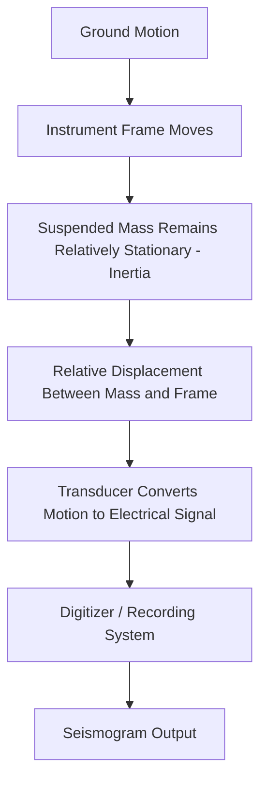
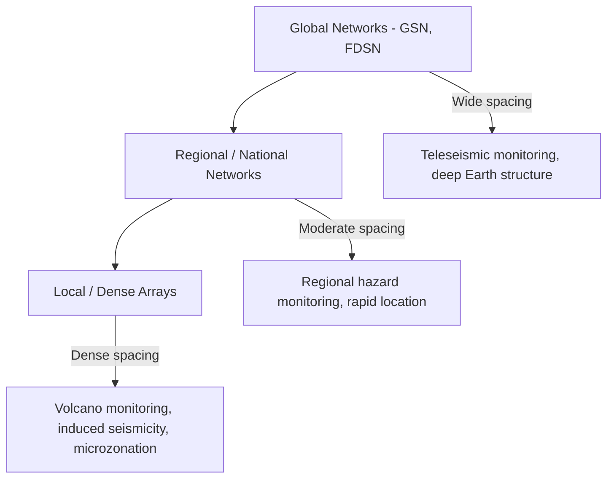

## Seismographs and Seismic Networks

### Definition and Overview

A seismograph (or seismometer) is an instrument that detects and records ground motion caused by seismic waves, elastic waves in the atmosphere, or other vibration sources. A **seismic network** is a coordinated array of such instruments distributed geographically, enabling earthquake detection, location, magnitude estimation, and structural monitoring through multi-station data integration. The distinction between "seismometer" (the sensor) and "seismograph" (the complete recording system) is often used loosely, though technically the seismometer is the transducer component while the seismograph includes recording and timing systems.

### Fundamental Operating Principle

**Key Points**

- Nearly all mechanical seismometers operate on the inertial pendulum principle: a suspended mass tends to remain stationary (due to inertia) while the instrument frame, anchored to the ground, moves with the seismic wave
- The relative motion between the stationary mass and the moving frame is measured and recorded as ground motion
- The equation of motion for a simple damped harmonic oscillator seismometer is:

$$m\ddot{x} + c\dot{x} + kx = -m\ddot{u}$$

where $m$ is the suspended mass, $x$ is the relative displacement between mass and frame, $c$ is the damping coefficient, $k$ is the spring constant, and $\ddot{u}$ is the ground acceleration being measured

- Instrument response depends critically on the relationship between the natural frequency of the pendulum ($\omega_0 = \sqrt{k/m}$) and the frequency of the ground motion being recorded; above the natural frequency, the instrument responds proportionally to ground displacement, while different frequency ranges yield proportionality to velocity or acceleration [Inference — the specific frequency response regime depends on instrument design parameters and damping ratio]

### Types of Seismic Instruments

#### Broadband Seismometers

- Designed to record ground motion accurately across a wide frequency range (typically 0.001–50 Hz), capturing both long-period surface waves from distant large earthquakes and short-period local events
- Commonly use force-feedback (active) sensor designs, in which an electronic feedback loop actively holds the mass near a null position, extending the usable frequency band beyond what a purely passive pendulum could achieve
- Standard instrument for global and regional seismic monitoring networks

#### Short-Period Seismometers

- Optimized for higher-frequency signals (typically 1–20 Hz), historically used for local earthquake and microseismic monitoring
- Largely supplanted by broadband instruments in modern permanent networks, though still used in dense local arrays and some specialized applications (e.g., volcano monitoring, induced seismicity monitoring) due to lower cost

#### Strong-Motion Accelerographs

- Record ground acceleration directly rather than displacement or velocity, designed specifically to remain on-scale during large, nearby, high-amplitude shaking that would saturate a sensitive broadband instrument
- Critical for engineering applications: seismic design, structural response analysis, and ground-motion prediction equation (GMPE) calibration
- Typically triggered instruments (activate recording upon exceeding a threshold) or continuously recording depending on network design

#### Ocean Bottom Seismometers (OBS)

- Deployed on the seafloor to fill critical gaps in global network coverage over oceanic regions, which constitute the majority of Earth's surface but have historically sparse instrumentation
- Face unique engineering challenges including pressure resistance, corrosion, limited power/data retrieval (often requiring physical recovery rather than real-time telemetry), and higher ambient noise from ocean currents and marine life [Unverified — specific technical specifications vary substantially by manufacturer and deployment depth]

### Instrument Response and Calibration

**Key Points**

- Every seismometer has a characteristic **instrument response function** describing how it converts true ground motion into recorded output across different frequencies, expressed as amplitude and phase response
- Raw recorded data must be deconvolved using the known instrument response to recover true ground motion (displacement, velocity, or acceleration) for scientific analysis
- Regular calibration (comparing instrument output to known reference signals) is necessary to detect sensor drift, degradation, or malfunction over time
- Poles-and-zeros representations are the standard mathematical format for describing instrument response in the frequency domain, used in data processing software such as SEED (Standard for the Exchange of Earthquake Data) metadata

### Digitization and Data Transmission

- Modern seismometers output analog electrical signals proportional to ground motion, which are converted to digital form via analog-to-digital converters (ADCs), typically with 24-bit resolution to capture the wide dynamic range between weak distant tremors and strong nearby shaking
- Precise timing is essential for accurate multi-station location; modern stations use GPS timing to synchronize digitizer clocks to sub-millisecond accuracy
- Data telemetry methods include satellite links, cellular/radio networks, and internet connections, enabling near-real-time data streaming to processing centers; older or remote stations may rely on local storage with periodic physical data retrieval

### Seismic Network Architecture

#### Global Networks

- **Global Seismographic Network (GSN)**: a cooperative international network of broadband, high-dynamic-range stations providing free, open, real-time data for global earthquake monitoring, deep Earth structure research, and nuclear test monitoring
- **International Federation of Digital Seismograph Networks (FDSN)**: coordinates standards and data exchange among numerous national and regional networks worldwide, enabling interoperable data access
- Global networks are optimized for teleseismic (long-distance) detection of moderate-to-large earthquakes worldwide, generally with wider station spacing than regional/local networks

#### Regional and National Networks

- Operated by national geological surveys or academic consortia (e.g., USGS-affiliated networks in the United States, JMA in Japan, GEONET, various national networks across seismically active countries)
- Denser station spacing than global networks, enabling more precise location and lower magnitude detection thresholds for regional events
- Often integrate multiple instrument types (broadband, strong-motion, short-period) for combined scientific and engineering monitoring objectives

#### Local and Dense Arrays

- Deployed for specific research or monitoring purposes: volcano monitoring, induced seismicity studies near injection or extraction sites, aftershock sequence characterization, or urban hazard microzonation
- Can achieve very dense spatial sampling (meters to hundreds of meters between stations) for specialized applications such as ambient noise tomography or nodal seismic surveys in exploration geophysics

### Data Processing and Analysis Workflow

**Key Points**

- **Detection**: automated algorithms (e.g., STA/LTA — short-term average/long-term average ratio triggers) identify candidate seismic events within continuous data streams by flagging sudden amplitude increases relative to background noise
- **Phase picking**: identification of P-wave and S-wave arrival times on each station's seismogram, performed by automated algorithms and refined through human analyst review for significant events
- **Association**: linking phase picks across multiple stations that likely correspond to the same earthquake, distinguishing genuine events from noise or unrelated signals
- **Location and magnitude computation**: applying the location algorithms and magnitude formulas (as covered in earthquake location and magnitude scale methodology) using the associated phase picks
- **Cataloging**: compiled results are entered into earthquake catalogs (e.g., USGS ComCat, International Seismological Centre bulletins) for public access and long-term research use

### Applications of Seismic Network Data

- **Earthquake early warning systems**: rapidly analyze initial P-wave arrivals at stations near the epicenter to issue warnings before more damaging S-waves and surface waves arrive at more distant locations; effectiveness depends on network density near likely source regions and the distance between the affected area and the epicenter [Behavior may vary by regional network design and epicentral distance]
- **Nuclear test monitoring**: global networks distinguish the distinct seismic signature of explosions (isotropic source) from tectonic earthquakes (shear faulting source) as part of international treaty verification efforts (e.g., Comprehensive Nuclear-Test-Ban Treaty Organization monitoring)
- **Volcano monitoring**: dense local networks track volcanic tremor, long-period events, and volcano-tectonic earthquakes as indicators of magma movement and eruption forecasting
- **Structural health monitoring**: instruments placed on buildings, dams, and bridges record structural response during shaking, informing engineering design and post-event damage assessment
- **Ambient noise seismology**: continuous background seismic noise (from ocean waves, wind, and anthropogenic sources) is cross-correlated between station pairs to extract subsurface velocity structure without requiring an earthquake source

### Example: STA/LTA Detection Logic

A simplified conceptual illustration of the STA/LTA trigger ratio used in automated detection:

$$R(t) = \frac{\text{STA}(t)}{\text{LTA}(t)}$$

where $\text{STA}(t)$ is the short-term average of signal amplitude (sensitive to sudden onset) and $\text{LTA}(t)$ is the long-term average (representing background noise level). When $R(t)$ exceeds a predefined threshold (commonly in the range of 3–5, though this is network- and application-specific), the system flags a candidate seismic event for further processing. [Inference — specific threshold values are configurable parameters that vary by network, noise environment, and target event size]

### Conclusion

Seismographs and seismic networks form the observational backbone of seismology, converting subtle ground vibrations into quantitative digital records through inertial pendulum-based sensors, and organizing these instruments into coordinated networks spanning global, regional, and local scales. Instrument selection—broadband, short-period, strong-motion, or ocean-bottom—depends on the target frequency range, amplitude, and application, while network architecture balances station density against coverage area for the specific monitoring objective, whether global earthquake detection, regional hazard assessment, or specialized local studies. The resulting data pipeline, from raw ground motion through detection, phase picking, association, and location/magnitude computation, underpins virtually all downstream seismological analysis, hazard assessment, and public earthquake information systems.

**Related Topics**

- Earthquake location and magnitude scales
- Seismic waves and wave propagation
- Earthquake early warning systems
- Ground motion prediction equations and strong-motion analysis
- Seismic tomography and Earth structure imaging
- Ambient noise seismology and interferometry
- Volcano seismic monitoring techniques
- Probabilistic seismic hazard analysis (PSHA)