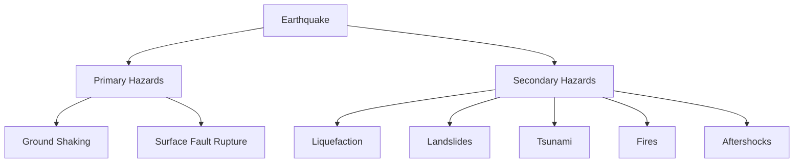
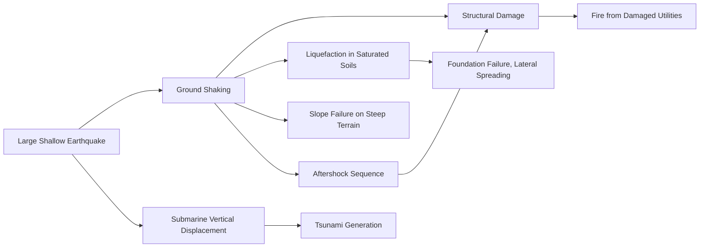

## Earthquake Hazards and Ground Effects

### Definition and Overview

Earthquake hazards encompass the range of physical phenomena caused directly or indirectly by seismic activity that pose risk to human life, infrastructure, and the environment. These are typically categorized into **primary (direct) hazards**—resulting immediately from fault rupture and ground shaking—and **secondary hazards**, which are triggered by the shaking but manifest through separate physical processes such as soil failure, mass wasting, or water displacement.

### Primary Hazards

#### Ground Shaking

**Key Points**

- The most widespread and damaging earthquake hazard, resulting directly from the passage of seismic waves through near-surface materials
- Shaking intensity at a given location depends on magnitude, distance from the source (hypocentral distance), focal depth, rupture directivity, and local site conditions
- Quantified through ground-motion parameters including peak ground acceleration (PGA), peak ground velocity (PGV), and spectral acceleration at various periods, all of which are inputs to engineering design standards
- **Site amplification** occurs when seismic waves pass from stiffer bedrock into softer, unconsolidated sediments, causing an increase in amplitude due to the impedance contrast between materials; this effect follows approximately from conservation of energy flux:

$$\frac{A_2}{A_1} = \sqrt{\frac{\rho_1 V_1}{\rho_2 V_2}}$$

where $A_1$, $\rho_1$, $V_1$ are amplitude, density, and velocity in the bedrock, and $A_2$, $\rho_2$, $V_2$ are the corresponding values in the softer surface layer

- Basin geometry can further amplify and prolong shaking through wave trapping and resonance, as demonstrated dramatically in the 1985 Mexico City earthquake, where shaking from a distant subduction event was substantially amplified by the soft lakebed sediments underlying the city [Inference — the degree of amplification is highly site-specific and requires local geotechnical data for precise prediction]

#### Surface Fault Rupture

- Direct displacement of the ground surface along the trace of an active fault during an earthquake
- Can offset roads, pipelines, building foundations, and other infrastructure that crosses the fault trace, independent of shaking-related damage
- Mitigated primarily through fault-avoidance zoning (setback requirements) rather than structural design, since engineering a structure to withstand direct fault offset is generally impractical for the displacements involved

### Secondary Hazards

#### Liquefaction

**Key Points**

- Occurs when saturated, loosely packed, cohesionless soils (typically sands and silts) lose shear strength during cyclic seismic loading, as excess pore water pressure builds up and approaches the total overburden stress
- The soil temporarily behaves as a fluid rather than a solid, losing its ability to support structures, leading to foundation failure, sand boils, ground settlement, and lateral spreading
- The liquefaction condition can be conceptually expressed through the effective stress principle:

$$\sigma' = \sigma - u$$

where $\sigma'$ is effective stress (grain-to-grain contact stress providing shear strength), $\sigma$ is total overburden stress, and $u$ is pore water pressure; liquefaction occurs when cyclic loading drives $u$ toward $\sigma$, causing $\sigma'$ to approach zero

- Susceptibility depends on soil grain size distribution, relative density, depth to water table, and shaking intensity/duration; loose, saturated, fine-to-medium sands near the surface with a shallow water table are most vulnerable
- Notable historical examples include widespread liquefaction damage in the 1964 Niigata earthquake (Japan) and the 1964 Great Alaska earthquake, both of which significantly advanced the geotechnical understanding of this phenomenon

**Example**

Lateral spreading, a common liquefaction-related failure mode, occurs when liquefied soil layers flow laterally on gentle slopes or toward a free face (such as a riverbank), causing ground cracking and horizontal displacement of the overlying non-liquefied soil crust, often damaging buried utilities and shallow foundations even at some distance from the epicenter.

#### Landslides and Slope Failures

- Seismic shaking reduces the shear strength of slope materials and adds transient inertial forces, potentially triggering slope failure on marginally stable slopes that would otherwise remain stable under static conditions
- Failure susceptibility is commonly evaluated using pseudo-static slope stability analysis, incorporating a seismic coefficient representing the horizontal ground acceleration into the standard factor-of-safety calculation:

$$FS = \frac{\text{Resisting forces}}{\text{Driving forces} + (k_h \times W)}$$

where $k_h$ is the seismic coefficient (a fraction of PGA) and $W$ is the weight of the potentially unstable mass

- Can range from small rockfalls to massive, highly destructive landslides; the 1970 Ancash earthquake in Peru triggered a catastrophic debris avalanche from Nevado Huascarán that caused significant loss of life, illustrating the potential severity of earthquake-triggered mass movement in steep terrain [Behavior of slope response varies substantially with local geology, slope angle, and material saturation]

#### Tsunamis

- Generated primarily by large, shallow submarine earthquakes involving significant vertical seafloor displacement, most commonly associated with megathrust subduction zone ruptures
- The displaced water column propagates outward as a series of long-wavelength waves, traveling at speeds in open ocean approximated by:

$$v = \sqrt{gh}$$

where $g$ is gravitational acceleration and $h$ is ocean depth—meaning tsunami waves travel fastest in deep water and slow dramatically as they approach shallow coastal areas, causing wave height to increase (wave shoaling) as energy is conserved while wave speed decreases

- Not all submarine earthquakes generate tsunamis; strike-slip mechanisms produce primarily horizontal displacement with minimal vertical seafloor deformation and therefore typically generate much smaller tsunamis than equivalent-magnitude thrust events [Inference — tsunami generation potential depends on the specific rupture mechanism and is not a function of magnitude alone]
- Submarine landslides triggered by seismic shaking can also independently generate tsunamis, sometimes with highly localized but severe run-up effects

#### Post-Earthquake Fires

- Result from ruptured gas lines, damaged electrical infrastructure, and overturned combustion sources, often complicated by simultaneously damaged water supply infrastructure and transportation access that impair firefighting response
- Historically among the most destructive secondary consequences in urban settings; a substantial portion of the destruction in the 1906 San Francisco earthquake resulted from the subsequent fires rather than direct shaking damage [Inference — precise damage-share attribution figures vary across historical sources and are difficult to establish with full certainty for events of this era]

#### Aftershocks

- Smaller earthquakes following the mainshock, resulting from stress redistribution onto adjacent fault segments and portions of the ruptured fault that did not fully release accumulated strain
- Pose a compounding hazard by further damaging structures already weakened by the mainshock, and can trigger renewed instances of liquefaction or slope failure

### Human and Infrastructure Vulnerability Factors

**Key Points**

- Building performance depends heavily on construction type, age, code compliance, and structural regularity; unreinforced masonry and non-ductile concrete frame structures are generally recognized as among the most vulnerable building types in strong shaking [Inference — relative vulnerability rankings can vary by specific construction detailing and regional building practices]
- Critical infrastructure interdependencies (power, water, transportation, communications) mean that damage to one system can cascade into failures of dependent systems, complicating emergency response
- Population density and time of day significantly influence casualty outcomes for equivalent shaking intensity, since occupancy patterns in vulnerable structures vary throughout the day

### Hazard Assessment and Mitigation Approaches

- **Probabilistic Seismic Hazard Analysis (PSHA)**: quantifies the likelihood of exceeding specific ground-motion levels at a site over a defined time period, integrating over all possible earthquake sources, magnitudes, and ground-motion prediction equations, forming the basis for modern seismic building codes
- **Liquefaction susceptibility mapping**: identifies areas of elevated risk based on soil type, groundwater depth, and historical liquefaction occurrence, informing land-use planning and site-specific engineering requirements
- **Tsunami inundation modeling**: simulates wave propagation and coastal run-up for defined earthquake source scenarios, used to designate evacuation zones and inform coastal infrastructure design
- **Seismic microzonation**: subdivides a region into zones of differing expected ground-motion amplification and hazard characteristics based on local geology, supporting differentiated building code requirements within a single metropolitan area

### Conclusion

Earthquake hazards extend well beyond direct ground shaking to encompass a diverse set of secondary phenomena—liquefaction, landslides, tsunamis, and fire—each governed by distinct physical mechanisms but ultimately triggered by the same underlying seismic event. Effective hazard characterization requires understanding not only the earthquake source parameters (magnitude, depth, rupture mechanism) but also site-specific factors including soil properties, slope conditions, coastal bathymetry, and the built environment's vulnerability. Modern hazard mitigation integrates probabilistic hazard analysis, susceptibility mapping, and engineering design standards to reduce risk from this full spectrum of earthquake-related hazards rather than addressing ground shaking in isolation.

**Related Topics**

- Causes and mechanisms of earthquakes
- Seismic waves and wave propagation
- Earthquake location and magnitude scales
- Probabilistic seismic hazard analysis (PSHA)
- Tsunami warning systems and coastal hazard mitigation
- Seismic building codes and earthquake-resistant design
- Soil mechanics and geotechnical earthquake engineering
- Emergency response and post-disaster recovery planning