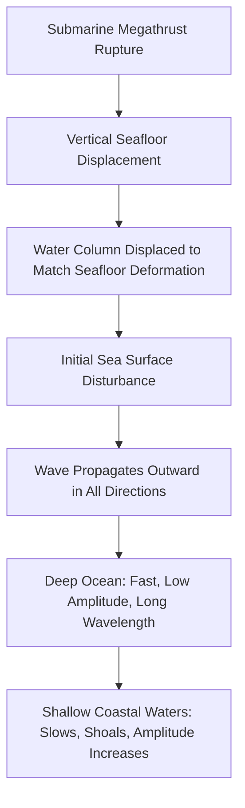
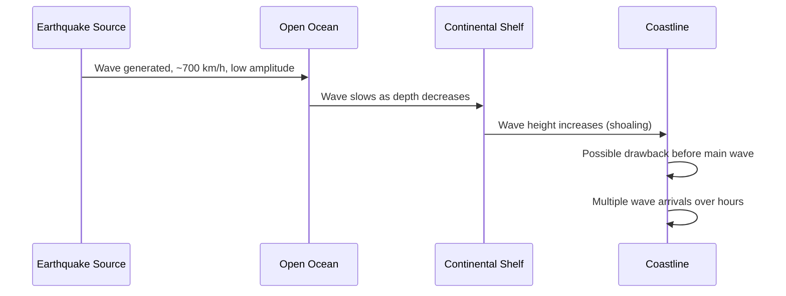

## Tsunami Generation and Behavior

### Definition and Overview

A tsunami is a series of long-wavelength ocean waves generated by the rapid, large-scale vertical displacement of a water column, most commonly resulting from submarine earthquakes but also from volcanic eruptions, landslides, and other impulsive disturbances. Unlike wind-generated waves, tsunamis are characterized by extremely long wavelengths (tens to hundreds of kilometers) and periods (minutes to over an hour), causing them to behave fundamentally differently in propagation, shoaling, and coastal impact.

### Generation Mechanisms

#### Seismogenic Tsunamis

**Key Points**

- The dominant cause of significant tsunamis globally, generated by large, shallow submarine earthquakes—predominantly megathrust events at subduction zone convergent boundaries
- The critical factor is co-seismic vertical seafloor displacement, not earthquake magnitude alone; the overlying water column is displaced to mirror the seafloor deformation nearly instantaneously relative to wave propagation timescales
- **Thrust/reverse fault mechanisms** (characteristic of subduction zones) produce substantial vertical displacement and are highly efficient tsunami generators
- **Strike-slip fault mechanisms** produce primarily horizontal displacement with minimal vertical seafloor change, and therefore typically generate much smaller tsunamis relative to their magnitude, though this relationship is not absolute and depends on the specific rupture geometry [Inference — tsunami generation efficiency depends on the specific slip vector and seafloor geometry rather than magnitude alone]
- Rupture width, dip angle, depth, and the presence of a shallow, weakly consolidated accretionary wedge at the trench can influence the efficiency of vertical displacement transfer to the water column

#### Landslide-Generated Tsunamis

- Submarine or coastal landslides, whether triggered by seismic shaking or occurring independently, can displace water volume and generate tsunami waves
- Can produce highly localized but severe run-up, sometimes disproportionate to the triggering earthquake's magnitude, since the landslide itself—not the earthquake rupture directly—is the primary energy source
- The 1958 Lituya Bay, Alaska event, where a seismically triggered rockslide generated an extreme localized wave, is frequently cited as an example of the disproportionate local run-up landslide mechanisms can produce relative to open-ocean tsunami behavior [Unverified — specific run-up height figures for historical events vary somewhat across sources and measurement methodologies]

#### Volcanic Tsunamis

- Generated through several distinct sub-mechanisms: caldera collapse, pyroclastic flow entry into water, submarine explosive eruption, or edifice flank collapse
- Can exhibit atmospheric-coupled wave generation in the case of very large explosive eruptions, where the eruption's atmospheric pressure wave itself couples with and drives ocean wave generation across a much wider area than direct water displacement alone would produce—a mechanism notably documented following the 2022 Hunga Tonga–Hunga Haʻapai eruption [Unverified — this atmospheric-coupling mechanism and its relative contribution compared to direct water displacement was still an active area of post-event scientific analysis]

#### Other Generation Mechanisms

- Meteorite impacts (rare, primarily of geological/paleo-historical significance)
- Meteotsunamis: generated by atmospheric pressure disturbances (fast-moving weather fronts) rather than seismic or mass-movement sources; mechanistically distinct despite producing superficially similar coastal impacts

### Wave Propagation Physics

#### Shallow-Water Wave Behavior

**Key Points**

- Tsunamis behave as **shallow-water waves** throughout almost their entire open-ocean propagation, since their wavelength (tens to hundreds of km) vastly exceeds typical ocean depth (a few km)—a wave is classified as "shallow-water" when wavelength exceeds roughly 20 times the water depth
- Under shallow-water wave theory, propagation speed depends only on water depth, not wavelength or wave height:

$$v = \sqrt{gh}$$

where $v$ is wave speed, $g$ is gravitational acceleration ($9.81 \text{ m/s}^2$), and $h$ is water depth

- In typical open-ocean depths of approximately 4,000 m, this yields speeds around 700 km/h, comparable to commercial jet aircraft, while open-ocean wave height is often less than 1 meter and therefore imperceptible to ships at sea [Inference — exact speed and amplitude figures vary with actual local bathymetry and source characteristics]

**Example**

For an open-ocean depth of $h = 4{,}000 \text{ m}$:

$$v = \sqrt{9.81 \times 4000} \approx \sqrt{39{,}240} \approx 198 \text{ m/s} \approx 713 \text{ km/h}$$

For a shallower coastal shelf depth of $h = 50 \text{ m}$:

$$v = \sqrt{9.81 \times 50} \approx \sqrt{490.5} \approx 22.1 \text{ m/s} \approx 80 \text{ km/h}$$

This illustrates the dramatic deceleration as the wave approaches shore.

#### Shoaling and Amplitude Growth

- As the wave enters shallower water, its speed decreases proportionally to $\sqrt{h}$, and by conservation of energy flux, wave height increases correspondingly (energy flux must remain approximately constant along the wave's path in the absence of significant dissipation)
- A simplified relationship (Green's Law) approximates this shoaling amplification as:

$$\frac{H_2}{H_1} = \left(\frac{h_1}{h_2}\right)^{1/4}$$

where $H_1$, $h_1$ are wave height and depth at an initial location, and $H_2$, $h_2$ are the corresponding values at a shallower location; this relationship is a simplified approximation and real coastal run-up is further modified by local bathymetry, coastline geometry, and nonlinear effects near shore that are not captured by this idealized relation [Inference — actual run-up heights depend heavily on complex, site-specific coastal and bathymetric factors beyond this simplified formula]

#### Refraction and Coastal Focusing

- Tsunami waves refract (bend) as they cross regions of varying depth, similar to the refraction of other wave types at velocity discontinuities, following principles analogous to Snell's Law
- Headlands, underwater ridges, and converging bathymetric contours can focus wave energy, producing locally amplified run-up at specific coastal points while adjacent areas experience comparatively reduced impact
- Bay and harbor geometry can further amplify wave height through resonance effects when the natural oscillation period of the enclosed water body coincides with the incoming wave period

### Coastal Impact Phenomena

#### Run-up and Inundation

- **Run-up height**: the maximum vertical elevation above sea level reached by tsunami water on land, distinct from the wave height measured offshore
- **Inundation distance**: the horizontal extent of coastal flooding, dependent on run-up height combined with coastal topography (gentle slopes permit much greater inland penetration than steep coastlines)
- A tsunami typically arrives not as a single breaking wave but as a rapidly rising and falling sea level (a surging flood), followed by multiple subsequent waves, which are not necessarily smaller than the first arrival

#### Drawback

- In many cases, the sea level initially recedes dramatically before the main wave arrives, exposing the seafloor, as the trough of the tsunami wave train reaches shore first
- This phenomenon has historically been documented as a natural warning sign preceding wave arrival, though it does not occur in every tsunami event, since it depends on the leading-edge polarity of the wave train, which is source-dependent [Inference — the presence or absence of an initial drawback is determined by the specific rupture geometry and cannot be assumed to occur universally as a precursor]

#### Multiple Wave Arrivals

- Tsunami wave trains typically consist of multiple successive waves, sometimes over a period of many hours, resulting from reflection, refraction, and the finite length of the generating source
- The largest wave in the sequence is not necessarily the first arrival, which is a significant factor in post-event safety, since perceived "all-clear" conditions after an initial, smaller wave can be misleading

### Tsunami Warning and Monitoring Systems

**Key Points**

- **Deep-ocean pressure sensors** (e.g., DART — Deep-ocean Assessment and Reporting of Tsunamis buoys) detect the passage of a tsunami wave in open water via bottom pressure changes, transmitting data via surface buoy to satellite in near-real time
- **Coastal tide gauges** confirm tsunami arrival and measure wave characteristics at the shoreline, though by definition only after the wave has already reached a monitored coastal point
- **Seismic-based rapid magnitude and location estimation** provides the initial warning trigger, since a tsunami warning must be issued before the wave itself can be directly observed for events threatening nearby coastlines
- Warning system effectiveness for near-source coastal communities is fundamentally constrained by the limited time between earthquake occurrence and wave arrival (potentially only minutes for coastlines very close to the source), making immediate self-evacuation based on strong shaking or natural warning signs (drawback, roaring sound) critical in addition to formal alert systems [Behavior may vary substantially by regional warning system infrastructure and coastal proximity to potential source zones]

### Notable Tsunamigenic Events (Illustrative Context)

| Event | Year | Mechanism | Notable Characteristic |
| --- | --- | --- | --- |
| Sumatra-Andaman ($M_w$ ~9.1–9.3) | 2004 | Megathrust subduction | Basin-wide devastation across Indian Ocean |
| Tōhoku, Japan ($M_w$ ~9.0–9.1) | 2011 | Megathrust subduction | Extensive run-up despite advanced warning infrastructure |
| Lituya Bay, Alaska | 1958 | Seismically triggered rockslide | Extreme localized run-up from landslide mechanism |
| Hunga Tonga eruption | 2022 | Volcanic, with atmospheric coupling | Wave effects observed at anomalously distant locations |

[Inference — specific magnitude and run-up figures for these events are drawn from general scientific consensus but individual measurements vary slightly across different reporting agencies and studies]

### Conclusion

Tsunami generation and behavior are governed by the physics of long-wavelength shallow-water waves, distinguishing them fundamentally from ordinary wind-driven ocean waves in both propagation speed and coastal impact mechanism. While large, shallow, thrust-mechanism submarine earthquakes at subduction zones represent the primary generation source for the most destructive tsunamis, landslide and volcanic mechanisms can produce disproportionately severe localized effects. Understanding the relationship between water depth and wave speed explains both the remarkable open-ocean propagation velocity and the dramatic shoaling amplification that occurs as waves approach shore, while coastal geometry, bathymetric focusing, and multiple wave arrivals combine to create the complex and often counterintuitive coastal impact patterns observed during actual tsunami events.

**Related Topics**

- Causes and mechanisms of earthquakes
- Earthquake hazards and ground effects
- Plate tectonics and subduction zone processes
- Coastal geomorphology and inundation mapping
- Tsunami warning system architecture (DART buoys, seismic triggers)
- Volcanic hazards and eruption mechanisms
- Submarine landslide processes
- Probabilistic tsunami hazard analysis