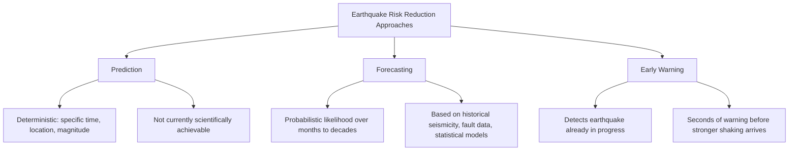
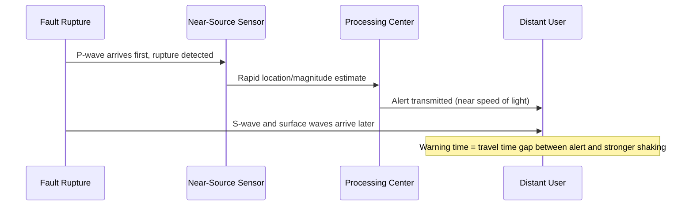

## Earthquake Forecasting and Early Warning

### Definition and Overview

Earthquake forecasting and early warning are distinct scientific and technological approaches to reducing seismic risk, frequently conflated in public discourse but fundamentally different in method, timescale, and output. **Forecasting** provides probabilistic estimates of earthquake likelihood over extended future time windows (months to decades), while **early warning** detects an earthquake that has already begun rupturing and issues alerts in the seconds before more damaging shaking arrives at a given location. Neither should be confused with **prediction**, which would require deterministic specification of time, location, and magnitude—a capability not currently achieved by scientific methods.

### The Prediction Problem: Why Deterministic Prediction Remains Unachieved

**Key Points**

- No precursor signal—including foreshock patterns, radon gas emission, electromagnetic anomalies, or animal behavior—has been validated as consistently and reliably predictive of an impending earthquake across rigorous scientific testing [Inference — this reflects current scientific consensus; research into potential precursors continues but has not yielded a validated operational prediction method]
- Foreshocks can only be identified retrospectively, after the larger mainshock occurs; at the time a small earthquake happens, there is no reliable method to distinguish whether it is an isolated event or the precursor to a larger rupture
- The fundamental physical unpredictability may stem from the chaotic, threshold-dependent nature of fault rupture initiation, where minute variations in local stress and frictional conditions can determine whether a rupture remains small or cascades into a large event
- High-profile prediction attempts, most notably the Parkfield Earthquake Prediction Experiment in California (initiated in the 1980s based on an apparent recurrence pattern), did not successfully predict the eventual 2004 Parkfield earthquake within the originally forecast window, illustrating the practical difficulty of the endeavor [Unverified — specific programmatic details and outcome interpretations of historical prediction experiments vary somewhat across retrospective analyses]

### Earthquake Forecasting

#### Statistical and Probabilistic Models

**Key Points**

- Forecasting relies on long-term earthquake catalogs, geological slip-rate data, and paleoseismic trenching results to estimate the probability of earthquakes of a given magnitude occurring in a specified region over a defined future time period
- The **Gutenberg-Richter relationship** provides a foundational statistical basis, describing the empirical relationship between earthquake magnitude and frequency:

$$\log_{10} N = a - bM$$

where $N$ is the cumulative number of earthquakes with magnitude greater than or equal to $M$, and $a$ and $b$ are regionally calibrated constants ($b$ typically close to 1.0, though it varies by tectonic setting)

- **Time-dependent probability models** incorporate the elastic rebound concept, adjusting probability estimates based on time elapsed since the last major rupture on a given fault segment relative to its estimated average recurrence interval
- Comprehensive regional models such as the Uniform California Earthquake Rupture Forecast (UCERF) integrate multiple fault sources, geodetic strain data, and statistical clustering models to produce long-term probabilistic hazard estimates used directly in building code development

#### Aftershock Forecasting

- Unlike mainshock prediction, aftershock behavior follows well-established statistical patterns that support meaningful short-term probabilistic forecasting
- **Omori's Law** describes the temporal decay of aftershock frequency following a mainshock:

$$n(t) = \frac{K}{(t + c)^p}$$

where $n(t)$ is the rate of aftershocks at time $t$ after the mainshock, and $K$, $c$, $p$ are empirically fitted constants (with $p$ typically near 1)

- Agencies such as the USGS routinely issue aftershock probability forecasts following significant earthquakes, providing the public and emergency managers with statistically grounded expectations for continued seismicity, distinct from any claim of deterministic prediction

#### Operational Earthquake Forecasting (OEF)

- A relatively modern framework in which forecast probabilities are updated in near-real time as new seismicity occurs, communicated to the public and emergency management agencies through standardized, transparent probabilistic statements
- Explicitly avoids the framing of "prediction," instead presenting time-varying probability changes (e.g., "the probability of a damaging earthquake in the next week has temporarily increased from X% to Y% following recent activity")
- Represents current best scientific practice for communicating elevated but non-deterministic short-term risk following notable seismic activity [Inference — specific operational implementations and communication protocols vary by country and responsible agency]

### Earthquake Early Warning (EEW) Systems

#### Fundamental Principle

**Key Points**

- EEW exploits the physical fact that P-waves travel faster than the more damaging S-waves and surface waves; a network of sensors near the fault detects the P-wave onset and rapidly estimates location and magnitude, then issues an alert to more distant locations before the slower, higher-amplitude waves arrive there
- This is fundamentally a **detection-and-alert** system, not a prediction system—the earthquake has already begun rupturing before any warning is issued
- The warning time available at a given location is directly proportional to its distance from the epicenter, since more distant locations gain a longer interval between P-wave detection and S-wave/surface-wave arrival; locations very close to the epicenter may receive little to no useful warning time [Behavior may vary substantially by regional network density and epicentral distance]

#### System Architecture Components

- **Dense seismic sensor network**: accelerometers and/or broadband seismometers positioned to provide rapid, redundant detection near likely source regions, with sufficient density to enable fast, reliable location and magnitude estimation from only the first few seconds of P-wave data
- **Rapid processing algorithms**: estimate earthquake location, magnitude, and expected ground-motion intensity at target locations within seconds of initial detection, often using onset characteristics of the P-wave itself (e.g., peak displacement or frequency content in the first few seconds) rather than waiting for a complete waveform
- **Alert dissemination infrastructure**: transmits warnings via cell broadcast, dedicated applications, television/radio interruption, and automated triggers for critical infrastructure (e.g., automatically stopping high-speed trains, opening elevator doors at nearest floor, halting precision manufacturing processes)
- **Decision logic and thresholds**: systems must balance warning sensitivity (minimizing missed damaging events) against false-alarm rate, since excessive false or unnecessary alerts can erode public trust and compliance over time [Inference — the specific algorithmic thresholds and trade-offs are implementation-specific and continuously refined based on operational performance data]

#### Notable Operational Systems

| System | Region | Notable Characteristic |
| --- | --- | --- |
| ShakeAlert | United States (West Coast) | Public alerting integrated with mobile OS-level notifications |
| Earthquake Early Warning (EEW) | Japan | Long-operating system integrated with transportation and industrial automation |
| SASMEX | Mexico | Historically notable for early warning ahead of Mexico City shaking from distant coastal subduction events |
| Various regional systems | Multiple countries (e.g., Taiwan, South Korea) | Implementation details vary by network density and alerting infrastructure |

[Unverified — specific technical implementation details, current operational status, and coverage areas of these systems are subject to ongoing development and should be confirmed against current official documentation for precise, up-to-date specifications]

#### Limitations of Early Warning

**Key Points**

- **Blind zone**: locations very close to the epicenter may experience strong shaking before any alert can be processed and transmitted, since the time required for detection and processing can exceed the S-wave travel time over short distances
- **Magnitude underestimation for very large earthquakes**: rapid algorithms based on only the first few seconds of P-wave data can, in some cases, underestimate the eventual magnitude of an exceptionally large rupture that continues to grow after the initial alert is issued, since final magnitude depends on total rupture extent that may not be apparent from onset characteristics alone [Inference — this is a recognized technical challenge in EEW algorithm design and its practical impact varies by system and specific algorithm employed]
- **False and missed alerts**: like any real-time detection system operating on noisy, incomplete initial data, EEW systems are subject to occasional false positives (alerts issued for events that do not produce significant shaking at the alerted location) and missed detections, with performance continuously refined through operational experience
- Early warning does not prevent an earthquake or reduce its physical severity; it only provides a brief window (seconds to, at most, roughly a minute for very distant locations) for protective actions such as "drop, cover, and hold on," automated system shutdowns, or pausing sensitive operations

### Distinguishing Forecasting, Early Warning, and Prediction

| Aspect | Forecasting | Early Warning | Prediction (Unachieved) |
| --- | --- | --- | --- |
| Timescale | Months to decades ahead | Seconds before strong shaking | Would specify exact future time |
| Basis | Statistical/probabilistic models | Real-time detection of an occurring rupture | Would require reliable precursor signal |
| Output | Probability of occurrence | Alert of imminent shaking | Deterministic time/location/magnitude |
| Scientific status | Operationally established | Operationally established | Not currently achieved |

### Conclusion

Earthquake forecasting and early warning represent scientifically validated, operationally deployed approaches to seismic risk reduction, distinct from the still-unachieved goal of deterministic earthquake prediction. Forecasting leverages statistical relationships—the Gutenberg-Richter law, time-dependent recurrence models, and aftershock decay patterns (Omori's Law)—to produce probabilistic risk estimates over extended timeframes, informing building codes and long-term planning. Early warning systems exploit the physical velocity difference between P-waves and more damaging later-arriving waves, providing a brief but operationally valuable window for automated and personal protective action. Both approaches share a common foundation in the fundamental unpredictability of exact earthquake timing at the individual-event level, and both continue to be refined through advances in network density, processing algorithms, and communication infrastructure.

**Related Topics**

- Causes and mechanisms of earthquakes
- Earthquake location and magnitude scales
- Seismographs and seismic networks
- Probabilistic seismic hazard analysis (PSHA)
- Gutenberg-Richter relationship and seismicity statistics
- Aftershock sequence characterization
- Seismic building codes and earthquake-resistant design
- Paleoseismology and fault recurrence intervals