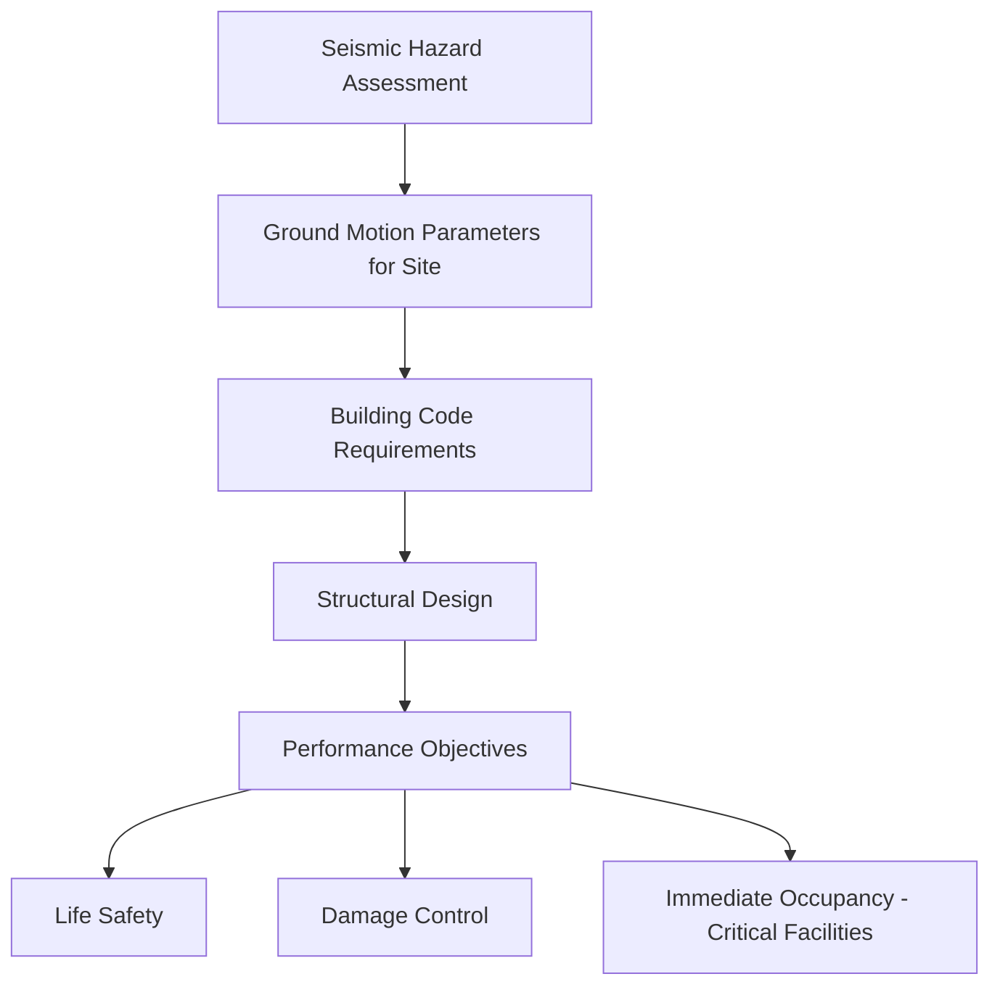

## Seismic Design and Building Codes

### Definition and Overview

Seismic design is the engineering discipline concerned with ensuring that structures can withstand earthquake-induced ground motion without collapse and, depending on the performance objective, with limited damage. Building codes formalize seismic design requirements into legally enforceable standards, translating probabilistic hazard assessments and structural engineering principles into prescriptive and performance-based requirements for construction. This field sits at the intersection of seismology, geotechnical engineering, and structural engineering.

### Foundational Design Philosophy

#### Performance-Based Objectives

**Key Points**

- Modern seismic codes are generally organized around tiered performance objectives rather than a single uniform standard, since designing every structure to remain fully undamaged in the largest conceivable earthquake would be economically impractical for ordinary buildings
- Common performance tiers include: **Immediate Occupancy** (minimal damage, building remains usable immediately after the event—typically required for hospitals, emergency response facilities, and other critical infrastructure), **Life Safety** (significant damage may occur, but structural collapse is prevented and occupants can safely exit—the standard objective for most ordinary buildings), and **Collapse Prevention** (extensive damage expected, but the structure does not collapse, applied as a baseline for very rare, extreme shaking scenarios)
- This tiered approach reflects a risk-based cost-benefit philosophy: the acceptable probability of damage is calibrated against the consequences of failure and the frequency of the design-level ground motion [Inference — the specific tier assigned to a given building type is a codified engineering and policy decision that varies somewhat between jurisdictions]

#### The Ductility Concept

- A central principle in seismic design is that structures are generally not designed to remain fully elastic (undamaged) during the maximum considered earthquake, since this would require impractically large member sizes and cost
- Instead, structures are designed with **ductility**—the capacity to undergo significant inelastic deformation and absorb seismic energy through controlled, predictable yielding (typically in designated structural elements) without loss of overall load-carrying capacity or collapse
- This principle is captured in the **response modification factor** (commonly denoted $R$ in codes such as ASCE 7), which allows design forces to be reduced below the theoretical elastic demand, in recognition of the structure's ability to dissipate energy through ductile behavior:

$$V_{design} = \frac{V_{elastic}}{R}$$

where $V_{design}$ is the reduced design base shear used for member sizing, $V_{elastic}$ is the theoretical force demand if the structure remained fully elastic, and $R$ is the system-specific response modification factor (higher for more ductile systems, such as properly detailed steel moment frames, and lower for inherently brittle systems, such as unreinforced masonry) [Inference — specific $R$ values are code- and jurisdiction-specific and are periodically revised based on updated research and observed earthquake performance]

### Ground Motion Characterization for Design

#### Design Response Spectrum

**Key Points**

- Rather than designing for a single specific recorded earthquake, codes specify a **design response spectrum**: a curve of expected spectral acceleration versus structural period, representing the envelope of anticipated shaking demand for structures of different natural periods (heights/stiffnesses) at a given site
- Derived from probabilistic seismic hazard analysis (PSHA), typically anchored to a specified probability of exceedance over a defined time period (e.g., ground motion with a 2% probability of exceedance in 50 years, corresponding to an average return period of approximately 2,475 years, is a common basis for "maximum considered earthquake" ground motions in several modern codes) [Unverified — exact probability/return-period conventions and terminology vary between specific code editions and jurisdictions and should be confirmed against the applicable current code]
- The natural period of a structure ($T$) is a key parameter, since taller/more flexible buildings respond differently to a given ground motion than short/stiff structures, generally described approximately by:

$$T \approx C_t h_n^x$$

where $h_n$ is building height and $C_t$, $x$ are empirical coefficients depending on structural system type

#### Site Effects Integration

- Local soil conditions substantially modify bedrock ground motion through amplification and resonance effects, so codes require site classification (typically based on average shear-wave velocity in the upper 30 meters, denoted $V_{s30}$) to apply appropriate site amplification factors to the base design spectrum
- Softer soil sites generally require higher design forces at longer structural periods due to amplification, while very soft or liquefiable soils may require specialized geotechnical investigation and potentially site-specific ground response analysis beyond the standard code procedure

### Structural Design Approaches

#### Force-Based (Equivalent Lateral Force) Procedure

- The traditional and still widely used simplified design approach, in which the total seismic base shear is calculated as an equivalent static horizontal force applied to the structure, distributed vertically according to a simplified formula reflecting the building's mass and height distribution
- Computationally efficient and suitable for regular, low-to-moderate height structures, but represents a simplification of the true dynamic, multi-mode response of a real structure to actual ground shaking

#### Dynamic Analysis Procedures

- **Response spectrum analysis**: combines the structure's multiple vibration modes with the design response spectrum to more accurately capture dynamic response, generally required for taller or structurally irregular buildings where the simplified static procedure is less applicable
- **Nonlinear time-history analysis**: applies actual or synthetic ground motion time-history records directly to a detailed nonlinear structural model, capturing inelastic behavior explicitly rather than through simplified reduction factors; typically reserved for critical, unusual, or very tall structures given its significantly higher computational and modeling effort

#### Structural Irregularity Considerations

**Key Points**

- Codes explicitly identify and penalize structural irregularities that concentrate seismic damage or produce unpredictable response, including:
  - **Soft-story irregularity**: a story (often a ground floor with large openings for parking or retail) with substantially lower lateral stiffness than stories above, concentrating deformation and damage at that level—a well-documented cause of catastrophic collapse in multiple historical earthquakes
  - **Torsional irregularity**: asymmetric distribution of mass or stiffness causing the building to twist as well as sway during shaking, complicating force distribution among structural elements
  - **Vertical discontinuities**: abrupt changes in structural framing, mass, or geometry between adjacent stories, disrupting the smooth load path assumed in simplified design procedures
- Structures with significant irregularities typically require more rigorous (dynamic) analysis procedures and, in some cases, additional design force penalties rather than being permitted to use the simplified equivalent lateral force method [Inference — specific irregularity thresholds and required analysis procedures are code-specific and subject to periodic revision]

### Seismic Design Elements and Systems

#### Lateral Force-Resisting Systems

| System Type | Mechanism | General Characteristic |
| --- | --- | --- |
| Moment-resisting frames | Rigid beam-column connections resist lateral force through frame bending | Generally higher ductility, more flexible |
| Braced frames | Diagonal bracing elements carry lateral force primarily in axial tension/compression | Stiffer, often less ductile than moment frames unless specially detailed |
| Shear walls | Solid or perforated walls resist lateral force through in-plane shear and bending | Common in residential and mid-rise construction |
| Base isolation | Flexible bearings decouple building superstructure from ground motion | Reduces force transmitted to structure; used for critical facilities |
| Dampers (tuned mass, viscous, friction) | Supplemental energy dissipation devices reduce dynamic response | Increasingly used in tall or critical structures |

#### Base Isolation and Supplemental Damping

- **Base isolation** places flexible bearings (commonly laminated rubber or friction pendulum systems) between a structure and its foundation, effectively lengthening the structure's fundamental period and shifting it away from the dominant energy content of typical earthquake ground motion, substantially reducing force transmitted into the superstructure
- **Supplemental damping devices** (viscous dampers, tuned mass dampers, friction dampers) are incorporated into a structure's lateral system to dissipate seismic energy through mechanisms independent of the primary structural framing, reducing displacement demand and structural damage
- Both approaches are more commonly applied to critical facilities, essential infrastructure, and increasingly to tall buildings, given their higher initial cost relative to conventional ductile design approaches [Inference — specific application thresholds and cost-benefit determinations vary by project and jurisdiction]

### Nonstructural Component Considerations

- Seismic codes also address nonstructural elements—mechanical/electrical equipment, ceiling systems, partition walls, and building contents—since nonstructural damage frequently represents a substantial portion of total earthquake losses and can pose direct life-safety hazards (e.g., falling equipment, blocked egress routes) even when the primary structural system performs adequately
- Anchorage and bracing requirements for nonstructural components are typically specified as a function of the component's weight, location within the building (with higher demands at upper floors due to dynamic amplification), and the criticality of maintaining its function after an earthquake

### Code Development and Regional Variation

**Key Points**

- Modern seismic codes are typically developed and periodically updated by national or international standards bodies, incorporating lessons learned from post-earthquake damage investigations, updated seismic hazard mapping, and advances in structural engineering research
- Code requirements vary significantly by region, reflecting differing levels of seismic hazard, construction practices, economic context, and historical experience with damaging earthquakes; a code appropriate for a high-seismicity region would generally be excessively conservative (and costly) if applied uniformly to a low-seismicity region, and vice versa [Inference — specific code adoption and regional calibration practices vary by country and are subject to periodic revision]
- Retrofit of existing, older structures built prior to modern seismic provisions represents a distinct and often more complex engineering and policy challenge compared to new construction, since retrofitting must work within the constraints of existing structural configurations rather than optimizing design from the outset

### Conclusion

Seismic design and building codes translate the probabilistic understanding of earthquake hazard into concrete engineering requirements aimed at protecting life safety and, for critical facilities, maintaining functionality after significant ground shaking. The discipline rests on the recognition that most structures cannot economically be designed to remain fully undamaged in the largest possible earthquake, leading to a ductility-based design philosophy that permits controlled inelastic behavior while preventing collapse. From site-specific ground motion characterization and structural irregularity provisions to advanced technologies such as base isolation and supplemental damping, modern seismic design integrates hazard science, geotechnical site characterization, and structural engineering into a continuously evolving framework shaped by lessons learned from observed earthquake performance.

**Related Topics**

- Earthquake hazards and ground effects
- Probabilistic seismic hazard analysis (PSHA)
- Earthquake location and magnitude scales
- Ground motion prediction equations (GMPEs)
- Seismic retrofit of existing structures
- Soil-structure interaction and site response analysis
- Base isolation and supplemental damping technologies
- Post-earthquake damage assessment and reconnaissance