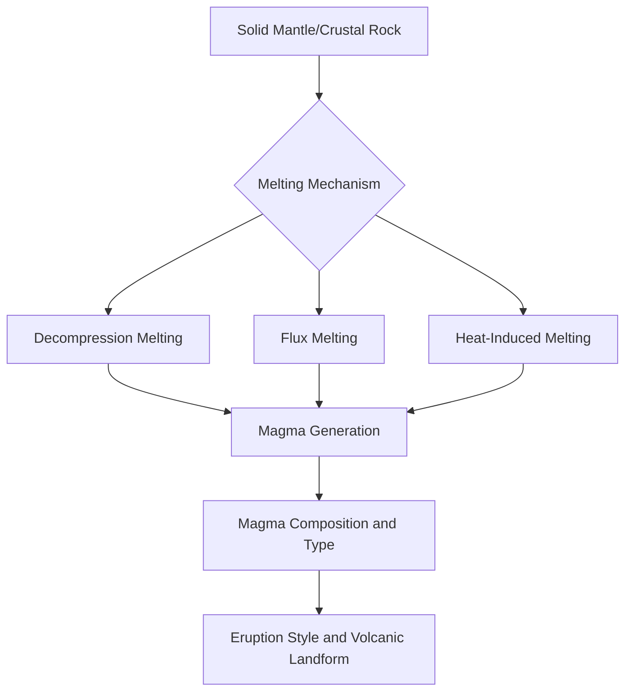
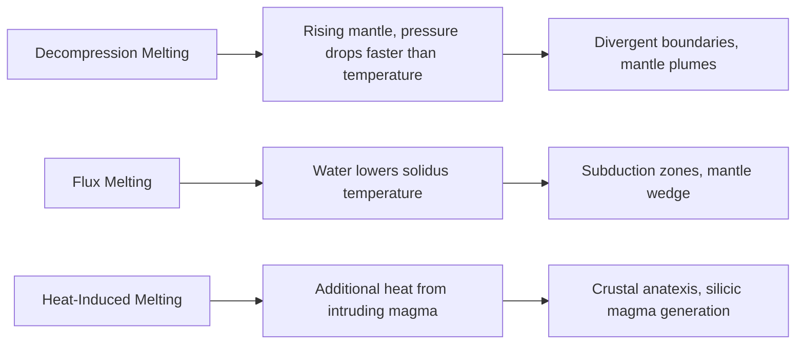
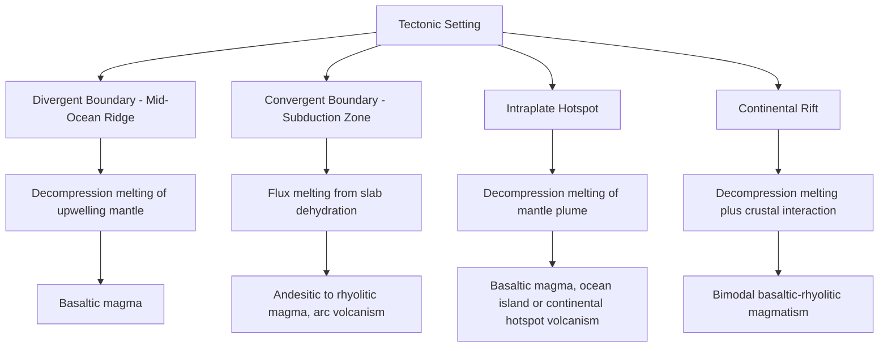

## Magma Types and Formation

### Definition and Overview

Magma is molten or partially molten rock generated within Earth's crust or upper mantle, typically containing a mixture of liquid melt, suspended crystals, and dissolved volatile gases. Its formation, composition, and physical behavior fundamentally control volcanic eruption style, associated hazards, and the resulting igneous rock types. Understanding magma genesis requires integrating principles of mineral melting behavior, mantle and crustal composition, and thermodynamic conditions of pressure and temperature at depth.

### Fundamental Melting Mechanisms

Rock melting within Earth is not simply a matter of temperature alone; it results from the interplay of pressure, temperature, and volatile (particularly water) content relative to a rock's solidus (the temperature at which melting begins for a given pressure and composition).

#### Decompression Melting

**Key Points**

- Occurs when hot mantle material rises toward the surface, and pressure decreases faster than temperature, causing the rock's melting point (solidus) to drop below its actual temperature
- The primary mechanism generating magma at **divergent plate boundaries** (mid-ocean ridges) and at **mantle plume/hotspot** settings, where mantle material ascends passively or actively toward the surface
- Does not require any additional heat input; the rock's temperature remains essentially constant during ascent, but its melting threshold decreases due to reduced confining pressure

#### Flux Melting (Water-Induced Melting)

- Occurs when water or other volatiles are introduced into hot mantle rock, substantially lowering its solidus temperature and inducing melting without requiring additional heat
- The dominant mechanism at **subduction zones**, where water bound in hydrous minerals within the subducting oceanic plate (and overlying sediments) is released through progressive dehydration reactions as the slab descends and heats
- Released water rises into the overlying mantle wedge, triggering flux melting and generating the magma that feeds volcanic arcs

#### Heat-Induced (Decompression-Independent) Melting

- Occurs when additional heat is directly transferred into crustal or mantle rock, most commonly from an underlying mantle-derived magma body intruding into and heating surrounding crustal rock
- A significant mechanism for generating silica-rich magmas through partial melting of continental crust, particularly above subduction zones or mantle plumes where mantle-derived basaltic magma provides the heat source (sometimes termed "hybrid" or crustal anatexis processes)

### Partial Melting and Source Rock Composition

**Key Points**

- Mantle and crustal rocks are not uniform single minerals but assemblages of multiple mineral phases with differing melting temperatures; heating or decompression typically causes only **partial melting**, where minerals with lower melting points melt first while the rock does not become entirely liquid
- The degree of partial melting directly influences resulting magma composition: low degrees of partial melting (a few percent) tend to produce melts enriched in incompatible elements and typically more silica-rich relative to the source rock, while higher degrees of partial melting produce melts compositionally closer to the bulk source rock composition [Inference — the precise compositional relationship depends on the specific mineralogy and trace-element partitioning behavior of the source rock and is a matter of active petrological research for many specific settings]
- The primary source rock for most mantle-derived magma is **peridotite**, an ultramafic rock composing the bulk of Earth's upper mantle; partial melting of peridotite typically yields basaltic magma

### Fractional Crystallization and Magma Differentiation

**Key Points**

- As magma cools, minerals crystallize sequentially according to their individual crystallization temperatures, broadly following the **Bowen's Reaction Series**, in which higher-temperature minerals (e.g., olivine, calcium-rich plagioclase) crystallize first, followed by progressively lower-temperature minerals as cooling continues
- If crystals are physically separated from the remaining melt (through settling, filter pressing, or other mechanisms), the residual liquid becomes progressively depleted in the elements incorporated into the earlier-formed crystals and enriched in others, driving the melt composition toward more silica-rich compositions over time—this process is termed **fractional crystallization**
- This mechanism, combined with partial melting degree and potential crustal contamination/magma mixing, explains why a single parental basaltic magma derived from the mantle can, through progressive differentiation, ultimately produce a range of more evolved magma compositions within a single volcanic system

<svg xmlns="http://www.w3.org/2000/svg" viewBox="0 0 700 380" font-family="sans-serif">
<text x="350" y="25" font-size="18" text-anchor="middle" font-weight="bold">Bowen's Reaction Series (svg_diagram)</text>
<line x1="150" y1="60" x2="150" y2="340" stroke="black" stroke-width="2" />
<text x="150" y="50" font-size="12" text-anchor="middle">High Temperature</text>
<text x="150" y="360" font-size="12" text-anchor="middle">Low Temperature</text>

<text x="280" y="70" font-size="13" font-weight="bold">Discontinuous Series</text>

<rect x="160" y="80" width="240" height="30" fill="`#8b4513`" stroke="black" />

<text x="280" y="100" font-size="12" text-anchor="middle" fill="white">Olivine</text>

<rect x="160" y="130" width="240" height="30" fill="#a0522d" stroke="black" />
<text x="280" y="150" font-size="12" text-anchor="middle" fill="white">Pyroxene</text>
<rect x="160" y="180" width="240" height="30" fill="#cd853f" stroke="black" />
<text x="280" y="200" font-size="12" text-anchor="middle">Amphibole</text>
<rect x="160" y="230" width="240" height="30" fill="#deb887" stroke="black" />
<text x="280" y="250" font-size="12" text-anchor="middle">Biotite Mica</text>

<text x="560" y="70" font-size="13" font-weight="bold">Continuous Series</text>

<rect x="440" y="80" width="240" height="180" fill="`#d3d3d3`" stroke="black" />

<text x="560" y="130" font-size="11" text-anchor="middle">Ca-rich Plagioclase</text>

<text x="560" y="150" font-size="11" text-anchor="middle">↓</text>

<text x="560" y="170" font-size="11" text-anchor="middle">Intermediate Plagioclase</text>

<text x="560" y="190" font-size="11" text-anchor="middle">↓</text>

<text x="560" y="210" font-size="11" text-anchor="middle">Na-rich Plagioclase</text>

<rect x="160" y="280" width="240" height="30" fill="#f4a460" stroke="black" />
<text x="280" y="300" font-size="12" text-anchor="middle">K-Feldspar</text>
<rect x="160" y="315" width="240" height="20" fill="#ffe4b5" stroke="black" />
<text x="280" y="330" font-size="11" text-anchor="middle">Muscovite / Quartz</text>
</svg>

### Classification of Magma Types by Composition

Magma composition is most commonly classified by silica ($SiO_2$) content, which directly controls physical properties including viscosity, gas retention behavior, and eruption style.

#### Basaltic (Mafic) Magma

**Key Points**

- Silica content approximately 45–52 wt%; relatively high in iron, magnesium, and calcium; relatively low viscosity due to lower silica polymerization
- Typically erupts effusively (relatively non-explosively) due to low viscosity allowing volcanic gases to escape readily rather than building high internal pressure
- Dominant magma type at divergent boundaries (mid-ocean ridges) and ocean-island hotspot settings (e.g., Hawaiian volcanism)
- Characteristic eruption products include lava flows, shield volcano construction, and fire-fountaining phenomena

#### Andesitic (Intermediate) Magma

- Silica content approximately 52–63 wt%; intermediate composition, often resulting from a combination of partial melting, fractional crystallization, magma mixing, and crustal assimilation in subduction zone settings
- Intermediate viscosity produces moderately explosive to effusive behavior, commonly associated with **stratovolcano (composite cone)** construction
- The characteristic magma type of continental volcanic arcs, such as the Andes (the compositional term's namesake) and the Cascade Range

#### Rhyolitic (Felsic) Magma

- Silica content approximately 69% or greater; enriched in silica and aluminum relative to iron/magnesium, generally the most evolved product of extensive fractional crystallization and/or crustal partial melting
- High viscosity due to extensive silica polymerization strongly inhibits gas escape, frequently resulting in highly explosive eruptions when gas pressure exceeds the strength of the overlying magma or rock
- Associated with **caldera-forming eruptions**, pyroclastic flows, and volcanic domes; characteristic of large silicic volcanic systems such as Yellowstone

#### Comparative Summary

| Magma Type | Silica Content | Viscosity | Typical Eruption Style | Common Tectonic Setting |
| --- | --- | --- | --- | --- |
| Basaltic (mafic) | ~45–52 wt% | Low | Effusive | Divergent boundaries, hotspots |
| Andesitic (intermediate) | ~52–63 wt% | Moderate | Mixed effusive/explosive | Subduction zone arcs |
| Rhyolitic (felsic) | ~69%+ wt% | High | Highly explosive | Continental crust, caldera systems |

### The Role of Dissolved Volatiles

**Key Points**

- Magma contains dissolved volatile compounds, predominantly water vapor, carbon dioxide, and sulfur dioxide, which remain in solution under high confining pressure at depth
- As magma ascends and pressure decreases, volatile solubility drops, causing dissolved gases to exsolve (come out of solution) and form bubbles—a process directly analogous to the release of dissolved carbon dioxide when a pressurized beverage container is opened
- The efficiency of gas escape versus gas retention, governed largely by magma viscosity, is the principal control on whether an eruption proceeds effusively (gas escapes readily) or explosively (gas pressure builds until catastrophic release), making volatile content and viscosity together the dominant controls on eruption style [Inference — actual eruption dynamics also depend on conduit geometry, ascent rate, and crystallization behavior, which interact with the base compositional controls described here]

### Viscosity Controls

The physical behavior of magma is governed substantially by viscosity, which depends on several interacting factors:

$$\eta = f(\text{SiO}_2 \text{ content}, \text{temperature}, \text{crystal content}, \text{dissolved volatile content})$$

- **Silica content**: higher silica promotes polymerization (formation of interconnected silicate tetrahedra chains), substantially increasing viscosity
- **Temperature**: higher temperature generally decreases viscosity for a given composition, as increased thermal energy disrupts polymer chain structure
- **Crystal content**: a higher proportion of suspended crystals within the melt increases effective viscosity, analogous to the effect of suspended particles in any fluid
- **Dissolved volatile content**: paradoxically, higher dissolved water content can decrease melt viscosity while the water remains in solution (by disrupting silica polymer networks), though this reverses once volatiles exsolve as bubbles, which can then increase effective magma viscosity depending on bubble content and behavior [Inference — the net viscosity effect of volatile exsolution is complex and depends on bubble volume fraction, connectivity, and ascent conditions]

### Tectonic Settings and Associated Magma Genesis

### Conclusion

Magma formation results from the interaction of pressure, temperature, and volatile content relative to source rock melting behavior, occurring through three principal mechanisms: decompression melting at divergent boundaries and hotspots, flux melting at subduction zones, and heat-induced crustal melting adjacent to mantle-derived intrusions. The resulting magma composition—governed by source rock chemistry, degree of partial melting, and subsequent differentiation through fractional crystallization—falls along a compositional spectrum from basaltic to rhyolitic, directly controlling viscosity, volatile retention, and ultimately the explosive or effusive character of associated volcanic eruptions. This fundamental link between magma genesis, composition, and eruptive behavior underpins the classification of volcanic landforms and hazard assessment across all tectonic settings.

**Related Topics**

- Volcanic eruption styles and classification
- Volcanic landforms (shield volcanoes, stratovolcanoes, calderas)
- Plate tectonics and subduction zone processes
- Igneous rock classification and petrology
- Bowen's Reaction Series and magma differentiation
- Volcanic hazards and pyroclastic flow dynamics
- Hotspot and mantle plume volcanism
- Volcanic gas monitoring and eruption forecasting