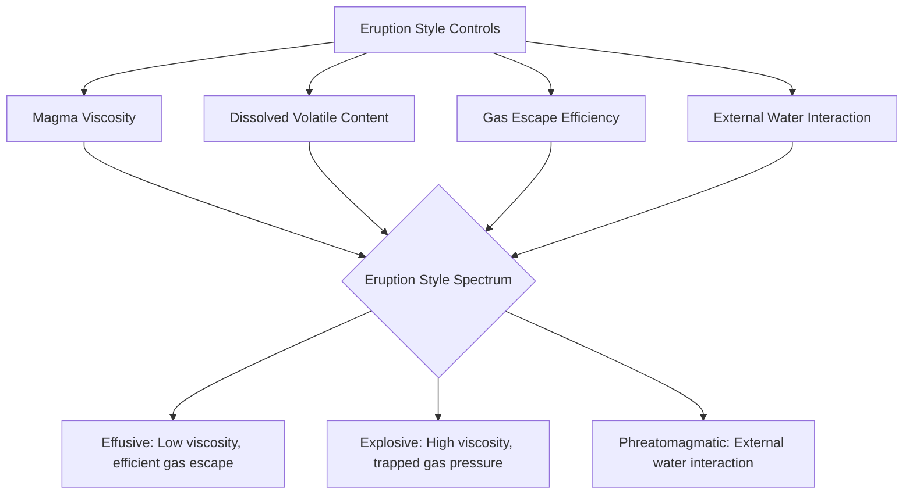

## Styles of Volcanic Eruption

### Definition and Overview

Volcanic eruption style refers to the physical manner in which magma and associated volcanic gases are expelled at Earth's surface, ranging from gentle, continuous lava effusion to violent, high-energy explosive events. Eruption style is fundamentally controlled by magma composition, viscosity, dissolved volatile content, and the rate at which gas can escape relative to magma ascent rate, though external factors such as interaction with groundwater or seawater can override these intrinsic controls entirely.

### Fundamental Control: Viscosity and Gas Escape

**Key Points**

- The central physical principle governing eruption style is the competition between the rate of gas bubble growth/ascent within the magma and the rate at which that gas can escape through the conduit or surrounding rock
- In low-viscosity (basaltic) magma, gas bubbles can rise and coalesce relatively freely, escaping to the surface with minimal resistance, resulting in effusive or mildly explosive activity
- In high-viscosity (silicic) magma, gas bubbles are trapped within the melt, unable to escape efficiently; continued ascent and decompression causes bubble volume to expand dramatically, building internal pressure until the surrounding magma or overlying rock fails catastrophically, producing violent fragmentation
- This relationship is often summarized by the ratio of gas escape rate to magma ascent rate, sometimes conceptualized through a dimensionless comparison of bubble growth timescale versus magma ascent timescale [Inference — precise quantitative thresholds separating effusive from explosive behavior depend on additional factors including conduit geometry and crystal content, and are not governed by a single universal numerical value]

### Effusive Eruptions

#### Hawaiian-Style Eruptions

**Key Points**

- Characterized by low-viscosity basaltic magma with relatively low gas content, producing gentle, continuous or intermittent lava effusion with minimal explosive fragmentation
- Associated phenomena include **lava fountains** (fire fountaining), where gas-rich basaltic magma produces sustained jets of lava droplets from a vent, and **lava lakes**, persistent bodies of molten lava within a crater or vent
- Named for its characteristic occurrence at Hawaiian shield volcanoes (e.g., Kīlauea), where eruptions typically produce extensive lava flow fields rather than significant explosive ash columns
- Associated hazards are primarily related to lava flow inundation of infrastructure and land, volcanic gas emissions (particularly sulfur dioxide, producing "vog"), and localized explosive hazards where lava interacts with water (see phreatomagmatic section below)

#### Strombolian Eruptions

- Characterized by rhythmic, discrete explosive bursts caused by large gas bubbles (termed "slugs") rising through moderately viscous basaltic-to-andesitic magma and bursting at the surface, ejecting incandescent lava fragments (bombs and lapilli) to modest heights
- Named for the persistently active Stromboli volcano in Italy, where this eruption style has been essentially continuous for a documented long duration, making it a widely used reference type example
- Represents an intermediate style between fully effusive Hawaiian activity and more sustained explosive activity, with discrete, cyclic bursts rather than continuous lava effusion or sustained explosive columns

### Explosive Eruptions

#### Vulcanian Eruptions

**Key Points**

- Short-duration, high-energy explosive bursts resulting from the fragmentation of a viscous magma plug or previously solidified crust blocking the vent, which is forcefully ejected once gas pressure beneath it exceeds the plug's structural strength
- Produces dense, ash-laden eruption columns and ballistic ejection of blocks and bombs, typically associated with andesitic-to-dacitic magma compositions
- Named for Vulcano volcano in Italy; individual Vulcanian explosions are typically brief (seconds to minutes) but can occur repeatedly over an eruptive episode

#### Plinian Eruptions

- The most powerful and sustained explosive eruption style, characterized by highly viscous, gas-rich, typically silicic (dacitic to rhyolitic) magma undergoing violent, sustained fragmentation
- Produces towering eruption columns that can reach the stratosphere (commonly tens of kilometers in height), driven by the intense thermal buoyancy of the erupting gas-pyroclast mixture entraining and heating surrounding atmospheric air
- Named after Pliny the Younger, who documented the 79 CE eruption of Mount Vesuvius that famously destroyed Pompeii and Herculaneum, providing the historical type description of this eruption style
- Sustained Plinian columns can persist for hours, generating widespread ashfall over large downwind areas and posing severe hazards to aviation, infrastructure, and agriculture across a broad regional footprint

**Sub-Plinian eruptions** represent a smaller-scale version of the same fundamental process, with lower eruption column heights and shorter duration but the same essential fragmentation mechanism.

#### Pyroclastic Density Currents

**Key Points**

- **Pyroclastic flows** are dense, hot (often several hundred degrees Celsius) mixtures of volcanic gas, ash, and rock fragments that travel down volcanic slopes at high velocity under gravity, generally representing one of the most lethal volcanic hazards due to their speed, temperature, and destructive capacity
- Commonly generated through two primary mechanisms: **column collapse**, where a sustained eruption column becomes too dense to maintain buoyant convective rise and collapses under gravity, and **dome collapse**, where an actively growing lava dome becomes gravitationally unstable and collapses, releasing pressurized gas-rich material
- **Pyroclastic surges** are a lower-density, more turbulent, gas-rich variant that can travel over irregular topography (including over water and hills) more readily than denser flows, though both mechanisms fall along a continuum of pyroclastic density current behavior rather than being strictly distinct categories [Inference — the precise boundary and classification terminology between "flow" and "surge" varies somewhat across the volcanological literature]
- The 1902 eruption of Mont Pelée, which produced a devastating pyroclastic flow that destroyed the city of Saint-Pierre, Martinique, is a frequently cited historical example illustrating the catastrophic potential of this hazard [Unverified — specific historical casualty figures vary somewhat across different historical sources]

### Phreatomagmatic and Phreatic Eruptions

#### Phreatomagmatic Eruptions

- Result from the direct interaction between rising magma and external water (groundwater, surface water, or seawater), causing rapid, highly efficient steam generation and explosive fragmentation independent of the magma's intrinsic gas content or viscosity
- Can occur with magma compositions (including basaltic magma) that would otherwise erupt effusively, since the explosive energy is driven primarily by the thermodynamics of rapid water-to-steam phase transition (sometimes termed a fuel-coolant interaction) rather than by magmatic gas exsolution alone
- Characteristic landforms include **maars** (broad, low-relief craters formed by phreatomagmatic explosions, often surrounded by a low tuff ring) and **tuff cones/rings**, distinct from the steeper cones built by purely magmatic explosive activity

#### Phreatic Eruptions

- Steam-driven explosions resulting from the heating of groundwater or hydrothermal fluids by underlying magma or hot rock, **without** the direct involvement of fresh magma being erupted at the surface
- Can occur with little or no immediate precursory warning signal detectable by standard monitoring, since they do not necessarily involve significant new magma ascent, making them a recognized challenge for eruption forecasting at volcanoes with active hydrothermal systems [Inference — the degree of precursory warning varies by specific volcanic system and monitoring network sophistication]
- Notable as a hazard specifically to visitors and infrastructure near volcanic craters with active hydrothermal systems, since these eruptions can occur at volcanoes not otherwise showing signs of imminent magmatic eruption

### Other Notable Eruption Classifications

#### Surtseyan Eruptions

- A specific type of phreatomagmatic eruption occurring when magma interacts explosively with shallow seawater or a shallow lake, named for the 1963 eruption that formed the island of Surtsey off Iceland
- Characterized by cypressoid ("cock's tail") explosion plumes and the potential to construct new islands or coastal landforms through the accumulation of fragmented tephra

#### Lava Dome Extrusion and Effusive-Explosive Transitions

- Highly viscous silicic magma can extrude slowly at the surface without significant fragmentation, forming a **lava dome**—a steep-sided mound of viscous lava that piles up over and around the vent rather than flowing away
- Lava domes represent an inherently unstable eruption product, prone to gravitational collapse (generating pyroclastic flows, as noted above) or sudden explosive disruption if internal gas pressure builds beneath a sealed, solidified dome carapace
- Many volcanic eruptive sequences transition between eruption styles over the course of a single eruption or eruptive episode as magma composition, gas content, and conduit conditions evolve, meaning a single volcano is not necessarily restricted to one eruption style category [Inference — this transitional behavior is well-documented in the volcanological literature but the specific sequence and triggers are volcano-specific]

### Comparative Summary Table

| Eruption Style | Magma Viscosity | Dominant Mechanism | Characteristic Hazard |
| --- | --- | --- | --- |
| Hawaiian | Low | Effusive lava, gas escapes freely | Lava flows, vog |
| Strombolian | Low–moderate | Discrete gas slug bursts | Ballistic ejecta, localized ashfall |
| Vulcanian | Moderate–high | Plug fragmentation | Ballistics, ash column |
| Plinian | High | Sustained column-forming fragmentation | Widespread ashfall, column collapse pyroclastic flows |
| Phreatomagmatic | Variable | Magma-water interaction | Explosive fragmentation independent of magma gas content |
| Phreatic | N/A (no fresh magma erupted) | Steam explosion from heated groundwater | Little precursory warning |

### Volcanic Explosivity Index (VEI)

**Key Points**

- A semi-quantitative, logarithmic scale (0–8) used to classify and compare the explosive magnitude of eruptions, primarily based on erupted volume of pyroclastic material and eruption column height
- Analogous in concept to the earthquake magnitude scale in providing a standardized comparative metric, though based on different physical parameters (erupted volume/column height rather than energy release)
- Each whole-number increase represents approximately a tenfold increase in erupted volume, with VEI 8 representing the rare "supereruption" category associated with the largest known caldera-forming events [Inference — exact VEI classification boundaries and the specific criteria weighting can vary slightly depending on the specific data available for a given eruption and the classifying source]

### Conclusion

Volcanic eruption styles span a continuous spectrum from gentle effusive lava emission to catastrophically explosive column-forming events, governed fundamentally by the interplay between magma viscosity, dissolved gas content, and the efficiency of gas escape during ascent. While intrinsic magma properties establish the baseline eruption style—from Hawaiian effusive activity through Strombolian, Vulcanian, and Plinian explosive types—external water interaction can override these controls entirely, producing highly explosive phreatomagmatic or phreatic activity independent of magma composition. Recognizing these distinct eruption styles and their associated hazard signatures, including pyroclastic density currents and dome collapse phenomena, forms the essential basis for volcanic hazard assessment, monitoring, and eruption forecasting.

**Related Topics**

- Magma types and formation
- Volcanic landforms and edifice classification
- Pyroclastic flow and surge dynamics
- Volcanic hazards and risk assessment
- Volcano monitoring and eruption forecasting
- Volcanic gas emissions and atmospheric effects
- Caldera formation and supereruptions
- Lava flow behavior and morphology