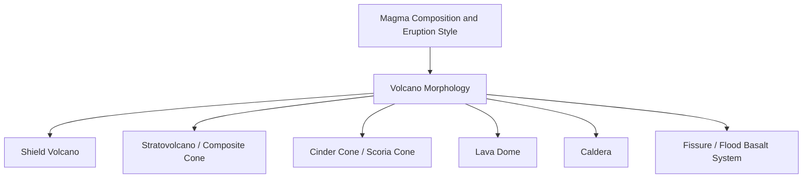

## Volcano Types and Morphology

### Definition and Overview

Volcano morphology refers to the physical shape, structure, and scale of volcanic edifices, which develop as a direct consequence of eruption style, magma composition, effusion rate, and eruptive history. Since magma properties fundamentally control whether eruptions are effusive or explosive, the resulting landform reflects this underlying volcanic behavior—low-viscosity, gas-poor magmas build broad, gently sloping edifices, while viscous, gas-rich magmas construct steep, often unstable cones. Classifying volcano types provides a framework for anticipating hazard behavior based on structural form alone.

### Shield Volcanoes

**Key Points**

- Broad, gently sloping edifices (typical slope angles often only a few degrees) built predominantly by successive low-viscosity basaltic lava flows that travel considerable distances before solidifying, rather than by explosive fragmented material
- Constructed almost entirely of overlapping thin lava flows with minimal pyroclastic content, reflecting the effusive, low-gas-content eruption style typical of basaltic magma
- Can achieve enormous overall volume and basal diameter despite relatively low slope angle, since accumulated lava flow thickness over a broad footprint and long eruptive history can build substantial total edifice height
- The Hawaiian volcanoes (e.g., Mauna Loa, Kīlauea) are the archetypal example, formed above the Hawaiian hotspot; Mauna Loa is frequently cited as among the largest volcanoes on Earth by total volume when measured from the surrounding seafloor [Inference — exact comparative volume rankings depend on measurement methodology, including whether submarine volume is included]
- Associated primarily with hotspot/intraplate settings and, to a lesser extent, some divergent boundary contexts, given the basaltic, low-viscosity magma these settings typically produce

### Stratovolcanoes (Composite Volcanoes)

**Key Points**

- Steep-sided, symmetrical conical edifices built from alternating layers of lava flows, pyroclastic material (ash, pumice, blocks), and lahar (volcanic mudflow) deposits, reflecting a more variable eruptive history alternating between effusive and explosive phases
- Constructed from intermediate to silicic magma (andesitic to dacitic, occasionally rhyolitic), consistent with the moderate-to-high viscosity magma typical of subduction zone volcanic arcs
- The alternating layered internal structure (giving rise to the term "composite") reflects the episodic, variable nature of stratovolcano eruptive activity compared to the more uniform lava-flow construction of shield volcanoes
- Represent the classically recognized volcanic cone shape in public perception, exemplified by Mount Fuji (Japan), Mount Rainier (United States), and Mount Mayon (Philippines)
- Pose disproportionately severe hazard potential relative to their moderate size due to steep slopes (prone to collapse and lahar generation), explosive eruption tendency, and frequently significant nearby population density given their common occurrence along densely populated subduction zone arcs

### Cinder Cones (Scoria Cones)

- Small, steep-sided conical landforms built from accumulated pyroclastic fragments (cinders/scoria) ejected from a single, typically short-lived, Strombolian-style eruptive vent
- Generally the smallest and structurally simplest common volcano type, often only tens to a few hundred meters in height, frequently formed within a single eruptive episode lasting weeks to a few years rather than over extended geological timescales
- Commonly occur as monogenetic features (erupting once and then becoming extinct) rather than the polygenetic, long-lived activity typical of shield volcanoes and stratovolcanoes, and frequently form as parasitic vents on the flanks of larger volcanic edifices or within volcanic fields containing numerous individual cinder cones
- Parícutin in Mexico, which emerged in a cornfield in 1943 and was extensively documented throughout its formation, is a frequently cited example illustrating the relatively rapid formation timescale characteristic of this volcano type [Unverified — specific formation duration details for individual historical examples vary slightly across sources]

### Lava Domes

**Key Points**

- Steep-sided, rounded mounds formed by the slow extrusion of highly viscous silicic (dacitic to rhyolitic) magma that piles up over and around the vent rather than flowing outward as a conventional lava flow
- Growth typically proceeds through endogenous processes (expansion from within, inflating the dome interior) and/or exogenous processes (new lava breaking through the dome surface and extruding as discrete lobes), often occurring in combination over a dome's growth history
- Structurally unstable due to steep slopes and internal gas pressure buildup beneath a solidified outer carapace, making dome collapse (generating pyroclastic flows) and sudden explosive disruption significant associated hazards
- Can occur as standalone volcanic features or, more commonly, within the crater of a larger stratovolcano following an explosive eruption, as seen with the ongoing dome-building activity that has occurred within the crater of Mount St. Helens following its 1980 eruption [Inference — specific ongoing activity status at any given volcano changes over time and should be confirmed against current monitoring reports]

### Calderas

**Key Points**

- Large, roughly circular depressions formed through the collapse of a volcanic edifice's summit or an underlying magma chamber roof, typically following the rapid evacuation of a substantial volume of magma during a major explosive eruption
- Distinguished from a simple crater (a smaller, primary vent-related depression) primarily by scale and formation mechanism, with calderas generally spanning kilometers in diameter compared to the typically much smaller scale of a summit crater
- Formation is directly linked to the structural instability created when a large, shallow magma chamber is rapidly emptied during a major eruption (frequently, though not exclusively, of Plinian or larger scale), causing the overlying roof rock to founder into the resulting void
- Large silicic caldera systems, such as Yellowstone (United States) and Toba (Indonesia), are associated with the most voluminous known eruptions in the geological record and represent long-lived, potentially still-active magmatic systems capable of renewed activity over extended timescales [Inference — current activity status and eruption probability assessments for specific large caldera systems are subject to ongoing scientific monitoring and should be verified against current volcanological literature]

### Fissure Volcanoes and Flood Basalt Provinces

- Eruptions occurring along linear crustal fractures (fissures) rather than from a single central vent, typically producing extensive basaltic lava flows spread over a broad area rather than a single tall edifice
- **Flood basalt provinces** represent the largest-scale expression of this eruptive style, involving enormous volumes of low-viscosity basaltic lava erupted from fissure systems over a geologically extended period, producing extensive layered lava plateaus rather than a conventional volcanic cone shape
- Notable examples in the geological record include the Columbia River Basalt Group (United States) and the Deccan Traps (India), both associated with exceptionally large total erupted volumes significantly exceeding typical individual central-vent volcano output [Unverified — precise total volume estimates for large flood basalt provinces vary across different geological studies and dating methodologies]
- Contemporary fissure eruptions, such as those periodically occurring in Iceland's volcanic rift zones, provide observable modern analogs for understanding this eruptive style, though at generally smaller scale than the ancient flood basalt provinces

### Comparative Morphology Summary

| Volcano Type | Typical Slope | Dominant Magma Composition | Formation Timescale | Representative Example |
| --- | --- | --- | --- | --- |
| Shield volcano | Gentle (few degrees) | Basaltic | Extended, polygenetic | Mauna Loa |
| Stratovolcano | Steep | Andesitic–dacitic | Extended, polygenetic | Mount Fuji |
| Cinder cone | Steep, small | Basaltic (Strombolian) | Short, typically monogenetic | Parícutin |
| Lava dome | Very steep, rounded | Dacitic–rhyolitic | Variable, often episodic | Mount St. Helens crater dome |
| Caldera | Depression, not a cone | Variable, often silicic | Rapid collapse following major eruption | Yellowstone |
| Fissure/flood basalt | Broad, low-relief plateau | Basaltic | Extended, potentially very large volume | Columbia River Basalt Group |

Below is a schematic cross-sectional comparison of the three most common central-vent volcano morphologies.

<svg xmlns="http://www.w3.org/2000/svg" viewBox="0 0 900 320" font-family="sans-serif">
<text x="450" y="25" font-size="18" text-anchor="middle" font-weight="bold">Volcano Morphology Comparison (svg_diagram)</text>

<g transform="translate(20,60)">
<text x="130" y="0" font-size="14" text-anchor="middle" font-weight="bold">Shield Volcano</text>
<line x1="0" y1="220" x2="260" y2="220" stroke="black" stroke-width="1" />
<path d="M0,220 Q130,150 260,220 Z" fill="#8b7355" stroke="black" stroke-width="2" />
<text x="130" y="245" font-size="11" text-anchor="middle">Broad, low profile</text>
<text x="130" y="260" font-size="11" text-anchor="middle">Basaltic lava flows</text>
</g>

<g transform="translate(320,40)">
<text x="130" y="0" font-size="14" text-anchor="middle" font-weight="bold">Stratovolcano</text>
<line x1="0" y1="240" x2="260" y2="240" stroke="black" stroke-width="1" />
<path d="M90,60 L170,60 L240,240 L20,240 Z" fill="#6b5b47" stroke="black" stroke-width="2" />
<g stroke="#4a3f33" stroke-width="1">
<line x1="60" y1="130" x2="200" y2="130" />
<line x1="45" y1="170" x2="215" y2="170" />
<line x1="30" y1="210" x2="230" y2="210" />
</g>
<text x="130" y="265" font-size="11" text-anchor="middle">Steep, layered flows/ash</text>
</g>

<g transform="translate(640,90)">
<text x="100" y="0" font-size="14" text-anchor="middle" font-weight="bold">Cinder Cone</text>
<line x1="0" y1="190" x2="200" y2="190" stroke="black" stroke-width="1" />
<path d="M65,100 L135,100 L180,190 L20,190 Z" fill="#3a3a3a" stroke="black" stroke-width="2" />
<ellipse cx="100" cy="100" rx="35" ry="8" fill="#1a1a1a" stroke="black" />
<text x="100" y="215" font-size="11" text-anchor="middle">Small, steep, single vent</text>
</g>
</svg>

### Volcanic Field Concepts

**Key Points**

- Some volcanic regions are characterized not by a single dominant edifice but by numerous small, typically monogenetic volcanic features (commonly cinder cones and small shield vents) distributed across a broad area, termed a **volcanic field**
- Reflects a distributed magma supply system with multiple small, independent conduits reaching the surface rather than a single long-lived central magma chamber and conduit system, in contrast to the sustained single-vent activity that builds large stratovolcanoes or shield volcanoes
- Individual volcanic fields can remain active over very long geological timescales even though each individual vent within the field is typically short-lived, since new eruptions can occur at new locations within the field long after older vents have become extinct [Inference — the specific longevity and recurrence characteristics vary substantially between different documented volcanic fields]

### Conclusion

Volcano morphology directly reflects the underlying magma composition, viscosity, and eruptive history that shaped a given edifice, ranging from the broad, gently sloping shield volcanoes built by effusive basaltic activity to the steep, layered stratovolcanoes constructed through alternating explosive and effusive intermediate-composition eruptions. Smaller-scale features including cinder cones and lava domes represent more localized or short-lived expressions of specific eruption styles, while calderas mark the structural aftermath of catastrophic magma chamber evacuation. Recognizing these morphological categories provides a first-order framework for anticipating volcanic hazard behavior, since edifice shape and internal structure are direct physical consequences of the eruptive processes examined in magma genesis and eruption style classification.

**Related Topics**

- Magma types and formation
- Styles of volcanic eruption
- Caldera formation and supereruptions
- Volcanic hazards and risk assessment
- Lava flow behavior and morphology
- Volcano monitoring and eruption forecasting
- Plate tectonic settings of volcanism
- Lahars and volcanic mass wasting processes