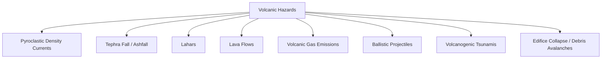
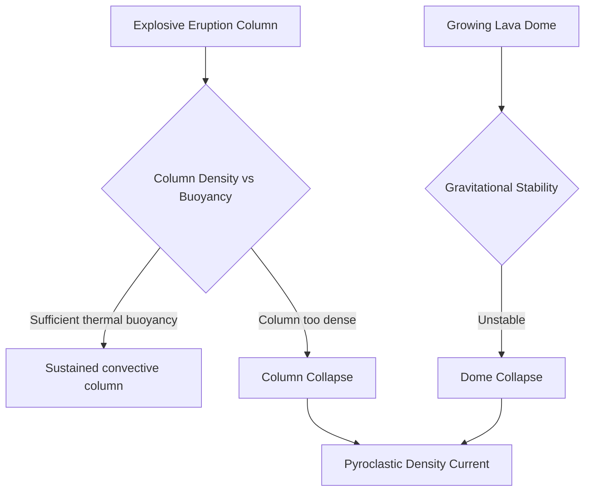
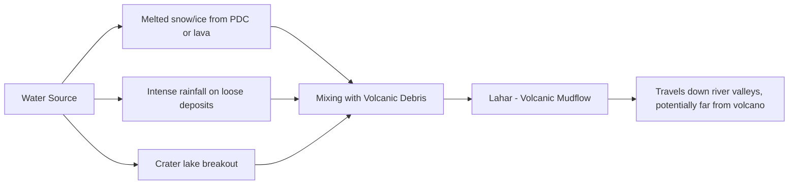

## Volcanic Hazards and Pyroclastic Phenomena

### Definition and Overview

Volcanic hazards encompass the diverse physical phenomena arising from volcanic activity that threaten human life, infrastructure, agriculture, and the environment. These range from immediate, high-energy proximal hazards such as pyroclastic density currents to widely dispersed distal hazards such as ashfall and volcanic gas emissions, each governed by distinct physical processes requiring separate hazard assessment and mitigation approaches.

### Pyroclastic Density Currents (PDCs)

#### Fundamental Nature and Generation Mechanisms

**Key Points**

- Pyroclastic density currents are hot, gravity-driven mixtures of volcanic gas, ash, and rock fragments that flow rapidly down volcanic slopes, generally regarded as among the most lethal of all volcanic hazards due to their combination of high velocity, extreme temperature, and destructive capacity
- Temperatures within pyroclastic flows commonly range from a few hundred to several hundred degrees Celsius, sufficient to cause immediate fatality and combustion of organic material in their path [Inference — exact temperature ranges vary considerably depending on the specific eruption, degree of air entrainment, and distance traveled from source]
- Velocities can reach tens to over one hundred kilometers per hour, frequently exceeding the speed at which affected populations could realistically evacuate once a flow has been generated, making advance evacuation based on eruption monitoring and precursory activity the primary viable mitigation strategy rather than reactive escape
- Two principal generation mechanisms are recognized: **eruption column collapse**, in which a sustained explosive column becomes too dense to sustain buoyant convective rise (due to insufficient thermal energy relative to the mass of entrained pyroclastic material) and collapses under gravity to form a density current radiating outward from the vent; and **lava dome or lava flow front collapse**, in which gravitationally unstable material collapses and disaggregates, releasing pressurized gas-charged material that develops into a moving pyroclastic current

#### Flow vs. Surge Distinction

- **Pyroclastic flows** (sometimes termed block-and-ash flows or pumice flows depending on composition) are relatively dense, concentrated currents that tend to follow topographic lows such as valleys and drainages
- **Pyroclastic surges** are lower-density, more dilute and turbulent currents capable of overriding topographic obstacles including hills and, in some documented cases, traveling over water surfaces, due to their lower bulk density and higher gas content relative to concentrated flows
- Both phenomena exist along a continuum of pyroclastic density current behavior rather than as strictly separate categories, and a single flow event can exhibit characteristics transitioning between dense, channel-confined behavior and more dilute, surge-like behavior at its margins or as it evolves downslope [Inference — the specific classification terminology and the degree of continuum versus discrete categorization is a matter of ongoing discussion within the volcanological literature]

### Tephra Fall (Ashfall)

**Key Points**

- **Tephra** is the general term for all fragmented volcanic material ejected explosively into the atmosphere, classified by size into ash (<2mm), lapilli (2–64mm), and blocks/bombs (>64mm), with ash representing the fraction capable of the most widespread atmospheric dispersal
- Fine ash can be transported by prevailing winds over distances ranging from tens to, for major explosive eruptions, thousands of kilometers from the source vent, with deposit thickness generally decreasing with distance downwind, though local topography and wind shifts during a sustained eruption can produce complex thickness distribution patterns
- Hazard impacts include: structural roof collapse from accumulated ash weight (particularly when ash becomes wetted by rain, substantially increasing its density), respiratory health effects from fine particulate inhalation, agricultural crop damage and livestock impacts, disruption of water supply and electrical infrastructure, and severe aviation hazard from ash ingestion into jet engines
- Aviation hazard from volcanic ash clouds is a globally significant concern given the potential for ash to be transported across major flight corridors far from the source eruption, historically prompting the establishment of dedicated international Volcanic Ash Advisory Centers coordinating with aviation authorities [Inference — specific operational protocols and advisory thresholds are subject to periodic revision by the responsible aviation and meteorological agencies]

**Example**

A commonly used empirical relationship for estimating ashfall deposit thinning with distance from a Plinian eruption column follows an approximately exponential decay pattern, though actual deposit thickness distributions are strongly modified by wind direction, wind speed variability during the eruption, and eruption column height, meaning single-eruption thickness maps typically show substantial deviation from any idealized symmetric decay model. [Inference — this is a generalized characterization of tephra dispersal behavior rather than a precise universal formula]

### Lahars

**Key Points**

- Lahars are volcanic mudflows or debris flows composed of a mixture of volcanic material (ash, pyroclastic debris, and rock fragments) and water, capable of traveling considerable distances down river valleys extending well beyond the immediate volcanic edifice
- Water sources triggering lahars include: rapid melting of summit snow and ice by pyroclastic flows or lava (particularly significant at high-elevation, glaciated stratovolcanoes), intense rainfall remobilizing loose volcanic deposits on steep slopes, breakout of crater lakes, and direct incorporation of stream or river water into a pyroclastic flow or debris avalanche
- Can occur during an eruption (**syn-eruptive lahars**, often the most dangerous due to their frequently unexpected timing and the combination with an actively ongoing eruption) or long after volcanic activity has ceased (**post-eruptive lahars**), since loose, unconsolidated pyroclastic deposits on volcanic slopes can remain susceptible to remobilization by heavy rainfall for years to decades following an eruption
- The 1985 Nevado del Ruiz eruption in Colombia, in which a relatively modest eruption generated lahars from summit ice melt that traveled a considerable distance and caused substantial loss of life in the town of Armero, is frequently cited as a demonstration that lahar hazard can be severe even from eruptions that are not, by explosive magnitude alone, exceptionally large [Unverified — specific casualty and event detail figures for this and similarly cited historical events vary somewhat across different historical sources]

### Lava Flows

- Generally regarded as a lower-lethality but potentially highly destructive-to-infrastructure hazard, since lava flows typically advance at speeds slow enough to allow evacuation of people (though not necessarily fixed infrastructure), except in cases of unusually low-viscosity, high-effusion-rate basaltic flows on steep slopes
- Hazard extent and behavior depend on effusion rate, magma viscosity, underlying topography (channelized flows on steep slopes can travel considerably faster and farther than sheet flows on gentle terrain), and the development of insulating features such as lava tubes, which can allow flows to maintain fluidity and travel substantially greater distances than an equivalent unchanneled, uninsulated flow
- Complete destruction of any structure or infrastructure directly overrun by an advancing lava flow is essentially unavoidable, making hazard mapping and land-use planning around historically active flow pathways the primary mitigation strategy rather than any feasible engineering defense against the flow itself in most circumstances [Inference — limited flow diversion efforts have occasionally been attempted historically, though effectiveness and applicability are highly situation-specific]

### Volcanic Gas Emissions

**Key Points**

- Volcanoes continuously or episodically emit gases including water vapor, carbon dioxide, sulfur dioxide, and hydrogen sulfide, both during active eruption and as passive degassing during quiescent periods
- **Sulfur dioxide** emissions can react with atmospheric moisture to form volcanic smog ("vog"), causing respiratory health impacts and, at larger eruption scale, contributing to stratospheric aerosol formation capable of producing measurable short-term global climate cooling effects following major explosive eruptions
- **Carbon dioxide**, being denser than air, can accumulate in topographic depressions near volcanic vents or through diffuse degassing from soil, posing an asphyxiation hazard in low-lying areas even without any accompanying eruptive activity; the 1986 Lake Nyos disaster in Cameroon, involving a sudden, large-scale release of CO2 from a volcanically charged crater lake, is a frequently cited example of this specific hazard mechanism [Unverified — the precise triggering mechanism and comparative significance of this specific event within the broader category of volcanic gas hazards is a subject with some variation in interpretation across different sources]
- Ongoing gas monitoring (measuring emission rate and composition changes) serves as a valuable eruption forecasting tool, since changes in gas flux and composition can reflect changing conditions within the underlying magmatic system prior to eruption onset

### Ballistic Projectiles

- Explosively ejected rock fragments (ranging from lapilli-sized particles to large blocks and bombs) following near-parabolic trajectories from the vent, posing a direct proximal hazard typically confined to within a few kilometers of the eruptive source, though this distance can be substantially greater for unusually energetic explosions
- Represents a particular hazard to visitors and personnel in close proximity to an active crater, since ballistic impact can occur with essentially no useful warning time given the short flight duration involved, distinguishing this hazard from most other volcanic hazard types that generally allow at least some evacuation window

### Volcanogenic Tsunamis and Edifice Collapse

**Key Points**

- Large-scale **flank collapse** or **debris avalanche** events, in which a substantial portion of a volcanic edifice catastrophically fails and slides away (potentially triggered by internal magmatic pressure, structural weakening from hydrothermal alteration, or an associated large earthquake), represent a comparatively rare but potentially catastrophic hazard capable of affecting areas far removed from the immediate eruptive vent
- Where such collapse occurs into or near a body of water (ocean, lake), the resulting sudden water displacement can generate a tsunami, independent of any direct seismic source
- Explosive eruption or associated pyroclastic flow entry into water can similarly generate tsunami waves through rapid, large-volume water displacement or associated atmospheric pressure coupling in the case of very large explosive events [Unverified — the relative contribution and interaction of these different volcanogenic tsunami generation mechanisms remains an active area of scientific study, particularly informed by post-event analysis of recent significant volcanic tsunami events]

### Hazard Zonation and Risk Assessment

**Key Points**

- Volcanic hazard maps typically integrate the spatial distribution and probability of multiple hazard types (pyroclastic flow inundation zones, lahar-prone drainages, ashfall probability by distance and prevailing wind direction, lava flow pathways based on topography) into composite risk zonation used for land-use planning and evacuation protocol development
- Hazard assessment draws heavily on the geological record of a specific volcano's past eruptive behavior (through stratigraphic and deposit mapping of prior eruptions), on the reasonable assumption that future eruptive behavior is likely to broadly resemble a volcano's documented eruptive history, while also accounting for the possibility of eruptions exceeding historically observed magnitude [Inference — the specific weighting given to historical recurrence versus worst-case scenario planning varies by hazard assessment methodology and responsible agency practice]
- Effective mitigation requires integrating physical hazard mapping with monitoring-based eruption forecasting (seismicity, ground deformation, gas emission changes) to enable timely evacuation decisions, since many of the most lethal hazard types (pyroclastic density currents in particular) offer little to no useful reactive warning time once initiated

### Comparative Hazard Summary

| Hazard Type | Typical Range from Source | Primary Danger Mechanism | Warning Time |
| --- | --- | --- | --- |
| Pyroclastic density currents | Proximal to several km+ | Heat, high velocity, asphyxiation | Minimal once initiated |
| Tephra fall | Local to global (fine ash) | Structural load, respiratory, aviation | Hours (eruption-dependent) |
| Lahars | Extends along river valleys, km to tens of km | High-energy debris flow impact, burial | Variable; can be rapid |
| Lava flows | Proximal to intermediate | Infrastructure destruction (low direct lethality) | Generally allows evacuation |
| Volcanic gas | Local (CO2 pooling) to global (climate) | Asphyxiation, respiratory, climate effects | Variable, often minimal for CO2 pooling |
| Ballistic projectiles | Very proximal (typically a few km) | Direct impact trauma | Essentially none |

### Conclusion

Volcanic hazards comprise a diverse set of physical phenomena operating across vastly different spatial and temporal scales, from near-instantaneous, highly lethal pyroclastic density currents and ballistic projectiles in the immediate vicinity of an eruptive vent, to slower-developing but far-reaching lahars, and widely dispersed tephra fall and gas emissions capable of affecting areas far beyond the volcano itself. Effective hazard mitigation depends on integrating detailed geological hazard mapping, informed by a volcano's eruptive history, with active monitoring-based forecasting capable of providing sufficient warning time for evacuation ahead of the most rapid and lethal hazard types, since several of the most dangerous volcanic phenomena offer minimal to no reactive escape window once triggered.

**Related Topics**

- Styles of volcanic eruption
- Volcano types and morphology
- Magma types and formation
- Volcano monitoring and eruption forecasting
- Volcanic gas monitoring and atmospheric effects
- Lahar hazard mapping and mitigation
- Tsunami generation and behavior
- Caldera formation and supereruptions