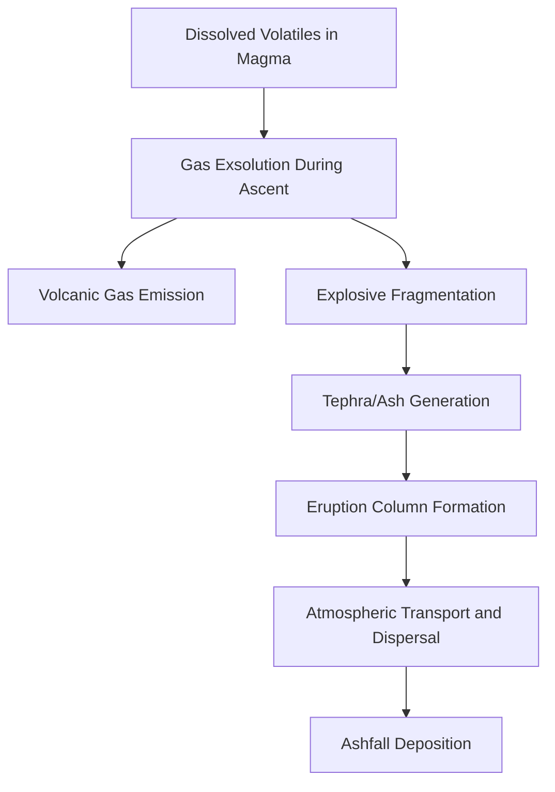
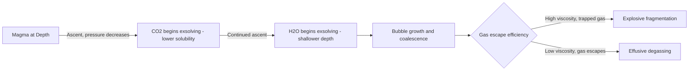
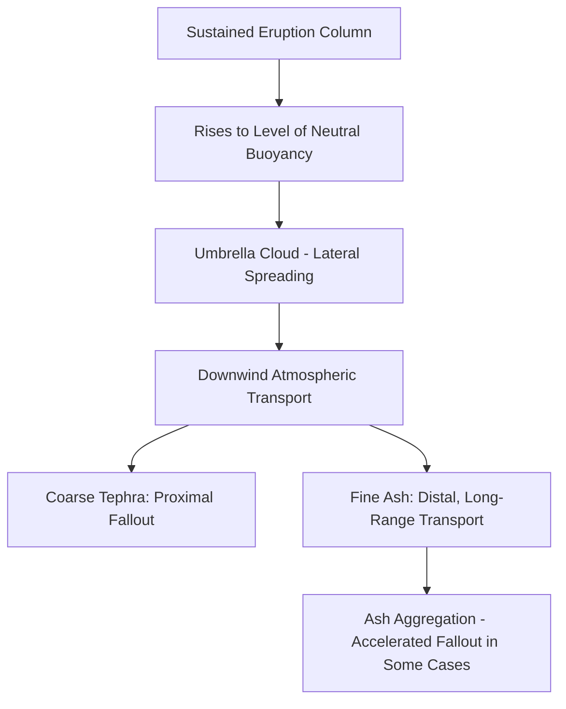

## Volcanic Gases and Ash Dispersal

### Definition and Overview

Volcanic gases are dissolved volatile compounds released from magma during ascent, eruption, and passive degassing, while ash dispersal refers to the atmospheric transport and deposition of fine fragmented volcanic material (tephra) following explosive eruption. Both phenomena are governed by distinct physical processes—gas exsolution thermodynamics and atmospheric plume dynamics, respectively—but are closely interlinked, since the volatile content driving explosive fragmentation directly determines the volume and character of ash injected into the atmosphere.

### Volcanic Gas Composition and Sources

**Key Points**

- Water vapor ($H_2O$) is typically the most abundant volcanic gas by volume, followed by carbon dioxide ($CO_2$) and sulfur dioxide ($SO_2$), with lesser amounts of hydrogen sulfide ($H_2S$), hydrogen chloride ($HCl$), hydrogen fluoride ($HF$), and other trace species, though relative proportions vary considerably between volcanic systems and even between different phases of activity at a single volcano [Inference — exact compositional percentages are highly system-specific and are typically determined through direct field measurement rather than a fixed universal ratio]
- Gas composition and flux provide valuable information about the state of the underlying magmatic system: increasing $SO_2$ flux, in particular, is commonly interpreted as an indicator of fresh, gas-rich magma ascending toward the surface, making it a widely used parameter in volcano monitoring and eruption forecasting
- Gases are released through several distinct pathways: **eruptive degassing** during active explosive or effusive eruption, **passive/fumarolic degassing** through vents, fractures, and fumaroles during quiescent (non-eruptive) periods, and **diffuse soil degassing**, where gas percolates through soil across a broader area surrounding a volcanic edifice without a discrete visible vent

### Gas Exsolution and Bubble Nucleation

**Key Points**

- As magma ascends and confining pressure decreases, the solubility of dissolved volatiles (particularly water and carbon dioxide) in the melt decreases correspondingly, driving exsolution—the formation of a separate gas phase as bubbles within the melt
- This process follows solubility relationships that are strongly pressure-dependent and, to a lesser degree, composition- and temperature-dependent; water solubility in silicate melt decreases substantially with decreasing pressure, meaning most water exsolution occurs at relatively shallow depths as magma approaches the surface, while $CO_2$, having generally lower solubility, tends to exsolve at greater depth
- Continued bubble growth during ascent, combined with the degree to which gas can escape versus remain trapped within the melt (governed by magma viscosity), directly determines whether an eruption proceeds effusively or explosively, as covered in the eruption style classification framework
- The differential exsolution depths of different volatile species (with $CO_2$ generally exsolving deeper than $H_2O$) means that gas emission composition can itself provide indirect information about the depth of magma from which gas is currently being released, a principle applied in some volcano monitoring approaches [Inference — the practical application and reliability of this depth-inference approach varies by volcanic system and monitoring methodology]

### Health, Environmental, and Infrastructure Impacts of Volcanic Gases

**Key Points**

- **Sulfur dioxide** can cause direct respiratory irritation and, upon reaction with atmospheric moisture, forms sulfate aerosols and volcanic smog (termed "vog" in some regions), contributing to broader air quality degradation and associated respiratory health impacts across areas downwind of a persistently degassing volcano
- **Carbon dioxide**, being denser than air, poses a localized asphyxiation hazard through accumulation in topographic depressions, caves, or poorly ventilated structures near vent areas, since it can displace breathable oxygen without necessarily producing an obvious sensory warning
- **Hydrogen fluoride** and related halogen gases can be adsorbed onto ash particles and subsequently deposited on vegetation and water supplies, posing a documented hazard to grazing livestock (fluorosis) in agricultural areas affected by ashfall from fluorine-rich eruptions [Unverified — the severity and prevalence of this specific impact varies considerably by eruption and regional agricultural context]
- Large-magnitude explosive eruptions injecting substantial $SO_2$ into the stratosphere can produce measurable short-term global climate cooling, since stratospheric sulfate aerosols reflect incoming solar radiation; this mechanism has been documented following several major historical eruptions, though the magnitude and duration of the resulting cooling effect varies with the specific quantity of sulfur injected and its stratospheric residence time [Inference — precise climate impact magnitude depends on eruption-specific factors including injection height, aerosol particle size distribution, and atmospheric circulation conditions at the time]

### Eruption Column Dynamics

#### Column Formation and Buoyancy

**Key Points**

- An explosive eruption column forms through the violent ejection of a hot mixture of gas, ash, and larger pyroclastic fragments from the vent, which initially rises as a momentum-driven jet before transitioning to buoyancy-driven convective rise as surrounding atmospheric air is entrained and heated by the erupting material
- The height achieved by a sustained convective eruption column depends primarily on eruption rate (mass flux) and the thermal energy available to heat entrained air, with column height for large Plinian eruptions commonly following an empirical relationship approximately proportional to the fourth root of mass eruption rate:

$$H \approx C \, \dot{M}^{1/4}$$

where $H$ is column height, $\dot{M}$ is mass eruption rate, and $C$ is an empirically calibrated constant [Inference — this represents a widely used simplified scaling relationship in volcanological literature; actual column height for any specific eruption is also influenced by atmospheric conditions, vent geometry, and other factors not captured in this simplified form]

- Sustained Plinian eruption columns can reach into the stratosphere, commonly on the order of tens of kilometers in height for major eruptions, enabling fine ash and gas to be injected well above typical tropospheric weather systems and subject instead to stratospheric circulation patterns capable of much longer atmospheric residence time and wider global dispersal

#### Column Collapse

- If the erupting mixture is too dense (insufficient thermal buoyancy relative to the mass of entrained pyroclastic material) to sustain convective rise, the column can partially or fully collapse under gravity, generating pyroclastic density currents rather than (or in addition to) a sustained buoyant ash plume
- Column behavior can fluctuate during a single eruption, with periods of sustained buoyant rise interspersed with partial collapse episodes, producing a complex combination of both distal ashfall and proximal pyroclastic density current hazards within a single eruptive event [Inference — the specific temporal pattern of column stability versus collapse is eruption-specific and depends on evolving vent conditions and magma supply rate during the event]

### Ash Dispersal and Atmospheric Transport

**Key Points**

- Once suspended within the eruption column or subsequently released from the collapsing plume top (termed the umbrella cloud, where the column spreads laterally upon reaching a level of neutral buoyancy in the atmosphere), fine ash is transported downwind according to prevailing atmospheric wind fields at the relevant altitude
- Larger, denser tephra particles (lapilli and blocks) fall out relatively close to the vent under the dominant influence of gravity and initial ballistic trajectory, while progressively finer ash particles can remain suspended for extended periods and be transported very long distances, since particle settling velocity decreases substantially with decreasing particle size
- Deposit thickness generally decreases with distance from the vent, though real-world ashfall distribution patterns are frequently complicated by variable wind direction and speed at different altitudes during a sustained eruption, producing asymmetric, sometimes multi-lobed deposit patterns rather than simple concentric thinning
- Fine ash aggregation (clumping of fine particles into larger aggregates, sometimes assisted by moisture within the eruption column) can cause ash to fall out of suspension more rapidly than would be predicted based on the settling velocity of individual, unaggregated fine particles, complicating dispersal modeling [Inference — the degree and consistency of aggregation effects vary by eruption conditions, including moisture content and ash particle characteristics, and represent an area of ongoing volcanological research]

### Ash Dispersal Modeling and Forecasting

**Key Points**

- Volcanic ash transport and dispersion models (VATD models) simulate the atmospheric movement of erupted ash using numerical advection-diffusion approaches, incorporating meteorological wind field data, eruption source parameters (column height, mass eruption rate, particle size distribution), and particle settling physics to forecast ashfall distribution and airborne ash cloud location
- Real-time model output is a critical input for aviation safety decision-making, since airborne volcanic ash poses a severe hazard to jet aircraft through engine damage and abrasion, leading to established international coordination protocols between volcano observatories, meteorological agencies, and aviation authorities for ash cloud tracking and flight path advisories [Inference — specific operational model choice and advisory threshold protocols vary by region and responsible agency, and are periodically updated]
- Satellite-based remote sensing (using thermal infrared and other spectral bands to detect airborne ash signatures distinct from meteorological cloud) provides an important complementary observational tool for validating and constraining dispersal model forecasts in near-real time

### Volcanic Gas Monitoring Techniques

**Key Points**

- **Direct sampling**: collection of gas samples directly from fumaroles or vents for laboratory compositional analysis, providing high-precision compositional data but limited by the practical difficulty and hazard of accessing active vent areas, particularly during heightened unrest
- **Remote spectroscopic sensing**: ground-based and satellite instruments measure gas column abundance (particularly $SO_2$, given its distinct absorption signature) using ultraviolet and infrared spectroscopy, enabling measurement of gas flux without requiring direct physical access to the vent
- **Soil gas and diffuse degassing surveys**: measure gas flux (commonly $CO_2$) escaping through soil across a broader area surrounding a volcanic edifice, useful for detecting subtle changes in the shallow magmatic-hydrothermal system that may not be apparent from vent-focused measurements alone
- Continuous or frequent gas monitoring, integrated with seismic and ground deformation data, forms a core component of comprehensive volcano monitoring programs aimed at detecting precursory changes that may indicate evolving eruption potential

### Conclusion

Volcanic gases and ash dispersal represent two closely interconnected but physically distinct volcanic phenomena: gas exsolution during magma ascent both drives explosive fragmentation (generating the tephra that becomes airborne ash) and independently poses direct health, environmental, and climatic hazards through its own emission pathways. Understanding eruption column dynamics—the balance between buoyant convective rise and gravitational collapse—provides the essential link between gas-driven eruptive processes and the resulting spatial pattern of ashfall hazard, which extends the influence of volcanic activity far beyond the immediate vicinity of the eruptive vent through atmospheric transport. Effective hazard mitigation for both gas emissions and ash dispersal depends on integrating direct and remote monitoring techniques with numerical atmospheric transport modeling to support timely, accurate hazard forecasting for affected populations, agriculture, and aviation.

**Related Topics**

- Styles of volcanic eruption
- Volcanic hazards and pyroclastic phenomena
- Magma types and formation
- Volcano monitoring and eruption forecasting
- Volcanic ash aviation hazard management
- Climate effects of large explosive eruptions
- Volcanic gas geochemistry and monitoring techniques
- Volcano types and morphology