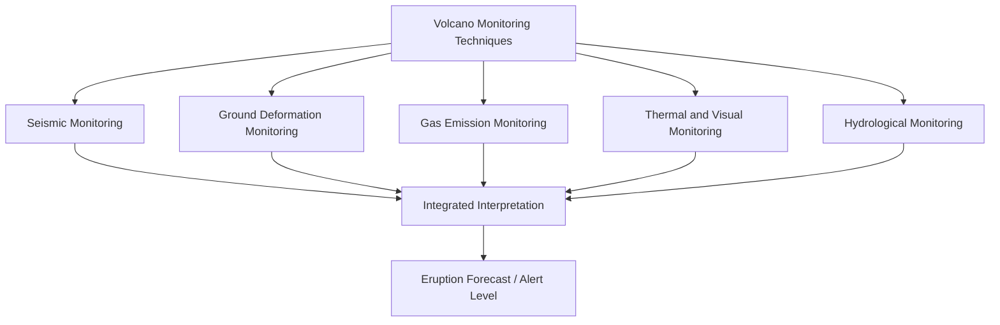
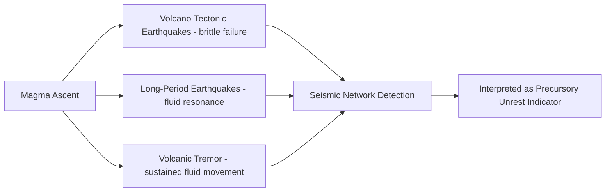
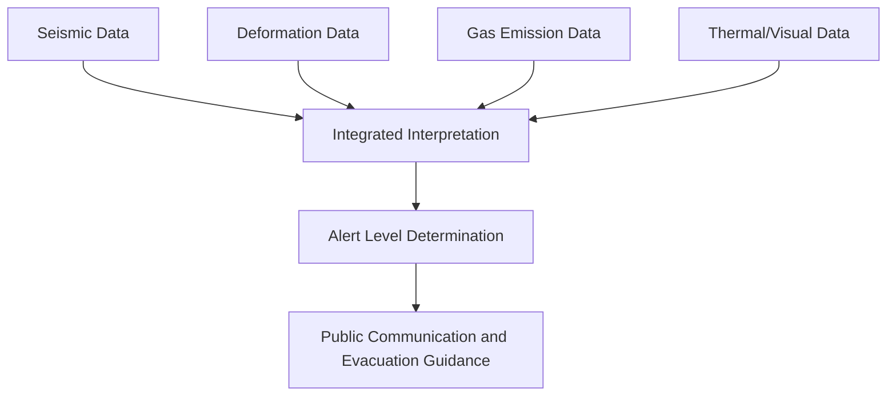

## Monitoring and Forecasting Eruptions

### Definition and Overview

Volcano monitoring involves the continuous or periodic measurement of physical and chemical parameters at active or potentially active volcanoes to detect precursory changes indicating evolving magmatic conditions. Eruption forecasting uses this monitoring data, combined with a volcano's known eruptive history, to assess the probability and likely character of future eruptive activity. Unlike earthquake prediction, short-term volcanic eruption forecasting has achieved meaningful, though imperfect, operational success, since most eruptions are preceded by detectable precursory unrest over timescales of hours to months.

### Seismic Monitoring

**Key Points**

- Magma movement, gas pressurization, and rock fracturing associated with ascending magma generate distinctive seismic signals, making seismicity one of the most widely used and reliable precursory indicators available to volcano monitoring programs
- **Volcano-tectonic (VT) earthquakes**: result from brittle rock fracture as magma forces its way through surrounding crustal rock, exhibiting sharp, impulsive waveforms similar to ordinary tectonic earthquakes; an increase in VT earthquake frequency and/or a shift in hypocenter location toward the surface is commonly interpreted as an indicator of magma ascent
- **Long-period (LP) earthquakes**: characterized by lower-frequency, more emergent waveforms, generally interpreted as resulting from resonance within fluid-filled cracks or conduits as magma or volcanic gas moves through the system, rather than direct brittle rock failure
- **Volcanic tremor**: a sustained, often continuous seismic signal (as opposed to discrete earthquake events), commonly associated with sustained fluid movement (magma or gas) through the volcanic plumbing system, frequently observed to intensify immediately prior to and during active eruption
- Seismic swarms (sudden increases in the rate of small earthquakes within a short period, without a single larger mainshock as would be typical of tectonic aftershock sequences) are a frequently observed precursory pattern at many volcanoes preparing to erupt [Inference — the specific seismic signature preceding eruption varies considerably between individual volcanic systems and is not governed by a single universal precursory pattern]

### Ground Deformation Monitoring

**Key Points**

- As magma accumulates within a shallow reservoir or migrates through the crust toward the surface, the associated pressure change typically deforms the overlying ground surface, producing measurable inflation (uplift and outward tilting) or, less commonly during pre-eruptive periods, deflation
- **GPS/GNSS networks**: continuous ground-based receivers measure precise three-dimensional surface position over time, detecting gradual or sudden ground displacement associated with subsurface magma movement
- **Tiltmeters**: measure very small changes in ground surface tilt (slope angle), often capable of detecting subtle, localized deformation changes over short timescales that may precede eruption by hours to days
- **Interferometric Synthetic Aperture Radar (InSAR)**: a satellite-based remote sensing technique that measures ground surface displacement over broad areas by comparing radar phase data from repeated satellite passes, enabling deformation monitoring across large or remote volcanic regions without requiring dense ground-based instrumentation
- Deformation patterns can be modeled using simplified source geometries (such as the **Mogi model**, representing a pressurized point source or small spherical magma reservoir at depth) to estimate the depth, volume change, and location of the underlying magmatic source responsible for observed surface displacement [Inference — actual subsurface magma reservoir geometry is typically more complex than idealized point-source models, and modeled parameters represent simplified approximations rather than precise physical reservoir dimensions]

### Volcanic Gas Monitoring

**Key Points**

- Changes in gas emission rate and composition provide direct chemical information about the state of the underlying magmatic system, complementing the physical/mechanical information provided by seismic and deformation monitoring
- An increase in **sulfur dioxide ($SO_2$) flux** is commonly interpreted as an indicator of fresh, gas-rich magma ascending toward the surface, since $SO_2$ is efficiently released from magma as it approaches shallower depths and lower pressure
- Changes in the ratio of different gas species (for example, the relative proportion of $CO_2$ to $SO_2$) can provide indirect information about the depth of magma currently degassing, since different volatile species exsolve from magma at different depths according to their differing pressure-dependent solubility behavior
- Remote spectroscopic techniques (ground-based and satellite ultraviolet/infrared spectroscopy) allow gas flux measurement without requiring direct physical access to often hazardous vent areas, an important consideration during periods of heightened unrest when close approach may be unsafe

### Thermal and Visual Monitoring

**Key Points**

- **Thermal infrared imaging** (from ground-based, aerial, or satellite platforms) detects elevated surface temperatures associated with fresh lava, active fumaroles, or heated ground, providing a means of tracking lava dome growth, new vent formation, or changes in hydrothermal system activity
- **Satellite-based thermal anomaly detection** systems provide routine, near-global monitoring capability for remote or difficult-to-access volcanoes lacking dense ground-based instrumentation, flagging significant thermal anomalies that may indicate new eruptive activity
- **Webcam and direct visual observation** provide continuous or periodic monitoring of visible activity (plume characteristics, lava dome morphology changes, ashfall extent) at accessible volcanoes, complementing quantitative geophysical and geochemical data with direct observational confirmation

### Hydrological and Hydrothermal Monitoring

- Changes in the temperature, chemistry, and flow rate of springs, crater lakes, and groundwater near a volcanic system can reflect changes in the underlying hydrothermal system, which is itself influenced by heat and gas input from the magmatic system at depth
- Particularly relevant for detecting precursory changes ahead of phreatic eruptions, which as a category are notably difficult to forecast using conventional magmatic monitoring techniques, since these eruptions do not necessarily involve fresh magma ascent that would be readily detected by seismic or deformation monitoring [Inference — the practical effectiveness of hydrothermal monitoring for phreatic eruption forecasting varies by volcanic system and monitoring network sophistication, and phreatic eruptions remain a recognized forecasting challenge even with comprehensive monitoring]

### Integrated Monitoring and Alert Level Systems

**Key Points**

- Effective eruption forecasting requires integrating data across all available monitoring streams (seismic, deformation, gas, thermal, hydrological) rather than relying on any single parameter in isolation, since different precursory processes can manifest through different, sometimes independent, monitoring signals
- Many volcano observatories operate tiered **alert level systems** (commonly using color codes or numerical tiers) that translate the integrated interpretation of monitoring data into standardized public communication regarding current volcanic status and associated recommended actions, ranging from normal background activity through elevated unrest to confirmed eruption
- Alert level frameworks and specific terminology vary considerably between different national and regional volcano monitoring agencies, so specific alert level definitions and associated protocols should be confirmed against the relevant responsible observatory's current published system rather than assumed to be universally standardized [Unverified — specific alert level terminology, thresholds, and associated public guidance differ across monitoring agencies and are periodically revised]

### Forecasting Approaches and Limitations

#### Pattern Recognition from Historical Precursors

**Key Points**

- Forecasting at well-monitored, well-studied volcanoes often draws on statistical pattern recognition from documented precursory sequences observed prior to previous eruptions at the same volcano, on the reasonable assumption that similar underlying processes tend to precede eruption in broadly similar ways at a given system
- This approach is inherently more reliable at volcanoes with a long history of instrumental monitoring through multiple eruptive cycles, and correspondingly less reliable at volcanoes lacking such a monitored eruptive history, or for volcanoes whose current unrest pattern deviates from previously documented precursory sequences [Inference — the specific degree of forecasting reliability is highly volcano-specific and depends substantially on the length and quality of the available monitoring record]

#### Probabilistic Event Tree Forecasting

- Modern volcanic hazard forecasting increasingly employs probabilistic event tree frameworks, in which the probability of progressively more specific outcomes (e.g., unrest continuing → unrest leading to eruption → eruption of a particular style → eruption affecting a particular hazard zone) is estimated at each branching decision point, often informed by both the specific volcano's monitoring data and broader statistical analysis of global volcanic eruption behavior
- This approach explicitly communicates forecast uncertainty rather than presenting a single deterministic outcome, reflecting the inherently probabilistic nature of volcanic forecasting even at well-monitored systems [Inference — specific event tree methodologies and their operational implementation vary between different volcano observatories and hazard assessment frameworks]

#### Known Limitations

**Key Points**

- Not all eruptions are preceded by detectable, unambiguous precursory activity of sufficient duration to enable confident forecasting, particularly for phreatic eruptions and for some smaller-magnitude eruptions at volcanoes with limited pre-existing monitoring infrastructure
- Precursory unrest does not always culminate in eruption; volcanic systems can exhibit significant seismicity, deformation, or gas emission changes that subsequently subside without eruption occurring, creating an inherent forecasting challenge in distinguishing unrest that will lead to eruption from unrest that will not [Inference — the proportion of unrest episodes that culminate in eruption versus subsiding without eruption varies substantially between volcanic systems and is a subject of ongoing volcanological research]
- Forecasting the precise timing, magnitude, and eruption style of an impending eruption remains considerably more uncertain than simply forecasting that an eruption is becoming more likely, meaning current operational forecasting capability is generally better suited to informing evacuation and preparedness decisions at a general level than to providing precise, deterministic eruption predictions

### Volcano Observatories and Global Coordination

- Volcano observatories, typically operated by national geological surveys or dedicated research institutions, maintain continuous monitoring networks at active or potentially active volcanoes within their jurisdiction, integrating the monitoring techniques described above into ongoing hazard assessment and public communication
- International coordination bodies and data-sharing frameworks support the exchange of monitoring expertise, particularly benefiting developing nations with significant volcanic hazard exposure but comparatively limited domestic monitoring infrastructure and resources [Unverified — the specific scope and current operational status of particular international coordination programs should be confirmed against current official sources, given that institutional arrangements in this area are subject to change over time]

### Conclusion

Monitoring and forecasting volcanic eruptions relies on the integrated interpretation of multiple independent geophysical and geochemical data streams—seismicity, ground deformation, gas emissions, and thermal/visual observations—each providing complementary information about the state of an underlying magmatic system as it evolves toward potential eruption. Unlike earthquake prediction, volcanic eruption forecasting has achieved meaningful operational success at well-monitored volcanoes, since most eruptions are preceded by detectable precursory unrest over timescales sufficient to inform evacuation and preparedness decisions, though significant limitations remain, particularly for phreatic eruptions and volcanic systems with limited monitoring history. Continued advancement in monitoring technology, probabilistic forecasting frameworks, and international coordination remains central to reducing the substantial global risk posed by volcanic hazards to vulnerable populations.

**Related Topics**

- Volcanic hazards and pyroclastic phenomena
- Styles of volcanic eruption
- Volcanic gases and ash dispersal
- Volcano types and morphology
- Magma types and formation
- Ground deformation and InSAR remote sensing techniques
- Volcanic alert level systems and public communication
- Probabilistic hazard assessment methodologies