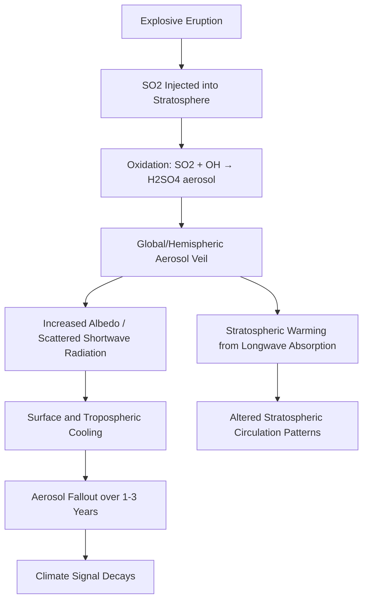

## Volcanism and Climate Interactions

### Overview

Volcanic eruptions inject gases, aerosols, and particulates into the atmosphere, producing effects that range from short-term regional cooling to multi-year global climate perturbations. The magnitude and character of the climatic response depend on eruption style, magnitude, latitude, and the chemical composition of erupted material — particularly sulfur content. Volcanism also operates on geologic timescales as a driver of long-term climate change through carbon cycling.

### Key Volcanic Emissions Relevant to Climate

**Sulfur Dioxide (SO₂)**

- Oxidizes in the stratosphere to form sulfate aerosols ($H_2SO_4$ droplets)
- Primary driver of short-term global cooling
- Residence time in the stratosphere: 1–3 years, versus days to weeks in the troposphere

**Carbon Dioxide (CO₂)**

- Contributes to long-term (geologic-timescale) warming
- Volcanic CO₂ flux is small compared to anthropogenic emissions on annual timescales, but cumulatively significant over millions of years

**Halogens (HCl, HBr)**

- Contribute to stratospheric ozone depletion
- Can enhance UV-B flux at the surface following large eruptions

**Volcanic Ash (Tephra)**

- Causes short-term (days to weeks) regional cooling by blocking solar radiation
- Settles out of the atmosphere relatively quickly, unlike sulfate aerosols
- Can also deposit nutrients (iron, phosphorus) into oceans, potentially stimulating phytoplankton blooms

### The Sulfate Aerosol Mechanism

The dominant pathway for short-term volcanic climate forcing:

1. Explosive eruption injects SO₂ into the stratosphere (requires eruption column height typically exceeding the tropopause, ~10–17 km depending on latitude)
2. SO₂ reacts with hydroxyl radicals (OH) and water vapor over weeks to months, forming sulfuric acid aerosol droplets
3. Aerosols spread via stratospheric winds, forming a global or hemispheric veil
4. The aerosol layer scatters incoming shortwave (solar) radiation back to space, reducing surface insolation
5. The same aerosols absorb some outgoing longwave and can slightly warm the stratosphere while cooling the troposphere and surface
6. Aerosols gradually fall out (sedimentation, wash-out) over 1–3 years, and the climate signal decays

$$\text{SO}_2 + \text{OH} \rightarrow \text{HOSO}_2 \rightarrow \text{H}_2\text{SO}_4 \text{(aerosol)}$$

**Radiative Forcing**

Volcanic aerosol radiative forcing is commonly parameterized using the Volcanic Explosivity Index (VEI) in conjunction with estimated SO₂ mass loading, since VEI alone (a measure of erupted volume/column height) does not linearly predict climatic impact — sulfur yield is the more direct control.

### Latitude Dependence

**Tropical Eruptions**

- Aerosols spread to both hemispheres via stratospheric circulation (Brewer-Dobson circulation)
- Produce global-scale cooling
- Example: Mount Pinatubo (1991, Philippines), Mount Tambora (1815, Indonesia)

**High-Latitude Eruptions**

- Aerosols tend to remain confined to one hemisphere
- Produce regional/hemispheric rather than global cooling
- Example: Laki (1783, Iceland) — primarily affected the Northern Hemisphere

### Case Studies

**Mount Tambora (1815)**

[Verified] The 1815 eruption of Mount Tambora is the largest documented eruption in recorded history (VEI 7).

- Led to the "Year Without a Summer" (1816) in the Northern Hemisphere
- Caused widespread crop failures in Europe and North America
- Estimated global temperature drop: approximately 0.4–0.7°C
- Documented societal impacts include famine and mass migration in parts of Europe

**Mount Pinatubo (1991)**

[Verified] The Pinatubo eruption injected an estimated 17–20 megatons of SO₂ into the stratosphere.

- Produced measurable global cooling of approximately 0.5°C over the following 1–2 years
- Served as a major validation event for climate models simulating aerosol forcing
- Provided empirical data later used to inform geoengineering research on solar radiation management (stratospheric aerosol injection proposals)

**Laki Fissure Eruption (1783–1784, Iceland)**

- A basaltic fissure eruption (effusive, not highly explosive) that nonetheless released enormous SO₂ volumes due to eruption duration and magma volume
- Produced a persistent sulfuric haze over Europe ("Laki haze")
- Associated with excess mortality in Iceland (livestock and human famine from fluorosis and crop damage) and anomalously cold winters in Europe and North America
- Demonstrates that effusive eruptions can rival explosive ones in atmospheric sulfur loading given sufficient duration and volume

### Long-Term Volcanism and Climate: The Deep-Time Perspective

**Volcanism as a Long-Term Warming Driver**

- Sustained volcanic CO₂ outgassing over millions of years is implicated in several major climate perturbations in Earth's history
- Large Igneous Provinces (LIPs) — massive basaltic eruptive events — are associated with several mass extinction events

**Key LIP Examples**

| LIP | Approximate Age | Associated Event |
| --- | --- | --- |
| Siberian Traps | ~252 Ma | End-Permian mass extinction |
| Central Atlantic Magmatic Province (CAMP) | ~201 Ma | End-Triassic mass extinction |
| Deccan Traps | ~66 Ma | End-Cretaceous extinction (coincides with Chicxulub impact) |

[Inference] The precise contribution of LIP volcanism versus other factors (e.g., bolide impact in the Cretaceous case) to individual extinction events remains an active area of scientific debate, particularly regarding relative timing and causal weighting.

**Mechanisms of Long-Term Forcing**

- Massive CO₂ release drives greenhouse warming over thousands to millions of years
- Concurrent SO₂ release can cause short-term cooling pulses superimposed on long-term warming trends
- Ocean acidification from CO₂ uptake compounds biotic stress
- Mercury and other trace element deposition provides a geochemical signature used to correlate LIP volcanism with sedimentary extinction horizons

### Volcanic Winter Concept

A "volcanic winter" refers to significant short-term global cooling following a very large eruption, potentially analogous in effect (though smaller in magnitude and different in duration) to nuclear winter scenarios.

- Associated with crop failures, shortened growing seasons, and historical famines
- The Toba supereruption (~74,000 years ago, Sumatra) has been hypothesized as a trigger for a multi-year volcanic winter

[Unverified] The "Toba catastrophe theory," which proposes that the Toba eruption caused a population bottleneck in early human populations, remains contested among researchers, with genetic and archaeological evidence yielding mixed support.

### Feedback Mechanisms

**Ice-Albedo Feedback**

- Volcanic cooling can increase sea ice and snow cover extent
- Increased albedo reinforces cooling beyond the direct aerosol effect

**Ocean Heat Uptake and Delayed Recovery**

- Oceans absorb some of the radiative deficit, causing surface cooling to persist somewhat beyond aerosol removal from the atmosphere
- Can influence multi-year climate oscillation patterns (some studies link large tropical eruptions to shifts in ENSO behavior, though this remains an area of ongoing research)

**Vegetation and Carbon Cycle Response**

- Diffuse radiation from aerosol scattering can enhance photosynthesis efficiency in some ecosystems (documented following Pinatubo), temporarily increasing terrestrial carbon uptake

### Distinguishing Volcanic Forcing from Other Climate Drivers

| Factor | Volcanic Forcing | Anthropogenic CO₂ Forcing |
| --- | --- | --- |
| Primary agent | Sulfate aerosols (short-term); CO₂ (long-term) | CO₂, CH₄, other greenhouse gases |
| Typical duration | Months to a few years (aerosol); millions of years (LIP CO₂) | Centuries to millennia (atmospheric CO₂ residence) |
| Radiative effect | Net cooling (aerosol phase) | Net warming |
| Spatial pattern | Latitude-dependent based on eruption location | Globally well-mixed |

### Diagram: Radiative Forcing Timeline After a Major Tropical Eruption

<svg xmlns="http://www.w3.org/2000/svg" viewBox="0 0 700 380">
<text x="350" y="25" text-anchor="middle" font-size="16" font-weight="bold" fill="#1a1a1a">Post-Eruption Radiative Forcing Timeline (svg_diagram)</text>
<line x1="60" y1="320" x2="650" y2="320" stroke="#333" stroke-width="2" />
<line x1="60" y1="60" x2="60" y2="320" stroke="#333" stroke-width="2" />

<text x="30" y="200" text-anchor="middle" font-size="12" fill="#333" transform="rotate(-90 30 200)">Radiative Forcing (W/m²)</text>

<text x="355" y="355" text-anchor="middle" font-size="12" fill="#333">Time After Eruption (months)</text>

<line x1="60" y1="190" x2="650" y2="190" stroke="#999" stroke-width="1" stroke-dasharray="4" />
<text x="45" y="194" text-anchor="end" font-size="10" fill="#666">0</text>

<path d="M 60 190 L 100 190 L 140 90 L 220 75 L 320 110 L 420 160 L 500 180 L 580 188 L 650 190" fill="none" stroke="`#c0392b`" stroke-width="3" />

<circle cx="140" cy="90" r="4" fill="#c0392b" />
<text x="140" y="75" text-anchor="middle" font-size="10" fill="#c0392b">Peak SO2 oxidation</text>
<circle cx="220" cy="75" r="4" fill="#c0392b" />
<text x="240" y="65" text-anchor="middle" font-size="10" fill="#c0392b">Max aerosol density</text>
<circle cx="500" cy="180" r="4" fill="#555" />
<text x="500" y="200" text-anchor="middle" font-size="10" fill="#555">Aerosol fallout</text>

<text x="100" y="185" text-anchor="middle" font-size="10" fill="#333">6</text>

<text x="220" y="185" text-anchor="middle" font-size="10" fill="#333">12</text>

<text x="320" y="185" text-anchor="middle" font-size="10" fill="#333">18</text>

<text x="420" y="185" text-anchor="middle" font-size="10" fill="#333">24</text>

<text x="580" y="185" text-anchor="middle" font-size="10" fill="#333">36</text>

<line x1="60" y1="60" x2="650" y2="60" stroke="none" />
<text x="620" y="80" text-anchor="middle" font-size="10" fill="#333">Eruption Onset</text>
<line x1="60" y1="60" x2="60" y2="320" stroke="#333" stroke-width="1" />
<text x="60" y="335" text-anchor="middle" font-size="10" fill="#333">0</text>
</svg>

### Monitoring and Modeling Approaches

**Satellite-Based Monitoring**

- TOMS (Total Ozone Mapping Spectrometer) and successor instruments track SO₂ plume dispersion
- AVHRR and MODIS instruments monitor aerosol optical depth (AOD)

**Ice Core Proxies**

- Sulfate concentration spikes in ice cores (Greenland, Antarctica) provide a long-term record of past eruptions, including those predating written history
- Allows reconstruction of eruption magnitude and approximate global sulfur yield for prehistoric events

**Climate Model Integration**

- General Circulation Models (GCMs) incorporate volcanic aerosol forcing via prescribed optical depth datasets
- Pinatubo remains a key benchmark eruption for validating aerosol-climate model performance

**Key Metric: Aerosol Optical Depth (AOD)**

$$\tau = -\ln\left(\frac{I}{I_0}\right)$$

where $I_0$ is incoming solar intensity and $I$ is the intensity after passing through the aerosol layer.

### Practical / Applied Relevance

- Volcanic eruption forecasting for climate impact assessment informs agricultural planning and food security modeling in the event of a major eruption
- Historical eruption records inform geoengineering research, particularly stratospheric aerosol injection (SAI) proposals, which deliberately mimic the Pinatubo cooling mechanism
- Paleoclimate reconstruction relies heavily on volcanic sulfate signals to date and calibrate ice core chronologies

**Related Topics**

- Volcanic Explosivity Index (VEI) and eruption classification
- Large Igneous Provinces and mass extinction events
- Stratospheric aerosol injection (geoengineering)
- Ice core paleoclimatology and tephrochronology
- Brewer-Dobson circulation and stratospheric transport
- Ocean-atmosphere feedback following radiative perturbations (ENSO variability)
- Milankovitch cycles versus volcanic forcing in paleoclimate reconstruction
- Supervolcanoes and caldera-forming eruptions (e.g., Yellowstone, Toba)