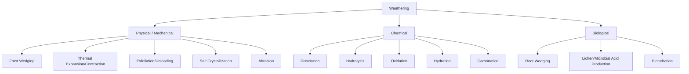

## Weathering Processes

### Overview

Weathering is the in-situ breakdown and alteration of rocks, minerals, and soils through physical, chemical, and biological processes at or near Earth's surface, without significant transport of material. It is distinct from erosion, which involves the removal and transport of weathered material by agents such as water, wind, or ice. Weathering is the foundational process that converts bedrock into regolith and soil, and it fundamentally controls landscape evolution, soil formation, and long-term carbon cycling.

### Classification of Weathering Processes

### Physical (Mechanical) Weathering

Physical weathering disaggregates rock into smaller fragments without altering its mineral composition, increasing surface area available for subsequent chemical attack.

**Frost Wedging (Freeze-Thaw)**

- Water infiltrates cracks and pore spaces, then freezes
- Water expands approximately 9% in volume upon freezing, exerting pressure on surrounding rock (theoretical pressures up to ~200 MPa in confined, saturated conditions, though real-world values are typically much lower due to incomplete confinement)
- Most effective in climates with frequent freeze-thaw cycling (e.g., alpine and periglacial environments)
- Produces angular rock fragments (talus, scree)

**Thermal Expansion and Contraction (Insolation Weathering)**

- Repeated heating and cooling causes differential expansion/contraction of mineral grains with different thermal properties
- Historically invoked to explain rock breakdown in deserts with high diurnal temperature ranges
- [Unverified] The efficacy of thermal weathering acting alone (without moisture involvement) has been questioned by experimental studies; many researchers now consider it a contributing rather than dominant mechanism in most desert settings, often acting synergistically with salt weathering or minor moisture effects

**Exfoliation (Sheeting/Unloading)**

- Removal of overlying rock/ice mass reduces confining pressure on previously deeply buried rock
- Rock expands outward, forming curved fractures parallel to the surface
- Produces exfoliation domes (e.g., Half Dome, Yosemite; Sugarloaf Mountain, Brazil)

**Salt Crystallization (Haloclasty)**

- Saline water infiltrates pores and evaporates, precipitating salt crystals
- Crystal growth exerts expansive pressure on pore walls
- Particularly effective in arid and coastal environments with evaporative cycling
- A significant contributor to weathering of building stone and monuments

**Abrasion**

- Mechanical wearing by particle-particle or particle-rock contact, driven by wind, water, or ice transport
- Technically overlaps with erosion but is often grouped with mechanical weathering in surface breakdown discussions

### Chemical Weathering

Chemical weathering alters the mineralogical and chemical composition of rock, typically producing more stable secondary minerals under surface conditions (e.g., clay minerals).

**Dissolution**

- Direct dissolving of soluble minerals by water, particularly effective for evaporite minerals (halite, gypsum) and carbonate rocks (limestone, dolomite)
- Rate strongly dependent on water pH and $CO_2$ concentration

**Carbonation**

$$CO_2 + H_2O \rightarrow H_2CO_3 \text{ (carbonic acid)}$$

$$CaCO_3 + H_2CO_3 \rightarrow Ca^{2+} + 2HCO_3^-$$

- Governs karst landscape development in limestone terrains
- Cold water holds more dissolved $CO_2$ than warm water, so carbonation can be locally more effective in cooler conditions despite generally slower reaction kinetics at lower temperatures

**Hydrolysis**

- Reaction between minerals (particularly silicates) and water, breaking down primary minerals into clay minerals and releasing soluble ions
- Dominant process in feldspar breakdown to clay:

$$2KAlSi_3O_8 + 2H_2CO_3 + 9H_2O \rightarrow Al_2Si_2O_5(OH)_4 + 4H_4SiO_4 + 2K^+ + 2HCO_3^-$$

(Potassium feldspar → kaolinite clay + dissolved silica + potassium and bicarbonate ions in solution)

- The single most significant chemical weathering reaction affecting silicate rocks, which constitute most of Earth's crust

**Hydration**

- Addition of water molecules into a mineral's crystal structure without full dissolution, causing volume change and structural weakening
- Example: anhydrite ($CaSO_4$) hydrating to gypsum ($CaSO_4 \cdot 2H_2O$), with an associated volume increase

**Oxidation**

- Reaction of minerals (particularly those containing iron, manganese, or sulfur) with atmospheric or dissolved oxygen
- Iron-bearing minerals oxidize to form iron oxides/hydroxides, producing characteristic reddish-brown staining (a common field indicator of weathering)

$$4FeO + O_2 \rightarrow 2Fe_2O_3$$

- Pyrite oxidation is particularly significant in acid mine drainage and acid rock drainage contexts:

$$2FeS_2 + 7O_2 + 2H_2O \rightarrow 2Fe^{2+} + 4SO_4^{2-} + 4H^+$$

### Biological Weathering

**Root Wedging (Physical Biological)**

- Plant roots grow into fractures and exert expansive pressure as they thicken
- Can widen existing joints and initiate new fracture propagation

**Biochemical Weathering**

- Lichens and microorganisms secrete organic acids (e.g., oxalic acid) that chemically attack mineral surfaces
- Mycorrhizal fungi actively extract nutrients from mineral grains, accelerating breakdown
- Root respiration elevates soil $CO_2$ concentrations, enhancing carbonation reactions in the root zone

**Bioturbation**

- Burrowing organisms (earthworms, ants, rodents) mix and aerate soil, exposing fresh mineral surfaces to weathering agents and enhancing water infiltration

### Controls on Weathering Rate and Style

**Climate**

- Temperature and precipitation are the primary climatic controls
- Warm, humid climates favor chemical weathering (higher reaction rates, abundant water)
- Cold and arid climates favor physical weathering (freeze-thaw, salt crystallization, limited chemical reactivity due to water scarcity)

**Rock Type and Mineralogy**

- Mineral stability follows a general susceptibility order (informally related to the Goldich Stability Series, which is the inverse of Bowen's Reaction Series crystallization order)
- Minerals that crystallize at higher temperatures from magma (e.g., olivine, calcium plagioclase) tend to be less stable and weather more readily at surface conditions; minerals that crystallize at lower temperatures (e.g., quartz, muscovite) tend to be more resistant

**Structural Factors**

- Joint and fracture density controls water infiltration pathways and surface area exposed to weathering agents
- Bedding orientation and rock permeability influence differential weathering patterns

**Surface Area to Volume Ratio**

- Weathering rate scales with exposed surface area; fragmentation from physical weathering accelerates subsequent chemical weathering by increasing reactive surface area

**Topography and Slope**

- Steeper slopes shed water and weathered debris more rapidly, potentially limiting prolonged water-rock contact time
- Flatter terrain promotes water retention and deeper weathering profiles

**Time**

- Weathering is cumulative; weathering rind thickness and soil profile development are commonly used as relative-age dating tools in geomorphology (e.g., rock varnish, weathering rind chronosequences)

### Differential Weathering and Resulting Landforms

Differential weathering occurs when rocks of varying resistance are exposed to the same weathering regime, producing distinctive landforms:

- **Hoodoos and pedestal rocks**: resistant caprock protects underlying softer rock from erosion
- **Tors**: residual masses of jointed, resistant rock (e.g., granite) left standing after surrounding weathered material (grus) is removed
- **Case hardening**: surface mineral precipitation (silica, iron oxides, calcium carbonate) creates a resistant rind around a more weatherable interior, common in arid environments
- **Honeycomb weathering (tafoni)**: cavernous weathering pattern often attributed to salt crystallization acting preferentially at microscale weaknesses

### Weathering Profiles and Regolith Development

A typical weathering profile from unweathered bedrock upward:

1. **Fresh/unweathered bedrock** — no alteration
2. **Slightly weathered bedrock** — discoloration along fractures, minor mineral alteration
3. **Highly weathered/saprolite** — original rock fabric preserved but minerals substantially altered chemically; friable
4. **Regolith/residual soil** — original rock structure destroyed; predominantly secondary minerals (clays, oxides) plus residual resistant minerals (e.g., quartz)

**Laterites and Deep Weathering Profiles**

- In tropical climates with intense, prolonged chemical weathering, laterite profiles can develop tens of meters thick
- Characterized by extreme leaching of silica and base cations, leaving residual concentrations of iron and aluminum oxides/hydroxides
- Economically significant as the source of bauxite (aluminum ore) deposits

### Weathering and the Long-Term Carbon Cycle

Silicate weathering, particularly of calcium and magnesium silicates, acts as a long-term atmospheric $CO_2$ sink over geologic timescales through the following reaction sequence (generalized):

$$CaSiO_3 + 2CO_2 + H_2O \rightarrow Ca^{2+} + 2HCO_3^- + SiO_2$$

Dissolved calcium and bicarbonate are transported to the ocean, where marine organisms precipitate calcium carbonate ($CaCO_3$), which can be sequestered in marine sediments over long timescales.

[Inference] This silicate weathering feedback is widely considered a key long-term thermostat regulating Earth's climate over million-year timescales, as weathering rates increase with temperature, creating a negative feedback that moderates extreme long-term warming — though the precise sensitivity and response timescale of this feedback remain active areas of research (the "BLAG" and related weathering-climate feedback models).

### Practical and Applied Relevance

- **Soil formation**: Weathering is the foundational process generating parent material for soil development (see soil-forming factors: climate, organisms, relief, parent material, time)
- **Engineering geology**: Weathering grade classification is critical for foundation design, slope stability assessment, and tunnel construction
- **Building stone conservation**: Understanding salt weathering and freeze-thaw mechanisms informs heritage conservation practice
- **Mineral resource formation**: Weathering concentrates economically valuable residual deposits (bauxite, laterite nickel ores, some gold placer sources)
- **Acid mine drainage management**: Understanding sulfide oxidation weathering kinetics informs mine waste management and remediation

### Example: Weathering Grade Classification (Engineering Geology Context)

| Grade | Description |
| --- | --- |
| I | Fresh rock, no visible weathering |
| II | Slightly weathered; discoloration on discontinuity surfaces |
| III | Moderately weathered; discoloration throughout, rock still largely intact |
| IV | Highly weathered; more than half of rock material decomposed to soil |
| V | Completely weathered; rock wholly decomposed but original fabric preserved |
| VI | Residual soil; original rock structure destroyed |

[Unverified] Exact grade boundary definitions vary somewhat between classification standards (e.g., ISRM vs. BS 5930 vs. regional geotechnical codes), so practitioners should confirm which specific scheme applies in a given engineering context.

**Related Topics**

- Soil formation and pedogenesis (Jenny's soil-forming factors)
- Karst landscape development
- Mass wasting and slope stability
- Erosion and sediment transport processes
- Goldich Stability Series and Bowen's Reaction Series
- Laterite and bauxite ore genesis
- Acid mine drainage and sulfide oxidation chemistry
- Long-term carbon cycle and the silicate weathering feedback