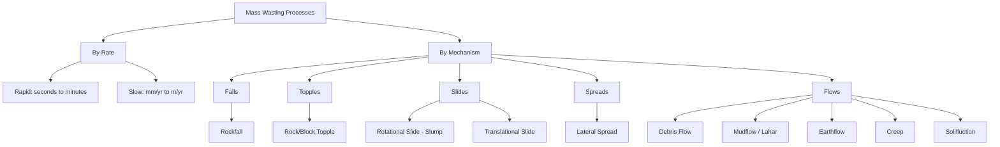

## Mass Wasting and Slope Stability

### Definition and Scope

Mass wasting refers to the downslope movement of rock, regolith, and soil under the direct influence of gravity, without the necessity of a transporting medium such as water, ice, or wind acting as the primary agent (though these often act as triggers or lubricants). It is a fundamental process in landscape denudation, linking weathering to erosion and sediment transport by rivers, glaciers, and wind.

**Key Points**

- Mass wasting is gravity-driven; fluvial, glacial, and aeolian processes are excluded from the strict definition even though they may precondition slopes for failure.
- It operates on all slopes, from nearly flat to vertical cliffs, at rates ranging from imperceptible creep to catastrophic collapse.
- Mass wasting is a primary control on hillslope morphology and sediment supply to river systems.

### Forces Controlling Slope Stability

Slope stability is governed by the balance between driving forces (promoting failure) and resisting forces (opposing failure).

#### Gravitational Force Components

On an inclined slope, the gravitational force acting on a mass can be resolved into two components:

$$F_g = mg$$

- **Shear stress ($\tau$)**: the component of gravity acting parallel to the slope surface, driving downslope movement.
- **Normal stress ($\sigma_n$)**: the component acting perpendicular to the slope surface, pressing material against the slope and contributing to frictional resistance.

For a slope angle $\theta$:

$$\tau = mg\sin\theta$$

$$\sigma_n = mg\cos\theta$$

#### Shear Strength

Resisting forces are collectively termed shear strength ($\tau_f$), commonly modeled with the Mohr-Coulomb failure criterion:

$$\tau_f = c + \sigma_n\tan\phi$$

Where:

- $c$ = cohesion (intrinsic bonding strength of the material, independent of normal stress)
- $\sigma_n$ = effective normal stress
- $\phi$ = angle of internal friction

**Key Points**

- Cohesion is high in clay-rich or cemented materials and near zero in dry, unconsolidated sand.
- The angle of internal friction depends on grain shape, packing, and surface roughness; angular, well-packed grains yield higher $\phi$.
- Effective normal stress is reduced by pore water pressure, per Terzaghi's effective stress principle: $\sigma_n' = \sigma_n - u$, where $u$ is pore water pressure. This is the mechanistic reason water triggers so many failures.

#### Factor of Safety

Slope stability is often quantified using the Factor of Safety (FS), the ratio of resisting to driving forces:

$$FS = \frac{\tau_f}{\tau}$$

- $FS > 1$: slope is theoretically stable
- $FS = 1$: slope is at the threshold of failure (critical equilibrium)
- $FS < 1$: slope failure is expected

[Inference] In practice, FS calculations carry significant uncertainty due to heterogeneity in subsurface material properties, making back-calculated or probabilistic FS values more common in engineering geology than single deterministic outputs.

### The Angle of Repose

The angle of repose is the steepest angle at which a granular material remains stable without sliding, controlled by grain size, shape, sorting, and moisture content. For dry, well-sorted sand, this angle is typically 30-34°. Slightly moist sand can sustain steeper angles due to capillary cohesion (apparent cohesion), while saturated sand loses nearly all shear strength and flows at very low angles.

### Controlling and Triggering Factors

#### Factors That Reduce Slope Stability

**Key Points**

- **Slope angle and slope height**: steeper and taller slopes increase shear stress relative to shear strength.
- **Water content**: increases pore pressure, adds weight (increasing driving force), and can dissolve cementing agents.
- **Removal of vegetation**: reduces root cohesion and increases infiltration and soil saturation.
- **Undercutting**: erosion by streams, waves, or glaciers, or human excavation, removes lateral support at the slope base (toe).
- **Loading**: addition of weight at the slope crest (construction, fill material, water reservoirs) increases driving stress.
- **Freeze-thaw and wetting-drying cycles**: progressively weaken rock and soil structure through repeated expansion and contraction.
- **Earthquakes**: seismic shaking imposes transient, often large, additional shear stress and can trigger liquefaction.
- **Volcanic activity**: heating of groundwater, ash loading, and edifice instability can trigger large-scale collapses (sector collapses).
- **Adverse geologic structure**: bedding planes, joints, foliation, or faults oriented parallel to and dipping steeper than the slope face create planes of weakness (a condition geologists term a "daylighted" bedding plane).

#### Liquefaction

A special case of water-induced instability, liquefaction occurs when saturated, loosely packed granular sediment (commonly sand) temporarily loses shear strength due to a sudden increase in pore water pressure, typically induced by seismic shaking. The sediment behaves as a fluid, and this process underlies many landslides and ground failures during earthquakes.

### Classification of Mass Wasting Processes

Mass wasting processes are classified along two primary axes: **type of movement** (fall, topple, slide, spread, flow) and **material type** (rock, debris, earth/soil), following the widely used Varnes classification scheme.

#### Classification Diagram

#### Falls

Free-falling, bouncing, or rolling of detached rock or debris from a steep slope or cliff, with little to no contact with the slope surface during descent.

- **Mechanism**: triggered by freeze-thaw wedging, root wedging, undercutting, or seismic shaking that dislodges blocks along joints or fractures.
- **Deposit**: accumulates at the cliff base as talus (scree), forming characteristic cone-shaped or apron-shaped deposits with an angle of repose typically 30-40°.
- **Rate**: extremely rapid (seconds).

**Example**

A rockfall from a jointed granite cliff face following a freeze-thaw cycle, where water in a joint expands upon freezing (~9% volume increase), progressively widening the fracture until the block detaches.

#### Topples

Forward rotation of a rock or soil mass about a pivot point below or low in the mass, driven by gravity and often facilitated by water or ice in cracks.

- Commonly occurs in columnar-jointed rock (e.g., basalt) or steeply dipping, fractured strata.
- Can evolve into a fall or slide once the toppled block loses contact with the underlying mass.

#### Slides

Movement of a coherent mass along one or more discrete rupture (failure) surfaces, with relatively little internal deformation of the moving material.

##### Rotational Slides (Slumps)

Movement along a concave-upward, curved failure surface, producing backward rotation of the displaced block.

- **Diagnostic features**: a crescent-shaped **scarp** at the head, a hummocky, back-tilted surface on the slump block, and often a bulging toe.
- Common in thick, homogeneous, cohesive materials (clay, poorly consolidated sediment) and frequently triggered by toe erosion or saturation.

##### Translational Slides

Movement of material along a planar or gently undulating surface, often coincident with a pre-existing plane of weakness such as bedding, foliation, joint surfaces, or the contact between regolith and bedrock.

- Tend to travel farther than rotational slides because the failure plane does not curve back into the slope.
- A **rockslide** is a translational slide involving predominantly bedrock.

#### Spreads

Lateral extension of a cohesive soil or rock mass over a deforming, often liquefied or plastic, underlying layer, producing extension and fracturing of the overlying material into blocks that move apart.

[Unverified] Lateral spreads in sensitive marine clays (e.g., "quick clays" in parts of Scandinavia and eastern Canada) can be triggered with minimal disturbance because the clay's structure collapses catastrophically when disturbed, converting the material almost instantaneously from a solid to a liquid-like slurry; the specific triggering thresholds vary substantially by site and are typically established through local geotechnical investigation.

#### Flows

Movement in which the material behaves as a viscous fluid, with internal shearing distributed throughout the moving mass rather than concentrated on a single discrete surface.

| Flow Type | Water Content | Typical Material | Velocity |
| --- | --- | --- | --- |
| Creep | Low | Soil, regolith | mm-cm/yr |
| Solifluction | Moderate (seasonal) | Soil over permafrost | cm/yr |
| Earthflow | Moderate | Clay-rich soil | m/day to m/yr |
| Debris Flow | High | Mixed sediment, rock, organic debris | m/s (up to tens of m/s) |
| Mudflow | Very high | Fine-grained sediment | m/s |
| Lahar | Very high | Volcanic ash/debris + water | m/s |

##### Creep

The slowest and most widespread form of mass wasting: the imperceptible, continuous downslope movement of soil and regolith, driven largely by repeated expansion and contraction cycles (wetting-drying, freeze-thaw) that lift particles perpendicular to the slope and let gravity settle them slightly downslope each cycle.

**Diagnostic evidence of creep**

- Tilted fence posts, utility poles, and gravestones
- Curved ("pistol-butted") tree trunks that straighten as they grow upward after being tilted at the base
- Bent or offset retaining walls and foundations
- Slowly bowed soil horizons visible in road cuts

##### Solifluction

A slow, saturated soil flow characteristic of periglacial and permafrost environments, occurring when the seasonally thawed active layer, saturated because meltwater cannot drain into the underlying permafrost, flows slowly over the frozen substrate. Produces characteristic lobate and terraced landforms on tundra slopes.

##### Debris Flows

Rapid, water-saturated flows of poorly sorted rock, soil, and organic debris, often initiated by intense rainfall on steep slopes with abundant loose sediment, or by the sudden failure of a slide that liquefies upon mobilization.

- Behave as non-Newtonian fluids (often approximated as Bingham plastics) with a yield strength that must be exceeded before flow initiates.
- Channelized debris flows are strongly confined by pre-existing drainages and can travel long distances at high velocity, posing severe hazards to downstream communities and infrastructure.
- **Lahars** are a specific type of debris flow originating on volcanic slopes, generated by rapid melting of snow/ice during eruption, crater lake breakout, or intense rainfall on unconsolidated volcanic ash.

**Example**

The 1985 Nevado del Ruiz lahar (Colombia) resulted from a relatively small eruption that melted summit glacial ice; the resulting lahar traveled down river valleys and destroyed the town of Armero, illustrating that lahar hazard is not proportional to eruption size but to the volume of available water and loose sediment.

##### Earthflows

Flow of water-saturated, fine-grained soil (typically clay- or silt-rich) down moderate slopes, producing a characteristic "hourglass" morphology: a bowl-shaped depression (source area) at the head narrowing into a channelized track and widening again into a lobate toe of deposition.

### Slope Failure Geometry (Rotational Slump)

Below is an SVG cross-section illustrating the anatomy of a rotational slump, a common translational vs. rotational slide comparison.

<svg xmlns="http://www.w3.org/2000/svg" viewBox="0 0 800 420" font-family="Helvetica, Arial, sans-serif">
<text x="400" y="30" text-anchor="middle" font-size="20" font-weight="bold" fill="#222">Anatomy of a Rotational Slump (svg_diagram)</text>

<path d="M 60 380 L 60 200 Q 200 120 380 100 L 750 60" fill="none" stroke="#999" stroke-width="2" stroke-dasharray="6,6" />
<text x="620" y="50" font-size="13" fill="#777">Original slope surface</text>

<path d="M 60 380 L 750 380 L 750 60 Q 500 90 380 220 Q 300 320 150 350 Q 90 365 60 380 Z" fill="#d8c9a3" stroke="none" />

<path d="M 380 100 Q 300 200 220 280 Q 170 330 90 355" fill="none" stroke="#8b3a2f" stroke-width="3" stroke-dasharray="10,4" />
<text x="180" y="260" font-size="13" fill="#8b3a2f" font-weight="bold">Rupture surface</text>

<path d="M 380 100 Q 300 200 220 280 Q 260 260 320 235 Q 370 200 400 150 Q 410 120 380 100 Z" fill="#c9955c" stroke="#5a3d1f" stroke-width="2" />

<path d="M 90 355 Q 130 330 175 335 Q 210 340 220 280" fill="#b98a4e" stroke="#5a3d1f" stroke-width="2" />
<text x="100" y="330" font-size="13" fill="#333" font-weight="bold">Toe (bulge)</text>

<line x1="380" y1="100" x2="410" y2="60" stroke="#333" stroke-width="3" />
<text x="415" y="65" font-size="13" fill="#333" font-weight="bold">Main scarp</text>

<path d="M 380 150 Q 350 155 330 175" fill="none" stroke="#333" stroke-width="2" />
<text x="300" y="150" font-size="12" fill="#333">Back-tilted</text>
<text x="300" y="165" font-size="12" fill="#333">surface</text>

<path d="M 90 340 L 250 300 L 400 260" fill="none" stroke="#2f6bab" stroke-width="2" stroke-dasharray="4,3" />
<text x="410" y="255" font-size="12" fill="#2f6bab">Water table</text>

<g stroke="#2f6b2f" stroke-width="3">
<line x1="600" y1="70" x2="600" y2="45" />
<circle cx="600" cy="40" r="10" fill="#3d8b3d" stroke="none" />
<line x1="500" y1="90" x2="500" y2="65" />
<circle cx="500" cy="60" r="10" fill="#3d8b3d" stroke="none" />
</g>

<line x1="60" y1="380" x2="750" y2="380" stroke="#333" stroke-width="2" />
</svg>

### Slope Stability Analysis Concepts

#### Infinite Slope Model

Used for translational failures in soil where the slide is shallow relative to slope length, allowing edge effects to be ignored. Factor of safety for a dry, cohesionless infinite slope simplifies to:

$$FS = \frac{\tan\phi}{\tan\theta}$$

For a slope with cohesion and a water table at height $m$ (as a fraction of soil depth) above the failure plane, the expression expands to incorporate pore pressure reduction of effective stress, generally lowering FS as $m$ increases toward 1 (fully saturated).

#### Limit Equilibrium Methods

Engineering geologists commonly use methods such as the **Ordinary Method of Slices**, **Bishop's Simplified Method**, and **Janbu's Method** to analyze rotational failure surfaces by dividing the slide mass into vertical slices, summing driving and resisting forces/moments across all slices, and solving iteratively for the critical (lowest FS) failure surface.

[Inference] These methods, while standard in practice, rely on simplifying assumptions about inter-slice forces; more rigorous stability requires numerical methods (finite element or finite difference) for complex geometries or heterogeneous stratigraphy.

### Human Interaction and Mitigation

#### Human-Induced Triggers

- Slope oversteepening from road cuts, quarrying, and construction excavation
- Deforestation and land-use change reducing root cohesion
- Irrigation and septic system leach fields increasing soil saturation
- Reservoir loading and drawdown altering pore pressure regimes
- Vibration from construction, blasting, and traffic

#### Mitigation Strategies

**Key Points**

- **Slope regrading**: reducing slope angle or benching (terracing) to lower driving stress.
- **Drainage**: horizontal drains, surface ditches, and subsurface drains to lower pore water pressure.
- **Retaining structures**: retaining walls, soil nails, and rock bolts to add resisting force.
- **Vegetation management**: replanting deep-rooted vegetation to enhance root cohesion and reduce infiltration.
- **Rockfall barriers and mesh**: catch fences, draped mesh, and shotcrete on cliff faces.
- **Toe buttressing**: adding mass or structural support at the slope base to counteract rotational failure.
- **Monitoring**: inclinometers, extensometers, GPS/InSAR ground deformation monitoring, and piezometers to track precursory movement and pore pressure.

#### Hazard Assessment

Landslide susceptibility mapping integrates slope angle, geology, land cover, precipitation history, and past landslide inventories, often within a GIS framework, to produce hazard zonation maps used in land-use planning. [Unverified] The specific statistical or physically based models used (e.g., logistic regression, SINMAP, TRIGRS) vary by jurisdiction and available data quality, and their predictive accuracy is highly site-dependent.

### Notable Real-World Examples

- **1970 Huascarán debris avalanche (Peru)**: triggered by an earthquake-induced ice/rock avalanche from Nevado Huascarán, transformed into a highly mobile debris flow that buried the town of Yungay.
- **1983 Thistle, Utah landslide**: a slow-moving translational/rotational slide reactivated by heavy snowmelt and rain, damming a river valley and causing extensive infrastructure damage.
- **2014 Oso landslide (Washington, USA)**: a rapid, highly mobile flow-slide in glacial sediments following prolonged heavy rainfall, demonstrating how saturated, weakly consolidated glacial deposits can fail catastrophically on moderate slopes.

### Summary Comparison Table

| Process | Movement Type | Typical Velocity | Water Requirement | Coherence of Mass |
| --- | --- | --- | --- | --- |
| Rockfall | Fall | Extremely rapid | Low | Fragmented |
| Topple | Rotation about pivot | Rapid | Low-moderate | Coherent to fragmented |
| Rockslide/Slump | Slide | Rapid to moderate | Variable | Coherent |
| Lateral Spread | Spread | Rapid | High (liquefied layer) | Fractured blocks |
| Creep | Flow | Extremely slow | Low-moderate | Deformed, continuous |
| Debris Flow | Flow | Very rapid | High | Fully remolded |

**Related Topics**

- Weathering processes (physical, chemical, biological) as preconditioning factors for mass wasting
- Hillslope hydrology and infiltration-runoff partitioning
- Fluvial geomorphology and sediment delivery from hillslopes to channels
- Engineering geology and geotechnical site investigation methods
- Volcanic hazards: lahars, pyroclastic flows, and edifice collapse
- Periglacial geomorphology and permafrost processes
- Landslide monitoring technologies: InSAR, LiDAR change detection, real-time sensor networks
- Seismic hazard analysis and earthquake-induced ground failure
- Coastal and riverbank erosion as slope-undercutting mechanisms
- GIS-based landslide susceptibility and risk modeling