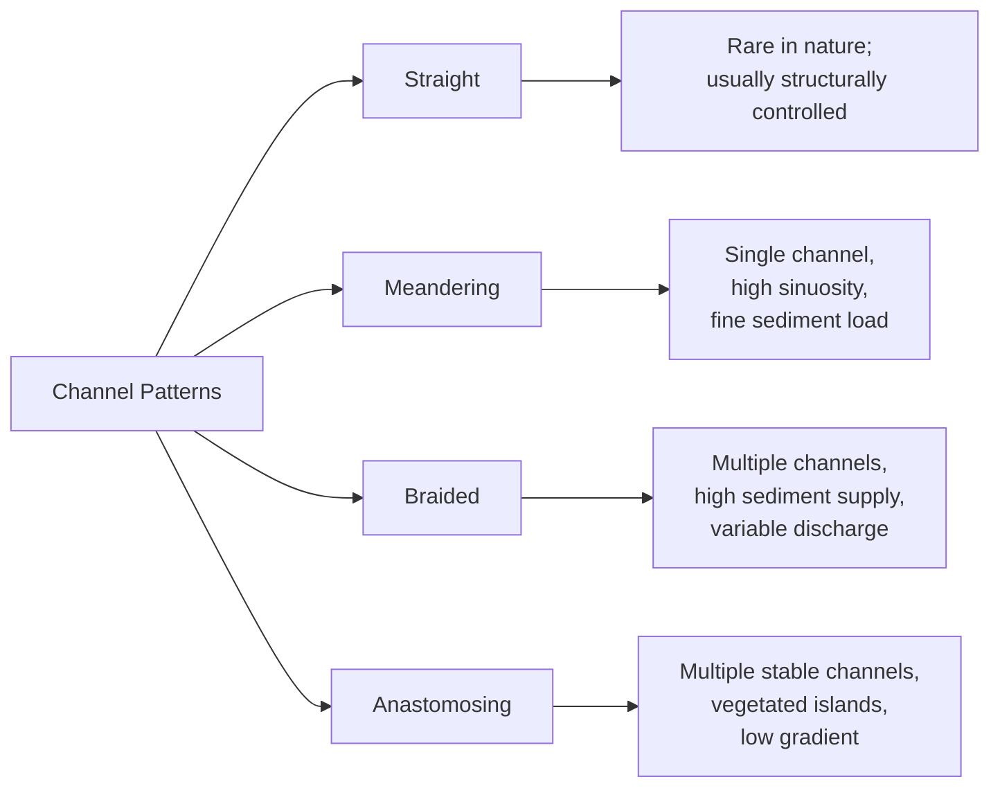
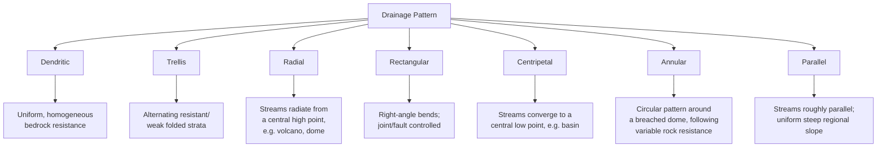

## Fluvial Landforms and Drainage Systems

### Definition and Scope

Fluvial geomorphology is the study of landforms produced by the action of rivers and streams, encompassing both erosional and depositional processes. It examines how flowing water shapes channels, valleys, and adjacent floodplains, and how networks of channels organize themselves into drainage systems across a landscape.

**Key Points**

- Fluvial processes are the dominant agent of landscape evolution in most non-glacial, non-arid terrestrial environments.
- Fluvial systems link hillslope sediment sources (via mass wasting and weathering) to depositional sinks (floodplains, deltas, ocean basins).
- Both erosional landforms (canyons, terraces, potholes) and depositional landforms (floodplains, deltas, alluvial fans) result from the same underlying hydraulic and sediment-transport principles.

### Stream Hydraulics Fundamentals

#### Discharge

Discharge ($Q$) is the volume of water passing a cross-section per unit time, expressed as:

$$Q = wdv$$

Where $w$ = channel width, $d$ = mean depth, $v$ = mean velocity. Discharge generally increases downstream as tributaries add water, even as individual variables (width, depth, velocity) each increase at different rates (hydraulic geometry relationships).

#### Stream Power and Competence

Stream power ($\Omega$) expresses the rate of energy expenditure per unit length of channel:

$$\Omega = \rho g Q S$$

Where $\rho$ = fluid density, $g$ = gravitational acceleration, $Q$ = discharge, $S$ = channel slope (gradient).

- **Competence**: the largest particle size a stream can transport, related to the square or higher power of velocity (per the Hjulström-Sundborg relationship).
- **Capacity**: the total sediment load a stream can carry, which scales with discharge.

#### Hjulström-Sundborg Diagram Concept

Describes the relationship between grain size and the velocity thresholds for erosion, transport, and deposition. Notably, fine clay particles require higher velocities to erode (due to cohesion) than to keep in transport, illustrating that erosion and deposition thresholds are not symmetrical across grain sizes.

### Sediment Transport Mechanisms

**Key Points**

- **Dissolved load**: material transported in chemical solution, invisible and independent of flow competence.
- **Suspended load**: fine sediment (silt, clay, fine sand) held aloft by turbulence; constitutes the majority of sediment load by mass in most rivers.
- **Bed load**: coarser sediment (sand, gravel, cobbles) moved along the channel bottom by:
  - **Traction**: rolling and sliding of grains
  - **Saltation**: short hops as grains are briefly lifted by flow and impact the bed, dislodging others
- **Wash load**: very fine sediment (typically clay/fine silt) supplied from the watershed that stays in suspension regardless of local flow competence, largely independent of the channel bed material.

### Channel Patterns

#### Meandering Channels

Single-thread channels with sinuous, curving planform geometry, typically dominated by suspended fine sediment load and relatively stable banks.

- **Point bar**: a depositional feature on the inside of a meander bend, where reduced velocity in the zone of helical (secondary) flow causes sediment deposition.
- **Cut bank**: the outer bank of a meander bend, subject to erosion due to higher velocity and centrifugal-driven helical flow directed toward the outer bank.
- **Meander cutoff**: occurs when a meander neck is breached during high flow, straightening the channel and isolating the former bend as an **oxbow lake**.
- **Sinuosity index**: channel length divided by valley length; values greater than 1.5 are generally classified as meandering.

##### Helical Flow in Meanders

Secondary (helical) circulation develops in meander bends: surface water moves toward the outer (cut) bank while near-bed water moves toward the inner (point bar) bank, driven by the pressure gradient and centrifugal acceleration imbalance around the curve. This circulation is the principal mechanism transferring eroded sediment from the cut bank across the channel to be deposited on the point bar.

#### Braided Channels

Multiple, interconnected, shifting channels separated by temporary bars, typical of streams with highly variable discharge, abundant coarse sediment supply, and easily erodible banks.

- Common in proglacial outwash plains, alluvial fans, and semi-arid environments with flashy discharge.
- Channel pattern shifts frequently, sometimes within a single flood event.

#### Anastomosing Channels

Multiple stable, interconnected channels separated by permanent, vegetated islands, typically found on low-gradient rivers with high, stable bank cohesion (often due to fine sediment and dense vegetation) and net aggradation.

[Inference] The distinction between braided and anastomosing systems is sometimes debated in the literature and can grade into one another depending on vegetation density, sediment caliber, and discharge variability at a given site.

### Longitudinal Profile and Base Level

The longitudinal profile is a plot of channel elevation versus downstream distance, typically concave-up, reflecting a general decrease in gradient downstream as discharge increases and grain size decreases.

- **Base level**: the theoretical lowest elevation to which a stream can erode, ultimately controlled by sea level (**ultimate base level**) for streams draining to the ocean.
- **Local (temporary) base level**: a lake, resistant rock layer, or dam that temporarily controls the profile upstream of it.
- **Graded stream**: a theoretical equilibrium condition in which slope, discharge, and sediment load are mutually adjusted so the stream neither erodes nor aggrades significantly over time.
- **Knickpoint**: an abrupt break in slope along the longitudinal profile, often marking a zone of active erosion migrating upstream in response to base-level fall (e.g., waterfalls, rapids).

#### Base Level Response

$$S \propto \frac{Q_s}{Q^{0.5}}$$

[Inference] This simplified proportionality (derived from broader stream-power and sediment-transport theory) illustrates that channel slope tends to increase with sediment supply ($Q_s$) and decrease with discharge ($Q$), but actual exponents and coefficients vary by region, lithology, and empirical calibration; it should be read as a conceptual relationship rather than a universal formula.

### Erosional Fluvial Landforms

**Key Points**

- **V-shaped valleys**: characteristic of youthful, high-gradient streams dominated by vertical (downcutting) erosion.
- **Canyons and gorges**: deep, steep-walled valleys formed where downcutting outpaces valley widening, often in resistant rock or arid climates with limited mass wasting on valley walls.
- **Potholes**: circular depressions eroded into bedrock streambeds by the abrasive, swirling action of sediment-laden turbulent water (a form of localized abrasion).
- **Waterfalls and knickpoints**: form where a stream crosses a resistant rock layer or a fault, or in response to base-level fall; typically migrate upstream over time through undercutting and collapse of the resistant caprock.
- **Stream terraces**: former floodplain surfaces abandoned as a stream downcuts into its own older alluvium, often in response to base-level fall, climate change, or tectonic uplift; preserved as flat, paired or unpaired benches above the modern floodplain.
- **Fluvial (river) capture (piracy)**: occurs when headward erosion by one stream breaches the divide and diverts the flow of an adjacent drainage system into its own channel.

### Depositional Fluvial Landforms

#### Floodplains

The relatively flat area adjacent to a channel that is periodically inundated during high-discharge events, built by lateral channel migration (point bar deposition) and vertical accretion of fine sediment (overbank deposition) during floods.

- **Natural levees**: low ridges paralleling the channel, built by rapid deposition of coarser sediment as floodwaters lose velocity and competence immediately upon leaving the channel.
- **Backswamp**: low-lying, poorly drained area on the floodplain beyond the levees, where only the finest sediment (clay, organic material) accumulates during flood recession.
- **Crevasse splay**: a fan-shaped deposit formed when a natural levee is breached during a flood, allowing sediment-laden water to spread rapidly onto the floodplain.

#### Alluvial Fans

Cone-shaped depositional landforms that form where a stream emerges from a confined valley or mountain front onto a broader, lower-gradient plain, causing an abrupt loss of confinement and competence.

- Common in arid and semi-arid tectonically active regions (e.g., basin-and-range topography).
- Sediment is typically coarse near the apex and fines outward (distally).

#### Deltas

Depositional landforms that form where a river enters a standing body of water (ocean, lake) and deposits its sediment load as flow velocity and competence rapidly decrease.

##### Delta Classification by Dominant Process

| Delta Type | Dominant Process | Morphology | Example Setting |
| --- | --- | --- | --- |
| River-dominated | Fluvial discharge | Elongate, "bird's-foot" lobes | Low wave/tide energy coastlines |
| Wave-dominated | Wave reworking | Smooth, arcuate shoreline | High wave energy coastlines |
| Tide-dominated | Tidal currents | Elongate, funnel-shaped distributary channels | Macrotidal coastlines |

##### Gilbert Delta Structure

Classic deltas (particularly in lacustrine settings) exhibit three internal sedimentary layers:

- **Topset beds**: nearly horizontal layers deposited on the delta plain/top surface
- **Foreset beds**: steeply inclined layers deposited on the advancing delta front (the primary depositional slope)
- **Bottomset beds**: fine, gently inclined layers deposited beyond the delta front in deeper, quieter water

### Drainage Basins and Divides

A **drainage basin** (watershed or catchment) is the total land area that contributes surface runoff to a given stream or river system, bounded by a **drainage divide**, the topographic high separating adjacent basins.

**Key Points**

- Drainage basins are nested hierarchically; small sub-basins combine to form progressively larger basins.
- Basin morphometry (shape, relief, drainage density) strongly influences the timing and magnitude of flood response.
- **Drainage density**: total stream channel length divided by basin area; high drainage density indicates impermeable substrate, sparse vegetation, or high relief, while low drainage density suggests permeable substrate or dense vegetation.

### Stream Order

The **Strahler stream ordering system** is the most widely used method for classifying the hierarchical position of a stream segment within a drainage network.

- A channel with no tributaries is a **first-order** stream.
- When two streams of the same order meet, the resulting stream increases by one order (two first-order streams join to form a second-order stream).
- When two streams of different orders meet, the resulting stream retains the higher of the two orders.
- The order of the entire drainage basin is defined by its highest-order stream at the outlet.

<svg xmlns="http://www.w3.org/2000/svg" viewBox="0 0 700 380" font-family="Helvetica, Arial, sans-serif">
<text x="350" y="28" text-anchor="middle" font-size="18" font-weight="bold" fill="#222">Strahler Stream Order (svg_diagram)</text>

<g stroke="#7fb8e8" stroke-width="2" fill="none">
<line x1="60" y1="60" x2="120" y2="110" />
<line x1="60" y1="140" x2="120" y2="110" />
<line x1="60" y1="190" x2="140" y2="220" />
<line x1="60" y1="250" x2="140" y2="220" />
<line x1="60" y1="300" x2="150" y2="290" />
<line x1="60" y1="340" x2="150" y2="290" />
</g>

<g stroke="#3d8bc4" stroke-width="3" fill="none">
<line x1="120" y1="110" x2="220" y2="170" />
<line x1="140" y1="220" x2="220" y2="200" />
</g>

<path d="M 220 170 L 220 200 L 320 220" stroke="#1f5f96" stroke-width="4" fill="none" />
<line x1="150" y1="290" x2="320" y2="220" stroke="#3d8bc4" stroke-width="3" fill="none" />

<path d="M 320 220 L 500 240 L 650 260" stroke="#0d3d63" stroke-width="6" fill="none" />

<text x="70" y="55" font-size="12" fill="`#3d8bc4`">1</text>

<text x="70" y="185" font-size="12" fill="`#3d8bc4`">1</text>

<text x="70" y="295" font-size="12" fill="`#3d8bc4`">1</text>

<text x="175" y="150" font-size="12" fill="`#1f5f96`" font-weight="bold">2</text>

<text x="260" y="195" font-size="12" fill="`#0d3d63`" font-weight="bold">3</text>

<text x="480" y="235" font-size="14" fill="`#08243d`" font-weight="bold">4</text>

<text x="350" y="360" text-anchor="middle" font-size="12" fill="#555">Two 1st-order streams join to form a 2nd-order segment; two 2nd-order streams form a 3rd-order segment</text>

</svg>

### Drainage Patterns

Drainage patterns reflect the underlying geologic structure, rock resistance, and regional slope, and are a key tool for interpreting subsurface geology from surface stream networks.

**Key Points**

- **Dendritic**: tree-like branching pattern, forming on horizontal, uniformly resistant strata or homogeneous crystalline rock; the most common pattern globally.
- **Trellis**: parallel main streams with short tributaries meeting at near-right angles, characteristic of folded sedimentary terrain with alternating resistant (ridge-forming) and weak (valley-forming) rock layers, such as the Valley and Ridge province.
- **Radial**: streams flow outward from a central topographic high, typical of isolated volcanic cones or domal uplifts.
- **Centripetal**: the inverse of radial; streams converge toward a central topographic low, such as a closed basin or crater.
- **Rectangular**: streams follow orthogonal joint or fault systems, producing sharp right-angle bends.
- **Annular**: a ring-like pattern that develops around a breached, structurally domed area where erosion has exposed concentric bands of varying rock resistance.
- **Parallel**: streams flow roughly parallel to one another, typically reflecting a uniform, moderately steep regional slope or parallel structural control (e.g., parallel fault sets).

### Fluvial Terraces and Incision Cycles

Stream terraces record episodes of lateral planation (floodplain widening) followed by vertical incision, often driven by:

- **Climatic change**: shifts in precipitation/temperature altering discharge and sediment supply balance
- **Tectonic uplift**: increasing regional gradient and triggering renewed downcutting
- **Base-level fall**: relative sea-level drop or upstream capture events

**Paired terraces** occur at the same elevation on both valley sides, indicating that incision was episodic and relatively rapid relative to lateral migration. **Unpaired terraces** occur at varying elevations on either side, indicating that lateral migration and gradual incision occurred simultaneously.

### Example: Interpreting a Drainage Network

**Example**

A field geologist observing a trellis drainage pattern with ridges composed of resistant sandstone and valleys underlain by shale would reasonably infer the presence of folded, alternating sedimentary strata (an anticline-syncline sequence) beneath the surface, since trellis patterns form preferentially where differential erosion exploits a series of parallel, contrasting rock units. [Inference] Confirming this interpretation in the field would still require supporting stratigraphic or structural data, as similar patterns can occasionally arise from other structural controls.

### Human Interaction with Fluvial Systems

**Key Points**

- **Channelization and levee construction**: modifies natural flood conveyance, often increasing downstream flood peaks and reducing sediment deposition on floodplains.
- **Dam construction**: traps sediment upstream, leading to sediment-starved ("hungry water") conditions downstream that can cause channel incision and coarsening of the bed.
- **Urbanization**: increases impervious surface area, raising peak discharge and shortening the time to peak flow (lag time) during storm events.
- **Agricultural land use**: can increase sediment yield through soil erosion or decrease it through soil conservation practices.

### Summary Comparison Table

| Landform/Feature | Formation Process | Typical Setting |
| --- | --- | --- |
| Point bar | Deposition on inside of meander bend | Meandering channels |
| Cut bank | Erosion on outside of meander bend | Meandering channels |
| Oxbow lake | Meander cutoff isolation | Low-gradient meandering rivers |
| Braid bar | Temporary deposition between shifting channels | Braided rivers |
| Natural levee | Rapid overbank deposition of coarse sediment | Floodplains |
| Alluvial fan | Loss of confinement/competence at valley mouth | Mountain front, arid regions |
| Delta | Loss of competence at standing water body | River mouths |
| Stream terrace | Abandonment of former floodplain via incision | Uplifted or base-level-lowered valleys |
| Knickpoint | Resistant layer or base-level fall | Actively adjusting profiles |

**Related Topics**

- Mass wasting and slope stability as sediment sources to fluvial systems
- Flood hydrology and hydrograph analysis
- Karst topography and groundwater-surface water interaction
- Coastal geomorphology and delta/estuary evolution
- Tectonic geomorphology: stream response to uplift and faulting
- Sediment budgets and watershed sediment yield
- Paleohydrology and terrace chronosequences (dating methods: OSL, radiocarbon)
- River restoration and channel engineering practices
- Drainage basin morphometry and hydrologic modeling (e.g., unit hydrograph theory)
- Arid-region fluvial systems: ephemeral streams, wadis, and playas