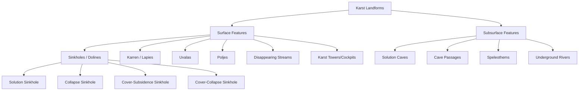

## Karst Topography and Cave Formation

### Definition and Scope

Karst topography refers to a distinctive landscape formed primarily through the chemical dissolution of soluble bedrock, most commonly limestone (calcium carbonate), but also dolomite, gypsum, and rock salt. Karst landscapes are characterized by a suite of surface and subsurface landforms, including sinkholes, caves, disappearing streams, and springs, and by drainage that is dominantly subsurface rather than surface-based.

**Key Points**

- Karst develops preferentially in soluble rocks with well-developed fracture/joint/bedding-plane networks that allow water infiltration.
- The term derives from the Kras (Karst) plateau region spanning Slovenia and Italy, where these landforms were first systematically described.
- Karst terrains occupy a substantial fraction of Earth's ice-free land surface and are important both as unique ecosystems and as vulnerable aquifer systems.

### Chemistry of Carbonate Dissolution

#### The Carbonic Acid Reaction

Limestone dissolution occurs primarily through the reaction of calcium carbonate with carbonic acid, which forms when atmospheric and soil-derived carbon dioxide dissolves in water:

$$CO_2 + H_2O \rightleftharpoons H_2CO_3$$

$$H_2CO_3 \rightleftharpoons H^+ + HCO_3^-$$

$$CaCO_3 + H^+ + HCO_3^- \rightleftharpoons Ca^{2+} + 2HCO_3^-$$

The net simplified reaction is often written as:

$$CaCO_3 + CO_2 + H_2O \rightleftharpoons Ca^{2+} + 2HCO_3^-$$

**Key Points**

- This reaction is reversible: the forward direction dissolves limestone, while the reverse direction (loss of $CO_2$, e.g., through degassing or evaporation) precipitates calcium carbonate, the mechanism responsible for speleothem growth.
- Soil-zone $CO_2$ concentrations are typically far higher than atmospheric concentrations due to root respiration and microbial decomposition of organic matter, making infiltrating water most chemically aggressive near the soil-bedrock interface.
- Water temperature inversely affects $CO_2$ solubility; cooler water can hold more dissolved $CO_2$ and is therefore generally more chemically aggressive toward carbonate rock, all else being equal.

#### Controls on Dissolution Rate

- **Rock purity**: high-purity limestone (high $CaCO_3$ content) dissolves more readily than impure or dolomitic limestone.
- **Fracture density**: joints, bedding planes, and faults provide pathways for water circulation; dissolution is concentrated along these discontinuities and widens over time.
- **Climate**: humid climates with abundant rainfall and vegetation (high soil $CO_2$ production) generally produce more vigorous karstification than arid climates. [Inference] The relative importance of temperature versus water volume/soil biological activity in driving dissolution rates is debated in the literature, as warmer climates increase reaction kinetics but can also reduce $CO_2$ solubility and, in arid settings, limit available water.
- **Hydraulic gradient**: steeper gradients drive more vigorous groundwater flow and dissolution.

### Surface Karst Landforms

#### Sinkholes (Dolines)

Closed depressions in the land surface, the most characteristic karst landform, formed through several distinct mechanisms:

- **Solution sinkholes**: form where surface water preferentially dissolves bedrock at a point of concentrated infiltration (e.g., a joint intersection), producing a gradual, funnel-shaped depression.
- **Collapse sinkholes**: form when the roof of a subsurface cave chamber becomes too thin to support its own weight and catastrophically collapses, often producing near-vertical walls and rapid formation.
- **Cover-subsidence sinkholes**: develop gradually where unconsolidated overlying sediment slowly settles/ravels downward into voids in the underlying soluble bedrock, common where the cover material is granular and permeable.
- **Cover-collapse sinkholes**: occur where cohesive overlying sediment (e.g., clay) spans a growing subsurface void until it can no longer support itself, then fails suddenly; these pose the greatest engineering hazard due to their rapid, often unpredictable onset.

**Example**

A cover-collapse sinkhole in central Florida forming within hours beneath a road, where a slow-growing cavity in underlying limestone had been bridged by a cohesive clay cap that gave way suddenly, illustrates why cover-collapse sinkholes are of particular concern in urban planning and infrastructure siting in karst terrain.

#### Karren (Lapiés)

Small-scale surface dissolution features, typically centimeters to a few meters in size, formed by the etching action of water flowing across exposed bedrock surfaces. Includes forms such as solution channels (rillenkarren), pits (kamenitza), and grooves.

#### Uvalas and Poljes

- **Uvala**: a larger, compound closed depression formed by the coalescence of multiple adjacent sinkholes as their walls erode and merge.
- **Polje**: a very large, flat-floored closed depression (often kilometers in scale) with steep bounding walls, typically structurally controlled (fault- or fold-bounded) and often seasonally flooded where the water table intersects the basin floor.

#### Disappearing Streams and Blind Valleys

Surface streams that flow into a sinkhole or cave entrance (a **swallow hole** or **ponor**) and continue as subsurface flow, sometimes reemerging elsewhere as a karst spring. A **blind valley** is a valley that terminates abruptly where its stream disappears underground, without continuing as a surface channel.

#### Tropical (Tower) Karst

In humid tropical and subtropical climates with high dissolution rates, karst can evolve into dramatic residual landforms:

- **Cockpit karst**: a landscape of closely spaced, star-shaped depressions separated by conical or irregular hills.
- **Tower karst (fenglin/fengcong)**: isolated, steep-sided residual limestone towers rising abruptly from flat alluviated plains, as classically developed in southern China (e.g., Guilin/Yangshuo region) and parts of Southeast Asia.

[Inference] The specific developmental sequence from cockpit to tower karst (whether towers represent a later erosional stage of cockpit karst or a distinct process) remains a subject of ongoing geomorphological research and may vary regionally.

### Cave Formation (Speleogenesis)

#### Primary Dissolution Zone

Most solution caves form at or near the water table, in the phreatic zone (permanently saturated), where groundwater flow is concentrated along bedding planes and joints, dissolving passages over long timescales. As regional base level falls (e.g., due to valley incision), cave systems can be left in the vadose zone (above the water table), where streams continue to modify passages primarily through mechanical erosion.

#### Cave Passage Development Model

**Key Points**

- Early-stage dissolution along a narrow fracture is slow and diffusion-limited; as the aperture widens, flow becomes turbulent, dramatically accelerating dissolution rates in a positive feedback loop.
- This nonlinear feedback explains why only a small percentage of initial fractures develop into significant cave passages, while most remain minor seepage pathways.
- Multi-level cave systems often record successive base-level positions, with higher, drier passages representing older, abandoned phases of cave development.

#### Hypogenic vs. Epigenic Speleogenesis

- **Epigenic caves**: formed by meteoric water (rainfall-derived) infiltrating from the surface, carrying dissolved atmospheric/soil $CO_2$; this is the dominant mode of cave formation globally.
- **Hypogenic caves**: formed by water rising from depth, often acidified by sources other than soil $CO_2$, most notably hydrogen sulfide oxidizing to sulfuric acid ($H_2S \rightarrow H_2SO_4$), a process independent of surface infiltration patterns. Hypogenic caves often exhibit distinctive morphologies such as rising passages, cupolas, and gypsum deposits from the sulfuric acid reaction with limestone.

**Example**

Carlsbad Caverns and Lechuguilla Cave (New Mexico, USA) are prominent examples of hypogenic, sulfuric-acid speleogenesis, where hydrogen sulfide-rich fluids rising from underlying petroleum reservoirs oxidized to form sulfuric acid, producing some of the most extensive and elaborately decorated cave systems documented.

### Speleothems (Cave Formations)

Speleothems are secondary mineral deposits, predominantly calcite (or aragonite), formed by the precipitation of calcium carbonate from solution once infiltrating water reaches an open cave passage and degasses $CO_2$, reversing the dissolution reaction.

#### Common Speleothem Types

| Speleothem | Formation Mechanism | Orientation |
| --- | --- | --- |
| Stalactite | Drip-fed deposition from cave ceiling; grows downward | Ceiling to floor |
| Stalagmite | Deposition from drips landing on cave floor; grows upward | Floor to ceiling |
| Column | Fusion of a stalactite and stalagmite | Ceiling to floor |
| Flowstone | Sheet-like deposition from thin films of flowing water on walls/floors | Sloped surfaces |
| Draperies (curtains) | Deposition along a sloped ceiling surface following the path of trickling water | Ceiling, angled |
| Soda straws | Thin, hollow tubular precursor to stalactites, formed before crystallization thickens the walls | Ceiling, vertical |
| Helictites | Irregular, gravity-defying growth, likely controlled by capillary forces and crystal impurities | Variable, non-vertical |
| Rimstone dams | Precipitation along the edges of flowing water pools, building dam-like ridges | Pool margins |

[Inference] The precise mechanism controlling helictite growth direction is not fully resolved and may involve a combination of capillary action through a central canal and crystallographic controls, an area of continued speleological research.

#### Speleothem Growth Rate and Paleoclimate Applications

Speleothem growth rates are highly variable (typically on the order of tens to hundreds of micrometers per year) and depend on drip rate, water saturation state, and cave air $CO_2$ concentration. Because speleothems incorporate trace elements and stable isotopes (particularly oxygen-18 and carbon-13) from the parent drip water at the time of formation, and can be dated precisely using uranium-series (U-Th) methods, they serve as valuable high-resolution paleoclimate archives.

### Cave Cross-Section Diagram

<svg xmlns="http://www.w3.org/2000/svg" viewBox="0 0 800 420" font-family="Helvetica, Arial, sans-serif">
<text x="400" y="28" text-anchor="middle" font-size="18" font-weight="bold" fill="#222">Karst Cave System Cross-Section (svg_diagram)</text>
<path d="M 20 80 L 780 80" stroke="#333" stroke-width="2" />
<text x="30" y="70" font-size="12" fill="#333">Surface</text>
<rect x="20" y="80" width="760" height="320" fill="#e5ded0" stroke="none" />
<path d="M 100 80 Q 130 130 160 90" fill="#c7b78a" stroke="#333" stroke-width="1.5" />
<text x="90" y="60" font-size="12" fill="#333" font-weight="bold">Sinkhole</text>
<path d="M 40 80 L 100 80" stroke="#2f6bab" stroke-width="3" fill="none" />
<path d="M 130 105 Q 150 160 180 190" stroke="#2f6bab" stroke-width="3" fill="none" stroke-dasharray="4,3" />
<ellipse cx="280" cy="150" rx="60" ry="22" fill="#f5efe0" stroke="#8a6d3b" stroke-width="2" />
<text x="245" y="130" font-size="11" fill="#5a4a2a">Abandoned (vadose)</text>
<text x="255" y="185" font-size="11" fill="#5a4a2a">passage</text>
<path d="M 20 260 L 780 250" stroke="#1f5f96" stroke-width="2" stroke-dasharray="6,4" />
<text x="650" y="245" font-size="13" fill="#1f5f96" font-weight="bold">Water table</text>
<path d="M 180 190 Q 250 240 320 260 Q 400 280 480 270 Q 560 260 620 290" stroke="#0d3d63" stroke-width="8" fill="none" stroke-linecap="round" opacity="0.85" />
<text x="330" y="300" font-size="12" fill="#0d3d63" font-weight="bold">Active phreatic passage</text>
<ellipse cx="480" cy="200" rx="90" ry="45" fill="#f8f4e8" stroke="#8a6d3b" stroke-width="2" />
<text x="440" y="165" font-size="12" fill="#5a4a2a" font-weight="bold">Decorated chamber</text>
<g fill="#c9bfa0" stroke="#8a6d3b" stroke-width="1">
<polygon points="440,165 445,195 435,195" />
<polygon points="465,160 470,200 460,200" />
<polygon points="500,162 505,190 495,190" />
</g>
<g fill="#c9bfa0" stroke="#8a6d3b" stroke-width="1">
<polygon points="450,235 460,200 440,200" />
<polygon points="500,240 508,205 492,205" />
</g>
<path d="M 620 290 Q 680 310 700 350" stroke="#2f6bab" stroke-width="4" fill="none" />
<circle cx="705" cy="360" r="6" fill="#2f6bab" />
<text x="600" y="380" font-size="12" fill="#2f6bab" font-weight="bold">Karst spring</text>
<g stroke="#c9bfa0" stroke-width="1" opacity="0.6">
<line x1="20" y1="340" x2="780" y2="330" />
<line x1="20" y1="380" x2="780" y2="370" />
</g>

<text x="30" y="105" font-size="12" fill="#333">Vadose zone</text>

<text x="30" y="280" font-size="12" fill="#333">Phreatic zone</text>

</svg>

### Karst Hydrology

#### Distinctive Aquifer Behavior

Karst aquifers differ fundamentally from typical porous-media (granular) aquifers due to the presence of conduits (solutionally enlarged channels) alongside diffuse fracture flow:

- **Conduit flow**: rapid, often turbulent flow through well-integrated cave passages, capable of transmitting water and contaminants over kilometers within hours to days.
- **Diffuse flow**: slow flow through the fine fracture network and rock matrix, analogous to conventional porous-media groundwater flow.
- **Triple porosity system**: karst aquifers are often conceptualized as having matrix porosity, fracture porosity, and conduit porosity operating simultaneously and interactively.

**Key Points**

- Karst springs frequently show rapid, "flashy" discharge responses to precipitation events, in contrast to the damped, delayed response typical of porous aquifers.
- Karst aquifers are highly vulnerable to contamination because conduit flow can transport pollutants rapidly, with minimal filtration, over long distances.
- Dye tracing is a standard technique used to establish hydrologic connections between sinkholes/swallow holes and their corresponding springs in karst terrain, since surface drainage divides often do not correspond to subsurface groundwater divides.

### Evaporite Karst

While carbonate (limestone/dolomite) karst is most widespread, karst processes also occur in evaporite rocks:

- **Gypsum karst**: gypsum ($CaSO_4 \cdot 2H_2O$) is significantly more soluble than limestone and can develop karst features far more rapidly, sometimes on humanly observable timescales.
- **Salt (halite) karst**: rock salt is extremely soluble and develops karst features very rapidly where exposed to unsaturated water; salt karst is comparatively rare due to salt's high solubility, which limits its surface exposure in humid climates.

[Inference] Evaporite karst hazard assessment typically requires attention to substantially faster dissolution timescales than carbonate karst, though exact rates are strongly site- and hydrology-dependent.

### Human Interaction with Karst Terrain

**Key Points**

- **Groundwater contamination risk**: septic systems, agricultural runoff, and industrial discharge pose elevated risk in karst terrain due to rapid conduit transport and limited natural filtration.
- **Sinkhole hazards**: construction, groundwater pumping (lowering the water table and removing buoyant support from cave roofs), and altered surface drainage can trigger sinkhole collapse.
- **Cave and karst conservation**: karst ecosystems often host unique, highly specialized (troglobitic) fauna adapted to permanent darkness and nutrient scarcity; show caves and wild caves require management to balance access with fragile speleothem and ecosystem preservation.
- **Water resource management**: karst aquifers supply a substantial portion of freshwater to some regions globally (e.g., parts of the Mediterranean, southeastern United States, and southern China), requiring specialized vulnerability mapping (e.g., the COST-620 European approach) distinct from standard aquifer protection methods.

### Notable Karst Regions

| Region | Notable Features |
| --- | --- |
| Kras Plateau (Slovenia/Italy) | Type locality for "karst" terminology |
| Guilin/Yangshuo, China | Classic tower karst (fenglin) landscape |
| Mammoth Cave, Kentucky, USA | Longest known cave system globally, extensive multi-level passages |
| Carlsbad Caverns/Lechuguilla, New Mexico, USA | Hypogenic, sulfuric-acid speleogenesis |
| Yucatán Peninsula, Mexico | Cenotes (collapse sinkholes exposing groundwater) in flat carbonate platform |
| Dinaric Karst (Balkans) | Poljes, extensive cave systems, type area for many karst terms |

### Summary Comparison Table

| Feature | Formation Process | Typical Scale |
| --- | --- | --- |
| Doline (sinkhole) | Dissolution or collapse | Meters to hundreds of meters |
| Uvala | Coalescence of multiple dolines | Hundreds of meters to kilometers |
| Polje | Large structurally controlled depression | Kilometers |
| Cave passage | Conduit dissolution along fractures/bedding | Meters to tens of kilometers (systems) |
| Stalactite/stalagmite | Degassing-driven calcite precipitation | Centimeters to meters |
| Karst spring | Conduit discharge at base level/valley wall | Point discharge feature |

**Related Topics**

- Mass wasting and slope stability (relevant to cave roof/sinkhole collapse mechanics)
- Groundwater hydrology and aquifer characterization
- Paleoclimatology and speleothem-based proxy records (U-Th dating, stable isotopes)
- Weathering processes: chemical weathering fundamentals
- Coastal karst and cenote/blue hole formation
- Structural geology: joint and fault control on landscape development
- Cave biology and troglobitic ecosystem adaptation
- Water resource management and aquifer vulnerability assessment
- Evaporite geology and diapirism
- Glaciokarst and periglacial modification of karst landscapes