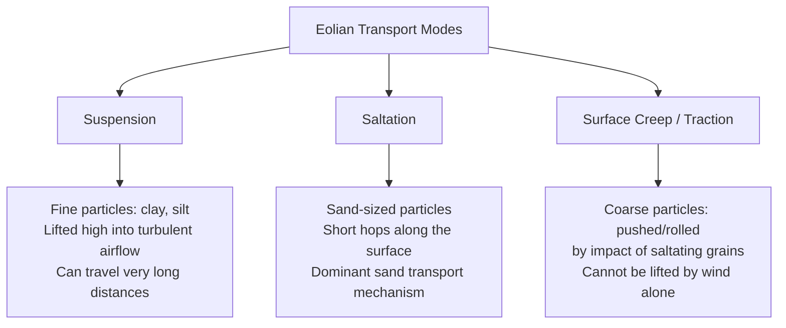
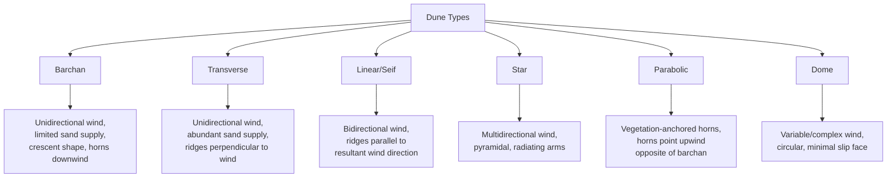

## Eolian Processes and Desert Landforms

### Definition and Scope

Eolian (aeolian) processes refer to the erosion, transport, and deposition of sediment by wind. While active in many environments (coastal dunes, periglacial regions, agricultural lands), eolian processes are most geomorphologically dominant in arid and semi-arid deserts, where sparse vegetation, limited soil moisture, and abundant loose, fine-grained sediment allow wind to act as a primary agent of landscape change.

**Key Points**

- Wind is a much less viscous and less dense fluid than water, giving it far lower competence and capacity; eolian transport is therefore generally restricted to sand-sized and finer particles.
- Deserts are defined climatically (low precipitation) rather than by temperature; both hot deserts (e.g., Sahara) and cold deserts (e.g., Gobi, polar deserts) exhibit eolian processes.
- [Inference] Despite popular imagery, dune fields (ergs) typically cover only a modest fraction of most desert regions; bare rock, gravel plains, and desert pavement are considerably more extensive in many deserts.

### Wind as a Geomorphic Agent

#### Threshold Velocity

The minimum wind velocity required to initiate particle movement, known as the **threshold velocity** or **fluid threshold**, depends on grain size, grain density, and surface moisture/cohesion.

$$u_{*t} \propto \sqrt{\frac{(\rho_s - \rho_a)g d}{\rho_a}}$$

Where $u_{*t}$ = threshold shear velocity, $\rho_s$ = particle density, $\rho_a$ = air density, $g$ = gravitational acceleration, $d$ = particle diameter.

**Key Points**

- Threshold velocity increases with grain size for sand-sized particles and coarser: larger, heavier grains require stronger wind to initiate movement.
- Very fine particles (clay, fine silt) often exhibit anomalously higher threshold velocities than predicted by grain size alone, because cohesive forces between fine particles and their tendency to form a smooth, low-roughness surface reduce the wind's ability to grip and lift them.
- Once particles are already in motion, the **impact threshold** (the velocity needed to sustain transport via grain-to-grain collisions) is lower than the initial fluid threshold, meaning transport can continue at wind speeds below those required to initiate it.
- Moisture significantly raises threshold velocity by increasing cohesion between grains (capillary forces); this is why wetted or crusted surfaces resist eolian erosion far more than dry, loose sediment.

#### Modes of Eolian Sediment Transport

- **Suspension**: fine particles (silt, clay) lifted into turbulent airflow and carried substantial distances, sometimes thousands of kilometers, forming atmospheric dust plumes; responsible for loess deposition far from source areas.
- **Saltation**: the dominant mode of sand transport, in which grains are lifted a short distance, follow a ballistic trajectory, and strike the surface, often ejecting other grains into similar hops. This process is analogous mechanically to saltation in fluvial bed-load transport but occurs over larger relative hop distances due to air's low density.
- **Surface creep (traction)**: coarser grains too large to be lifted by wind or saltation impacts are pushed or rolled along the surface by the impact of saltating grains; typically constitutes a minor fraction of total transported mass but is important for coarse-lag surface development.

### Eolian Erosional Processes

#### Deflation

The removal of loose, fine-grained material from a surface by wind, progressively lowering the ground surface where fine sediment is not replenished.

- **Deflation basins (blowouts)**: shallow depressions formed by sustained deflation, particularly common where vegetation cover has been locally disturbed or removed.
- **Desert pavement**: a surface layer of closely packed, wind-polished gravel and pebbles that remains after deflation has selectively removed finer material, armoring the surface against further significant deflation. [Inference] While deflation is a classic explanation for desert pavement formation, some research indicates that pavement can also develop through the upward migration of coarse clasts via wetting-drying and eolian dust infiltration beneath the clasts, meaning deflation alone may not fully explain all pavement surfaces.

#### Abrasion

The wearing away of rock surfaces by the sandblasting effect of wind-driven sediment, concentrated within roughly a meter or two of the ground surface where saltating sand grains are most abundant.

- **Ventifacts**: rocks that have been shaped, faceted, and polished by sustained sand abrasion, often exhibiting flat facets meeting at sharp edges (keels) where wind direction has been variable.
- **Yardangs**: elongated, streamlined ridges carved into susceptible bedrock or cohesive sediment by a combination of abrasion and deflation, aligned parallel to the dominant wind direction.

### Eolian Depositional Landforms

#### Loess

Extensive blankets of wind-deposited, well-sorted, unstratified silt, typically sourced from glacial outwash plains, desert margins, or floodplains, and deposited over vast areas downwind. Loess deposits are notable for their vertical cleavage/slope stability when dry (due to angular grain packing and calcite cementation) and vulnerability to rapid erosion when saturated or disturbed.

**Example**

The Loess Plateau of China represents one of the most extensive loess deposits globally, sourced substantially from glacial and desert sediment in Central Asia and the Gobi Desert region and transported by prevailing winds over geologic time, illustrating how eolian suspension transport can redistribute sediment across continental scales.

#### Sand Seas (Ergs) and Dune Formation

An **erg** is a large area of shifting sand dominated by dune fields, requiring an adequate sand supply, sufficient wind energy, and a depositional setting (often a basin or area of reduced wind competence) to accumulate substantial sand thickness.

##### Dune Morphology Fundamentals

- **Windward (stoss) slope**: the gently sloping upwind face of a dune, where sand is transported upward by saltation and creep.
- **Slip face**: the steep, downwind face of a dune, standing at or near the angle of repose for dry sand (approximately 30-34°), formed by avulanching of sand that accumulates past the dune crest.
- **Dune migration**: occurs through the continuous process of sand moving up the stoss slope and avalanching down the slip face, causing the entire dune form to advance in the downwind direction over time while preserving characteristic cross-bedded internal structure.

#### Dune Types by Wind Regime

| Dune Type | Wind Regime | Sand Supply | Distinguishing Shape |
| --- | --- | --- | --- |
| Barchan | Unidirectional | Limited | Crescent, horns point downwind |
| Transverse | Unidirectional | Abundant | Ridges perpendicular to wind, wavy crestline |
| Linear (seif) | Bidirectional | Variable | Long, straight ridges parallel to resultant wind |
| Star | Multidirectional | Variable | Pyramidal peak with multiple radiating arms |
| Parabolic | Unidirectional | Limited, vegetated margins | U-shaped, horns point upwind (opposite of barchan) |
| Dome | Strong unidirectional, variable | Variable | Circular/oval, low relief, minimal slip face |

**Key Points**

- Barchan dunes typically form as isolated features on hard, sand-poor desert floors, and their crescent horns advance faster than the main dune body because horns have less sand mass to move.
- Parabolic dunes commonly develop where vegetation anchors the dune margins/horns while the sand-rich center (often initiated at a blowout) continues to migrate downwind, producing the horns-upwind geometry; common in coastal and semi-arid vegetated settings.
- Star dunes tend to form in areas with complex, multidirectional wind regimes and are generally the tallest and most stable dune type, exhibiting minimal net migration due to their radially symmetric form.
- Linear (seif) dunes can extend for tens to over a hundred kilometers and are thought to form under a bidirectional wind regime where two dominant wind directions converge on a resultant transport direction along the dune's long axis.

### Dune Cross-Section and Internal Structure

<svg xmlns="http://www.w3.org/2000/svg" viewBox="0 0 700 380" font-family="Helvetica, Arial, sans-serif">
<text x="350" y="28" text-anchor="middle" font-size="18" font-weight="bold" fill="#222">Barchan Dune: Cross-Section and Cross-Bedding (svg_diagram)</text>

<line x1="40" y1="90" x2="120" y2="90" stroke="#333" stroke-width="2" marker-end="url(#arrow)" />
<text x="45" y="75" font-size="13" fill="#333">Wind</text>

<line x1="30" y1="320" x2="670" y2="320" stroke="#555" stroke-width="2" />

<path d="M 120 320 Q 250 130 380 120 L 480 320 Z" fill="#e8d4a0" stroke="#8a6d3b" stroke-width="2" />

<text x="200" y="220" font-size="13" fill="`#5a4a2a`" font-weight="bold" transform="rotate(-25 200 220)">Windward (stoss) slope</text>

<text x="410" y="220" font-size="13" fill="`#8b3a2f`" font-weight="bold" transform="rotate(60 410 220)">Slip face (~32°)</text>

<circle cx="380" cy="120" r="4" fill="#333" />
<text x="390" y="115" font-size="12" fill="#333">Crest</text>

<g stroke="#b8985f" stroke-width="1.5" fill="none">
<path d="M 150 310 Q 280 250 380 130" />
<path d="M 170 315 Q 290 260 390 160" />
<path d="M 195 318 Q 300 275 400 195" />
<path d="M 220 320 Q 310 290 410 225" />
<path d="M 245 320 Q 320 300 420 255" />
<path d="M 270 320 Q 335 312 435 280" />
</g>
<text x="150" y="270" font-size="11" fill="#8a6d3b" font-style="italic">Cross-bedding</text>
<text x="150" y="285" font-size="11" fill="#8a6d3b" font-style="italic">(dips toward slip face)</text>

<line x1="450" y1="340" x2="550" y2="340" stroke="#8b3a2f" stroke-width="2" stroke-dasharray="5,3" marker-end="url(#arrow2)" />
<text x="460" y="360" font-size="12" fill="#8b3a2f">Dune migration direction</text>

<text x="500" y="315" font-size="11" fill="#555">Horns extend</text>

<text x="500" y="328" font-size="11" fill="#555">further downwind (out of plane)</text>

</svg>

**Key Points**

- Cross-bedding within dunes forms as successive layers of sand avalanche down the slip face, with beds dipping in the downwind direction at angles approaching the angle of repose; this internal structure is a diagnostic tool for interpreting ancient eolian deposits (paleo-wind direction) in the rock record.
- The steep angle and consistent dip direction of eolian cross-beds are commonly used to distinguish ancient eolian sandstones from those of fluvial or marine origin, which typically exhibit different bedding geometries and scales.

### Non-Dune Desert Surfaces

**Key Points**

- **Reg (gravel desert/desert pavement)**: extensive gravel-veneered surfaces formed by deflation and/or clast migration processes, common across large areas of hot deserts (e.g., much of the Sahara).
- **Hamada (rocky desert)**: bare, exposed bedrock plateau surfaces with minimal loose sediment cover.
- **Playa**: the flat, typically clay- and salt-rich floor of an ephemeral desert lake basin, periodically flooded and subject to both fluvial (sheet flooding) and eolian reworking of fine sediment; playas are frequently significant local dust sources.

### Desertification and Land Degradation

Desertification refers to land degradation in arid, semi-arid, and dry sub-humid areas resulting from a combination of climatic variation and human activities, often manifesting through accelerated wind erosion, vegetation loss, and soil degradation.

**Key Points**

- Overgrazing, deforestation, and unsustainable agricultural practices can remove stabilizing vegetation cover, increasing surface exposure to deflation and dune reactivation.
- [Unverified] The relative contribution of climatic drivers (drought cycles) versus direct human land-use pressure to specific desertification episodes is a subject of active scientific and policy debate, and the balance likely varies substantially by region and time period.
- Dust storms originating from degraded or naturally arid source regions can have significant downwind effects on air quality, regional climate (radiative forcing), and even distant ecosystems via nutrient transport (e.g., Saharan dust fertilizing Amazon soils).

### Human Interaction and Mitigation

**Key Points**

- **Wind erosion control**: shelterbelts (tree/shrub windbreaks), stubble mulching, and reduced tillage practices lower surface wind velocity and increase threshold shear velocity through added surface roughness and cohesion.
- **Dune stabilization**: planting of deep-rooted, drought-tolerant vegetation and construction of sand fences to trap moving sand and reduce dune migration into infrastructure or agricultural land.
- **Dust and air quality monitoring**: satellite remote sensing (e.g., aerosol optical depth measurements) is commonly used to track dust plume sources, transport pathways, and regional air quality impacts.
- **Historical case study**: the 1930s Dust Bowl in the central United States exemplified how a combination of drought and unsustainable agricultural tillage practices on the Great Plains led to severe wind erosion, soil loss, and large-scale dust storm events, subsequently informing modern soil conservation policy.

### Summary Comparison Table

| Landform/Feature | Formation Process | Typical Setting |
| --- | --- | --- |
| Ventifact | Sandblasting/abrasion of exposed rock | Areas with strong, consistent winds and available sand |
| Yardang | Combined abrasion and deflation of susceptible rock/sediment | Arid regions with unidirectional strong winds |
| Desert pavement | Deflation and/or clast lag concentration | Widespread across many desert surfaces |
| Barchan dune | Unidirectional wind, limited sand supply | Isolated dunes on hard desert floor |
| Star dune | Multidirectional wind regime | Complex sand seas |
| Loess | Suspension deposition of fine wind-blown silt | Downwind of glacial, desert, or floodplain dust sources |
| Playa | Fluvial/eolian reworking in closed basin | Arid basin floors |

**Related Topics**

- Weathering processes and desert rock breakdown mechanisms
- Fluvial landforms in arid environments (ephemeral streams, alluvial fans, wadis)
- Paleoclimate interpretation from ancient eolian sandstone (cross-bedding analysis)
- Atmospheric science: dust transport, aerosol loading, and radiative forcing
- Soil science and land degradation/desertification policy
- Coastal eolian processes and foredune systems
- Periglacial and cold-desert eolian processes
- Mass wasting and slope stability (relevant to dune slip-face avalanching)
- Remote sensing applications in arid land monitoring
- Planetary geomorphology: eolian processes on Mars

**Next Steps**

- Explore stratigraphic identification criteria for ancient eolian deposits in the sedimentary rock record
- Examine regional case studies of erg formation (Sahara, Arabian, Namib, Taklamakan)
- Investigate quantitative eolian sediment transport models (e.g., Bagnold's transport equations)