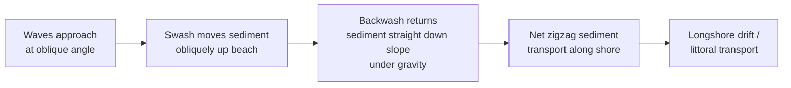
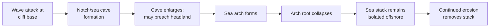
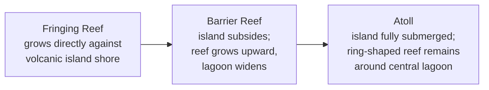

## Coastal Landforms and Shoreline Processes

### Definition and Scope

Coastal geomorphology examines the landforms and processes operating at the interface between land and sea, driven primarily by wave energy, tidal action, currents, and sediment supply, and modulated by relative sea-level change, coastal geology, and climate. Coastlines are among the most dynamic and rapidly evolving landscapes on Earth, responding to processes operating over timescales from seconds (individual wave swash) to millennia (sea-level change, isostatic adjustment).

**Key Points**

- Coastal landforms result from the interplay of erosional and depositional processes, similar in principle to fluvial systems but driven by oscillatory wave energy rather than unidirectional flow.
- Coasts are classified broadly as erosional (dominated by net sediment removal, often rocky/high-energy) or depositional (dominated by net sediment accumulation, often low-relief/sandy).
- Relative sea-level change (a combination of eustatic sea-level change and local land-level change via tectonics or isostasy) exerts a first-order control on long-term coastal evolution.

### Wave Mechanics Fundamentals

#### Wave Generation and Characteristics

Wind-generated waves develop through the transfer of wind energy to the sea surface, with wave size controlled by three factors: wind speed, wind duration, and **fetch** (the distance over open water the wind blows).

- **Wave height ($H$)**: vertical distance between wave crest and trough.
- **Wavelength ($L$)**: horizontal distance between successive crests.
- **Wave period ($T$)**: time for successive crests to pass a fixed point.
- **Deep-water wave speed**: $C = \dfrac{L}{T}$, and for deep-water waves, $C \propto \sqrt{L}$ (longer waves travel faster in deep water).

#### Wave Transformation Approaching Shore

As waves move into progressively shallower water, they undergo predictable transformations once water depth becomes less than approximately half the wavelength:

$$\text{Shoaling begins when } d < \frac{L}{2}$$

- **Shoaling**: wave speed and wavelength decrease while wave height increases as the wave's energy is compressed into a shorter wavelength and shallower water column.
- **Wave breaking**: occurs when wave height-to-depth ratio reaches a critical threshold (commonly approximated as $H \approx 0.78d$), causing the wave to become unstable and collapse.
- **Wave refraction**: bending of wave crests as they approach shore at an angle, caused by differential wave speed where nearshore depth varies along the coast; refraction tends to focus wave energy on headlands (promontories) and disperse it in bays, a key control on long-term shoreline straightening.

#### Wave Refraction Diagram

<svg xmlns="http://www.w3.org/2000/svg" viewBox="0 0 700 400" font-family="Helvetica, Arial, sans-serif">
<text x="350" y="28" text-anchor="middle" font-size="18" font-weight="bold" fill="#222">Wave Refraction Around a Headland (svg_diagram)</text>

<rect x="20" y="50" width="660" height="320" fill="#cfe3ee" stroke="none" />

<path d="M 20 50 L 20 370 L 250 370 Q 350 300 250 230 Q 200 190 250 140 Q 350 100 450 140 Q 500 190 450 230 Q 350 300 450 370 L 680 370 L 680 50 Z" fill="#e8dcb8" stroke="#8a6d3b" stroke-width="2" />

<text x="330" y="200" font-size="12" fill="`#5a4a2a`" font-weight="bold">Headland</text>

<text x="130" y="330" font-size="12" fill="`#5a4a2a`" font-weight="bold">Bay</text>

<text x="560" y="330" font-size="12" fill="`#5a4a2a`" font-weight="bold">Bay</text>

<g stroke="#1f5f96" stroke-width="2" fill="none" opacity="0.85">
<line x1="30" y1="60" x2="670" y2="60" />
<line x1="30" y1="90" x2="670" y2="90" />
</g>

<g stroke="#0d3d63" stroke-width="2" fill="none">
<path d="M 60 130 Q 250 150 340 155 Q 430 150 620 130" />
<path d="M 60 165 Q 250 185 340 190 Q 430 185 620 165" />
<path d="M 100 200 Q 250 218 340 222 Q 430 218 580 200" />
</g>

<g stroke="#8b3a2f" stroke-width="1.5" stroke-dasharray="4,3">
<line x1="330" y1="80" x2="340" y2="150" />
<line x1="150" y1="80" x2="130" y2="220" />
<line x1="550" y1="80" x2="570" y2="220" />
</g>

<text x="360" y="100" font-size="11" fill="`#8b3a2f`">Energy convergence</text>

<text x="360" y="112" font-size="11" fill="`#8b3a2f`">(erosion focused)</text>

<text x="480" y="240" font-size="11" fill="`#8b3a2f`">Energy divergence</text>

<text x="480" y="252" font-size="11" fill="`#8b3a2f`">(deposition favored)</text>

</svg>

### Nearshore Water Circulation

**Key Points**

- **Swash**: the forward, uprush motion of water onto the beach face following wave breaking.
- **Backwash**: the return flow of water down the beach face under gravity, generally weaker and less turbulent than swash due to infiltration losses, resulting in net onshore sediment transport under many conditions.
- **Longshore current**: a current flowing parallel to shore within the surf zone, generated by waves approaching the coast at an oblique angle; the dominant mechanism for **longshore sediment transport (littoral drift)**, which moves sand progressively along the coast in the direction of the net current.
- **Rip currents**: narrow, seaward-flowing currents that return water piled up in the nearshore zone by breaking waves, often channelized through gaps in nearshore sandbars; a significant hazard to swimmers due to their high velocity and offshore-directed flow.

#### Longshore (Littoral) Drift

Sediment grains follow a characteristic zigzag path along the beach: oblique swash carries sediment up the beach face at the angle of wave approach, while backwash returns it directly downslope under gravity, producing net transport in the direction of wave approach over many wave cycles.

### Erosional Coastal Landforms

**Key Points**

- **Sea cliffs**: steep coastal slopes formed by wave erosion undercutting the base of coastal terrain, often triggering mass wasting of the cliff face above (linking coastal and slope-stability processes).
- **Wave-cut platform (shore platform)**: a gently sloping, erosional bedrock surface exposed at the base of a retreating sea cliff, formed as the cliff erodes landward over time while the platform is periodically exposed at low tide.
- **Sea caves**: form where waves exploit zones of structural weakness (joints, faults, weaker rock layers) at the base of a cliff, progressively excavating a cavity.
- **Sea arches**: form when a sea cave erodes through a narrow headland, connecting two sides and leaving a rock span.
- **Sea stacks**: isolated pillars of resistant rock left standing offshore after the collapse of a sea arch's roof or the differential erosion of a headland, representing the erosional endpoint of the cave-arch-stack sequence.

#### Cliff Retreat Sequence

### Depositional Coastal Landforms

#### Beaches

Accumulations of loose sediment (sand, gravel, or shell fragments) along the shoreline, shaped and continuously reworked by wave swash/backwash and longshore currents. Beach sediment composition and grain size reflect local sediment sources, wave energy, and the balance between deposition and erosion.

- **Berm**: a relatively flat, gently landward-sloping platform on the upper beach, marking the limit of typical wave swash; often more pronounced after periods of calmer wave conditions.
- **Beach face**: the sloping section of beach between the berm and the low-tide line, actively shaped by swash and backwash.
- **Longshore bar and trough**: a submerged ridge of sand roughly parallel to shore, formed by wave breaking processes in the nearshore zone, separated from the beach by a trough.

#### Depositional Landforms Built by Longshore Drift

- **Spit**: an elongated ridge of sand or gravel extending from the shore into open water or across the mouth of a bay, built by longshore drift where the coastline changes direction abruptly (e.g., at a bay mouth) and sediment continues to be deposited beyond the point of direction change.
- **Recurved spit (hook)**: a spit whose distal end curves landward, typically due to wave refraction around the spit's tip or a secondary wave approach direction.
- **Baymouth bar**: a spit that has grown completely across the mouth of a bay, isolating the water behind it as a lagoon.
- **Tombolo**: a depositional sediment ridge connecting an island to the mainland (or to another island), formed where wave refraction around the island creates a zone of reduced wave energy and net sediment convergence in its lee.
- **Barrier island**: a long, narrow, shore-parallel island of sand separated from the mainland by a lagoon or sound, thought to form through several possible mechanisms including spit segmentation, submergence of coastal dune ridges by sea-level rise, or offshore bar emergence. [Inference] The dominant formation mechanism likely varies by regional setting and sea-level history, and a single universal model may not apply to all barrier island systems.

**Example**

The Outer Banks of North Carolina represent a classic barrier island system, where the islands are separated from the mainland by extensive lagoons (sounds) and are subject to ongoing landward migration through overwash processes during storm events, illustrating the dynamic, sediment-limited nature of barrier coastlines under rising relative sea level.

#### Deltas and Estuaries

- **Deltas**: form where a river's sediment supply exceeds the rate at which waves and currents can redistribute it at the coast (see Fluvial Landforms for detailed delta classification by dominant process).
- **Estuaries**: partially enclosed coastal water bodies where freshwater river input mixes with saline ocean water; commonly formed by the drowning of a river valley mouth during postglacial sea-level rise (creating a **ria**), though other origin types exist (fjords, bar-built, tectonic).

### Coral Reef Coastlines

Reef-building corals construct wave-resistant carbonate structures in warm ($\gtrsim$ 18°C), shallow, clear, low-nutrient tropical and subtropical waters, producing a distinctive category of biogenic coastal landform.

#### Darwin's Reef Evolution Model

**Key Points**

- This model, proposed by Charles Darwin, explains the progression of reef types as a function of gradual volcanic island subsidence combined with the ability of coral to grow upward and keep pace with subsidence, provided the rate of subsidence does not exceed the coral's vertical growth rate.
- **Fringing reef**: grows directly adjacent to the shoreline with little to no lagoon separation.
- **Barrier reef**: separated from the shoreline by a widening lagoon as the island subsides, exemplified at large scale by the Great Barrier Reef of Australia (though not all barrier reefs form via island subsidence in the strict Darwinian sense).
- **Atoll**: a ring-shaped reef surrounding a central lagoon, formed after the original volcanic island has fully subsided below sea level, leaving only the reef structure.
- [Inference] While broadly well-supported by subsequent drilling data confirming subsided volcanic basement beneath atolls, the precise rate and timing relationships in Darwin's model can vary regionally due to factors such as glacial-interglacial sea-level fluctuations and variable subsidence rates.

### Types of Coasts by Origin

**Key Points**

- **Emergent coasts**: result from relative sea-level fall (or land uplift), often exposing former marine terraces, wave-cut platforms, and beach deposits above current sea level; common in tectonically active, uplifting regions.
- **Submergent coasts**: result from relative sea-level rise (or land subsidence), commonly producing highly irregular, embayed coastlines as river valleys and lowlands are drowned (e.g., rias, fjords, estuaries).
- **Fjords**: deep, steep-walled, glacially carved valleys that have been drowned by postglacial sea-level rise, distinguished from rias by their glacial (U-shaped) rather than fluvial (V-shaped) valley cross-section.
- **Primary coasts**: shaped mainly by terrestrial, marine-independent processes (e.g., volcanic, tectonic, fluvial, glacial) recently exposed to marine action.
- **Secondary coasts**: shaped mainly by marine processes (wave erosion, marine deposition, biological activity) acting over time on an existing coastline.

### Tidal Influence on Coastal Landforms

Tidal range strongly influences coastal morphology and the balance between wave- and tide-dominated processes:

| Tidal Range Classification | Range | Dominant Influence |
| --- | --- | --- |
| Microtidal | < 2 m | Wave-dominated landforms typically prevail |
| Mesotidal | 2-4 m | Mixed wave/tidal influence |
| Macrotidal | > 4 m | Tide-dominated landforms typically prevail (e.g., tidal flats, funnel-shaped estuaries) |

- **Tidal flats**: broad, low-gradient depositional surfaces exposed at low tide, typically composed of fine mud and sand, common in macrotidal, low-wave-energy settings.
- **Salt marshes and mangroves**: vegetated intertidal environments that stabilize fine sediment, dissipate wave/storm energy, and are increasingly recognized for coastal protection value.

### Coastal Hazards and Human Interaction

**Key Points**

- **Beach erosion**: natural sediment budget imbalances (more removal than supply) are frequently exacerbated by human structures such as jetties, groins, and dams that interrupt longshore sediment transport or trap upstream fluvial sediment supply.
- **Hard stabilization structures**: seawalls, groins, and jetties can locally protect infrastructure but often redirect wave energy and starve downdrift beaches of sediment, a phenomenon sometimes summarized as the structures relocating rather than solving the erosion problem.
- **Soft stabilization**: beach nourishment (artificial sediment placement) is widely used as an alternative to hard structures, though it typically requires periodic renourishment as the added sediment is redistributed or removed by ongoing wave/current processes.
- **Sea-level rise**: anthropogenic climate change is contributing to accelerated global mean sea-level rise, increasing rates of coastal erosion, saltwater intrusion, and flood frequency in many low-lying coastal regions; the magnitude of future rise carries a range of projected values depending on greenhouse gas emissions trajectories and ice-sheet dynamics. [Unverified] Specific site-level impacts depend heavily on local subsidence rates, sediment supply, and engineered interventions, making generalized global projections an imperfect guide to any particular coastline's future.
- **Storm surge**: the temporary rise in sea level generated by low atmospheric pressure and wind-driven water piling associated with tropical or extratropical storms, often the most damaging component of coastal storm impacts, distinct from the astronomical tide.

### Summary Comparison Table

| Landform/Feature | Formation Process | Coast Type |
| --- | --- | --- |
| Wave-cut platform | Cliff base erosion and retreat | Erosional |
| Sea stack | Collapse of sea arch/headland erosion | Erosional |
| Spit | Longshore drift deposition at direction change | Depositional |
| Tombolo | Wave refraction/convergence behind island | Depositional |
| Barrier island | Sediment accumulation parallel to mainland | Depositional |
| Atoll | Coral growth keeping pace with island subsidence | Biogenic |
| Fjord | Glacial valley drowned by sea-level rise | Submergent |
| Tidal flat | Fine sediment deposition, macrotidal setting | Depositional/tidal |

**Related Topics**

- Fluvial landforms and drainage systems (river-derived sediment supply to coasts, delta formation)
- Mass wasting and slope stability (sea cliff collapse mechanics)
- Glacial geomorphology (fjord formation, glacio-isostatic adjustment)
- Sea-level change: eustatic, isostatic, and tectonic controls
- Coral reef ecology and ocean acidification impacts
- Coastal engineering and shoreline management practices
- Storm surge modeling and tropical cyclone hazard assessment
- Sediment budget analysis in littoral cells
- Estuarine and wetland ecosystem dynamics
- Remote sensing and shoreline change detection methods