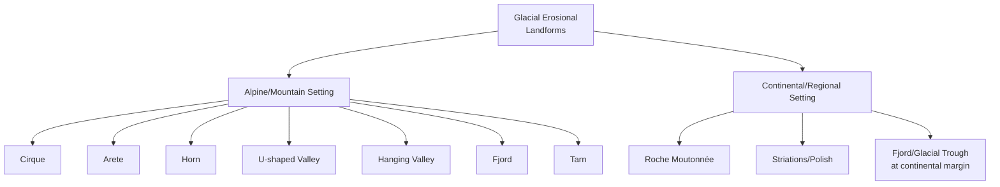
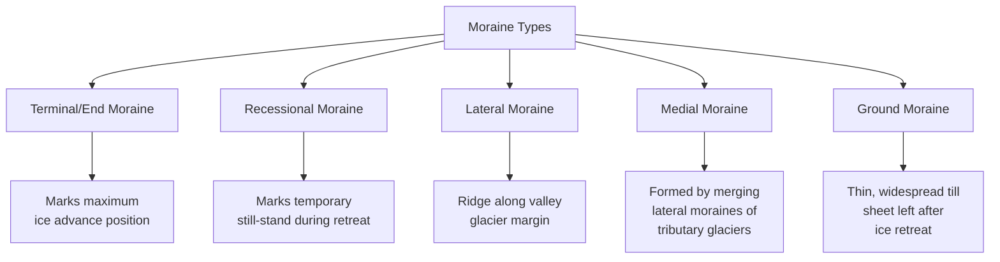

## Glacial Landforms

### Definition and Scope

Glacial geomorphology examines the landforms produced by the erosive and depositional action of glacier ice, along with associated meltwater processes. Glaciers are among the most effective agents of landscape modification on Earth, capable of both large-scale erosion of bedrock and the deposition of vast volumes of unsorted and sorted sediment.

**Key Points**

- Glacial landforms are broadly classified as erosional (produced by ice scouring, plucking, and abrasion) or depositional (produced by direct ice deposition or glacial meltwater deposition).
- Glacial processes have shaped large portions of high-latitude and high-altitude terrain, both from currently active glaciers and from Pleistocene ice sheets that have since retreated.
- The distinction between features formed directly by ice (glacial) versus those formed by meltwater draining from ice (glaciofluvial/glaciolacustrine) is fundamental to interpreting glaciated landscapes.

### Glacier Types and Ice Movement

#### Glacier Classification

- **Alpine (mountain) glaciers**: confined by surrounding topography, including cirque glaciers (small, bowl-shaped), valley glaciers (flowing down pre-existing valleys), and piedmont glaciers (spreading out onto lowlands where a valley glacier emerges from confining mountains).
- **Continental ice sheets**: vast masses of ice covering large areas of continental crust, largely independent of underlying topography (e.g., Antarctic and Greenland ice sheets), the primary agents of Pleistocene-scale landscape modification across much of North America and Europe.

#### Glacier Ice Movement

Glacier ice moves downslope (or outward from an accumulation center) through two primary mechanisms:

- **Internal deformation (creep)**: plastic deformation of ice crystals under the stress of overlying ice mass, occurring even in glaciers frozen to their bed.
- **Basal sliding**: movement of the glacier as a whole over its bed, facilitated by a thin film of meltwater at the ice-bed interface that reduces friction; requires the glacier base to be at the pressure-melting point (a **warm-based** or **temperate** glacier), in contrast to a **cold-based** glacier frozen to its substrate, which moves almost exclusively by internal deformation.

**Key Points**

- Warm-based glaciers are generally far more erosive than cold-based glaciers because basal sliding facilitates plucking and abrasion at the ice-rock interface.
- The mass balance of a glacier (the difference between accumulation, primarily snowfall in the upper zone, and ablation, melting/sublimation/calving in the lower zone) determines whether a glacier advances, retreats, or remains in equilibrium.

### Glacial Erosional Processes and Landforms

#### Erosional Mechanisms

- **Plucking (quarrying)**: meltwater infiltrates joints and fractures in bedrock, refreezes, and as the glacier moves, pulls loosened blocks of rock away from the bed, particularly effective on the downslope (lee) side of bedrock obstacles.
- **Abrasion**: rock fragments embedded in the glacier's base scrape and grind against the underlying bedrock as the ice moves, producing polished surfaces, striations (linear scratches indicating past ice-flow direction), and fine rock flour.

#### Erosional Landforms

##### Alpine Glacial Erosional Features

- **Cirque**: a bowl-shaped, steep-walled depression carved at the head of a glacial valley by rotational ice movement and plucking/abrasion; the fundamental erosional unit of alpine glaciation, often containing a small lake (**tarn**) after ice retreat.
- **Arête**: a sharp, narrow ridge formed where two adjacent cirques (or glacial valleys) erode toward each other from opposite sides, leaving a knife-edge divide.
- **Horn**: a sharply pointed peak formed where three or more cirques erode a mountain from multiple sides, producing a pyramidal summit (the Matterhorn is the archetypal example).
- **U-shaped (glacial trough) valley**: a valley with a characteristic broad, U-shaped cross-profile, formed as a glacier widens and deepens a pre-existing (typically V-shaped fluvial) valley through erosion of the valley floor and lower walls.
- **Hanging valley**: a tributary valley whose floor sits at a higher elevation than the main valley floor, formed because the smaller tributary glacier had less erosive power than the larger trunk glacier and could not erode as deeply; often marked by a waterfall where the tributary stream now drops into the main valley after ice retreat.
- **Fjord**: a glacial trough that has been partially submerged by the sea following ice retreat and/or sea-level rise (see Coastal Landforms for further detail).

##### Regional/Continental Erosional Features

- **Roche moutonnée**: an asymmetric bedrock knob with a gently sloping, smoothed/striated up-ice (stoss) side shaped by abrasion, and a steep, rough, plucked down-ice (lee) side; a valuable indicator of past ice-flow direction.
- **Glacial striations and polish**: linear scratches and smoothed surfaces on bedrock produced by abrasion, providing direct evidence of past ice movement direction when preserved.

#### Glacial Erosional Landform Cross-Section

<svg xmlns="http://www.w3.org/2000/svg" viewBox="0 0 800 400" font-family="Helvetica, Arial, sans-serif">
<text x="400" y="28" text-anchor="middle" font-size="18" font-weight="bold" fill="#222">Alpine Glacial Erosional Landforms (svg_diagram)</text>

<rect x="20" y="40" width="760" height="340" fill="#eef4f8" stroke="none" />

<path d="M 40 370 L 100 200 L 160 250 L 220 120 L 260 160 L 330 60 L 380 150 L 440 100 L 490 200 L 560 140 L 620 260 L 680 190 L 760 370 Z" fill="#d6cdb8" stroke="#5a4a2a" stroke-width="2" />

<text x="300" y="50" font-size="12" fill="#333" font-weight="bold">Horn</text>

<line x1="330" y1="60" x2="330" y2="75" stroke="#333" stroke-width="1" />

<text x="220" y="105" font-size="12" fill="#333" font-weight="bold">Arête</text>

<path d="M 140 250 Q 190 300 250 260" fill="#f0ede0" stroke="#5a4a2a" stroke-width="1.5" />
<ellipse cx="195" cy="270" rx="20" ry="10" fill="#7fb8d9" />
<text x="145" y="245" font-size="11" fill="#333" font-weight="bold">Cirque</text>
<text x="205" y="290" font-size="10" fill="#2f6bab">Tarn</text>

<path d="M 40 370 Q 250 320 400 370 Q 550 320 760 370 L 760 380 L 40 380 Z" fill="#c9e0ea" stroke="none" />
<path d="M 40 370 Q 250 330 400 370 Q 550 330 760 370" fill="none" stroke="#1f5f96" stroke-width="2" />
<text x="340" y="355" font-size="12" fill="#1f5f96" font-weight="bold">U-shaped trough (main valley)</text>

<path d="M 560 140 Q 590 220 605 260" fill="none" stroke="#8a7a5a" stroke-width="1.5" stroke-dasharray="3,2" />
<path d="M 605 260 L 610 340" stroke="#2f6bab" stroke-width="4" />
<text x="615" y="220" font-size="11" fill="#333" font-weight="bold">Hanging valley</text>
<text x="615" y="300" font-size="10" fill="#2f6bab">Waterfall</text>

<path d="M 420 370 Q 435 350 460 355 Q 470 365 450 372 Z" fill="#8a8a7a" stroke="#333" stroke-width="1" />
<text x="400" y="392" font-size="10" fill="#333">Roche moutonnée</text>
</svg>

### Glacial Depositional Processes and Landforms

#### Till and Direct Ice Deposition

**Till** is unsorted, unstratified sediment deposited directly by glacial ice, containing a heterogeneous mixture of grain sizes from clay to boulders, reflecting the glacier's non-selective transport capacity.

##### Moraine Types

- **Terminal (end) moraine**: a ridge of till marking the maximum forward extent (furthest advance) reached by a glacier, deposited where the ice front remained stationary long enough for continuous till delivery via conveyor-belt-like ice flow to accumulate.
- **Recessional moraine**: a ridge similar to a terminal moraine but marking a temporary pause or still-stand position during overall glacial retreat, typically located up-valley from the terminal moraine.
- **Lateral moraine**: a ridge of till deposited along the sides of a valley glacier, formed from debris that fell onto the glacier surface from adjacent valley walls (via rockfall and mass wasting) combined with debris carried at the ice margin.
- **Medial moraine**: a ridge formed at the confluence of two valley glaciers, where the merging lateral moraines combine to form a debris stripe running down the center of the combined ice stream.
- **Ground moraine**: a thin, widespread, relatively unconsolidated blanket of till deposited across a broad area as a glacier retreats, forming gently rolling **till plains**.

#### Streamlined Depositional Landforms

- **Drumlin**: an elongated, asymmetric hill of till (or, less commonly, bedrock) shaped by overriding glacial ice, with a steeper, blunter end facing up-ice (stoss) and a tapered, gentler end facing down-ice (lee); drumlin long-axis orientation is a reliable indicator of past ice-flow direction. [Inference] The precise formation mechanism of drumlins remains actively debated, with hypotheses ranging from subglacial sediment deformation to catastrophic subglacial meltwater floods; multiple mechanisms may operate in different settings.
- **Drumlin fields**: drumlins characteristically occur in clusters or "swarms" of similarly oriented, streamlined hills, providing strong regional evidence of past ice-flow patterns.

### Glaciofluvial (Meltwater) Landforms

Distinct from direct ice deposition, glaciofluvial landforms are built by meltwater streams and are characteristically sorted and stratified, in contrast to unsorted till.

#### Ice-Contact Glaciofluvial Landforms

- **Esker**: a long, sinuous ridge of sorted sand and gravel deposited by meltwater flowing in a subglacial or englacial tunnel beneath (or within) stagnant or slowly moving ice; when the ice melts, the former stream channel deposit is left standing as a ridge on the landscape.
- **Kame**: a mound or hummock of sorted sediment deposited by meltwater in contact with stagnant ice, such as in a crevasse, a supraglacial depression, or against the ice margin; kames often collapse into irregular, hummocky topography as the supporting ice subsequently melts.
- **Kettle**: a depression formed when an isolated block of ice, buried or partially buried in glacial sediment, eventually melts, causing the overlying sediment to collapse and leaving a closed basin, frequently occupied by a **kettle lake**.

#### Proglacial (Beyond Ice Margin) Glaciofluvial Landforms

- **Outwash plain (sandur)**: a broad, gently sloping plain of sorted, stratified sediment deposited by braided meltwater streams beyond the glacier margin, typically fining with distance from the ice front as stream competence decreases.
- **Glacial lake and varves**: proglacial lakes commonly form where meltwater is impounded by a moraine dam, ice dam, or topographic barrier; sediment deposited in such lakes often exhibits **varves**, annual sediment couplets consisting of a coarser, lighter summer layer (higher meltwater discharge and sediment supply) and a finer, darker winter layer (quiescent, low-energy settling of fine clay under lake ice), providing a valuable tool for counting elapsed years in the geologic record.

#### Glaciofluvial Landform Association

<svg xmlns="http://www.w3.org/2000/svg" viewBox="0 0 800 380" font-family="Helvetica, Arial, sans-serif">
<text x="400" y="26" text-anchor="middle" font-size="18" font-weight="bold" fill="#222">Ice-Margin Depositional Landform Association (svg_diagram)</text>

<path d="M 20 60 L 380 60 Q 400 60 400 100 L 380 200 Q 360 240 300 250 L 20 250 Z" fill="#dceaf2" stroke="#7fa8c4" stroke-width="2" />
<text x="150" y="150" font-size="14" fill="#3d6b8a" font-weight="bold">Glacier ice</text>

<line x1="20" y1="320" x2="780" y2="320" stroke="#555" stroke-width="2" />

<path d="M 100 250 Q 180 260 260 255 Q 330 250 380 240" fill="none" stroke="#8a6d3b" stroke-width="6" stroke-linecap="round" />
<text x="120" y="290" font-size="11" fill="#5a4a2a" font-weight="bold">Esker (former subglacial meltwater tunnel deposit)</text>

<ellipse cx="330" cy="220" rx="35" ry="18" fill="#c9a86a" stroke="#5a4a2a" stroke-width="1.5" />
<text x="300" y="200" font-size="11" fill="#5a4a2a" font-weight="bold">Kame</text>

<path d="M 380 250 Q 400 300 420 320" fill="#b8985f" stroke="#5a4a2a" stroke-width="2" />
<text x="410" y="270" font-size="11" fill="#5a4a2a" font-weight="bold">Terminal moraine</text>

<ellipse cx="470" cy="310" rx="30" ry="12" fill="#7fb8d9" stroke="#2f6bab" stroke-width="1.5" />
<text x="440" y="345" font-size="11" fill="#2f6bab" font-weight="bold">Kettle lake</text>

<path d="M 430 320 L 780 320 L 780 340 L 430 340 Z" fill="#e8dcb8" stroke="none" />
<g stroke="#c4a870" stroke-width="1.5" fill="none">
<path d="M 450 325 Q 500 330 540 325 Q 580 320 630 328" />
<path d="M 500 335 Q 560 330 620 335 Q 680 330 730 335" />
</g>
<text x="560" y="360" font-size="12" fill="#5a4a2a" font-weight="bold">Outwash plain (sandur)</text>

<text x="440" y="295" font-size="9" fill="`#7fa8c4`" font-style="italic">(buried ice block melts)</text>

</svg>

### Contrasting Till and Glaciofluvial Sediment

| Property | Till (Direct Ice Deposition) | Glaciofluvial Sediment |
| --- | --- | --- |
| Sorting | Poorly sorted (unsorted) | Well to moderately sorted |
| Stratification | Unstratified (massive) | Stratified (bedded) |
| Grain shape | Angular to subangular | Rounded to subrounded |
| Transport agent | Ice directly | Meltwater |
| Example landforms | Moraines, drumlins, till plains | Eskers, kames, outwash plains, varved lake deposits |

### Ice Sheet-Scale Depositional and Erosional Effects

**Key Points**

- **Isostatic depression and rebound**: the immense mass of continental ice sheets depresses the underlying crust; following deglaciation, the crust slowly rebounds (glacial isostatic adjustment), a process still ongoing in formerly glaciated regions such as Scandinavia and Hudson Bay.
- **Proglacial lakes at continental scale**: large ice-dammed lakes, such as glacial Lake Agassiz in North America, formed where continental ice sheets blocked natural drainage outlets; catastrophic drainage of such lakes (e.g., via ice-dam failure) could produce significant, rapid landscape modification through outburst flooding.
- **Loess generation**: extensive glacial outwash plains and till surfaces, once exposed and dried, served as major source areas for wind-blown silt (loess) deposition in adjacent, non-glaciated regions (see Eolian Processes).

### Periglacial Landforms (Adjacent to Glaciers/Permafrost)

While not glacial in the strict sense (not produced directly by ice), periglacial processes operate in cold, non-glaciated environments at glacier margins and in permafrost regions, and are commonly treated alongside glacial geomorphology:

- **Permafrost**: ground that remains at or below 0°C for at least two consecutive years, underlying much of the periglacial realm.
- **Patterned ground**: geometric surface patterns (circles, polygons, stripes) formed through repeated freeze-thaw sorting of soil and clasts.
- **Pingo**: a dome-shaped mound with an ice core, formed by the freezing and expansion of groundwater beneath the surface in permafrost terrain.
- **Solifluction lobes**: slow, saturated soil flow features formed in the seasonally thawed active layer above permafrost (see Mass Wasting and Slope Stability).

### Human Interaction and Applications

**Key Points**

- **Glacial deposits as aquifers**: sorted glaciofluvial sediments (outwash, eskers, kames) often form productive aquifers due to their high permeability, in contrast to poorly permeable, compact till.
- **Aggregate resources**: sand and gravel from eskers, kames, and outwash plains are widely quarried as construction aggregate.
- **Glacial retreat monitoring**: modern glacier mass balance and retreat are tracked via remote sensing and field measurement as key indicators of climate change, with most global glaciers (outside a few regional exceptions) documented to be in a state of net mass loss in recent decades.
- **Glacial hazard**: glacial lake outburst floods (GLOFs), triggered by the failure of moraine or ice dams impounding proglacial lakes, pose significant hazards to downstream communities in mountainous glaciated regions (e.g., the Himalayas, Andes).

### Summary Comparison Table

| Landform | Formation Process | Category |
| --- | --- | --- |
| Cirque | Rotational erosion at valley head | Erosional (alpine) |
| Horn | Multiple cirque erosion converging on a peak | Erosional (alpine) |
| U-shaped valley | Glacial widening/deepening of valley | Erosional (alpine) |
| Roche moutonnée | Abrasion (stoss) + plucking (lee) | Erosional (regional) |
| Terminal moraine | Till deposition at maximum ice extent | Depositional (direct ice) |
| Drumlin | Subglacial shaping of till/bedrock | Depositional (streamlined) |
| Esker | Subglacial meltwater tunnel infill | Depositional (glaciofluvial) |
| Kettle | Melting of buried ice block | Depositional (glaciofluvial) |
| Outwash plain | Proglacial braided meltwater deposition | Depositional (glaciofluvial) |

**Related Topics**

- Mass wasting and slope stability (periglacial solifluction, rockfall onto glacier surfaces)
- Coastal landforms (fjord formation, glacio-isostatic sea-level effects)
- Eolian processes and desert landforms (loess sourced from glacial outwash)
- Paleoclimatology: ice core records and Pleistocene glacial-interglacial cycles
- Permafrost and periglacial geomorphology
- Sea-level change: glacio-eustatic and glacio-isostatic contributions
- Hydrogeology: glacial aquifer systems
- Glacial hazard assessment: GLOF risk and mountain community planning
- Quaternary stratigraphy and till/varve chronology methods
- Planetary glaciology: ice-related landforms on Mars